PP：

- 这个UI风格，我喜欢
  - 

# 基础环境搭建

（后续选择：阿里云服务器   后期更换）

## F1：搭建CentOS7系统的虚拟机

### 虚拟机准备

- 版本：VMware 12 Pro
- 下载地址：https://pan.baidu.com/s/1_EtcyPD-qMbmf1cRAdfMtQ 
- 安装步骤太简单，不做赘述

### CentOS7系统准备

- 版本：CentOS-7-x86_64
- 下载地址：https://pan.baidu.com/s/18Qox3tvr9G1yzoCPdi1l6Q

### 虚拟机安装CentOS7步骤

- 新建虚拟机
  - 
  - 
  - 
  - 
  - 
  - 
  - 
  - 
  - 
  - 
  - 
  - 
  - 
  - 
- 设置镜像文件
  - 
  - 
- 开机，配置CentOS7
  - 选择==install CentOS7==，然后回车
    - 
  - 选择系统语言，这里以==简体中文==为例
    - 
  - 软件--安装源，点击进入，然后点击==完成==
    - 
    - 
  - 软件--软件选择，==GNOME桌面==，选择带友好UI的图形化界面
    - 
  - 系统--安装位置，手动设置分区
    - 
    - 
    - 
    - 
    - 
    - 
  - 分区最终效果
    - 
    - 
  - 开始安装
    - 
  - 设置root密码，设置个人账户
    - 
    - 
    - 
  - 等待安装完成，然后点击==重启==
    - 
  - 接受许可
    - 
    - 
  - 设置网络
    - 
  - 完成配置
    - 
  - 然后就可以登录使用了，习惯使用root用户登录
    - 
    - 
    - 

### 配置CentOS7网络及其他基础配置

- 关闭锁屏和空白屏幕
  - 
  - 
- 配置静态IP
  - 首先还原虚拟机网络配置，因为计算机处于不同网络下，可能会因为网络原因，产生的子网IP，网关之类的没法复用（比如你在家的VMnet8的网关是192.168.242.2，但是到了学校重新生成的网关可能变成了192.168.125.2
    - 
  - 查看Vmnet8的网关，配置的静态IP与网关处于同一网段
    - 
    - 
    - 
  - 修改vi /etc/sysconfig/network-scripts/ifcfg-ens33
    - 
  - 重启网络服务service network restart，输入ifconfig即可看到修改后的静态IP
    - 
- 后面就可以用XSHell连接操作了

### 永久关闭防火墙

- 因为要配置很多软件，而且这些软件都有特定端口来访问，避免麻烦，直接永久关闭防火墙，当然也可以依次配置手动放行一些固定端口

  ~~~shell
  [root@localhost ~]# systemctl stop firewalld
  [root@localhost ~]# systemctl disable firewalld
  Removed symlink /etc/systemd/system/multi-user.target.wants/firewalld.service.
  Removed symlink /etc/systemd/system/dbus-org.fedoraproject.FirewallD1.service.
  ~~~

### 配置阿里yum镜像源

- 方便后续下载软件，网速快
- 配置地址：https://developer.aliyun.com/mirror/centos?spm=a2c6h.13651102.0.0.3e221b110YBfQ8
- 

### 设置快照保留此时状态（初始化）

- 步骤
  - 
  - 

## F2：Docker安装

### 步骤

- 下载并安装-

  ~~~shell
  yum -y install docker
  ---------------------------
  [root@localhost ~]# docker --version
  Docker version 1.13.1, build 64e9980/1.13.1
  ~~~

- 启动相关命令（==执行启动==）

  ~~~shell
  # 启动
  systemctl start docker
  # 重启
  systemctl restart docker
  # 停止
  systemctl stop docker
  ~~~

- 开机自启动设置（==执行==）

  ~~~shell
  systemctl enable docker
  ~~~

- PS：如果在docker运行过程中操作了防火墙（开启或关闭），都需要重启Docker

### 配置阿里云镜像加速器

- 登录到阿里云找到容器服务

  - 

- 找到镜像加速器

  - 
  - 

- 配置使用

  

  ~~~shell
  # 1. 创建目录
  sudo mkdir -p /etc/docker
  # 2. 编写配置文件
  sudo tee /etc/docker/daemon.json <<-'EOF'
  {
    "registry-mirrors": ["https://nr1qsvgu.mirror.aliyuncs.com"]
  }
  EOF
  # 3. 重启服务
  sudo systemctl daemon-reload
  # 4. 重启docker
  sudo systemctl restart docker
  ~~~

## F3：Vim安装

- 好用的文本编辑器，主要是能高亮显示

  ~~~shell
  yum -y install vim
  ~~~

## F4：JDK安装

### 查找

- yum search openjdk
- 

### 安装

- yum -y install java-1.8.0-openjdk

### 测试

- 查看版本

  ~~~shell
  [root@localhost ~]# java -version
  openjdk version "1.8.0_262"
  OpenJDK Runtime Environment (build 1.8.0_262-b10)
  OpenJDK 64-Bit Server VM (build 25.262-b10, mixed mode)
  ~~~

## F5：Redis安装

- 执行命令

  ~~~shell
  docker run -d --name redis -p 6390:6379 redis --requirepass "root"
  # 参数说明
  docker run [OPTIONS] IMAGE [COMMAND] [ARG...]
  
  -d		后台运行容器并且打印容器id
  --name	为容器设置name名称
  -p		设置容器端口映射  主机端口/容器内端口
  第二个redis	远程要下载的镜像名称
  --requirepass	为redis设置密码
  ~~~

## F6：FastDfs安装

### 命令

~~~shell
docker run -d --restart=always --privileged=true --net=host --name=fastdfs -e IP=192.168.125.20 -e WEB_PORT=8888 -v ${HOME}/fastdfs:/var/local/fdfs registry.cn-beijing.aliyuncs.com/tianzuo/fastdfs

# 注意IP：如果是阿里云则设置为公网IP，如果是虚拟机就设置为虚拟机IP
# 注意WEB_PORT：最好改成非80端口，因为后端nginx的部署项目要使用80
# 参数说明
-d		后台运行容器
--restart=always	当docker重启时，自动启动该容器
--privileged=true	容器内的root拥有真正的root权限
--net=host		省去端口映射，比如docker容器内在8080端口起了一个服务.不加的话需要把本机的某个port比如7979和docker内的8080做一个映射关系,访问的时候访问7979. 加了net=host则直接访问8080.另外,加了net=host后会使得进入创建的容器的命令行时名称显示为主机的名称而不是一串id
--name		设置容器name名称
-e 			设置环境变量
-e IP=xxx	指定fastdfs访问的ip，需要是当前服务器ip
-e WEB_PORT	指定镜像中集成的nginx的端口，用来访问fastdfs中存储的文件
-v			数据卷挂载  A：B，将A目录挂载到容器内的B目录
registry.cn-beijing.aliyuncs.com/tianzuo/fastdfs	应该也是阿里云的某种东西，应该是有加速类似的某种作用
~~~

## F7：Zookeeper安装

### 下载Zookeeper

- 下载方式

  ~~~shell
  wget https://mirror.bit.edu.cn/apache/zookeeper/zookeeper-3.4.14/zookeeper-3.4.14.tar.gz
  ~~~

- 这里直接用XFTP来复制到CentOS了，==统一文件复制路径为：/usr/local/tools==

### 解压

- 命令
  - tar -zxvf zookeeperxxxxxx

### 移动并重命名

- 重命名
  - 

### 备份并重命名配置文件

- zoo_sample.cfg是一个模板文件，配置文件必须名字叫==zoo.cfg==，当然，正如所有的默认都可变这句话，名字当然可以是其他但是没必要

  ~~~shell
  cp /usr/local/tools/zookeeper/conf/zoo_sample.cfg /usr/local/tools/zookeeper/conf/zoo.cfg
  ~~~

- zoo.cfg中配置了Zookeeper的默认端口2181

### 启动Zookeeper

- 命令

  ~~~shell
  [root@localhost conf]# cd /usr/local/tools/zookeeper/bin/
  [root@localhost bin]# ./zkServer.sh start
  ~~~

### 检查是否启动成功

- 数据查看工具

  - 下载地址：https://pan.baidu.com/s/1wq3CRTrkklDjyZ4l-oHnYA
  - 
  - 启动ZookeeperInspector数据查看工具
    - 
  - 出现如下页面就可以了
    - 

- 方式二

  ~~~shell
  ps -ef | grep zookeeper
  # 可以看到进程ID就可以了
  ~~~

  

## F8：Dubbo-admin准备（服务治理项目）

### 下载dubbo-admin

- 下载地址：https://github.com/apache/dubbo-admin/tree/master
- 选择master分支，然后下载代码
  - 

### 打包dubbo-admin

- 进入dubbo-admin项目，进行打包
  - 
- 进入该目录后，直接路径栏写cmd
  - 
  - 生成之后的jar包在target目录下
    - 
- 查看该项目的一些信息，可以看到该项目的访问端口为7001
  - 
  - 
    - 因为dubbo-admin与Zookeeper是在同一台服务器上所以最后一行写的是127.0.0.1:2181

### 上传jar包到/usr/local/tools/dubbo-admin目录下

- 创建dubbo-admin目录并上传
  - 

### 后台启动dubbo-admin

- 命令（并查看是否启动成功）

  ~~~shell
  # 如果使用java -jar xxx.jar来运行该jar包的时候，当关闭命令窗口后，项目也就停止运行了
  # 后台启动
  nohup java -jar dubbo-admin-0.0.1-SNAPSHOT.jar >/dev/null &
  
  [root@localhost dubbo-admin]# nohup java -jar dubbo-admin-0.0.1-SNAPSHOT.jar >/dev/null &
  [1] 59716
  [root@localhost dubbo-admin]# nohup: 忽略输入重定向错误到标准输出端
  	# 这个位置按一下回车就能重新输入命令了
  [root@localhost dubbo-admin]# ps -ef | grep dubbo
  root      59716   3535 67 21:37 pts/1    00:00:14 java -jar dubbo-admin-0.0.1-SNAPSHOT.jar
  root      59761   3535  0 21:38 pts/1    00:00:00 grep --color=auto dubbo
  ~~~

- 访问dubbo-admin，浏览器访问192.168.125.20:7001

  - 账号密码root：root
  - 

## F9：ActiveMQ

- 后续用到再安装  （后期更换）

## F10：MyCat

- 最后部署项目再安装   （后期更换）

## F11：MySQL安装

- 本机安装，必须5.7版本以上，支持JSON数据    

## F12：IDEA安装

- 版本：2019.1.3
- 地址：https://pan.baidu.com/s/1AxkwU9Cqy1oAFwwa5czbXA
- 开启Run Dashboard，方便后面多个服务的启动查看
  - https://blog.csdn.net/qq_41649001/article/details/109131493

## F13：WebStorm安装

- 版本：2020.1
- 地址：https://pan.baidu.com/s/1_PPSIquufmoMh4_eFUVFKA

## F14：Navicat For MySQL安装

- 版本：11.1.3

## F15：Maven安装

- 版本：3.6.0

## F16：主机JDK

- 版本：JDK1.8

## F17：Git的安装

- 版本：2.23.0

# 后端环境搭建

## F1：数据库准备

- 创建数据库
  - 
- 运行SQL文件
  - （后期更换）
  - 这里先不导入了，根据自己的后期一个个系统的需求在单独导入吧，因为要改一下表名啥的东西

## F2：后端项目结构说明

- 
- 
  - （后期更换）基本依赖关系：
    - domain：实体类数据对象
    - web：控制层
    - service：业务层也有一些实现
    - mapper：操作数据库
    - api：接口
    - api接口依赖domain实体类，mapper保存数据依赖domain，service需要实现接口依赖api，web调用service依赖service

## F3：后台分布式项目搭建

### F3.1：项目整体结构

- （后期更换）

- 

### F3.2：【主父项目】online-hospital项目的创建和配置

- 

- 

- 

- PS：记得检查Maven的settings.xml配置文件
  
  - 
  
- 使用：Git开始管理
  - 在项目根目录下，git bash-->git init或者第二种方式--图二
    - 
    - 
  - 选中项目，右键git->add然后git->commit directory
    - 
  - 将项目分享到Github（前提IDEA配置了GitHub账号）
    - 
    - 
  - 在GitHub上查看该项目
    - 
  - 根据master分支，创建development开发分支
    - 
  
- 配置pom.xml文件，引入依赖

  ~~~xml
  <?xml version="1.0" encoding="UTF-8"?>
  <project xmlns="http://maven.apache.org/POM/4.0.0"
           xmlns:xsi="http://www.w3.org/2001/XMLSchema-instance"
           xsi:schemaLocation="http://maven.apache.org/POM/4.0.0 http://maven.apache.org/xsd/maven-4.0.0.xsd">
      <modelVersion>4.0.0</modelVersion>
      <!--依赖SpringBoot-->
      <parent>
          <groupId>org.springframework.boot</groupId>
          <artifactId>spring-boot-starter-parent</artifactId>
          <version>2.2.6.RELEASE</version>
          <relativePath/><!-- lookup parent from repository-->
      </parent>
      <groupId>com.fclever</groupId>
      <artifactId>online-hospital</artifactId>
      <version>1.0</version>
      <packaging>pom</packaging>
      <description>online-hospital后端项目</description>
  
      <!--统一配置项目中jar包版本号，在Dependencies中就直接通过${}获取即可，方便统一管理-->
      <properties>
          <!--JDK版本-->
          <java.version>1.8</java.version>
          <!--Shiro版本-->
          <shiro-boot.version>1.5.3</shiro-boot.version>
          <!--阿里Druid数据库连接池版本-->
          <druid.version>1.1.21</druid.version>
          <!--MyBatis-plus版本-->
          <mybatis-plus.version>3.3.1.tmp</mybatis-plus.version>
          <!--fastdfs版本 用于做文件上传-->
          <fastdfs.version>1.26.7</fastdfs.version>
          <!--shiro安全框架版本-->
          <shiro-redis.version>3.2.3</shiro-redis.version>
          <!--fastjson版本，json数据-->
          <fastjson.version>1.2.62</fastjson.version>
          <!--hutool版本  抽象工具方法，减少项目工具类的数量-->
          <hutool.version>5.1.1</hutool.version>
          <!--bitwalker版本 解析操作系统时浏览器的类型，IP地址等-->
          <bitwalker.version>1.19</bitwalker.version>
          <!--Dubbo版本-->
          <dubbo.version>2.7.5</dubbo.version>
      </properties>
  
      <!--使用dependencyManagement由顶级父项目来维护版本号，这样子项目在使用对应依赖时，就不需要指定版本号了-->
      <dependencyManagement>
          <dependencies>
              <!--Druid数据源-->
              <dependency>
                  <groupId>com.alibaba</groupId>
                  <artifactId>druid-spring-boot-starter</artifactId>
                  <version>${druid.version}</version>
              </dependency>
              <!--MybatisPlus-->
              <dependency>
                  <groupId>com.baomidou</groupId>
                  <artifactId>mybatis-plus-boot-starter</artifactId>
                  <version>${mybatis-plus.version}</version>
              </dependency>
              <!--shiro-->
              <dependency>
                  <groupId>org.apache.shiro</groupId>
                  <artifactId>shiro-spring-boot-web-starter</artifactId>
                  <version>${shiro-boot.version}</version>
              </dependency>
              <!--fastdfs 用于做文件上传-->
              <dependency>
                  <groupId>com.github.tobato</groupId>
                  <artifactId>fastdfs-client</artifactId>
                  <version>${fastdfs.version}</version>
              </dependency>
              <!--shiro集成redis的包 统一管理session-->
              <dependency>
                  <groupId>org.crazycake</groupId>
                  <artifactId>shiro-redis</artifactId>
                  <version>${shiro-redis.version}</version>
              </dependency>
              <!--fastjson-->
              <dependency>
                  <groupId>com.alibaba</groupId>
                  <artifactId>fastjson</artifactId>
                  <version>${fastjson.version}</version>
              </dependency>
              <!--hutool工具类-->
              <dependency>
                  <groupId>cn.hutool</groupId>
                  <artifactId>hutool-all</artifactId>
                  <version>${hutool.version}</version>
              </dependency>
              <!--bitwalker 解析操作系统时浏览器的类型，IP地址等-->
              <dependency>
                  <groupId>eu.bitwalker</groupId>
                  <artifactId>UserAgentUtils</artifactId>
                  <version>${bitwalker.version}</version>
              </dependency>
              <!--dubbo-->
              <dependency>
                  <groupId>org.apache.dubbo</groupId>
                  <artifactId>dubbo-spring-boot-starter</artifactId>
                  <version>${dubbo.version}</version>
              </dependency>
              <!--使用Zookeeper做注册中心，Dubbo所需要的依赖-->
              <dependency>
                  <groupId>org.apache.dubbo</groupId>
                  <artifactId>dubbo-dependencies-zookeeper</artifactId>
                  <version>${dubbo.version}</version>
                  <type>pom</type>
                  <exclusions><!--排除一些附带下载的依赖-->
                      <exclusion>
                          <groupId>org.slf4j</groupId>
                          <artifactId>slf4j-log4j12</artifactId>
                      </exclusion>
                  </exclusions>
              </dependency>
          </dependencies>
      </dependencyManagement>
  </project>
  ~~~

- 对项目进行打包（暂时不需要），因为是父项目，后续子项目需要依赖父项目，打包顺序先父后字

  - 
  - install：是将打好的jar包安装到本地Maven库中，package仅仅是将代码打包到输出目录，一般是target目录
  
- 主父项目不会写代码，只是配置一些依赖，src目录可以删除

### F3.3：【公共模块】hospital-commons模块的创建和配置

- 新建Module（选中主父项目，右键创建即可）

  - 
  - 
  - 
  - 

- 修改pom.xml配置

  ~~~xml
  <?xml version="1.0" encoding="UTF-8"?>
  <project xmlns="http://maven.apache.org/POM/4.0.0"
           xmlns:xsi="http://www.w3.org/2001/XMLSchema-instance"
           xsi:schemaLocation="http://maven.apache.org/POM/4.0.0 http://maven.apache.org/xsd/maven-4.0.0.xsd">
      <parent>
          <artifactId>online-hospital</artifactId>
          <groupId>com.fclever</groupId>
          <version>1.0</version>
      </parent>
      <modelVersion>4.0.0</modelVersion>
  
      <artifactId>hospital-commons</artifactId>
  
      <dependencies>
          <!--hutool  工具类-->
          <dependency>
              <groupId>cn.hutool</groupId>
              <artifactId>hutool-all</artifactId>
          </dependency>
          <!--日志-->
          <dependency>
              <groupId>org.slf4j</groupId>
              <artifactId>slf4j-api</artifactId>
          </dependency>
          <!--lombok插件，减少POJO类的代码-->
          <dependency>
              <groupId>org.projectlombok</groupId>
              <artifactId>lombok</artifactId>
          </dependency>
          <!--fastjson-->
          <dependency>
              <groupId>com.alibaba</groupId>
              <artifactId>fastjson</artifactId>
          </dependency>
          <!--commons-lang3-->
          <dependency>
              <groupId>org.apache.commons</groupId>
              <artifactId>commons-lang3</artifactId>
          </dependency>
          <!--servlet-->
          <dependency>
              <groupId>javax.servlet</groupId>
              <artifactId>javax.servlet-api</artifactId>
          </dependency>
          <!--swagger 接口文档-->
          <dependency>
              <groupId>io.springfox</groupId>
              <artifactId>springfox-swagger2</artifactId>
              <version>2.9.2</version>
          </dependency>
      </dependencies>
  </project>
  ~~~

- 调整Maven视图结构
  - 
  - 
  - 

### F3.4：【系统模块】hospital-system模块及其子项目的创建和配置

- 新建模块（选中主父项目后）

  - 
  - 
  - 

- pom配置

  ~~~xml
  <?xml version="1.0" encoding="UTF-8"?>
  <project xmlns="http://maven.apache.org/POM/4.0.0"
           xmlns:xsi="http://www.w3.org/2001/XMLSchema-instance"
           xsi:schemaLocation="http://maven.apache.org/POM/4.0.0 http://maven.apache.org/xsd/maven-4.0.0.xsd">
      <parent>
          <artifactId>online-hospital</artifactId>
          <groupId>com.fclever</groupId>
          <version>1.0</version>
      </parent>
      <modelVersion>4.0.0</modelVersion>
  
      <artifactId>hospital-system</artifactId>
      <packaging>pom</packaging>
      <description>系统模块</description>
      <modules>
          <module>system-interface</module>
      </modules>
  
      <dependencies>
          <!--依赖公共模块-->
          <dependency>
              <groupId>com.fclever</groupId>
              <artifactId>hospital-commons</artifactId>
              <version>1.0</version>
          </dependency>
      </dependencies>
  </project>
  ~~~

#### F3.4.1：【子模块】system-interface模块创建和配置

- 新建（右键hospital-system）

  - 
  - 
  - 

- pom配置

  ~~~xml
  <?xml version="1.0" encoding="UTF-8"?>
  <project xmlns="http://maven.apache.org/POM/4.0.0"
           xmlns:xsi="http://www.w3.org/2001/XMLSchema-instance"
           xsi:schemaLocation="http://maven.apache.org/POM/4.0.0 http://maven.apache.org/xsd/maven-4.0.0.xsd">
      <parent>
          <artifactId>hospital-system</artifactId>
          <groupId>com.fclever</groupId>
          <version>1.0</version>
      </parent>
      <modelVersion>4.0.0</modelVersion>
  
      <artifactId>system-interface</artifactId>
      <description>系统模块中接口子模块</description>
  
      <dependencies>
          <dependency>
              <groupId>com.fclever</groupId>
              <artifactId>system-domain</artifactId>
              <version>1.0</version>
          </dependency>
      </dependencies>
  
  </project>
  ~~~

#### F3.4.2：【子模块】system-domain模块创建并配置

- 新建（基于system）

  - 
  - 
  - 

- pom

  ~~~xml
  <?xml version="1.0" encoding="UTF-8"?>
  <project xmlns="http://maven.apache.org/POM/4.0.0"
           xmlns:xsi="http://www.w3.org/2001/XMLSchema-instance"
           xsi:schemaLocation="http://maven.apache.org/POM/4.0.0 http://maven.apache.org/xsd/maven-4.0.0.xsd">
      <parent>
          <artifactId>hospital-system</artifactId>
          <groupId>com.fclever</groupId>
          <version>1.0</version>
      </parent>
      <modelVersion>4.0.0</modelVersion>
  
      <artifactId>system-domain</artifactId>
      <description>系统模块中实体子模块</description>
  
      <dependencies>
          <!--mybatis-plus  辅助实体类，需要用到mybatis-plus的注解-->
          <dependency>
              <groupId>com.baomidou</groupId>
              <artifactId>mybatis-plus-boot-starter</artifactId>
          </dependency>
      </dependencies>
  </project>
  ~~~

#### F3.4.2：【子模块】system-mapper模块创建并配置

- 新建

  - 

- pom

  ~~~xml
  <?xml version="1.0" encoding="UTF-8"?>
  <project xmlns="http://maven.apache.org/POM/4.0.0"
           xmlns:xsi="http://www.w3.org/2001/XMLSchema-instance"
           xsi:schemaLocation="http://maven.apache.org/POM/4.0.0 http://maven.apache.org/xsd/maven-4.0.0.xsd">
      <parent>
          <artifactId>hospital-system</artifactId>
          <groupId>com.fclever</groupId>
          <version>1.0</version>
      </parent>
      <modelVersion>4.0.0</modelVersion>
  
      <artifactId>system-mapper</artifactId>
      <description>系统模块中数据访问子模块</description>
  
      <dependencies>
          <!--实体模块-->
          <dependency>
              <groupId>com.fclever</groupId>
              <artifactId>system-domain</artifactId>
              <version>1.0</version>
          </dependency>
          <!--Mysql连接驱动-->
          <dependency>
              <groupId>mysql</groupId>
              <artifactId>mysql-connector-java</artifactId>
          </dependency>
          <!--Druid连接池-->
          <dependency>
              <groupId>com.alibaba</groupId>
              <artifactId>druid-spring-boot-starter</artifactId>
          </dependency>
      </dependencies>
  </project>
  ~~~

#### F3.4.2：【子模块】system-service模块创建并配置

- 新建

  - 

- pom

  ~~~xml
  <?xml version="1.0" encoding="UTF-8"?>
  <project xmlns="http://maven.apache.org/POM/4.0.0"
         xmlns:xsi="http://www.w3.org/2001/XMLSchema-instance"
           xsi:schemaLocation="http://maven.apache.org/POM/4.0.0 http://maven.apache.org/xsd/maven-4.0.0.xsd">
      <parent>
          <artifactId>hospital-system</artifactId>
          <groupId>com.fclever</groupId>
          <version>1.0</version>
      </parent>
      <modelVersion>4.0.0</modelVersion>
  
      <artifactId>system-service</artifactId>
      <description>系统模块中业务逻辑子模块</description>
  
      <dependencies>
          <!--数据访问模块 其实该模块也需要依赖domain，但是mapper已经依赖domain了，所以只需要依赖一个mapper就可以了-->
          <dependency>
              <groupId>com.fclever</groupId>
              <artifactId>system-mapper</artifactId>
              <version>1.0</version>
          </dependency>
          <!--接口模块-->
          <dependency>
              <groupId>com.fclever</groupId>
              <artifactId>system-interface</artifactId>
              <version>1.0</version>
          </dependency>
      </dependencies>
  </project>
  ~~~
  

#### F3.4.2：【子模块】system-web模块创建并配置

- 新建

  - 

- pom

  ~~~xml
  <?xml version="1.0" encoding="UTF-8"?>
  <project xmlns="http://maven.apache.org/POM/4.0.0"
           xmlns:xsi="http://www.w3.org/2001/XMLSchema-instance"
           xsi:schemaLocation="http://maven.apache.org/POM/4.0.0 http://maven.apache.org/xsd/maven-4.0.0.xsd">
      <parent>
          <artifactId>hospital-system</artifactId>
          <groupId>com.fclever</groupId>
          <version>1.0</version>
      </parent>
      <modelVersion>4.0.0</modelVersion>
  
      <artifactId>system-web</artifactId>
      <description>系统模块中控制层子模块</description>
  
      <dependencies>
          <!--依赖service业务层-->
          <dependency>
              <groupId>com.fclever</groupId>
              <artifactId>system-service</artifactId>
              <version>1.0</version>
          </dependency>
          <!--Swagger  接口对外暴露，利用Swagger方便生成一些接口文档-->
          <dependency>
              <groupId>io.springfox</groupId>
              <artifactId>springfox-swagger-ui</artifactId>
              <version>2.9.2</version>
          </dependency>
          <!--web启动器-->
          <dependency>
              <groupId>org.springframework.boot</groupId>
              <artifactId>spring-boot-starter-web</artifactId>
          </dependency>
          <!--shiro和redis-->
          <dependency>
              <groupId>org.apache.shiro</groupId>
              <artifactId>shiro-spring-boot-web-starter</artifactId>
          </dependency>
          <dependency>
              <groupId>org.crazycake</groupId>
              <artifactId>shiro-redis</artifactId>
          </dependency>
          <dependency>
              <groupId>org.springframework.boot</groupId>
              <artifactId>spring-boot-starter-data-redis</artifactId>
          </dependency>
          <!--解析客户端操作系统和浏览器等数据-->
          <dependency>
              <groupId>eu.bitwalker</groupId>
              <artifactId>UserAgentUtils</artifactId>
          </dependency>
          <!--切面AOP-->
          <dependency>
              <groupId>org.springframework.boot</groupId>
              <artifactId>spring-boot-starter-aop</artifactId>
          </dependency>
          <!--fastdfs操作包-->
          <dependency>
              <groupId>com.github.tobato</groupId>
              <artifactId>fastdfs-client</artifactId>
          </dependency>
          <!--测试相关依赖-->
          <dependency>
              <groupId>org.springframework.boot</groupId>
              <artifactId>spring-boot-starter-test</artifactId>
              <scope>test</scope>
              <exclusions>
                  <exclusion>
                      <groupId>org.junit.vintage</groupId>
                      <artifactId>junit-vintage-engine</artifactId>
                  </exclusion>
              </exclusions>
          </dependency>
          <!--dubbo依赖-->
          <dependency>
              <groupId>org.apache.dubbo</groupId>
              <artifactId>dubbo-spring-boot-starter</artifactId>
          </dependency>
          <!--使用Zookeeper做注册中心，Dubbo需要的依赖-->
          <dependency>
              <groupId>org.apache.dubbo</groupId>
              <artifactId>dubbo-dependencies-zookeeper</artifactId>
              <type>pom</type>
              <exclusions>
                  <exclusion>
                      <groupId>org.slf4j</groupId>
                      <artifactId>slf4j-log4j12</artifactId>
                  </exclusion>
              </exclusions>
          </dependency>
      </dependencies>
  </project>
  ~~~

- 创建系统模块启动类

  ~~~class
  /**
   * @author Fclever
   * @create 2020-10-16-08:43
   */
  @SpringBootApplication // SpringBoot项目核心注解，开启自动配置
  @MapperScan(basePackages = {"com.fclever.mapper"})  // 指定接口所在包，对应包下的接口编译后会生成相应实现类
  @EnableDubbo // 启动Dubbo
  public class SystemApplication {
      public static void main(String[] args) {
          SpringApplication.run(SystemApplication.class, args);
          System.out.println("系统模块hospital-system启动成功");
      }
  }
  ~~~

- 创建application.yml并配置

  ~~~yml
  # 设置启动哪个配置文件的内容，配置dev即表示使用application-dev.yml中的内容
  spring:
    profiles:
      active: dev
  ~~~

- 创建开发环境application-dev.yml并配置

  ~~~yml
  # 开发环境配置文件
  # 1.设置项目启动端口
  server:
    port: 8080
  # 2.spring相关配置
  spring:
    datasource:
      driver-class-name: com.mysql.cj.jdbc.Driver # mysql-connector-java  6.0以上要使用这个，并且指定时区，UTC比中国早8个小时可以改成Asia/Shanghai
      url: jdbc:mysql://127.0.0.1:3306/onlinehospital?serverTimezone=Asia/Shanghai&useUnicode=true&characterEncoding=utf8&useSSL=false
      username: root
      password: root
      type: com.alibaba.druid.pool.DruidDataSource
      druid: # Druid数据源的配置
        max-active: 20
        min-idle: 5
        validation-query: select x
        initial-size: 3
        max-wait: 5000
        stat-view-servlet:
          # login-username: root
          # login-password: 123456
          allow:
          deny:
          url-pattern: /druid/*
          enabled: true # 启用数据源监控
    # Redis配置
    redis:
      port: 6390
      host: 192.168.125.20
      password: root
    mvc: # 前端接收的日期转成这种形式
      date-format: yyyy-MM-dd HH:mm:ss
    jackson: # 后端数据库获取数据转换格式
      date-format: yyyy-MM-dd HH:mm:ss
      time-zone: GMT+8 # 时区
  # shiro配置
  shiro:
    anon-urls: # 配置放行，不需要验证token
      - /login/doLogin* # 登录
      - /login/captcha* # 获取验证码
      - /login/logout* # 退出
      - /druid/**
    authc-urls: # 其他路径都需要拦截
      - /**
  # Mybatis-plus配置
  mybatis-plus:
    configuration:
      log-impl: org.apache.ibatis.logging.stdout.StdOutImpl # 控制台打印完整带参数SQL语句
    mapper-locations: classpath:mapper/*Mapper.xml # 扫描mapper对象
    global-config:
      db-config:
        id-type: auto # id自动生成
  
  # fastdfs配置
  fdfs:
    so-timeout: 2500 # 读取时间
    connect-timeout: 600 # 连接超时时间
    thumb-image: # 缩略图信息
      width: 100
      height: 100
    tracker-list:
      - 192.168.125.20:22122
  upload:
    base-url: http://192.168.125.20:8888
    allow-types: # 运行上传的类型
      - image/jpeg
      - image/png
      - image/bmp
  # dubbo配置
  dubbo:
    config-center:
      timeout: 10000
    application:
      name: hospital-system-web-service # 该项目部署在Zookeeper上的服务名称
    registry:
      address: zookeeper://192.168.125.20:2181
    consumer:
      check: false # 是否检查消费者
  
  ~~~

- 创建生产环境application-pro.yml并配置

  ~~~yml
  # 生产环境配置文件（暂时不用，内容临时与dev一样）
  # 开发环境配置文件
  # 1.设置项目启动端口
  server:
    port: 8080
  # 2.spring相关配置
  spring:
    datasource:
      driver-class-name: com.mysql.cj.jdbc.Driver # mysql-connector-java  6.0以上要使用这个，并且指定时区，UTC比中国早8个小时可以改成Asia/Shanghai
      url: jdbc:mysql://127.0.0.1:3306/onlinehospital?serverTimezone=Asia/Shanghai&useUnicode=true&characterEncoding=utf8&useSSL=false
      username: root
      password: root
      type: com.alibaba.druid.pool.DruidDataSource
      druid: # Druid数据源的配置
        max-active: 20
        min-idle: 5
        validation-query: select x
        initial-size: 3
        max-wait: 5000
        stat-view-servlet:
          # login-username: root
          # login-password: 123456
          allow:
          deny:
          url-pattern: /druid/*
          enabled: true # 启用数据源监控
    # Redis配置
    redis:
      port: 6390
      host: 192.168.125.20
      password: root
    mvc: # 前端接收的日期转成这种形式
      date-format: yyyy-MM-dd HH:mm:ss
    jackson: # 后端数据库获取数据转换格式
      date-format: yyyy-MM-dd HH:mm:ss
      time-zone: GMT+8 # 时区
  # shiro配置
  shiro:
    anon-urls: # 配置放行，不需要验证token
      - /login/doLogin* # 登录
      - /login/captcha* # 获取验证码
      - /login/logout* # 退出
      - /druid/**
    authc-urls: # 其他路径都需要拦截
      - /**
  # Mybatis-plus配置
  mybatis-plus:
    configuration:
      log-impl: org.apache.ibatis.logging.stdout.StdOutImpl # 控制台打印完整带参数SQL语句
    mapper-locations: classpath:mapper/*Mapper.xml # 扫描mapper对象
    global-config:
      db-config:
        id-type: auto # id自动生成
  
  # fastdfs配置
  fdfs:
    so-timeout: 2500 # 读取时间
    connect-timeout: 600 # 连接超时时间
    thumb-image: # 缩略图信息
      width: 100
      height: 100
    tracker-list:
      - 192.168.125.20:22122
  upload:
    base-url: http://192.168.125.20:8888
    allow-types: # 运行上传的类型
      - image/jpeg
      - image/png
      - image/bmp
  # dubbo配置
  dubbo:
    config-center:
      timeout: 10000
    application:
      name: hospital-system-web-service # 该项目部署在Zookeeper上的服务名称
    registry:
      address: zookeeper://192.168.125.20:2181
    consumer:
      check: false # 是否检查消费者
  ~~~

### F3.5：【进销存模块】hospital-erp模块及其子项目的创建和配置

- 新建模块（右击主父模块）

  - 
  - 

- pom

  ~~~xml
  <?xml version="1.0" encoding="UTF-8"?>
  <project xmlns="http://maven.apache.org/POM/4.0.0"
           xmlns:xsi="http://www.w3.org/2001/XMLSchema-instance"
           xsi:schemaLocation="http://maven.apache.org/POM/4.0.0 http://maven.apache.org/xsd/maven-4.0.0.xsd">
      <parent>
          <artifactId>online-hospital</artifactId>
          <groupId>com.fclever</groupId>
          <version>1.0</version>
      </parent>
      <modelVersion>4.0.0</modelVersion>
  
      <artifactId>hospital-erp</artifactId>
      <description>进销存模块</description>
  
      <dependencies>
          <!--依赖公共模块-->
          <dependency>
              <groupId>com.fclever</groupId>
              <artifactId>hospital-commons</artifactId>
              <version>1.0</version>
          </dependency>
      </dependencies>
  </project>
  ~~~

#### F3.5.1：【子模块】erp-interface模块创建和配置

- 新建(选中erp模块)
  - 
- pom
  - 

#### F3.5.2：【子模块】erp-domain模块创建和配置

- 新建
  
  - 
  
- pom

  ~~~xml
  <?xml version="1.0" encoding="UTF-8"?>
  <project xmlns="http://maven.apache.org/POM/4.0.0"
           xmlns:xsi="http://www.w3.org/2001/XMLSchema-instance"
           xsi:schemaLocation="http://maven.apache.org/POM/4.0.0 http://maven.apache.org/xsd/maven-4.0.0.xsd">
      <parent>
          <artifactId>hospital-erp</artifactId>
          <groupId>com.fclever</groupId>
          <version>1.0</version>
      </parent>
      <modelVersion>4.0.0</modelVersion>
  
      <artifactId>erp-domain</artifactId>
      <description>进销存模块下实体模块</description>
  
      <dependencies>
          <!--mybatis-plus-->
          <dependency>
              <groupId>com.baomidou</groupId>
              <artifactId>mybatis-plus-boot-starter</artifactId>
          </dependency>
      </dependencies>
  
  </project>
  ~~~

#### F3.5.3：【子模块】erp-mapper模块创建和配置

- 新建

  - 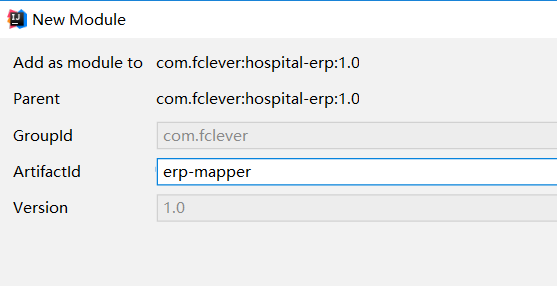

- pom

  ~~~xml
  <?xml version="1.0" encoding="UTF-8"?>
  <project xmlns="http://maven.apache.org/POM/4.0.0"
           xmlns:xsi="http://www.w3.org/2001/XMLSchema-instance"
           xsi:schemaLocation="http://maven.apache.org/POM/4.0.0 http://maven.apache.org/xsd/maven-4.0.0.xsd">
      <parent>
          <artifactId>hospital-erp</artifactId>
          <groupId>com.fclever</groupId>
          <version>1.0</version>
      </parent>
      <modelVersion>4.0.0</modelVersion>
  
      <artifactId>erp-mapper</artifactId>
      <description>进销存模块下数据访问模块</description>
  
      <dependencies>
          <!--依赖实体模块-->
          <dependency>
              <groupId>com.fclever</groupId>
              <artifactId>erp-domain</artifactId>
              <version>1.0</version>
          </dependency>
      </dependencies>
  
  </project>
  ~~~

#### F3.5.4：【子模块】erp-service模块创建和配置

- 新建

  - 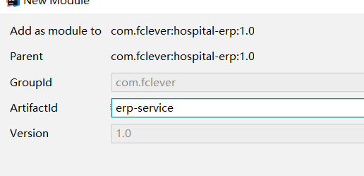

- pom（erp模块只是对外暴露服务，而不是暴露接口，并没有web模块），因此Dubbo|Zookeeper在此处

  ~~~xml
  <?xml version="1.0" encoding="UTF-8"?>
  <project xmlns="http://maven.apache.org/POM/4.0.0"
           xmlns:xsi="http://www.w3.org/2001/XMLSchema-instance"
           xsi:schemaLocation="http://maven.apache.org/POM/4.0.0 http://maven.apache.org/xsd/maven-4.0.0.xsd">
      <parent>
          <artifactId>hospital-erp</artifactId>
          <groupId>com.fclever</groupId>
          <version>1.0</version>
      </parent>
      <modelVersion>4.0.0</modelVersion>
  
      <artifactId>erp-service</artifactId>
      <description>进销存模块下业务逻辑模块</description>
  
      <dependencies>
          <!--依赖接口模块-->
          <dependency>
              <groupId>com.fclever</groupId>
              <artifactId>erp-interface</artifactId>
              <version>1.0</version>
          </dependency>
          <!--依赖数据访问模块-->
          <dependency>
              <groupId>com.fclever</groupId>
              <artifactId>erp-mapper</artifactId>
              <version>1.0</version>
          </dependency>
          <!--mysql数据库连接-->
          <dependency>
              <groupId>mysql</groupId>
              <artifactId>mysql-connector-java</artifactId>
          </dependency>
          <!--Durid-->
          <dependency>
              <groupId>com.alibaba</groupId>
              <artifactId>druid-spring-boot-starter</artifactId>
          </dependency>
          <!--测试相关-->
          <dependency>
              <groupId>org.springframework.boot</groupId>
              <artifactId>spring-boot-starter-test</artifactId>
              <scope>test</scope>
              <exclusions>
                  <exclusion>
                      <groupId>org.junit.vintage</groupId>
                      <artifactId>junit-vintage-engine</artifactId>
                  </exclusion>
              </exclusions>
          </dependency>
          <!--dubbo相关-->
          <dependency>
              <groupId>org.apache.dubbo</groupId>
              <artifactId>dubbo-spring-boot-starter</artifactId>
          </dependency>
          <!--使用Zookeeper做注册中心，Dubbo需要的依赖-->
          <dependency>
              <groupId>org.apache.dubbo</groupId>
              <artifactId>dubbo-dependencies-zookeeper</artifactId>
              <type>pom</type>
              <exclusions>
                  <exclusion>
                      <groupId>org.slf4j</groupId>
                      <artifactId>slf4j-log4j12</artifactId>
                  </exclusion>
              </exclusions>
          </dependency>
      </dependencies>
  
  </project>
  ~~~

- 创建启动类ErpApplication（这个项目需要启动的，这样system模块才能访问对应服务）

  ~~~shell
  package com.fclever;
  
  import org.apache.dubbo.config.spring.context.annotation.EnableDubbo;
  import org.mybatis.spring.annotation.MapperScan;
  import org.springframework.boot.SpringApplication;
  import org.springframework.boot.autoconfigure.SpringBootApplication;
  
  /**
   * @author Fclever
   * @create 2020-10-17 07:35
   */
  @SpringBootApplication
  @MapperScan(basePackages = {"com.fclever.mapper"})
  @EnableDubbo
  public class ErpApplication {
      public static void main(String[] args) {
          SpringApplication.run(ErpApplication.class, args);
      }
  }
  
  ~~~

- 添加yml文件

  - application.yml

    ~~~shell
    # 设置启动哪个配置文件的内容，配置dev即表示使用application-dev.yml中的内容
    spring:
      profiles:
        active: dev
    ~~~

    

  - application-dev.xml

    ~~~shell
    # 开发环境配置文件
    # 1.只需要对外暴露服务
    #server:
    #  port: 8080
    # 2.spring相关配置
    spring:
      datasource:
        driver-class-name: com.mysql.cj.jdbc.Driver # mysql-connector-java  6.0以上要使用这个，并且指定时区，UTC比中国早8个小时可以改成Asia/Shanghai
        url: jdbc:mysql://127.0.0.1:3306/onlinehospital?serverTimezone=Asia/Shanghai&useUnicode=true&characterEncoding=utf8&useSSL=false
        username: root
        password: root
        type: com.alibaba.druid.pool.DruidDataSource
        druid: # Druid数据源的配置
          max-active: 20
          min-idle: 5
          validation-query: select x
          initial-size: 3
          max-wait: 5000
          stat-view-servlet:
            # login-username: root
            # login-password: 123456
            allow:
            deny:
            url-pattern: /druid/*
            enabled: true # 启用数据源监控
    # Mybatis-plus配置
    mybatis-plus:
      configuration:
        log-impl: org.apache.ibatis.logging.stdout.StdOutImpl # 控制台打印完整带参数SQL语句
      mapper-locations: classpath:mapper/*Mapper.xml # 扫描mapper对象 Mapper.xml统一放在resource目录下
      global-config:
        db-config:
          id-type: auto # id自动生成
    # dubbo配置
    dubbo:
      config-center:
        timeout: 10000
      application:
        name: hospital-erp-service # 该项目部署在Zookeeper上的服务名称
      registry:
        address: zookeeper://192.168.125.20:2181
      consumer:
        check: false # 是否检查消费者
    
    ~~~

    

  - application-prod.yml

    ~~~shell
    # 生产环境配置文件（暂时不用，内容临时与dev一样）
    # 1.只需要对外暴露服务
    #server:
    #  port: 8080
    # 2.spring相关配置
    spring:
      datasource:
        driver-class-name: com.mysql.cj.jdbc.Driver # mysql-connector-java  6.0以上要使用这个，并且指定时区，UTC比中国早8个小时可以改成Asia/Shanghai
        url: jdbc:mysql://127.0.0.1:3306/onlinehospital?serverTimezone=Asia/Shanghai&useUnicode=true&characterEncoding=utf8&useSSL=false
        username: root
        password: root
        type: com.alibaba.druid.pool.DruidDataSource
        druid: # Druid数据源的配置
          max-active: 20
          min-idle: 5
          validation-query: select x
          initial-size: 3
          max-wait: 5000
          stat-view-servlet:
            # login-username: root
            # login-password: 123456
            allow:
            deny:
            url-pattern: /druid/*
            enabled: true # 启用数据源监控
    # Mybatis-plus配置
    mybatis-plus:
      configuration:
        log-impl: org.apache.ibatis.logging.stdout.StdOutImpl # 控制台打印完整带参数SQL语句
      mapper-locations: classpath:mapper/*Mapper.xml # 扫描mapper对象 Mapper.xml统一放在resource目录下
      global-config:
        db-config:
          id-type: auto # id自动生成
    # dubbo配置
    dubbo:
      config-center:
        timeout: 10000
      application:
        name: hospital-erp-service # 该项目部署在Zookeeper上的服务名称
      registry:
        address: zookeeper://192.168.125.20:2181
      consumer:
        check: false # 是否检查消费者
    
    
    ~~~

    

### F3.6：【就诊模块】hospital-diagnose模块及其子项目的创建和配置

- 新建父项目（hospital-diagnose），选中主父项目

  - 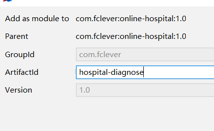

- pom

  ~~~xml
  <?xml version="1.0" encoding="UTF-8"?>
  <project xmlns="http://maven.apache.org/POM/4.0.0"
           xmlns:xsi="http://www.w3.org/2001/XMLSchema-instance"
           xsi:schemaLocation="http://maven.apache.org/POM/4.0.0 http://maven.apache.org/xsd/maven-4.0.0.xsd">
      <parent>
          <artifactId>online-hospital</artifactId>
          <groupId>com.fclever</groupId>
          <version>1.0</version>
      </parent>
      <modelVersion>4.0.0</modelVersion>
  
      <artifactId>hospital-diagnose</artifactId>
      <description>就诊模块</description>
  
      <dependencies>
          <!--依赖公共模块-->
          <dependency>
              <groupId>com.fclever</groupId>
              <artifactId>hospital-commons</artifactId>
              <version>1.0</version>
          </dependency>
      </dependencies>
  </project>
  ~~~

  

#### F3.6.1 【子模块】diagnose-interface模块创建和配置

- 新建

  - 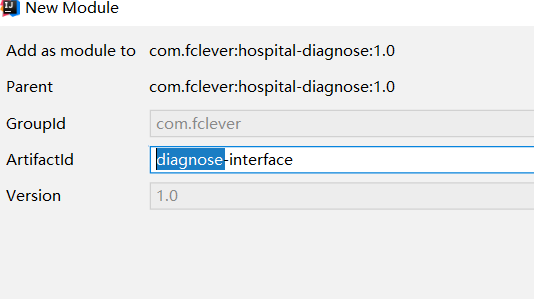

- pom

  - ```xml
    <?xml version="1.0" encoding="UTF-8"?>
    <project xmlns="http://maven.apache.org/POM/4.0.0"
             xmlns:xsi="http://www.w3.org/2001/XMLSchema-instance"
             xsi:schemaLocation="http://maven.apache.org/POM/4.0.0 http://maven.apache.org/xsd/maven-4.0.0.xsd">
        <parent>
            <artifactId>hospital-diagnose</artifactId>
            <groupId>com.fclever</groupId>
            <version>1.0</version>
        </parent>
        <modelVersion>4.0.0</modelVersion>
    
        <artifactId>diagnose-interface</artifactId>
        <description>就诊模块下接口子模块</description>
    
        <dependencies>
            <!--依赖实体模块-->
            <dependency>
                <groupId>com.fclever</groupId>
                <artifactId>diagnose-domain</artifactId>
                <version>1.0</version>
            </dependency>
        </dependencies>
    </project>
    ```

#### F3.6.1 【子模块】diagnose-domain模块创建和配置

- 新建

  - 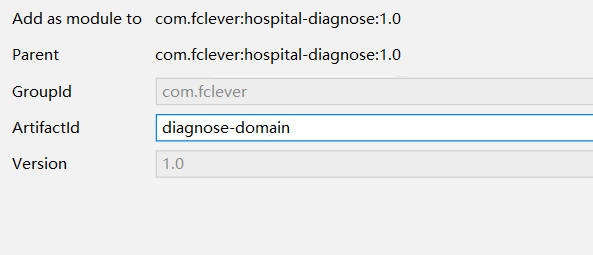

- pom

  ~~~xml
  <?xml version="1.0" encoding="UTF-8"?>
  <project xmlns="http://maven.apache.org/POM/4.0.0"
           xmlns:xsi="http://www.w3.org/2001/XMLSchema-instance"
           xsi:schemaLocation="http://maven.apache.org/POM/4.0.0 http://maven.apache.org/xsd/maven-4.0.0.xsd">
      <parent>
          <artifactId>hospital-diagnose</artifactId>
          <groupId>com.fclever</groupId>
          <version>1.0</version>
      </parent>
      <modelVersion>4.0.0</modelVersion>
  
      <artifactId>diagnose-domain</artifactId>
      <description>就诊模块下实体子模块</description>
  
      <dependencies>
          <!--mybatis-plus-->
          <dependency>
              <groupId>com.baomidou</groupId>
              <artifactId>mybatis-plus-boot-starter</artifactId>
          </dependency>
      </dependencies>
  
  </project>
  ~~~

  

#### F3.6.1 【子模块】diagnose-mapper模块创建和配置

- 新建

  - 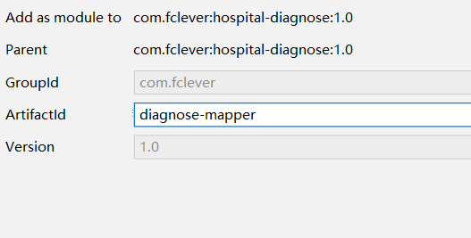

- pom（依赖了interface，里面有了实体，所以不用单独再引入实体）

  ~~~xml
  <?xml version="1.0" encoding="UTF-8"?>
  <project xmlns="http://maven.apache.org/POM/4.0.0"
           xmlns:xsi="http://www.w3.org/2001/XMLSchema-instance"
           xsi:schemaLocation="http://maven.apache.org/POM/4.0.0 http://maven.apache.org/xsd/maven-4.0.0.xsd">
      <parent>
          <artifactId>hospital-diagnose</artifactId>
          <groupId>com.fclever</groupId>
          <version>1.0</version>
      </parent>
      <modelVersion>4.0.0</modelVersion>
  
      <artifactId>diagnose-mapper</artifactId>
      <description>就诊模块下数据访问子模块</description>
  
      <dependencies>
          <!--依赖接口-->
          <dependency>
              <groupId>com.fclever</groupId>
              <artifactId>diagnose-interface</artifactId>
              <version>1.0</version>
              <scope>compile</scope>
          </dependency>
          <!--mysql连接-->
          <dependency>
              <groupId>mysql</groupId>
              <artifactId>mysql-connector-java</artifactId>
          </dependency>
          <!--Druid-->
          <dependency>
              <groupId>com.alibaba</groupId>
              <artifactId>druid-spring-boot-starter</artifactId>
          </dependency>
      </dependencies>
  
  </project>
  ~~~

  

#### F3.6.1 【子模块】diagnose-service模块创建和配置

- 新建

  - 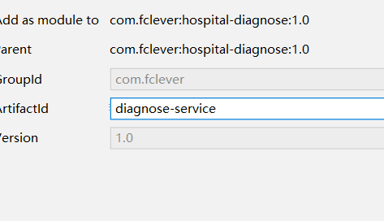

- pom

  ~~~xml
  <?xml version="1.0" encoding="UTF-8"?>
  <project xmlns="http://maven.apache.org/POM/4.0.0"
           xmlns:xsi="http://www.w3.org/2001/XMLSchema-instance"
           xsi:schemaLocation="http://maven.apache.org/POM/4.0.0 http://maven.apache.org/xsd/maven-4.0.0.xsd">
      <parent>
          <artifactId>hospital-diagnose</artifactId>
          <groupId>com.fclever</groupId>
          <version>1.0</version>
      </parent>
      <modelVersion>4.0.0</modelVersion>
  
      <artifactId>diagnose-service</artifactId>
      <description>就诊模块下业务逻辑子模块</description>
  
      <dependencies>
          <!--依赖数据访问模块-->
          <dependency>
              <groupId>com.fclever</groupId>
              <artifactId>diagnose-mapper</artifactId>
              <version>1.0</version>
          </dependency>
          <!--依赖Erp的接口模块-->
          <dependency>
              <groupId>com.fclever</groupId>
              <artifactId>erp-interface</artifactId>
              <version>1.0</version>
          </dependency>
          <!--mysql-->
          <dependency>
              <groupId>mysql</groupId>
              <artifactId>mysql-connector-java</artifactId>
          </dependency>
          <!--Druid-->
          <dependency>
              <groupId>com.alibaba</groupId>
              <artifactId>druid-spring-boot-starter</artifactId>
          </dependency>
          <!--测试依赖-->
          <dependency>
              <groupId>org.springframework.boot</groupId>
              <artifactId>spring-boot-starter-test</artifactId>
              <scope>test</scope>
              <exclusions>
                  <exclusion>
                      <groupId>org.junit.vintage</groupId>
                      <artifactId>junit-vintage-engine</artifactId>
                  </exclusion>
              </exclusions>
          </dependency>
          <!--dubbo-->
          <dependency>
              <groupId>org.apache.dubbo</groupId>
              <artifactId>dubbo-spring-boot-starter</artifactId>
          </dependency>
          <!--使用Zookeeper做注册中心，Dubbo需要的依赖-->
          <dependency>
              <groupId>org.apache.dubbo</groupId>
              <artifactId>dubbo-dependencies-zookeeper</artifactId>
              <type>pom</type>
              <exclusions>
                  <exclusion>
                      <groupId>org.slf4j</groupId>
                      <artifactId>slf4j-log4j12</artifactId>
                  </exclusion>
              </exclusions>
          </dependency>
      </dependencies>
  
  </project>
  ~~~

  

- 启动类

  ~~~xml
  package com.fclever;
  
  import org.apache.dubbo.config.spring.context.annotation.EnableDubbo;
  import org.mybatis.spring.annotation.MapperScan;
  import org.springframework.boot.SpringApplication;
  import org.springframework.boot.autoconfigure.SpringBootApplication;
  
  /**
   * @author Fclever
   * @create 2020-10-17 09:18
   */
  @SpringBootApplication
  @MapperScan(basePackages = {"com.fclever.mapper"})
  @EnableDubbo
  public class DiagnoseApplication {
      public static void main(String[] args) {
          SpringApplication.run(DiagnoseApplication.class, args);
      }
  }
  
  ~~~

  

- yml配置

  - application.yml

    ~~~xml
    # 设置启动哪个配置文件的内容，配置dev即表示使用application-dev.yml中的内容
    spring:
      profiles:
        active: dev
    ~~~

    

  - application-dev.xml

    ~~~xml
    # 开发环境配置文件
    # 1.只需要对外暴露服务
    #server:
    #  port: 8080
    # 2.spring相关配置
    spring:
      datasource:
        driver-class-name: com.mysql.cj.jdbc.Driver # mysql-connector-java  6.0以上要使用这个，并且指定时区，UTC比中国早8个小时可以改成Asia/Shanghai
        url: jdbc:mysql://127.0.0.1:3306/onlinehospital?serverTimezone=Asia/Shanghai&useUnicode=true&characterEncoding=utf8&useSSL=false
        username: root
        password: root
        type: com.alibaba.druid.pool.DruidDataSource
        druid: # Druid数据源的配置
          max-active: 20
          min-idle: 5
          validation-query: select x
          initial-size: 3
          max-wait: 5000
          stat-view-servlet:
            # login-username: root
            # login-password: 123456
            allow:
            deny:
            url-pattern: /druid/*
            enabled: true # 启用数据源监控
    # Mybatis-plus配置
    mybatis-plus:
      configuration:
        log-impl: org.apache.ibatis.logging.stdout.StdOutImpl # 控制台打印完整带参数SQL语句
      mapper-locations: classpath:mapper/*Mapper.xml # 扫描mapper对象 Mapper.xml统一放在resource目录下
      global-config:
        db-config:
          id-type: auto # id自动生成
    # dubbo配置
    dubbo:
      config-center:
        timeout: 10000
      application:
        name: hospital-diagnose-service # 该项目部署在Zookeeper上的服务名称
      registry:
        address: zookeeper://192.168.125.20:2181
      consumer:
        check: false # 是否检查消费者
    
    ~~~

    

  - application-prod.yml

    ~~~yml
    # 生产环境配置文件（暂时不用，内容临时与dev一样）
    # 1.只需要对外暴露服务
    #server:
    #  port: 8080
    # 2.spring相关配置
    spring:
      datasource:
        driver-class-name: com.mysql.cj.jdbc.Driver # mysql-connector-java  6.0以上要使用这个，并且指定时区，UTC比中国早8个小时可以改成Asia/Shanghai
        url: jdbc:mysql://127.0.0.1:3306/onlinehospital?serverTimezone=Asia/Shanghai&useUnicode=true&characterEncoding=utf8&useSSL=false
        username: root
        password: root
        type: com.alibaba.druid.pool.DruidDataSource
        druid: # Druid数据源的配置
          max-active: 20
          min-idle: 5
          validation-query: select x
          initial-size: 3
          max-wait: 5000
          stat-view-servlet:
            # login-username: root
            # login-password: 123456
            allow:
            deny:
            url-pattern: /druid/*
            enabled: true # 启用数据源监控
    # Mybatis-plus配置
    mybatis-plus:
      configuration:
        log-impl: org.apache.ibatis.logging.stdout.StdOutImpl # 控制台打印完整带参数SQL语句
      mapper-locations: classpath:mapper/*Mapper.xml # 扫描mapper对象 Mapper.xml统一放在resource目录下
      global-config:
        db-config:
          id-type: auto # id自动生成
    # dubbo配置
    dubbo:
      config-center:
        timeout: 10000
      application:
        name: hospital-diagnose-service # 该项目部署在Zookeeper上的服务名称
      registry:
        address: zookeeper://192.168.125.20:2181
      consumer:
        check: false # 是否检查消费者
    
    
    ~~~

### F3.7：【统计模块】hospital-statistics模块及其子项目的创建和配置

- 新建（基于主父项目）

  - 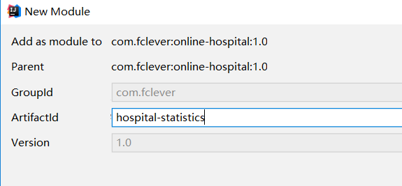

- pom

  ~~~xml
  <?xml version="1.0" encoding="UTF-8"?>
  <project xmlns="http://maven.apache.org/POM/4.0.0"
           xmlns:xsi="http://www.w3.org/2001/XMLSchema-instance"
           xsi:schemaLocation="http://maven.apache.org/POM/4.0.0 http://maven.apache.org/xsd/maven-4.0.0.xsd">
      <parent>
          <artifactId>online-hospital</artifactId>
          <groupId>com.fclever</groupId>
          <version>1.0</version>
      </parent>
      <modelVersion>4.0.0</modelVersion>
  
      <artifactId>hospital-statistics</artifactId>
      <packaging>pom</packaging>
      <description>统计分析模块</description>
      <modules>
          <module>statistics-interface</module>
      </modules>
  
      <dependencies>
          <!--依赖公共模块-->
          <dependency>
              <groupId>com.fclever</groupId>
              <artifactId>hospital-commons</artifactId>
              <version>1.0</version>
          </dependency>
      </dependencies>
  </project>
  ~~~

#### F3.7.1：【子模块】statistics-interface模块创建和配置

- 新建

  - 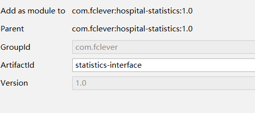

- pom

  ~~~xml
  <?xml version="1.0" encoding="UTF-8"?>
  <project xmlns="http://maven.apache.org/POM/4.0.0"
           xmlns:xsi="http://www.w3.org/2001/XMLSchema-instance"
           xsi:schemaLocation="http://maven.apache.org/POM/4.0.0 http://maven.apache.org/xsd/maven-4.0.0.xsd">
      <parent>
          <artifactId>hospital-statistics</artifactId>
          <groupId>com.fclever</groupId>
          <version>1.0</version>
      </parent>
      <modelVersion>4.0.0</modelVersion>
  
      <artifactId>statistics-interface</artifactId>
      <description>统计分析模块下接口子模块</description>
  
      <dependencies>
          <!--依赖实体模块-->
          <dependency>
              <groupId>com.fclever</groupId>
              <artifactId>statistics-domain</artifactId>
              <version>1.0</version>
          </dependency>
      </dependencies>
  
  
  </project>
  ~~~

  

#### F3.7.1：【子模块】statistics-domain模块创建和配置

- 新建

  - 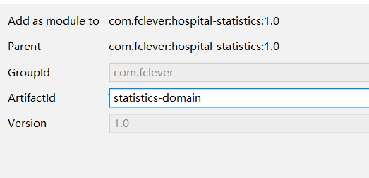

- pom

  ~~~xml
  <?xml version="1.0" encoding="UTF-8"?>
  <project xmlns="http://maven.apache.org/POM/4.0.0"
           xmlns:xsi="http://www.w3.org/2001/XMLSchema-instance"
           xsi:schemaLocation="http://maven.apache.org/POM/4.0.0 http://maven.apache.org/xsd/maven-4.0.0.xsd">
      <parent>
          <artifactId>hospital-statistics</artifactId>
          <groupId>com.fclever</groupId>
          <version>1.0</version>
      </parent>
      <modelVersion>4.0.0</modelVersion>
  
      <artifactId>statistics-domain</artifactId>
      <description>统计分析模块下实体子模块</description>
  
      <dependencies>
          <!--mybatis-plus-->
          <dependency>
              <groupId>com.baomidou</groupId>
              <artifactId>mybatis-plus-boot-starter</artifactId>
          </dependency>
      </dependencies>
  
  </project>
  ~~~

  

#### F3.7.1：【子模块】statistics-mapper模块创建和配置

- 新建

  - 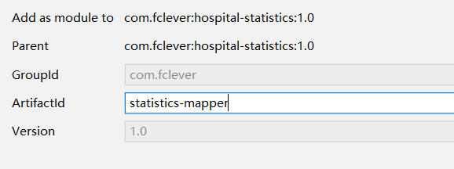

- pom

  ~~~xml
  <?xml version="1.0" encoding="UTF-8"?>
  <project xmlns="http://maven.apache.org/POM/4.0.0"
           xmlns:xsi="http://www.w3.org/2001/XMLSchema-instance"
           xsi:schemaLocation="http://maven.apache.org/POM/4.0.0 http://maven.apache.org/xsd/maven-4.0.0.xsd">
      <parent>
          <artifactId>hospital-statistics</artifactId>
          <groupId>com.fclever</groupId>
          <version>1.0</version>
      </parent>
      <modelVersion>4.0.0</modelVersion>
  
      <artifactId>statistics-mapper</artifactId>
      <description>统计分析模块下数据访问子模块</description>
  
      <dependencies>
          <!--依赖实体-->
          <dependency>
              <groupId>com.fclever</groupId>
              <artifactId>statistics-domain</artifactId>
              <version>1.0</version>
          </dependency>
      </dependencies>
  
  </project>
  ~~~

  

#### F3.7.1：【子模块】statistics-service模块创建和配置

- 新建

  - 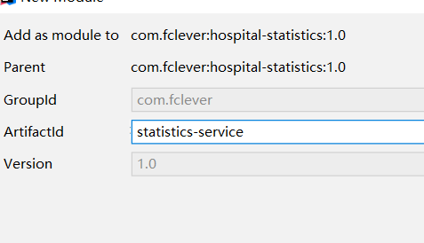

- pom

  ~~~xml
  <?xml version="1.0" encoding="UTF-8"?>
  <project xmlns="http://maven.apache.org/POM/4.0.0"
           xmlns:xsi="http://www.w3.org/2001/XMLSchema-instance"
           xsi:schemaLocation="http://maven.apache.org/POM/4.0.0 http://maven.apache.org/xsd/maven-4.0.0.xsd">
      <parent>
          <artifactId>hospital-statistics</artifactId>
          <groupId>com.fclever</groupId>
          <version>1.0</version>
      </parent>
      <modelVersion>4.0.0</modelVersion>
  
      <artifactId>statistics-service</artifactId>
      <description>统计分析模块下业务逻辑子模块</description>
  
      <dependencies>
          <!--依赖数据访问层-->
          <dependency>
              <groupId>com.fclever</groupId>
              <artifactId>statistics-mapper</artifactId>
              <version>1.0</version>
          </dependency>
          <!--依赖接口层-->
          <dependency>
              <groupId>com.fclever</groupId>
              <artifactId>system-interface</artifactId>
              <version>1.0</version>
          </dependency>
          <!--MySQL-->
          <dependency>
              <groupId>mysql</groupId>
              <artifactId>mysql-connector-java</artifactId>
          </dependency>
          <!--Druid-->
          <dependency>
              <groupId>com.alibaba</groupId>
              <artifactId>druid-spring-boot-starter</artifactId>
          </dependency>
          <!--测试依赖-->
          <dependency>
              <groupId>org.springframework.boot</groupId>
              <artifactId>spring-boot-starter-test</artifactId>
              <scope>test</scope>
              <exclusions>
                  <exclusion>
                      <groupId>org.junit.vintage</groupId>
                      <artifactId>junit-vintage-engine</artifactId>
                  </exclusion>
              </exclusions>
          </dependency>
          <!--Dubbo-->
          <dependency>
              <groupId>org.apache.dubbo</groupId>
              <artifactId>dubbo-spring-boot-starter</artifactId>
          </dependency>
          <!--使用Zookeeper注册中心，Dubbo需要的依赖-->
          <dependency>
              <groupId>org.apache.dubbo</groupId>
              <artifactId>dubbo-dependencies-zookeeper</artifactId>
              <type>pom</type>
              <exclusions>
                  <exclusion>
                      <groupId>org.slf4j</groupId>
                      <artifactId>slf4j-log4j12</artifactId>
                  </exclusion>
              </exclusions>
          </dependency>
      </dependencies>
  
  </project>
  ~~~

- 启动类

  ~~~class
  package com.fclever;
  
  import org.apache.dubbo.config.spring.context.annotation.EnableDubbo;
  import org.mybatis.spring.annotation.MapperScan;
  import org.springframework.boot.SpringApplication;
  import org.springframework.boot.autoconfigure.SpringBootApplication;
  
  /**
   * @author Fclever
   * @create 2020-10-17 12:26
   */
  @SpringBootApplication
  @MapperScan(basePackages = {"com.fclever.mapper"})
  @EnableDubbo
  public class StatisticsApplication {
      public static void main(String[] args) {
          SpringApplication.run(StatisticsApplication.class, args);
      }
  }
  
  ~~~

  

- yml

  - application.yml

    ~~~xml
    # 设置启动哪个配置文件的内容，配置dev即表示使用application-dev.yml中的内容
    spring:
      profiles:
        active: dev
    ~~~

    

  - application-dev.xml

    ~~~xml
    # 开发环境配置文件
    # 1.只需要对外暴露服务
    #server:
    #  port: 8080
    # 2.spring相关配置
    spring:
      datasource:
        driver-class-name: com.mysql.cj.jdbc.Driver # mysql-connector-java  6.0以上要使用这个，并且指定时区，UTC比中国早8个小时可以改成Asia/Shanghai
        url: jdbc:mysql://127.0.0.1:3306/onlinehospital?serverTimezone=Asia/Shanghai&useUnicode=true&characterEncoding=utf8&useSSL=false
        username: root
        password: root
        type: com.alibaba.druid.pool.DruidDataSource
        druid: # Druid数据源的配置
          max-active: 20
          min-idle: 5
          validation-query: select x
          initial-size: 3
          max-wait: 5000
          stat-view-servlet:
            # login-username: root
            # login-password: 123456
            allow:
            deny:
            url-pattern: /druid/*
            enabled: true # 启用数据源监控
    # Mybatis-plus配置
    mybatis-plus:
      configuration:
        log-impl: org.apache.ibatis.logging.stdout.StdOutImpl # 控制台打印完整带参数SQL语句
      mapper-locations: classpath:mapper/*Mapper.xml # 扫描mapper对象 Mapper.xml统一放在resource目录下
      global-config:
        db-config:
          id-type: auto # id自动生成
    # dubbo配置
    dubbo:
      config-center:
        timeout: 10000
      application:
        name: hospital-statistics-service # 该项目部署在Zookeeper上的服务名称
      registry:
        address: zookeeper://192.168.125.20:2181
      consumer:
        check: false # 是否检查消费者
    ~~~

    

  - application-prod.yml

    ~~~xml
    # 生产环境配置文件（暂时不用，内容临时与dev一样）
    # 1.只需要对外暴露服务
    #server:
    #  port: 8080
    # 2.spring相关配置
    spring:
      datasource:
        driver-class-name: com.mysql.cj.jdbc.Driver # mysql-connector-java  6.0以上要使用这个，并且指定时区，UTC比中国早8个小时可以改成Asia/Shanghai
        url: jdbc:mysql://127.0.0.1:3306/onlinehospital?serverTimezone=Asia/Shanghai&useUnicode=true&characterEncoding=utf8&useSSL=false
        username: root
        password: root
        type: com.alibaba.druid.pool.DruidDataSource
        druid: # Druid数据源的配置
          max-active: 20
          min-idle: 5
          validation-query: select x
          initial-size: 3
          max-wait: 5000
          stat-view-servlet:
            # login-username: root
            # login-password: 123456
            allow:
            deny:
            url-pattern: /druid/*
            enabled: true # 启用数据源监控
    # Mybatis-plus配置
    mybatis-plus:
      configuration:
        log-impl: org.apache.ibatis.logging.stdout.StdOutImpl # 控制台打印完整带参数SQL语句
      mapper-locations: classpath:mapper/*Mapper.xml # 扫描mapper对象 Mapper.xml统一放在resource目录下
      global-config:
        db-config:
          id-type: auto # id自动生成
    # dubbo配置
    dubbo:
      config-center:
        timeout: 10000
      application:
        name: hospital-statistics-service # 该项目部署在Zookeeper上的服务名称
      registry:
        address: zookeeper://192.168.125.20:2181
      consumer:
        check: false # 是否检查消费者
    ~~~

## F4：启动后端环境

- 前提：
  - 虚拟机开启对应服务
- 启动几个后端项目
  - 系统模块因为需要shiro的一些配置，暂时无法启动
- 如果控制台不报错就可以了

### F3.8：【小程序模块】hospital-app模块及其子项目的创建和配置

# 前端环境搭建

## F1：准备工作

### F1.1：vue-element-ui-admin

- 介绍
  - [vue-element-admin](http://panjiachen.github.io/vue-element-admin) 是一个后台前端解决方案，它基于 [vue](https://github.com/vuejs/vue) 和 [element-ui](https://github.com/ElemeFE/element)实现。它使用了最新的前端技术栈，内置了 i18 国际化解决方案，动态路由，权限验证，提炼了典型的业务模型，提供了丰富的功能组件，它可以帮助你快速搭建企业级中后台产品原型。
- 相关材料
  - 中文文档
    - https://panjiachen.gitee.io/vue-element-admin-site/zh/
  - GitHub代码
    - https://github.com/PanJiaChen/vue-element-admin
  - 演示系统
    - 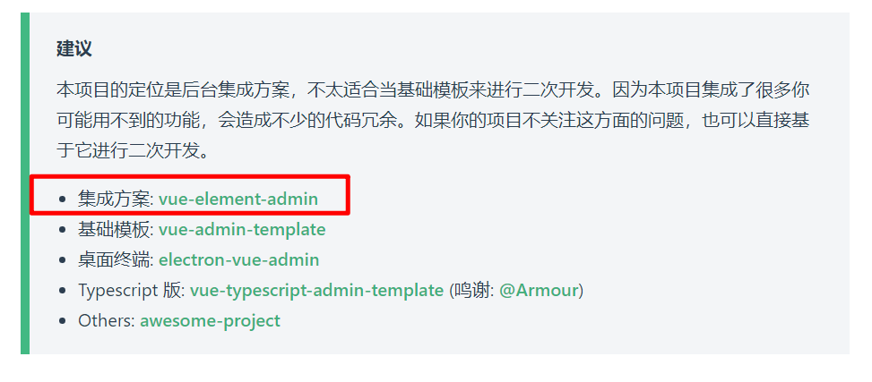

### F1.2：安装Node服务器

- https://nodejs.org/zh-cn/
  - 
- 本机版本
  - 
  - 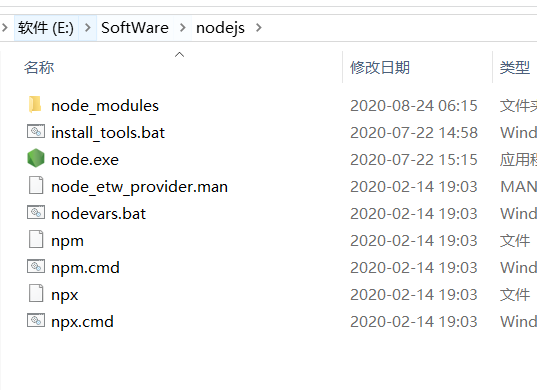
- 下载之后需要配置环境变量
  - 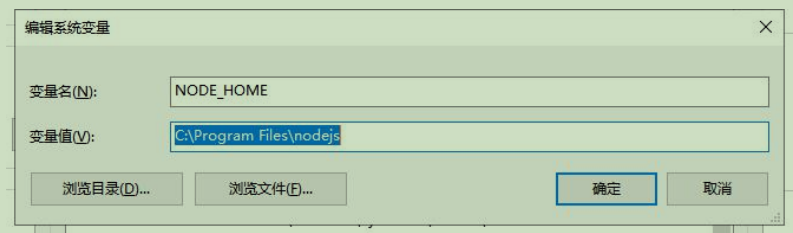
  - 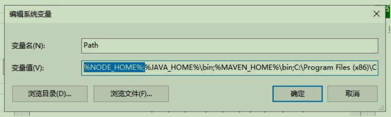

### F1.3：安装WebStorm

- 这个在基础环境搭建里面已经提到过了，不再赘述

## F2：vue-element-ui搭建

#### F2.1：clone项目

- 通过官方github的介绍来进行或者说明文档
  - https://github.com/PanJiaChen/vue-element-admin/blob/master/README.zh-CN.md
  - https://panjiachen.github.io/vue-element-admin-site/zh/guide
  - 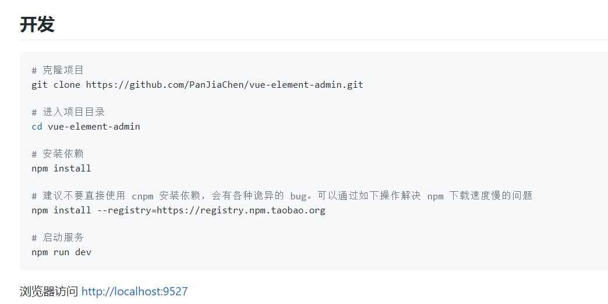
- 如果自己在WebStorm中配置了github账号的话，可以删掉，下载或者push时手动输入
  - 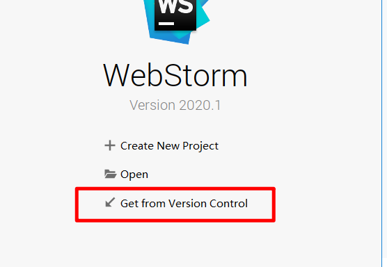
  - 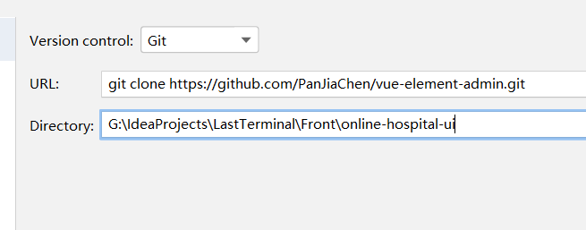

#### F2.2：安装install

- npm install

- 可以设置一下加速（如果感觉下载慢的话，我这里没有用）

  - ```bash
    npm install --registry=https://registry.npm.taobao.org
    ```

- 先尝试在WebStorm的Terminal中执行该命令，如果出现如下错误

  - 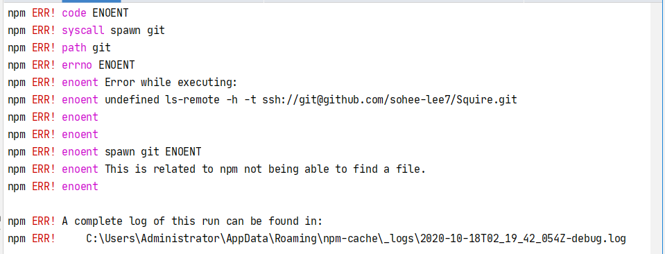

- 则进入项目根目录，然后git bash here，执行npm install(一定要耐心等，我的情况是当时等了一会，发展控制台没有什么进展，然后强制关系，重新打开WebStorm，npm install就成功了。。。)

  - 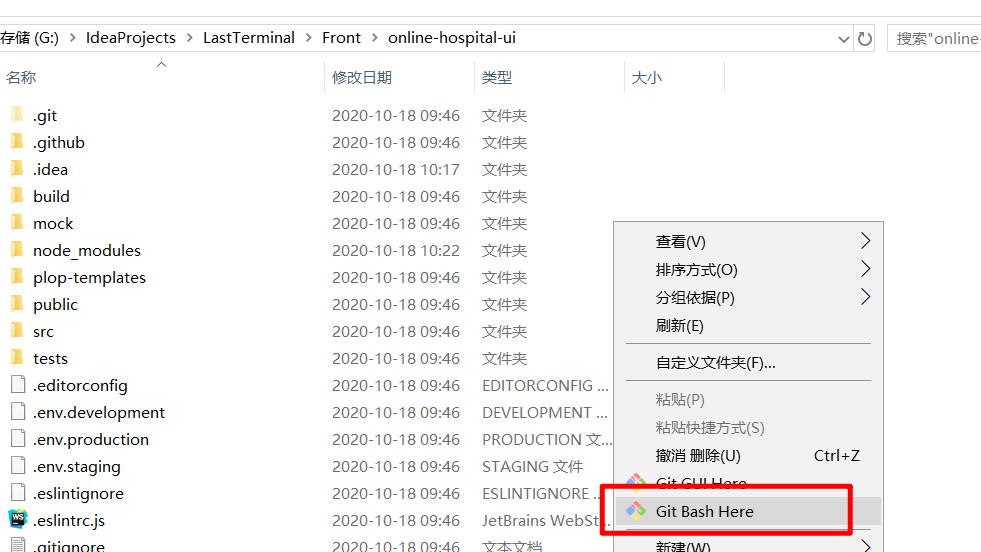

- 终于成功了

  - 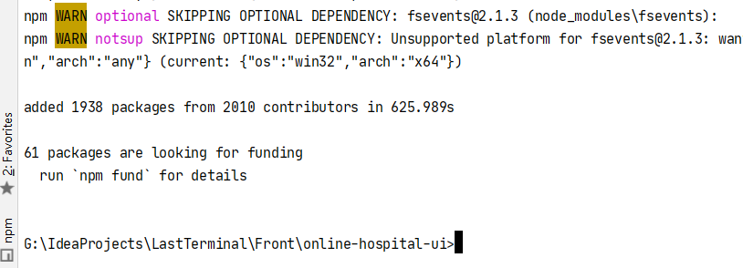

#### F2.3：运行测试

- npm run dev
- 
- 会自动打开浏览器页面
  - 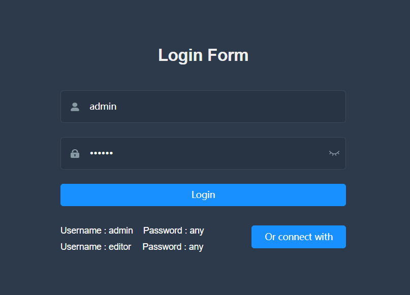
  - 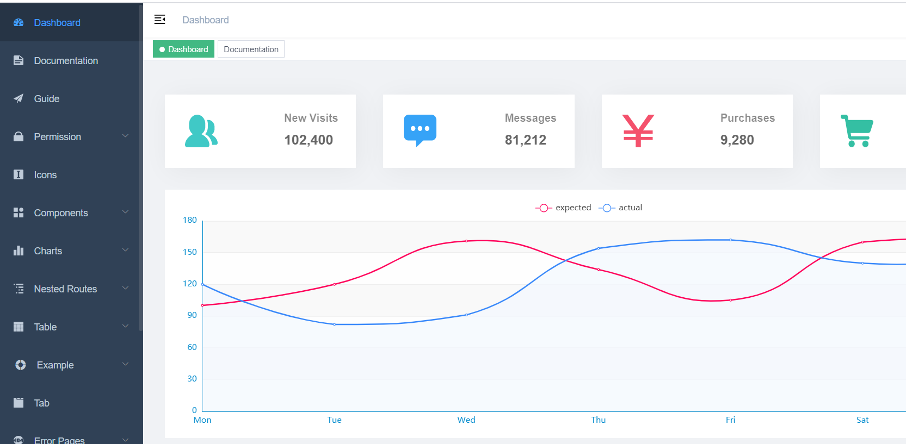

#### F 2.4：成功打开页面后，上传到GitHub

- 删除掉项目根目录下的.git文件，.github文件
- 初始化git
  - 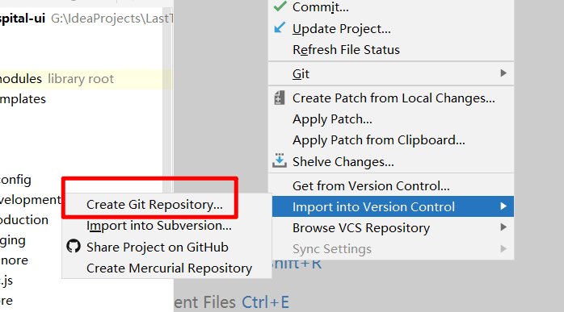
  - 选择当前项目的路径就可以了
  - 如果进行完这一步之后，右键项目看不到git选项， 则重新打开一下项目就可以了
- 添加项目到本地仓库add-->commit
  - 由于前面的npm install如此费劲，所以我这次设置了将node_modules也上传上去了（这个正常来说是不能传的）
  - 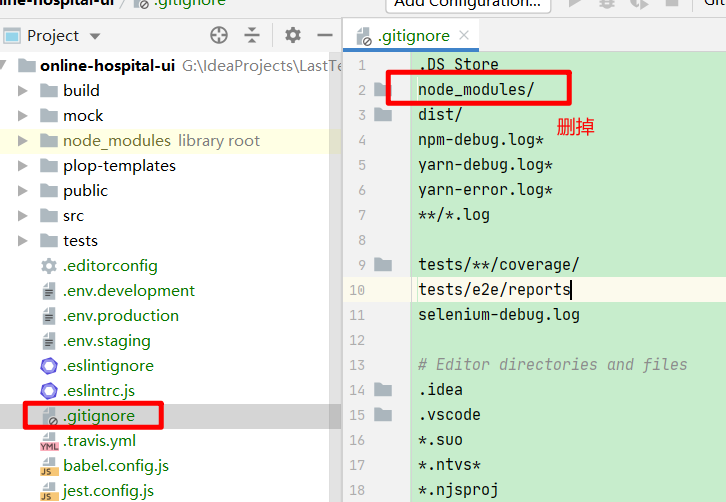
  - 
  - 由于加入了node_modules，因此add或者后面的操作都会很耗时，因为node_modules内容很多（接近300M），
  - 然后commit
- 上传到自己github仓库
  - 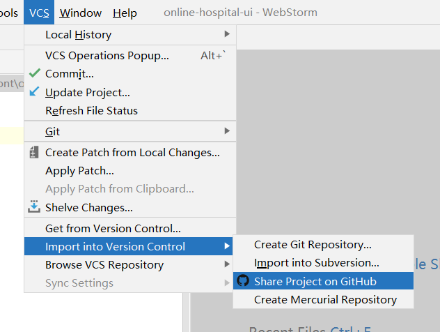
  - 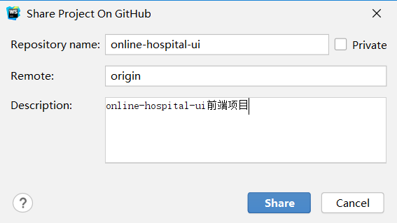
  - 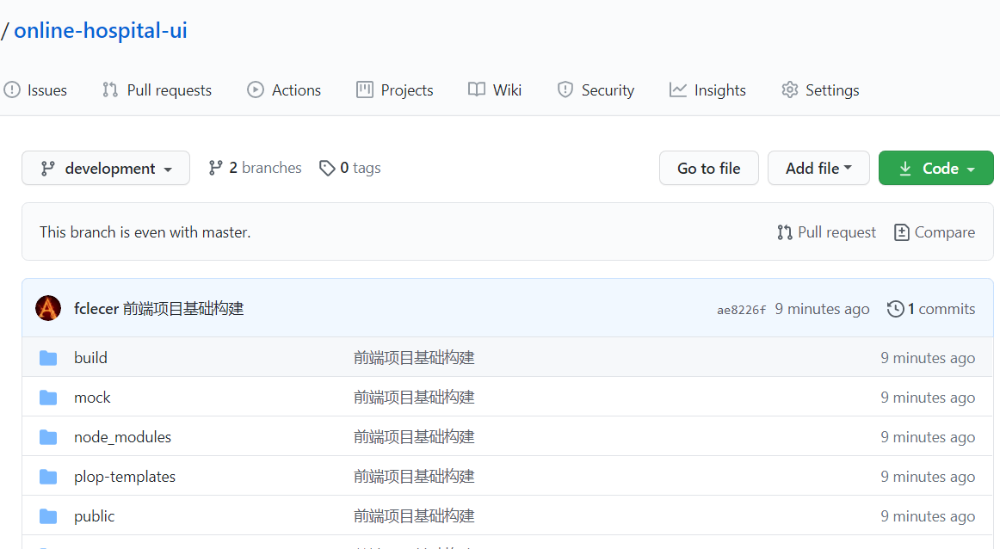
- 创建development分支，以后开发的位置
  - 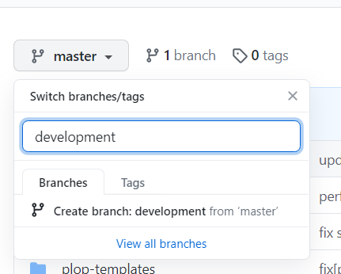
- 本地检出development分支
  - 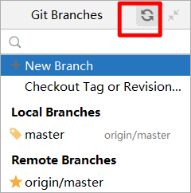
  - 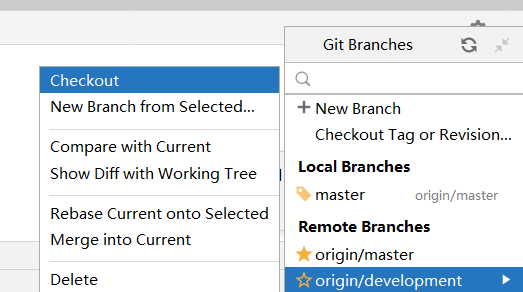
- 再次运行项目测试
  - npm run dev
  - 成功

#### F2.5：项目结构说明

- 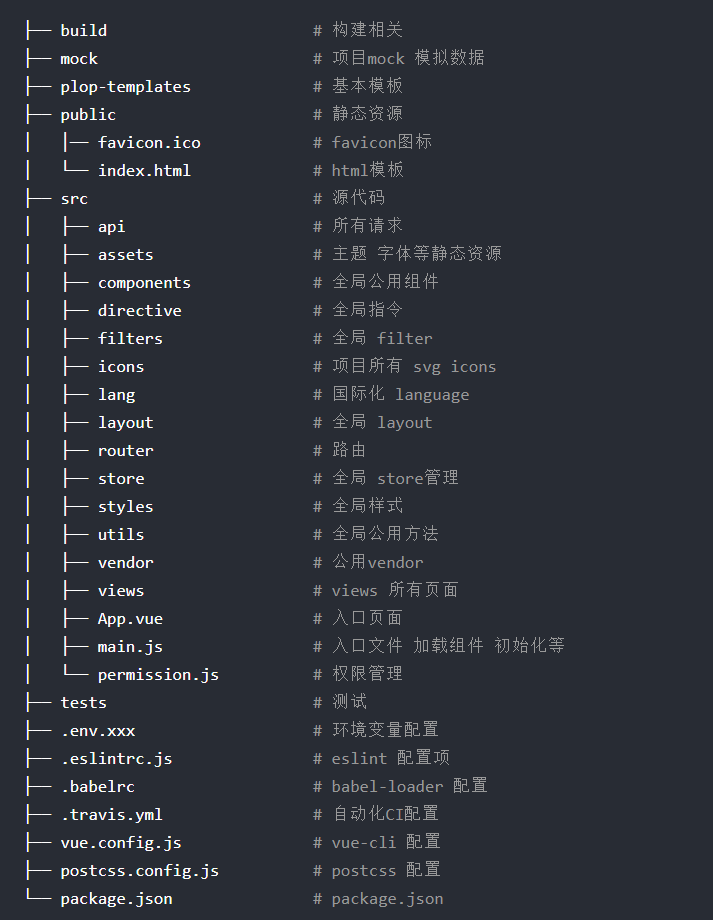

#### F2.6：删除一些不必要文件，提交到github

- 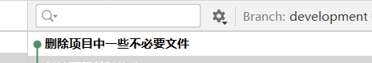

#### F2.7：默认登录和加载菜单的说明

- 对应文件

  - permission.js
  - 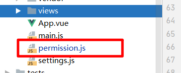

- 内容

  ~~~js
  import router from './router'
  import store from './store'
  import { Message } from 'element-ui'
  import NProgress from 'nprogress' // progress bar
  import 'nprogress/nprogress.css' // progress bar style
  import { getToken } from '@/utils/auth' // get token from cookie
  import getPageTitle from '@/utils/get-page-title'
  
  NProgress.configure({ showSpinner: false }) // NProgress Configuration
  
  const whiteList = ['/login', '/auth-redirect'] // no redirect whitelist
  
  // 全局前置守卫，触发任意导航时，都会触发全局前置守卫
  router.beforeEach(async(to, from, next) => {
    // 开始进度条
    NProgress.start()
  
    // 设置网页标题
    document.title = getPageTitle(to.meta.title)
  
    // 获取页面的token信息，判断用户是否已经登录
    const hasToken = getToken()
  
    if (hasToken) {
      // 已经登录了，判断请求路由是否为login，如果是login则不需要重复登录，直接跳转到首页即可
      if (to.path === '/login') {
        // 如果已经登录过了，那么跳转到首页
        next({ path: '/' })
        NProgress.done() // hack: https://github.com/PanJiaChen/vue-element-admin/pull/2939
      } else {
        // 如果请求路由不是去往登录页面，那么就需要判断当前用户的角色，来决定能否跳转到目标路由
        // 确定用户是否通过getInfo获得了他的角色
        const hasRoles = store.getters.roles && store.getters.roles.length > 0
        // 如果已经获得了角色，那么就可以跳转到目标路由
        if (hasRoles) {
          next()
        } else {
          // 如果没有对应的角色，那么就需要请求后台获取用户信息和权限信息
          try {
            // 说明：角色必须是一个对象数组类型，比如【‘admin’】或者【‘developer’，‘editor’】
            const { roles } = await store.dispatch('user/getInfo')
  
            // 基于角色生成动态路由【菜单和权限】
            const accessRoutes = await store.dispatch('permission/generateRoutes', roles)
  
            // 动态添加路由
            router.addRoutes(accessRoutes)
  
            // hack方法，以确保addRoutes是完整的
            // 设置replace: true，这样导航将不会留下历史记录
            next({ ...to, replace: true })
          } catch (error) {
            // 如果出错，则请求后台重置用户token并且跳转到登录页面，重新登录
            await store.dispatch('user/resetToken')
            Message.error(error || 'Has Error')
            next(`/login?redirect=${to.path}`)
            NProgress.done()
          }
        }
      }
    } else {
      /* has no token*/
      // 没有token，需要登录
      if (whiteList.indexOf(to.path) !== -1) {
        // in the free login whitelist, go directly
        // 如果在免登陆白名单中，则直接不需登录直接进入
        next()
      } else {
        // 否则将被重定向到登录页面
        next(`/login?redirect=${to.path}`)
        NProgress.done()
      }
    }
  })
  
  // 全局后置钩子
  router.afterEach(() => {
    // finish progress bar
    NProgress.done()
  })
  
  ~~~

- 登录页面登录相关逻辑
  - 登录页面（src/views/login/index.vue）
    - 该页面中可以找到登录按钮触发的事件
    - 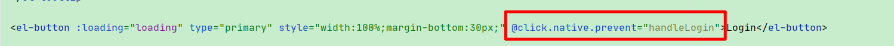
    - 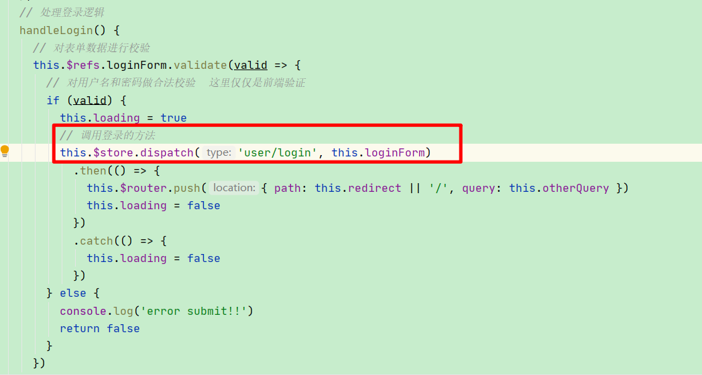
    - this.$store.dispatch这个方法会调用src/store/modules/user.js文件中的login方法，并将logForm登录表单数据传递过去
  - user.js
    - 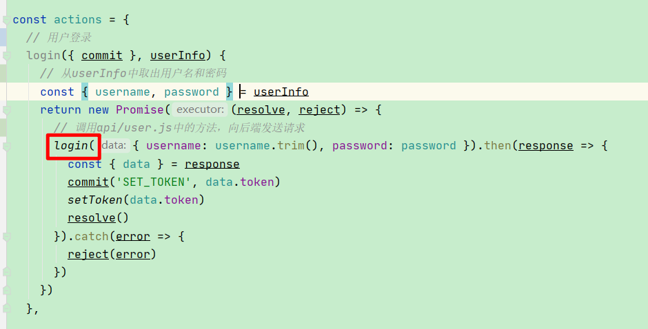
  - api/user.js
    - 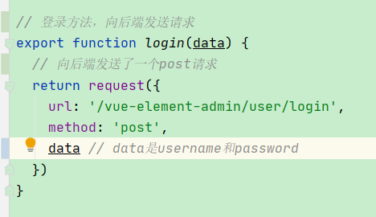

#### F2.8：修改系统路由菜单

- 直接修改router/index.js即可

  ~~~js
  import Vue from 'vue'
  import Router from 'vue-router'
  Vue.use(Router)
  
  /* Layout */
  import Layout from '@/layout'
  /**
   * constantRoutes 常量路由，这些路由由后台的数据控制是否显示
   */
  export const constantRoutes = [
    {
      path: '/redirect',
      component: Layout,
      hidden: true,
      children: [
        {
          path: '/redirect/:path*',
          component: () => import('@/views/redirect/index')
        }
      ]
    },
    {
      path: '/login',
      component: () => import('@/views/login/index'),
      hidden: true
    },
    {
      path: '/auth-redirect',
      component: () => import('@/views/login/auth-redirect'),
      hidden: true
    },
    {
      path: '/404',
      component: () => import('@/views/error-page/404'),
      hidden: true
    },
    {
      path: '/401',
      component: () => import('@/views/error-page/401'),
      hidden: true
    },
    {
      path: '/',
      component: Layout,
      redirect: '/dashboard',
      children: [
        {
          path: 'dashboard',
          component: () => import('@/views/dashboard/index'),
          name: '首页',
          meta: { title: '首页', icon: 'dashboard', affix: true }
        }
      ]
    }
  ]
  export const asyncRoutes = [
    {
      path: '/system',
      component: Layout,
      redirect: 'noRedirect',
      alwaysShow: true,
      name: '/system',
      meta: {
        title: '系统管理',
        icon: 'lock'
      },
      children: [
        {
          path: 'dept',
          component: () => import('@/views/error-page/404'),
          name: '/system/dept',
          meta: {
            title: '科室管理',
            icon: 'edit'
          }
        },
        {
          path: 'user',
          component: () => import('@/views/error-page/404'),
          name: '/system/user',
          meta: {
            title: '用户管理',
            icon: 'list'
          }
        },
        {
          path: 'role',
          component: () => import('@/views/error-page/404'),
          name: '/system/role',
          meta: {
            title: '角色管理',
            icon: 'tab'
          }
        },
        {
          path: 'menu',
          component: () => import('@/views/error-page/404'),
          name: '/system/menu',
          meta: {
            title: '菜单管理',
            icon: 'bug'
          }
        },
        {
          path: 'dict',
          component: () => import('@/views/error-page/404'),
          name: '/system/dict',
          meta: {
            title: '字典管理',
            icon: 'zip'
          }
        },
        {
          path: 'notice',
          component: () => import('@/views/error-page/404'),
          name: '/system/notice',
          meta: {
            title: '通知公告',
            icon: 'theme'
          }
        },
        {
          path: 'log_login',
          component: () => import('@/views/error-page/404'),
          name: '/system/log_login',
          meta: {
            title: '登陆日志管理',
            icon: 'clipboard'
          }
        },
        {
          path: 'log_opt',
          component: () => import('@/views/error-page/404'),
          name: '/system/log_opt',
          meta: {
            title: '操作日志管理',
            icon: 'clipboard'
          }
        },
        {
          path: 'ins_fee',
          component: () => import('@/views/error-page/404'),
          name: '/system/ins_fee',
          meta: {
            title: '检查费用设置',
            icon: 'international'
          }
        },
        {
          path: 'reg_fee',
          component: () => import('@/views/error-page/404'),
          name: '/system/reg_fee',
          meta: {
            title: '挂号费用设置',
            icon: 'international'
          }
        }
      ]
    },
    {
      path: '/statistics',
      component: Layout,
      redirect: 'noRedirect',
      name: '/statistics',
      meta: {
        title: '数据统计',
        icon: 'example'
      },
      children: [
        {
          path: 'revenue',
          component: () => import('@/views/error-page/404'),
          name: '/statistics/revenue',
          meta: { title: '收支统计', icon: 'edit' }
        },
        {
          path: 'sales',
          component: () => import('@/views/error-page/404'),
          name: '/statistics/sales',
          meta: { title: '药品销售统计', icon: 'list' },
          hidden: true
        },
        {
          path: 'check',
          component: () => import('@/views/error-page/404'),
          name: '/statistics/check',
          meta: { title: '检查项目统计', icon: 'list' }
        },
        {
          path: 'workload',
          component: () => import('@/views/error-page/404'),
          name: '/statistics/workload',
          meta: { title: '工作量统计', icon: 'list' }
        }
      ]
    },
    {
      path: '/stock',
      component: Layout,
      redirect: 'noRedirect',
      name: '/stock',
      meta: {
        title: '药品进销存',
        icon: '404'
      },
      children: [
        {
          path: 'producter',
          component: () => import('@/views/error-page/404'),
          name: '/stock/producter',
          meta: { title: '生产厂家维护', icon: 'list' }
        },
        {
          path: 'medicinal',
          component: () => import('@/views/error-page/404'),
          name: '/stock/medicinal',
          meta: { title: '药品信息维护', icon: 'list' }
        },
        {
          path: 'provider',
          component: () => import('@/views/error-page/404'),
          name: '/stock/provider',
          meta: { title: '供应商维护', icon: 'list' }
        },
        {
          path: 'purchase',
          component: () => import('@/views/error-page/404'),
          name: '/stock/purchase',
          meta: { title: '采购入库列表', icon: 'list' }
        },
        {
          path: 'examine',
          component: () => import('@/views/error-page/404'),
          name: '/stock/examine',
          meta: { title: '入库审核', icon: 'list' }
        },
        {
          path: 'inventory',
          component: () => import('@/views/error-page/404'),
          name: '/stock/inventory',
          meta: { title: '库存查询', icon: 'list' }
        }
      ]
    },
    {
      path: '/charge',
      component: Layout,
      redirect: 'noRedirect',
      name: '/charge',
      meta: {
        title: '收费管理',
        icon: 'excel'
      },
      children: [
        {
          path: 'charge',
          component: () => import('@/views/error-page/404'),
          name: '/charge/docharge',
          meta: { title: '处方收费', icon: 'list' }
        },
        {
          path: 'chargelist',
          component: () => import('@/views/error-page/404'),
          name: '/charge/chargelist',
          meta: { title: '收费查询', icon: 'list' }
        },
        {
          path: 'backfee',
          component: () => import('@/views/error-page/404'),
          name: '/charge/backfee',
          meta: { title: '处方退费', icon: 'list' }
        },
        {
          path: 'backfeelist',
          component: () => import('@/views/error-page/404'),
          name: '/charge/backfeelist',
          meta: { title: '退费查询', icon: 'list' }
        },
        {
          path: 'dispensing',
          component: () => import('@/views/error-page/404'),
          name: '/charge/dispensing',
          meta: { title: '处方发药', icon: 'list' }
        }
      ]
    },
    {
      path: '/check',
      component: Layout,
      redirect: 'noRedirect',
      name: '/check',
      meta: {
        title: '检查管理',
        icon: 'excel'
      },
      children: [
        {
          path: 'docheck',
          component: () => import('@/views/error-page/404'),
          name: '/check/docheck',
          meta: { title: '新开检查', icon: 'list' }
        },
        {
          path: 'checkresult',
          component: () => import('@/views/error-page/404'),
          name: '/check/checkresult',
          meta: { title: '检查结果录入', icon: 'list' }
        },
        {
          path: 'checklist',
          component: () => import('@/views/error-page/404'),
          name: '/check/checklist',
          meta: { title: '检查结果查询', icon: 'list' }
        }
      ]
    },
    {
      path: '/doctor',
      component: Layout,
      redirect: 'noRedirect',
      name: '/doctor',
      meta: {
        title: '看病就诊',
        icon: 'excel'
      },
      children: [
        {
          path: 'registered',
          component: () => import('@/views/error-page/404'),
          name: '/doctor/registered',
          meta: { title: '门诊挂号', icon: 'list' }
        },
        {
          path: 'registeredlist',
          component: () => import('@/views/error-page/404'),
          name: '/doctor/registeredlist',
          meta: { title: '挂号列表', icon: 'list' }
        },
        {
          path: 'newcare',
          component: () => import('@/views/error-page/404'),
          name: '/doctor/newcare',
          meta: { title: '新开就诊', icon: 'list' }
        },
        {
          path: 'myscheduling',
          component: () => import('@/views/error-page/404'),
          name: '/doctor/myscheduling',
          meta: { title: '我的排班', icon: 'list' }
        },
        {
          path: 'scheduling',
          component: () => import('@/views/error-page/404'),
          name: '/doctor/scheduling',
          meta: { title: '医生排班', icon: 'list' }
        },
        {
          path: 'patient',
          component: () => import('@/views/error-page/404'),
          name: '/doctor/patient',
          meta: { title: '患者库', icon: 'list' }
        }
      ]
    }
  ]
  export const lastRoute = [
    {
      path: '/dict',
      component: Layout,
      hidden: true,
      children: [
        {
          path: 'type/data/:dictId(\\d+)',
          component: () => import('@/views/error-page/404'),
          name: '/dict',
          meta: { title: '数据字典' }
        }
      ]
    },
    {
      path: '/stock/purchase',
      component: Layout,
      hidden: true,
      children: [
        {
          path: 'insert',
          component: () => import('@/views/error-page/404'),
          name: '/stock/purchase/insert',
          meta: { title: '采购入库', icon: 'list' }
        },
        {
          path: 'update/:purchaseId',
          component: () => import('@/views/error-page/404'),
          name: '/stock/purchase/update',
          meta: { title: '采购入库修改', icon: 'list' }
        }
      ]
    },
    // 404 page must be placed at the end !!!
    { path: '*', redirect: '/404', hidden: true }
  ]
  const createRouter = () => new Router({
    // mode: 'history', // require service support
    scrollBehavior: () => ({ y: 0 }),
    // 初始化时将所有路由都加载上，否则会出现刷新页面404的情况
    routes: constantRoutes
  })
  const router = createRouter()
  // Detail see: https://github.com/vuejs/vue-router/issues/1234#issuecomment-357941465
  export function resetRouter() {
    const newRouter = createRouter()
    router.matcher = newRouter.matcher // reset router
  }
  export default router
  
  ~~~

- 重启项目，就可以看到项目菜单了

  - 

#### F2.9：修改项目运行端口9527---》80

- 这样的话，浏览器默认对80端口不会显示出来
- 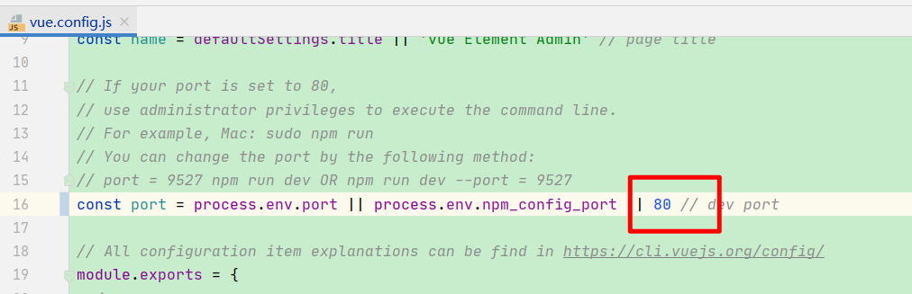

#### F2.10：部分页面修改

- 首页中右上角退出部分修改
  - 原页面
    - 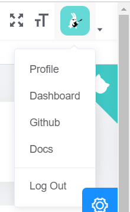
  - 找到layout/Navbar.vue
    - 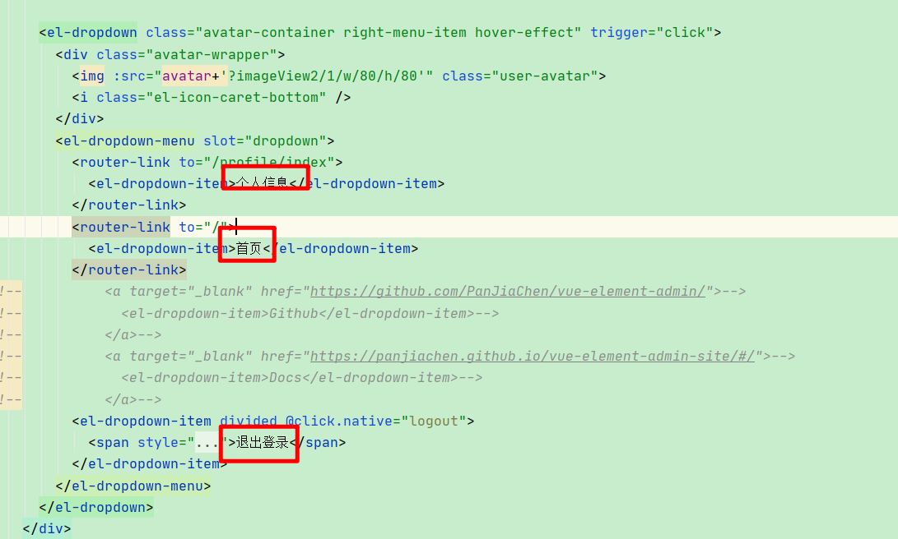
  - 修改后效果
    - 
- 登录页面修改
  - 原页面
    - 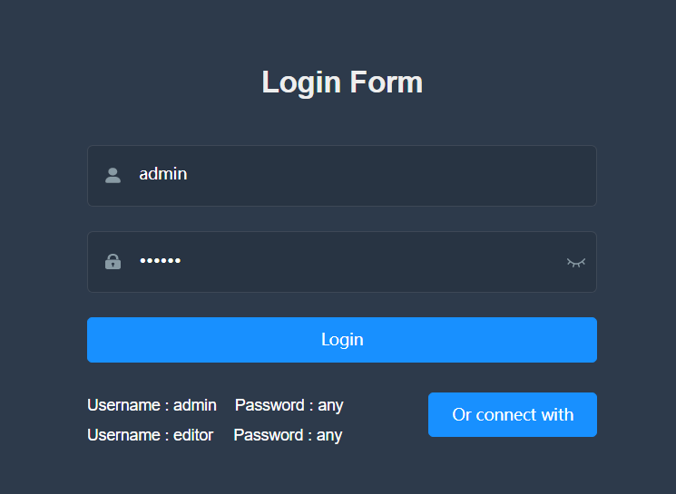
  - 找到views/login/index.vue以及依赖的SocialSignin.vue
    - 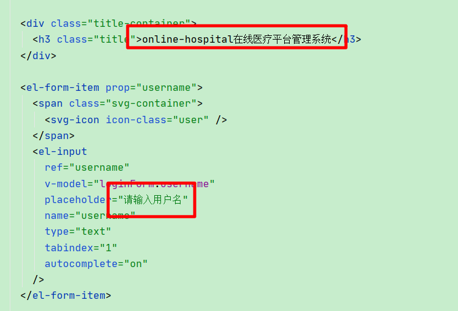
    - 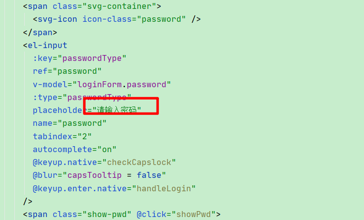
    - 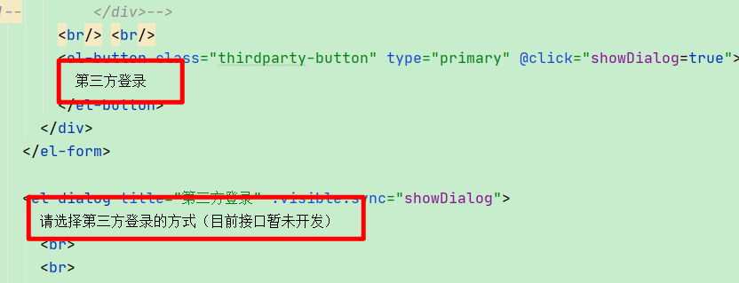
    - 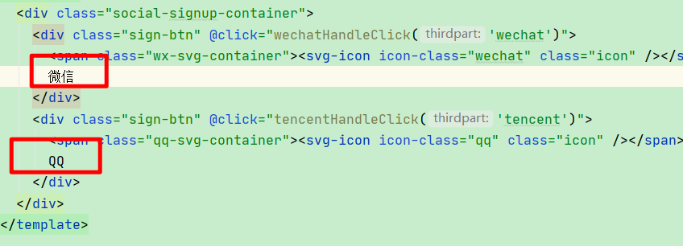
  - 修改后
    - 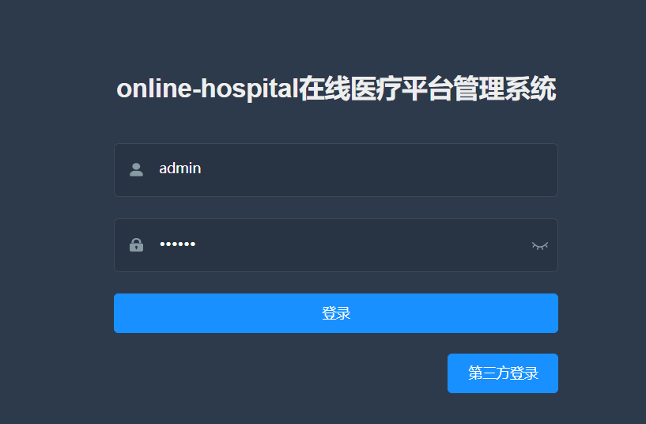
- 网站标题修改
  - 原页面
    - 
  - 找文件
    - settings.js
    - 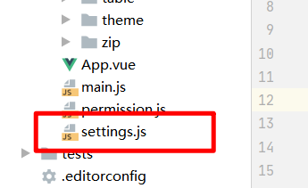
  - 修改后
    - 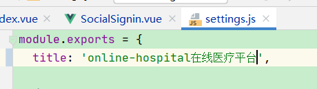
    - 

## F3：登录接口准备说明

- 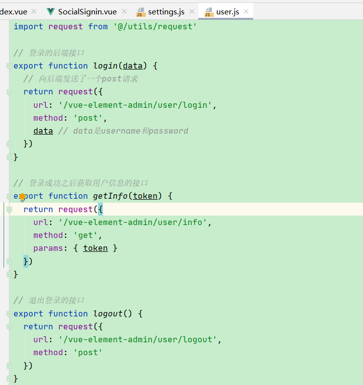
- 登录的时候使用到了上面三个接口，所以为避免修改很多前端代码，在写后端接口的时候，就可以直接把这三个接口写出来
- 逻辑
  - 先登录--》成功后得到用户信息（用户信息，角色信息，权限信息）
  - 退出--》logout方法
- 


