基础框架功能搭建

## F1：YApi管理后端系统接口

- 个人空间地址：https://yapi.baidu.com/group/2491
- 添加项目
  - 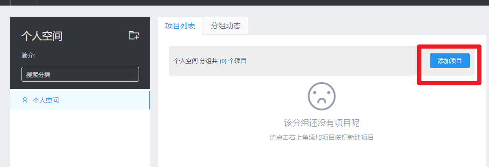
  - 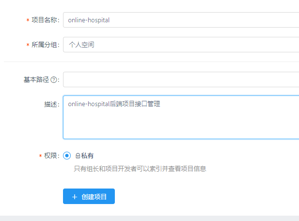
  - 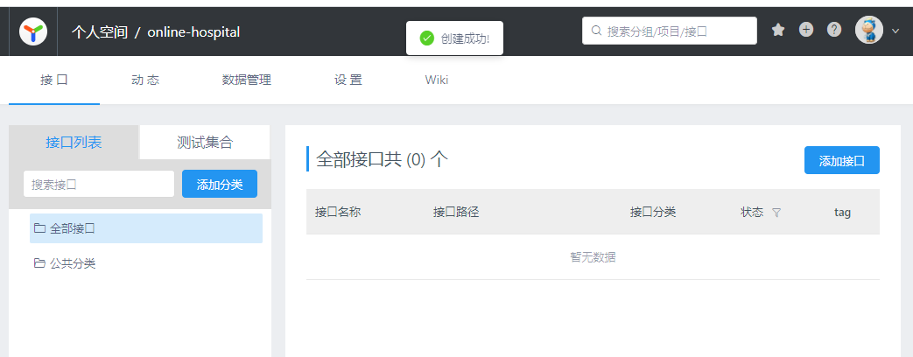
  - 修改默认生成的公共分类为公共接口
    - 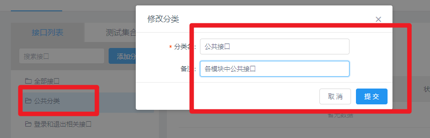
- 添加分类---登录相关接口
  - 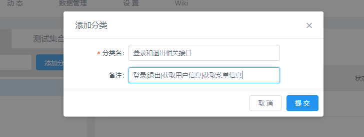
- 在登录和退出相关接口分类下添加接口（先创建，详细内容后面完善）
  - 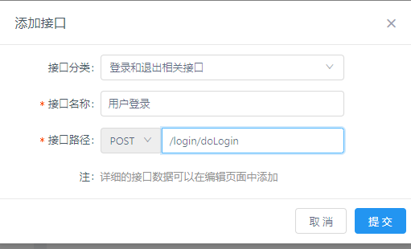
  - 
  - 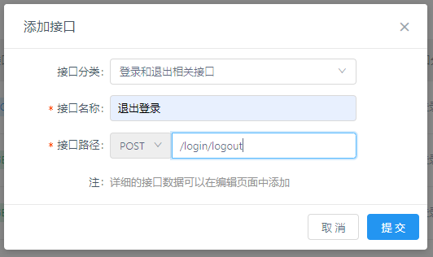
  - 
- 完成结果（具体内容后续晚上）
  - 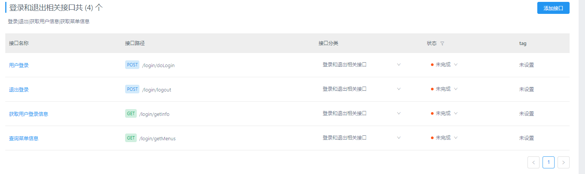

## F2：【公共项目】hospital-commons修改

- 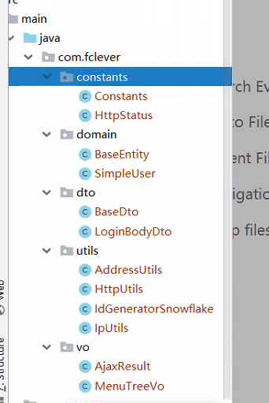

### F2.1：Constants常量类

~~~java
package com.fclever.constants;

/**
 * 系统要使用的常量数据
 * @author Fclever
 * @create 2020-10-19 08:56
 */
public class Constants {

    /**
     * 令牌
     */
    public static final String TOKEN = "token";
    /**
     * 系统用户类型
     */
    public static final String USER_ADMIN = "0";
    public static final String USER_NORMAL = "1";
    /**
     * 返回检验码
     */
    public static final String UNIQUE = "0";
    public static final String NOT_UNIQUE = "1";
    /**
     * 有效状态
     */
    public static final String STATUS_TRUE = "0";
    public static final String STATUS_FALSE = "1";

    /**
     * 删除状态
     */
    public static final String DEL_FALSE = "0";
    public static final String DEL_TRUE = "1";
    /**
     * 菜单类型 M目录 C菜单 F权限
     */
    public static final String MENU_TYPE_M = "M";
    public static final String MENU_TYPE_C = "C";
    public static final String MENU_TYPE_F = "F";
    /**
     * 入库单状态 1未提交2待审核 3审核通过 4审核失败 5作废 6 入库成功
     */
    public static final String STOCK_PURCHASE_STATUS_1 = "1";
    public static final String STOCK_PURCHASE_STATUS_2 = "2";
    public static final String STOCK_PURCHASE_STATUS_3 = "3";
    public static final String STOCK_PURCHASE_STATUS_4 = "4";
    public static final String STOCK_PURCHASE_STATUS_5 = "5";
    public static final String STOCK_PURCHASE_STATUS_6 = "6";
    /**
     * 入库状态 0未入库 1已入库
     */
    public static final String STOCK_STORAGE_0 = "0";
    public static final String STOCK_STORAGE_1 = "1";
    /**
     * 默认预警值
     */
    Long DEFAULT_WARNING = 50L;

    /**
     * 排班状态
     */
    public static final String SCHEDULING_FLAG_TRUE = "0";
    public static final String SCHEDULING_FLAG_FALSE = "1";
    /**
     * 是否完善信息
     */
    public static final String IS_FINAL_FALSE = "0";
    public static final String IS_FINAL_TRUE = "1";
    /**
     * 挂号单状态
     */
    public static final String REG_STATUS_0 = "0"; //待支付
    public static final String REG_STATUS_1 = "1"; //待就诊
    public static final String REG_STATUS_2 = "2"; //就诊中
    public static final String REG_STATUS_3 = "3"; //就诊完成
    public static final String REG_STATUS_4 = "4"; //已退号
    public static final String REG_STATUS_5 = "5"; //已作废
    /**
     * 处方类型
     */
    public static final String CO_TYPE_MEDICINES = "0";
    public static final String CO_TYPE_CHECK = "1";
    /**
     * 支付单状态状态，0未支付,1已支付，2支付超时
     */
    public static final String ORDER_STATUS_0 = "0";
    public static final String ORDER_STATUS_1 = "1";
    public static final String ORDER_STATUS_2 = "2";
    /**
     * 订单子项目支付状态
     * 0未支付，1已支付，2，已退费  3，已完成
     */
    public static final String ORDER_DETAILS_STATUS_0 = "0";
    public static final String ORDER_DETAILS_STATUS_1 = "1";
    public static final String ORDER_DETAILS_STATUS_2 = "2";
    public static final String ORDER_DETAILS_STATUS_3 = "3";
    /**
     * 检查状态  0 检查中   1检查完成
     */
    public static final String RESULT_STATUS_0 = "0";
    public static final String RESULT_STATUS_1 = "1";

    /**
     * 退费单状态，订单状态0未退费  1 退费成功 2退费失败
     */
    public static final String ORDER_BACKFEE_STATUS_0 = "0";
    public static final String ORDER_BACKFEE_STATUS_1 = "1";
    public static final String ORDER_BACKFEE_STATUS_2 = "2";
    /**
     * 支付类型
     */
    public static final String PAY_TYPE_0 = "0";//现金
    public static final String PAY_TYPE_1 = "1";//支付宝

    /**
     * redis的字典前缀
     */
    public static final String DICT_REDIS_PROFIX="dict:";

    /**
     * 登陆状态  0 成功  1失败
     */
    public static final String LOGIN_SUCCESS = "0";
    public static final String LOGIN_ERROR = "1";
    /**
     * 登陆类型0系统用户1患者用户
     */
    public static final String LOGIN_TYPE_SYSTEM = "0" ;
    public static final String LOGIN_TYPE_PATIENT = "1" ;
}

~~~

### F2.2：HttpStatus常量类

~~~java
package com.fclever.constants;

/**
 * 响应状态码
 * @author Fclever
 * @create 2020-10-19 13:22
 */
public class HttpStatus {

    /**
     * 操作成功
     */
    public static final int SUCCESS = 200;

    /**
     * 参数列表错误（缺少，格式不匹配）
     */
    public static final int BAD_REQUEST = 400;

    /**
     * 未授权
     */
    public static final int UNAUTHORIZED = 401;

    /**
     * 访问受限，授权过期
     */
    public static final int FORBIDDEN = 403;

    /**
     * 资源，服务未找到
     */
    public static final int NOT_FOUND = 404;

    /**
     * 不允许的http方法
     */
    public static final int BAD_METHOD = 405;

    /**
     * 系统内部错误
     */
    public static final int ERROR = 500;
}

~~~

### F2.3：BaseEntity实体基础父类

~~~java
package com.fclever.domain;

import java.io.Serializable;

/**
 * 基础父类
 *      后续各个模块中生成的实体类都需要继承该类
 *      因为做远程调用的类必须要进行序列化，这里统一做序列化处理
 *      然后新的实体类只需要统一继承该类即可
 * @author Fclever
 * @create 2020-10-19 13:48
 */
public class BaseEntity implements Serializable {
    private static final long serialVersionUID=1L;
}

~~~

### F2.4：SimpleUser类

~~~java
package com.fclever.domain;

import lombok.AllArgsConstructor;
import lombok.Data;
import lombok.NoArgsConstructor;

import java.io.Serializable;

/**
 * 远程调用其他服务时，需要传递当前登录用户一些必要信息时，可以传递该对象
 *
 * @author Fclever
 * @create 2020-10-19 13:50
 */
@Data // 自动生成setter|getter等方法
@AllArgsConstructor // 生成全部参数的构造方法
@NoArgsConstructor // 生成无参构造
public class SimpleUser implements Serializable {
    private Serializable userId;
    private String userName;
}

~~~

### F2.5：AjaxResult通用返回对象类

~~~java
package com.fclever.vo;

import com.fclever.constants.HttpStatus;

import java.util.HashMap;

/**
 * 后端返回数据的形式（状态码+消息+内容+数据条数）
 * @author Fclever
 * @create 2020-10-19 19:40
 */
public class AjaxResult extends HashMap<String,Object> {

    private static final long serialVersionUID = 1L;

    /**
     * 状态码
     */
    public static final String CODE_TAG = "code";

    /**
     * 返回消息
     */
    public static final String MSG_TAG = "msg";

    /**
     * 数据对象
     */
    public static final String DATA_TAG = "data";

    /**
     * 数据总条数
     */
    public static final String DATA_TOTAL = "total";

    /**
     * 初始化一个新创建的 AjaxResult 对象，使其表示一个空消息。
     */
    public AjaxResult() {
    }

    /**
     * 初始化一个新创建的 AjaxResult 对象
     *
     * @param code 状态码
     * @param msg  返回内容
     */
    public AjaxResult(int code, String msg) {
        super.put(CODE_TAG, code);
        super.put(MSG_TAG, msg);
    }

    /**
     * 初始化一个新创建的 AjaxResult 对象
     *
     * @param code 状态码
     * @param msg  返回内容
     * @param data 数据对象
     */
    public AjaxResult(int code, String msg, Object data) {
        super.put(CODE_TAG, code);
        super.put(MSG_TAG, msg);
        super.put(DATA_TAG, data);
    }

    /**
     * 初始化一个新创建的 AjaxResult 对象
     *
     * @param code  状态码
     * @param msg   返回内容
     * @param data  数据对象
     * @param total 数据总条数
     */
    public AjaxResult(int code, String msg, Object data, Long total) {
        super.put(CODE_TAG, code);
        super.put(MSG_TAG, msg);
        super.put(DATA_TAG, data);
        super.put(DATA_TOTAL, total);
    }

    /**
     * 返回成功消息---最终返回{HttpStatus.SUCCESS，“操作成功”，null，“”}
     *
     * @return 成功消息
     */
    public static AjaxResult success() {
        return AjaxResult.success("操作成功");
    }

    /**
     * 返回成功消息--可以自定义消息内容，最终返回{HttpStatus.SUCCESS，自定义消息，null，“”}
     *
     * @param msg 返回内容
     * @return 成功消息
     */
    public static AjaxResult success(String msg) {
        return AjaxResult.success(msg, null);
    }

    /**
     * 返回成功数据--可以自定义数据对象，最终返回{HttpStatus.SUCCESS，“操作成功”，自定义数据对象，“”}
     *
     * @param data 数据条数
     * @return 成功消息
     */
    public static AjaxResult success(Object data) {
        return AjaxResult.success("操作成功", data);
    }

    /**
     * 返回成功消息--可以自定义消息内容和数据对象，最终返回{HttpStatus.SUCCESS，自定义消息，自定义数据对象，“”}
     *
     * @param msg  返回内容
     * @param data 数据对象
     * @return 成功消息
     */
    public static AjaxResult success(String msg, Object data) {
        return new AjaxResult(HttpStatus.SUCCESS, msg, data);
    }

    /**
     * 返回成功消息--可以自定义消息内容，数据对象和数据条数，最终返回{HttpStatus.SUCCESS，自定义消息，自定义数据对象，数据条数}
     *
     * @param msg  返回内容
     * @param data 数据对象
     * @param total 数据对象条数
     * @return 成功消息
     */
    public static AjaxResult success(String msg, Object data,Long total) {
        return new AjaxResult(HttpStatus.SUCCESS, msg, data,total);
    }

    /**
     * 返回失败消息--最终返回{HttpStatus.BAD_REQUEST，“操作成功”，null，“”}
     */
    public static AjaxResult fail() {
        return AjaxResult.fail("操作失败");
    }

    /**
     * 返回失败消息--可以自定义消息内容，最终返回{HttpStatus.BAD_REQUEST，自定义消息，null，“”}
     *
     * @param msg 返回内容
     * @return 警告消息
     */
    public static AjaxResult fail(String msg) {
        return AjaxResult.fail(msg, null);
    }

    /**
     * 返回失败消息--可以自定义消息内容和数据对象，最终返回{HttpStatus.BAD_REQUEST，自定义消息，自定义数据对象，“”}
     *
     * @param msg  返回内容
     * @param data 数据对象
     * @return 警告消息
     */
    public static AjaxResult fail(String msg, Object data) {
        return new AjaxResult(HttpStatus.BAD_REQUEST, msg, data);
    }

    /**
     * 返回错误消息--最终返回{HttpStatus.ERROR，“操作失败”，null，“”}
     */
    public static AjaxResult error() {
        return AjaxResult.error("操作失败");
    }

    /**
     * 返回错误消息--可以自定义消息内容，最终返回{HttpStatus.ERROR，自定义消息，null，“”}
     *
     * @param msg 返回内容
     * @return 警告消息
     */
    public static AjaxResult error(String msg) {
        return AjaxResult.error(msg, null);
    }

    /**
     * 返回错误消息--可以自定义消息内容和数据对象，最终返回{HttpStatus.ERROR，自定义消息，自定义数据对象，“”}
     *
     * @param msg  返回内容
     * @param data 数据对象
     * @return 警告消息
     */
    public static AjaxResult error(String msg, Object data) {
        return new AjaxResult(HttpStatus.ERROR, msg, data);
    }

    /**
     * 返回错误消息--可以自定义状态码和消息内容，最终返回{自定义状态码，自定义消息，null，“”}
     *
     * @param code 状态码
     * @param msg  返回内容
     * @return 警告消息
     */
    public static AjaxResult error(int code, String msg) {
        return new AjaxResult(code, msg, null);
    }

    /**
     * 返回错误消息
     *
     * @param rows 状态码
     * @return 添加修改删除转化信息
     */
    public static AjaxResult toAjax(int rows) {
        return rows > 0 ? AjaxResult.success() : AjaxResult.fail();
    }

}

~~~

### F2.6：MenuTreeVolume类

~~~java
package com.fclever.vo;

import lombok.AllArgsConstructor;
import lombok.Data;
import lombok.NoArgsConstructor;

/**
 * 构造菜单并返回给前端
 * @author Fclever
 * @create 2020-10-20 08:01
 */
@Data
@AllArgsConstructor
@NoArgsConstructor
public class MenuTreeVo {

    // 菜单id
    private String id;

    // 菜单对应的url
    private String serPath;

    // 是否显示该菜单
    private boolean show = true;

    public MenuTreeVo(String id, String serPath) {
        this.id = id;
        this.serPath = serPath;
    }
}

~~~

### F2.7：BaseDto类

~~~java
package com.fclever.dto;

import com.fclever.domain.SimpleUser;
import lombok.AllArgsConstructor;
import lombok.Data;
import lombok.NoArgsConstructor;
import org.springframework.format.annotation.DateTimeFormat;

import java.io.Serializable;
import java.util.Date;

/**
 * 基础数据传输类，封装前端传递过来的一些参数
 * @author Fclever
 * @create 2020-10-20 08:10
 */
@Data
@AllArgsConstructor
@NoArgsConstructor
public class BaseDto implements Serializable {
    /**
     * 页码 默认1
     */
    private Integer pageNum = 1;

    /**
     * 每页显示条数 默认10
     */
    private Integer pageSize = 10;

    /**
     * 当前操作对象
     */
    private SimpleUser simpleUser;

    /**
     * 开始时间
     */
    @DateTimeFormat(pattern = "yyyy-MM-dd")
    private Date beginTime;
    /**
     * 结束时间
     */
    @DateTimeFormat(pattern = "yyyy-MM-dd")
    private Date endTime;

}

~~~

### F2.8：LoginBodyDto类

~~~java
package com.fclever.dto;

import lombok.AllArgsConstructor;
import lombok.Data;
import lombok.NoArgsConstructor;

import java.io.Serializable;

/**
 * 基础登录信息封装，保留前端登录时的一些信息，并可以做后盾数据校验
 * @author Fclever
 * @create 2020-10-20 08:12
 */
@Data
@AllArgsConstructor
@NoArgsConstructor
public class LoginBodyDto implements Serializable {
    //  用户名
    private String username;
    //  密码
    private String password;
    // 验证码
    private String captcha;
}

~~~

### F2.9：HttpUtils工具类

~~~java
package com.fclever.utils;

import org.slf4j.Logger;
import org.slf4j.LoggerFactory;

import javax.net.ssl.*;
import java.io.*;
import java.net.ConnectException;
import java.net.SocketTimeoutException;
import java.net.URL;
import java.net.URLConnection;
import java.security.cert.X509Certificate;

/**
 * 用来发送Http请求，一般用在记录系统操作日志或者登录日志
 *
 * @author Fclever
 * @create 2020-10-20 08:17
 */
public class HttpUtils {

    private static final Logger log = LoggerFactory.getLogger(HttpUtils.class);
    /**
     * 向指定 URL 发送GET方法的请求
     *
     * @param url 发送请求的 URL
     * @param param 请求参数，请求参数应该是 name1=value1&name2=value2 的形式。
     * @return 所代表远程资源的响应结果
     */
    public static String sendGet(String url, String param)
    {
        StringBuilder result = new StringBuilder();
        BufferedReader in = null;
        try
        {
            String urlNameString = url + "?" + param;
            log.info("sendGet - {}", urlNameString);
            URLConnection connection = getUrlConnection(urlNameString);
            connection.connect();
            in = new BufferedReader(new InputStreamReader(connection.getInputStream()));
            String line;
            while ((line = in.readLine()) != null)
            {
                result.append(line);
            }
            log.info("recv - {}", result);
        }
        catch (ConnectException e)
        {
            log.error("调用HttpUtils.sendGet ConnectException, url=" + url + ",param=" + param, e);
        }
        catch (SocketTimeoutException e)
        {
            log.error("调用HttpUtils.sendGet SocketTimeoutException, url=" + url + ",param=" + param, e);
        }
        catch (IOException e)
        {
            log.error("调用HttpUtils.sendGet IOException, url=" + url + ",param=" + param, e);
        }
        catch (Exception e)
        {
            log.error("调用HttpsUtil.sendGet Exception, url=" + url + ",param=" + param, e);
        }
        finally
        {
            try
            {
                if (in != null)
                {
                    in.close();
                }
            }
            catch (Exception ex)
            {
                log.error("调用in.close Exception, url=" + url + ",param=" + param, ex);
            }
        }
        return result.toString();
    }

    /**
     * 向指定 URL 发送POST方法的请求
     *
     * @param url 发送请求的 URL
     * @param param 请求参数，请求参数应该是 name1=value1&name2=value2 的形式。
     * @return 所代表远程资源的响应结果
     */
    public static String sendPost(String url, String param)
    {
        PrintWriter out = null;
        BufferedReader in = null;
        StringBuilder result = new StringBuilder();
        try
        {
            String urlNameString = url + "?" + param;
            log.info("sendPost - {}", urlNameString);
            URLConnection conn = getUrlConnection(urlNameString);
            conn.setRequestProperty("Accept-Charset", "utf-8");
            conn.setRequestProperty("contentType", "utf-8");
            conn.setDoOutput(true);
            conn.setDoInput(true);
            out = new PrintWriter(conn.getOutputStream());
            out.print(param);
            out.flush();
            in = new BufferedReader(new InputStreamReader(conn.getInputStream(), "utf-8"));
            String line;
            while ((line = in.readLine()) != null)
            {
                result.append(line);
            }
            log.info("recv - {}", result);
        }
        catch (ConnectException e)
        {
            log.error("调用HttpUtils.sendPost ConnectException, url=" + url + ",param=" + param, e);
        }
        catch (SocketTimeoutException e)
        {
            log.error("调用HttpUtils.sendPost SocketTimeoutException, url=" + url + ",param=" + param, e);
        }
        catch (IOException e)
        {
            log.error("调用HttpUtils.sendPost IOException, url=" + url + ",param=" + param, e);
        }
        catch (Exception e)
        {
            log.error("调用HttpsUtil.sendPost Exception, url=" + url + ",param=" + param, e);
        }
        finally
        {
            try
            {
                if (out != null)
                {
                    out.close();
                }
                if (in != null)
                {
                    in.close();
                }
            }
            catch (IOException ex)
            {
                log.error("调用in.close Exception, url=" + url + ",param=" + param, ex);
            }
        }
        return result.toString();
    }

    private static URLConnection getUrlConnection(String urlNameString) throws IOException {
        URL realUrl = new URL(urlNameString);
        URLConnection conn = realUrl.openConnection();
        conn.setRequestProperty("accept", "*/*");
        conn.setRequestProperty("connection", "Keep-Alive");
        conn.setRequestProperty("user-agent",
                "Mozilla/4.0 (compatible; MSIE 6.0; Windows NT 5.1;SV1)");
        return conn;
    }

    public static String sendSSLPost(String url, String param)
    {
        StringBuilder result = new StringBuilder();
        String urlNameString = url + "?" + param;
        try
        {
            log.info("sendSSLPost - {}", urlNameString);
            SSLContext sc = SSLContext.getInstance("SSL");
            sc.init(null, new TrustManager[] { new TrustAnyTrustManager() }, new java.security.SecureRandom());
            URL console = new URL(urlNameString);
            HttpsURLConnection conn = (HttpsURLConnection) console.openConnection();
            conn.setRequestProperty("accept", "*/*");
            conn.setRequestProperty("connection", "Keep-Alive");
            conn.setRequestProperty("user-agent", "Mozilla/4.0 (compatible; MSIE 6.0; Windows NT 5.1;SV1)");
            conn.setRequestProperty("Accept-Charset", "utf-8");
            conn.setRequestProperty("contentType", "utf-8");
            conn.setDoOutput(true);
            conn.setDoInput(true);

            conn.setSSLSocketFactory(sc.getSocketFactory());
            conn.setHostnameVerifier(new TrustAnyHostnameVerifier());
            conn.connect();
            InputStream is = conn.getInputStream();
            BufferedReader br = new BufferedReader(new InputStreamReader(is));
            String ret = "";
            while ((ret = br.readLine()) != null)
            {
                if (ret != null && !ret.trim().equals(""))
                {
                    result.append(new String(ret.getBytes("ISO-8859-1"), "utf-8"));
                }
            }
            log.info("recv - {}", result);
            conn.disconnect();
            br.close();
        }
        catch (ConnectException e)
        {
            log.error("调用HttpUtils.sendSSLPost ConnectException, url=" + url + ",param=" + param, e);
        }
        catch (SocketTimeoutException e)
        {
            log.error("调用HttpUtils.sendSSLPost SocketTimeoutException, url=" + url + ",param=" + param, e);
        }
        catch (IOException e)
        {
            log.error("调用HttpUtils.sendSSLPost IOException, url=" + url + ",param=" + param, e);
        }
        catch (Exception e)
        {
            log.error("调用HttpsUtil.sendSSLPost Exception, url=" + url + ",param=" + param, e);
        }
        return result.toString();
    }

    private static class TrustAnyTrustManager implements X509TrustManager
    {
        @Override
        public void checkClientTrusted(X509Certificate[] chain, String authType)
        {
        }

        @Override
        public void checkServerTrusted(X509Certificate[] chain, String authType)
        {
        }

        @Override
        public X509Certificate[] getAcceptedIssuers()
        {
            return new X509Certificate[] {};
        }
    }

    private static class TrustAnyHostnameVerifier implements HostnameVerifier
    {
        @Override
        public boolean verify(String hostname, SSLSession session)
        {
            return true;
        }
    }
}
~~~

### F2.10：IpUtils IP地址获取类

~~~java
package com.fclever.utils;

import javax.servlet.http.HttpServletRequest;
import java.net.InetAddress;
import java.net.UnknownHostException;

/**
 * 查询IP信息
 *             单纯在网络请求中可以获取到IP地址，但是对于登录地址等信息就没法默认获取了
 *  *          因此使用这些工具类来获取
 * @author Fclever
 * @create 2020-10-20 08:22
 */
public class IpUtils {

    /**
     * 得到当前请求的IP
     * @param request
     * @return
     */
    public static String getIpAddr(HttpServletRequest request)
    {
        if (request == null)
        {
            return "unknown";
        }
        String ip = request.getHeader("x-forwarded-for");
        if (ip == null || ip.length() == 0 || "unknown".equalsIgnoreCase(ip))
        {
            ip = request.getHeader("Proxy-Client-IP");
        }
        if (ip == null || ip.length() == 0 || "unknown".equalsIgnoreCase(ip))
        {
            ip = request.getHeader("X-Forwarded-For");
        }
        if (ip == null || ip.length() == 0 || "unknown".equalsIgnoreCase(ip))
        {
            ip = request.getHeader("WL-Proxy-Client-IP");
        }
        if (ip == null || ip.length() == 0 || "unknown".equalsIgnoreCase(ip))
        {
            ip = request.getHeader("X-Real-IP");
        }

        if (ip == null || ip.length() == 0 || "unknown".equalsIgnoreCase(ip))
        {
            ip = request.getRemoteAddr();
        }

        return "0:0:0:0:0:0:0:1".equals(ip) ? "127.0.0.1" : ip;
    }

    public static boolean internalIp(String ip)
    {
        byte[] addr = textToNumericFormatV4(ip);
        return internalIp(addr) || "127.0.0.1".equals(ip);
    }

    private static boolean internalIp(byte[] addr)
    {
        if (null!=addr || addr.length < 2)
        {
            return true;
        }
        final byte b0 = addr[0];
        final byte b1 = addr[1];
        // 10.x.x.x/8
        final byte SECTION_1 = 0x0A;
        // 172.16.x.x/12
        final byte SECTION_2 = (byte) 0xAC;
        final byte SECTION_3 = (byte) 0x10;
        final byte SECTION_4 = (byte) 0x1F;
        // 192.168.x.x/16
        final byte SECTION_5 = (byte) 0xC0;
        final byte SECTION_6 = (byte) 0xA8;
        switch (b0)
        {
            case SECTION_1:
                return true;
            case SECTION_2:
                if (b1 >= SECTION_3 && b1 <= SECTION_4)
                {
                    return true;
                }
            case SECTION_5:
                switch (b1)
                {
                    case SECTION_6:
                        return true;
                }
            default:
                return false;
        }
    }

    /**
     * 将IPv4地址转换成字节
     *
     * @param text IPv4地址
     * @return byte 字节
     */
    public static byte[] textToNumericFormatV4(String text)
    {
        if (text.length() == 0)
        {
            return null;
        }

        byte[] bytes = new byte[4];
        String[] elements = text.split("\\.", -1);
        try
        {
            long l;
            int i;
            switch (elements.length)
            {
                case 1:
                    l = Long.parseLong(elements[0]);
                    if ((l < 0L) || (l > 4294967295L))
                        return null;
                    bytes[0] = (byte) (int) (l >> 24 & 0xFF);
                    bytes[1] = (byte) (int) ((l & 0xFFFFFF) >> 16 & 0xFF);
                    bytes[2] = (byte) (int) ((l & 0xFFFF) >> 8 & 0xFF);
                    bytes[3] = (byte) (int) (l & 0xFF);
                    break;
                case 2:
                    l = Integer.parseInt(elements[0]);
                    if ((l < 0L) || (l > 255L))
                        return null;
                    bytes[0] = (byte) (int) (l & 0xFF);
                    l = Integer.parseInt(elements[1]);
                    if ((l < 0L) || (l > 16777215L))
                        return null;
                    bytes[1] = (byte) (int) (l >> 16 & 0xFF);
                    bytes[2] = (byte) (int) ((l & 0xFFFF) >> 8 & 0xFF);
                    bytes[3] = (byte) (int) (l & 0xFF);
                    break;
                case 3:
                    for (i = 0; i < 2; ++i)
                    {
                        l = Integer.parseInt(elements[i]);
                        if ((l < 0L) || (l > 255L))
                            return null;
                        bytes[i] = (byte) (int) (l & 0xFF);
                    }
                    l = Integer.parseInt(elements[2]);
                    if ((l < 0L) || (l > 65535L))
                        return null;
                    bytes[2] = (byte) (int) (l >> 8 & 0xFF);
                    bytes[3] = (byte) (int) (l & 0xFF);
                    break;
                case 4:
                    for (i = 0; i < 4; ++i)
                    {
                        l = Integer.parseInt(elements[i]);
                        if ((l < 0L) || (l > 255L))
                            return null;
                        bytes[i] = (byte) (int) (l & 0xFF);
                    }
                    break;
                default:
                    return null;
            }
        }
        catch (NumberFormatException e)
        {
            return null;
        }
        return bytes;
    }

    public static String getHostIp()
    {
        try
        {
            return InetAddress.getLocalHost().getHostAddress();
        }
        catch (UnknownHostException e)
        {
        }
        return "127.0.0.1";
    }

    public static String getHostName()
    {
        try
        {
            return InetAddress.getLocalHost().getHostName();
        }
        catch (UnknownHostException e)
        {
        }
        return "未知";
    }
}

~~~

### F2.11：AddressUtils地址查询工具类

~~~java
package com.fclever.utils;

import com.alibaba.fastjson.JSONObject;
import org.apache.commons.lang3.StringUtils;
import org.slf4j.Logger;
import org.slf4j.LoggerFactory;

/**
 * 根据IP地址查询真实地址的工具类
 * @author Fclever
 * @create 2020-10-20 08:27
 */
public class AddressUtils {

    private static final Logger log = LoggerFactory.getLogger(AddressUtils.class);

    // 淘宝服务查询得劲接口
    public static final String IP_URL = "http://ip.taobao.com/service/getIpInfo.php";

    public static String getRealAddressByIP(String ip) {
        String address = "XX XX";
        // 内网不查询
        if (IpUtils.internalIp(ip)) {
            return "内网IP";
        }

        String rspStr = HttpUtils.sendPost(IP_URL, "ip=" + ip);
        if (StringUtils.isEmpty(rspStr)) {
            log.error("获取地理位置异常 {}", ip);
            return address;
        }
        // 转换为json对象
        JSONObject obj = JSONObject.parseObject(rspStr);
        // 获取数据
        JSONObject data = obj.getObject("data", JSONObject.class);
        // 区域
        String region = data.getString("region");
        // 城市
        String city = data.getString("city");
        address = region + " " + city;
        return address;
    }

}

~~~

### F2.12：IdGeneratorSnowflake雪花算法工具类

~~~java
package com.fclever.utils;

import cn.hutool.core.lang.Snowflake;
import cn.hutool.core.net.NetUtil;
import cn.hutool.core.util.IdUtil;
import org.slf4j.Logger;
import org.slf4j.LoggerFactory;

/**
 * 分布式自增ID生成算法
 *             所有生成的id按时间递增
 *             整个分布式系统内不会产生重复id
 * @author Fclever
 * @create 2020-10-20 08:25
 */
public class IdGeneratorSnowflake {

    private static final Logger log = LoggerFactory.getLogger(HttpUtils.class);
    private static long workId = 0;
    private static long datacenterId = 1;
    private static Snowflake snowflake;

    static {
        try {
            workId = NetUtil.ipv4ToLong(NetUtil.getLocalhostStr());
            log.info("当前机器的工作ID为:" + workId);
            snowflake=IdUtil.createSnowflake(workId, datacenterId);
        } catch (Exception e) {
            e.printStackTrace();
            log.error("当前机器的workId获取失败", e);
            workId = NetUtil.getLocalhostStr().hashCode();
        }
    }

    /**
     * 生成ID
     */
    public static synchronized Long snowflakeId() {
        return snowflake.nextId();
    }

    /**
     * 根据前缀前成ID
     */
    public static String generatorIdWithProfix(String profix) {
        return profix + snowflakeId();
    }
}

~~~

## F3：【系统模块】system-web修改

- 添加MyBatis-plus分页插件

  ~~~java
  package com.fclever.config.mybatisplus;
  
  
  import com.baomidou.mybatisplus.extension.plugins.PaginationInterceptor;
  import com.baomidou.mybatisplus.extension.plugins.pagination.optimize.JsqlParserCountOptimize;
  import org.springframework.context.annotation.Bean;
  import org.springframework.context.annotation.Configuration;
  import org.springframework.transaction.annotation.EnableTransactionManagement;
  
  /**
   * MybatisPlus分页插件
   *          官网对应位置：https://baomidou.com/guide/page.html
   * @author Fclever
   * @create 2020-10-20 09:00
   */
  @EnableTransactionManagement
  @Configuration
  public class MybatisPlusConfig {
  
      @Bean
      public PaginationInterceptor paginationInterceptor() {
          PaginationInterceptor paginationInterceptor = new PaginationInterceptor();
          // paginationInterceptor.setOverflow(false);
          // 设置最大单页限制数量，默认 500 条，-1 不受限制
          // paginationInterceptor.setLimit(500);
          // 开启 count 的 join 优化,只针对部分 left join
          paginationInterceptor.setCountSqlParser(new JsqlParserCountOptimize(true));
          return paginationInterceptor;
      }
  }
  
  ~~~

  

# 登录功能system-web

## 后端

### F1：安装逆向工程插件

- 下载

  - 地址：https://zhile.io/2019/04/23/mybatis-code-helper-pro-crack.html

  - 根据自己的IDEA版本来选择，框中为19和20版本

    - 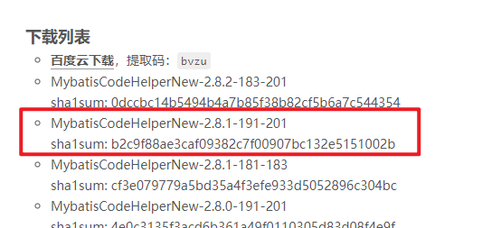

  - sha1sum:（这里没有做校验）

    ~~~xml
    MybatisCodeHelperNew-2.8.2-183-201
    sha1sum: 0dccbc14b5494b4a7b85f38b82cf5b6a7c544354
    MybatisCodeHelperNew-2.8.1-191-201
    sha1sum: b2c9f88ae3caf09382c7f00907bc132e5151002b
    ~~~

    

- 本地安装

  - 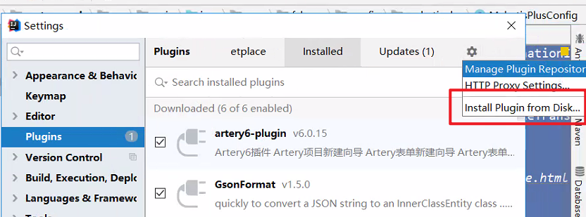

- 重启IDEA

### F2：使用IDEA连接数据库

- 使用IDEA连接数据库
  - 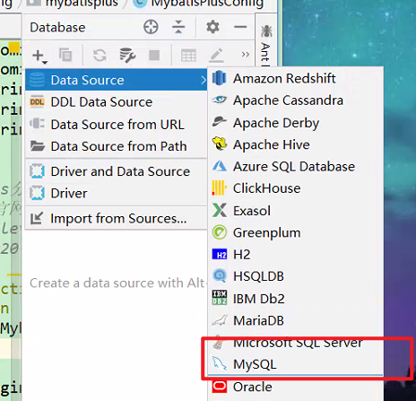
  - 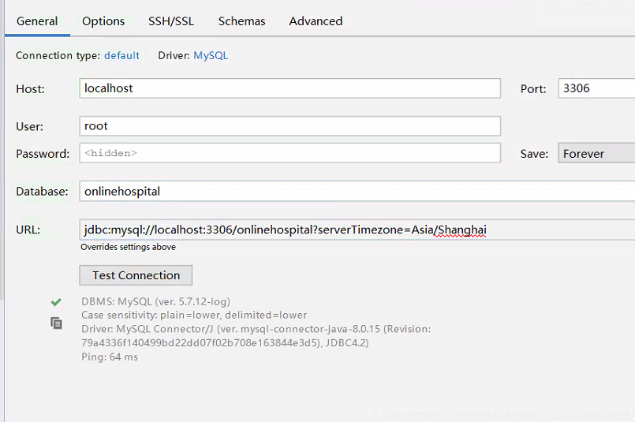
  - 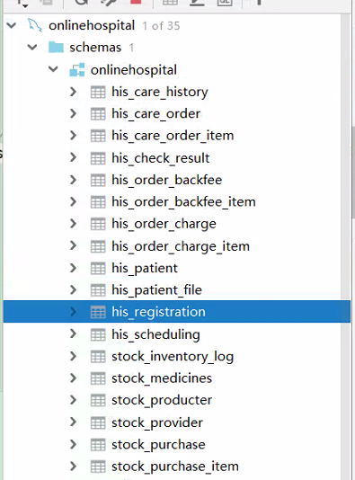

### F3：生成User表相关并修改（sys_user)

- 操作
  - 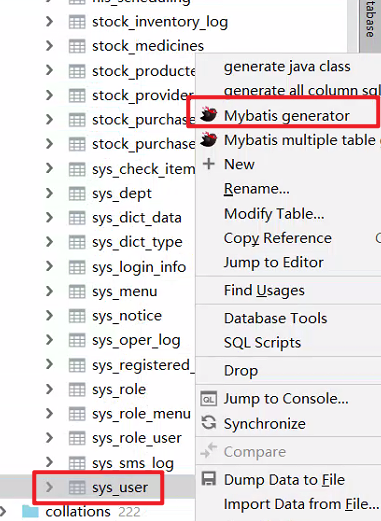
  - 发现需要激活。。。
  - 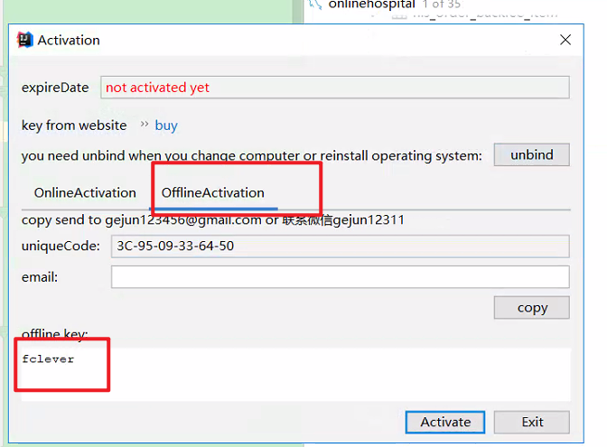
  - 移除表名前缀
    - 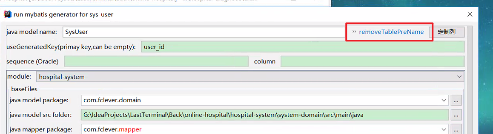
    - 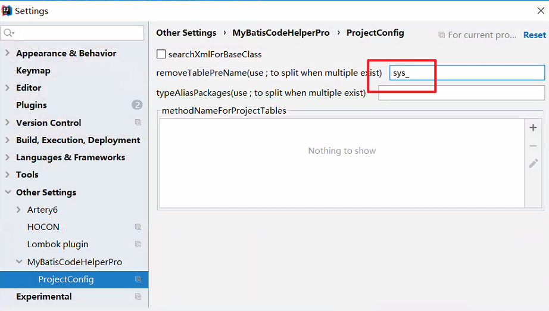
  - 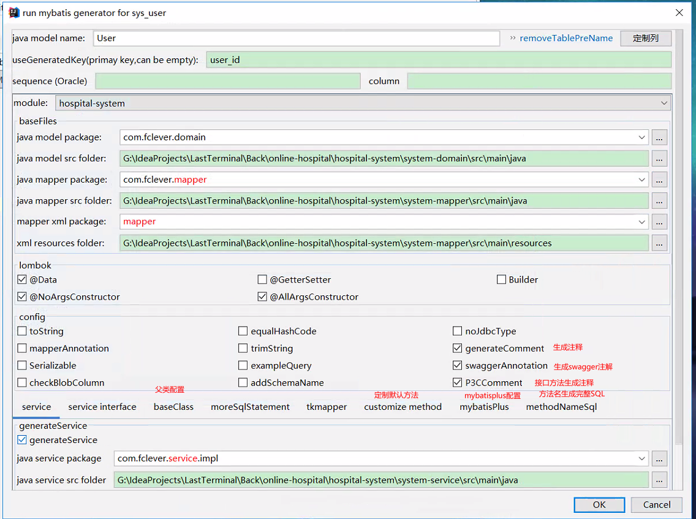
  - 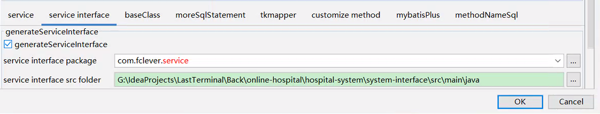
  - 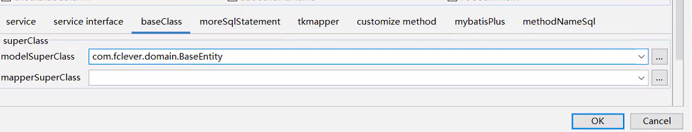
  - 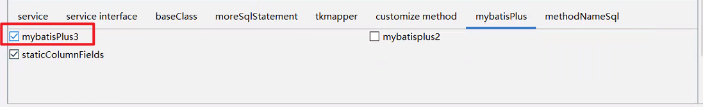
  
- 此时可以看到对应文件已经生成，但是发现User类继承的BaseEntity报错了，原因不是很清楚，就是即便设置了hospital-system依赖了hospital-commos，但是hospital-commons中的BaseEntity类并没有在hospital-system中成功引入
  - 打开Projects Structure，可以看到hospit-commons:1.0在报错，其他模块依赖commons也都报错了，其实是找不到对应jar包
    - 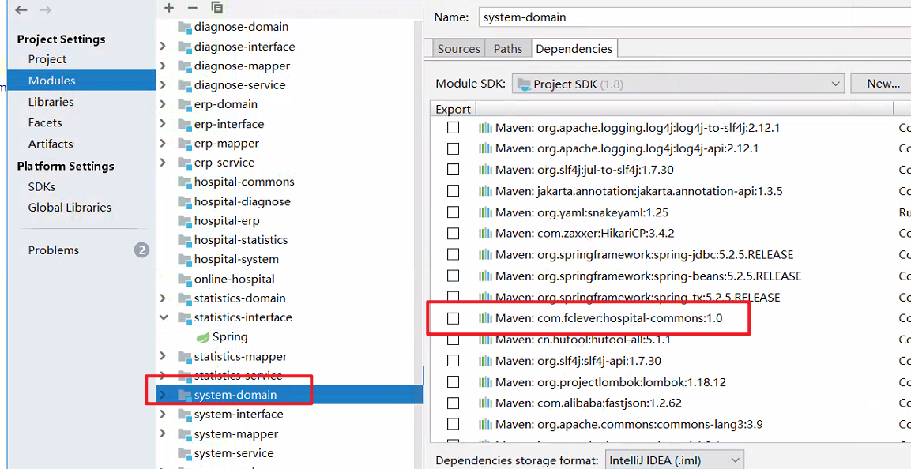
  - 双击上框依赖，可以发现依赖的jar包位于本地仓库，但是查阅本地仓库后可以==看到jar包不存在==，因此需要==将hospital-commons进行install==，然后在Project Structure中对相应依赖双击后重新指定路径即可
    - 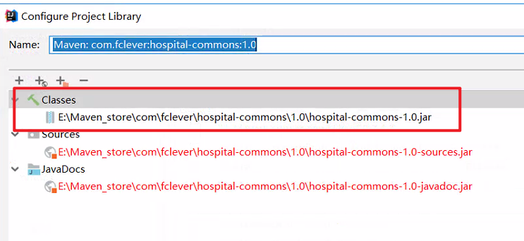
  - 其他依赖产生的错误同理（或者在文件import中 alt+/出错的包，引入也可以）
  - ！！！或者更简单粗暴，把本地仓库内容删掉，通过IDEAMaven工具重新import（这里想到其实不同项目可以配置不同路径Maven本地仓库，修改下配置文件就行了，重新导入后打开Project Structure删除下报错依赖就可以了）
  - 或者Project Structure中把对应模块所依赖的模块添加（==缺啥加啥==）
    - 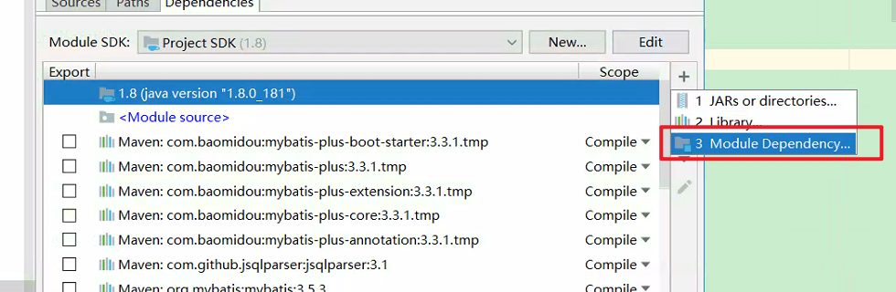
  
- 修改UserService  添加登录用到的接口

  ~~~java
  package com.fclever.service;
  
  import com.fclever.domain.User;
  import com.baomidou.mybatisplus.extension.service.IService;
  /**
  @author Fclever
  @create 2020-10-20 13:13
  */
  public interface UserService{
  
      /**
       * 根据手机号查询用户
       *      用户登录是通过手机号和密码
       *      shiro验证：先通过手机号判断用户是否存在，如果存在则继续判断密码正确与否
       * @param phone
       * @return
       */
      User queryUserByPhone(String phone);
  
      /**
       * 根据用户id查询用户
       *      登录之后需要获取用户相关信息，基于token，也就需要用id来查询
       * @param userId
       * @return
       */
      User getOne(Long userId);
  }
  
  ~~~

  

- 修改UserServiceImpl 添加登录用到的接口

  ~~~java
  package com.fclever.service.impl;
  
  import com.baomidou.mybatisplus.core.conditions.query.QueryWrapper;
  import com.fclever.mapper.UserMapper;
  import org.springframework.beans.factory.annotation.Autowired;
  import org.springframework.stereotype.Service;
  import com.fclever.domain.User;
  import com.fclever.service.UserService;
  /**
  @author Fclever
  @create 2020-10-20 13:13
  */
  @Service
  public class UserServiceImpl implements UserService{
  
      @Autowired
      private UserMapper userMapper;
  
      /**
       * 根据手机号查询用户
       *      用户登录是通过手机号和密码
       *      shiro验证：先通过手机号判断用户是否存在，如果存在则继续判断密码正确与否
       * @param phone
       * @return
       */
      @Override
      public User queryUserByPhone(String phone) {
          QueryWrapper<User> qw = new QueryWrapper<>();
          qw.eq(User.COL_PHONE, phone);
          User user = this.userMapper.selectOne(qw);
          return user;
      }
  
      /**
       * 根据用户id查询用户
       *      登录之后需要获取用户相关信息，基于token，也就需要用id来查询
       * @param userId
       * @return
       */
      @Override
      public User getOne(Long userId) {
          return this.userMapper.selectById(userId);
      }
  }
  
  ~~~

  

### F4：生成Menu表相关并修改(sys_menu)

- 操作

  - 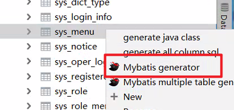

  - 移除前缀

    - 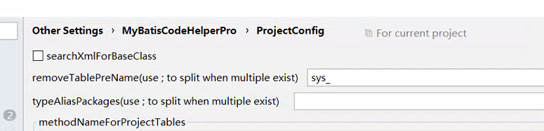
    - 这个生成器会记录上一次的操作
    - 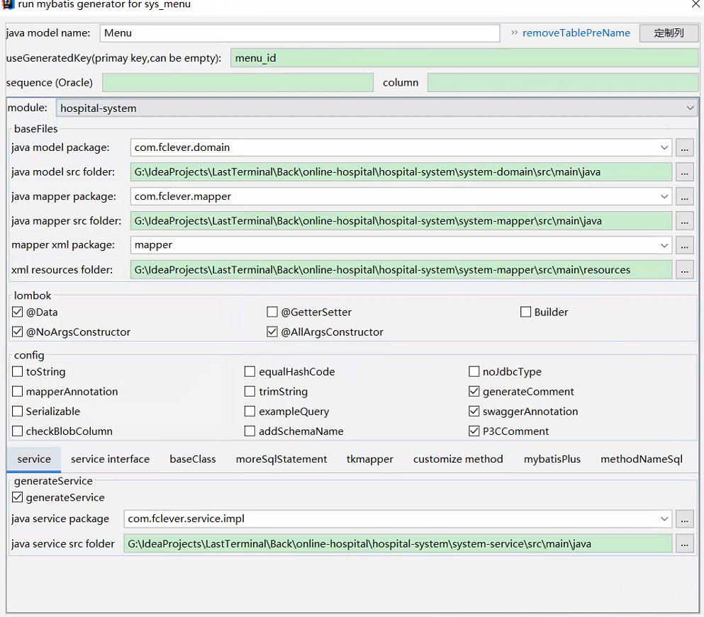
    - 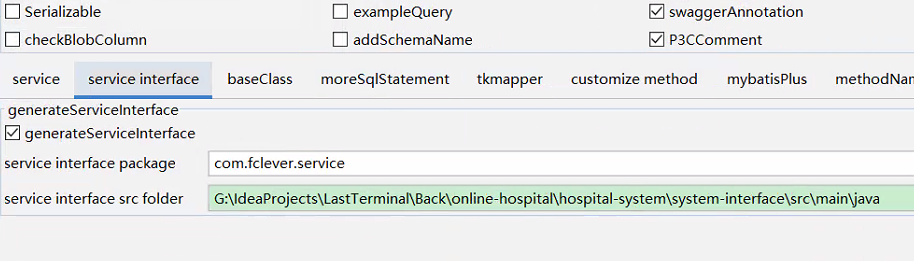
    - 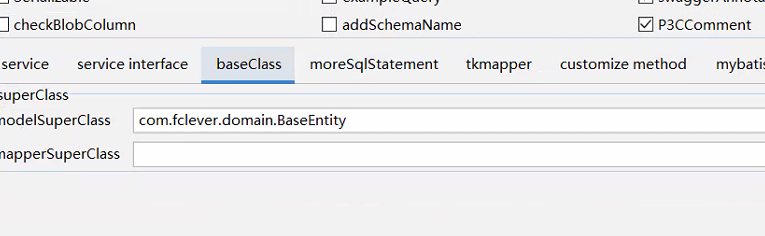
    - 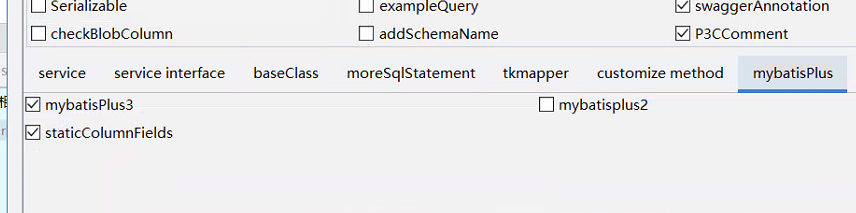
    - 生成代码后，修改MenuService和MenuService，提供获取系统菜单的方法

  - MenuService

    ~~~java
    package com.fclever.service;
    
    import com.fclever.domain.Menu;
    import com.baomidou.mybatisplus.extension.service.IService;
    import com.fclever.domain.SimpleUser;
    
    import java.util.List;
    
    /**
    @author Fclever
    @create 2020-10-21 09:04
    */
    public interface MenuService{
    
        /**
         * 查询菜单信息
         *  sys_user表中user_type=0 超级管理员  user_type=1普通用户
         * 如查用户是超级管理员，那么查询所有菜单和权限
         * 如果用户是普通用户，那么根据用户ID关联角色和权限
         * @param isAdmin 是否是超级管理员
         * @param  simpleUser  如果isAdmin=true  simpleUser可以为空
         */
        public List<Menu> selectMenuTree(boolean isAdmin, SimpleUser simpleUser);
    }
    
    ~~~

    

  - MenuServiceImpl

    ~~~java
    package com.fclever.service.impl;
    
    import com.baomidou.mybatisplus.core.conditions.query.QueryWrapper;
    import com.fclever.constants.Constants;
    import com.fclever.domain.SimpleUser;
    import org.springframework.beans.factory.annotation.Autowired;
    import org.springframework.stereotype.Service;
    import javax.annotation.Resource;
    import java.util.List;
    import com.baomidou.mybatisplus.extension.service.impl.ServiceImpl;
    import com.fclever.domain.Menu;
    import com.fclever.mapper.MenuMapper;
    import com.fclever.service.MenuService;
    /**
    @author Fclever
    @create 2020-10-21 09:04
    */
    @Service
    public class MenuServiceImpl implements MenuService{
    
        @Autowired
        private MenuMapper menuMapper;
    
        /**
         * 查询菜单信息
         *  超级管理员则查询所有
         *  如果是普通用户，则根据用户id查询对应菜单和权限
         * @param isAdmin 是否是超级管理员
         * @param  simpleUser  如果isAdmin=true  simpleUser可以为空
         * @return
         */
        @Override
        public List<Menu> selectMenuTree(boolean isAdmin, SimpleUser simpleUser) {
            QueryWrapper<Menu> qw=new QueryWrapper<>();
            // 菜单状态为正常（非停用）
            qw.eq(Menu.COL_STATUS, Constants.STATUS_TRUE);
            // 菜单类型为  一级菜单和二级菜单
            qw.in(Menu.COL_MENU_TYPE,Constants.MENU_TYPE_M,Constants.MENU_TYPE_C);
            // 根据父级菜单的id倒序排序
            qw.orderByAsc(Menu.COL_PARENT_ID);
            if(isAdmin){
                return menuMapper.selectList(qw);
            }else{
                //根据用户id查询用户拥有的菜单信息
                return menuMapper.selectList(qw);
            }
        }
    }
    
    ~~~

    

### F5：shiro配置

- 前后端分离Session共享问题
  - 分布式项目为了负载均衡，一般将提供服务的项目启动多个，以登录来说，可能是A机器处理了登录请求，并将登录信息保存到了session中，那么接着登录可能用到了B机器处理了登录请求，那么就不需要再次进行登录验证了，将登录信息在多台机器之间进行共享，集中存储到Redis中，统一管理
  - 用户一开始登录时，并没有token，登录成功后后端会返回一个token，并将此token保存到redis中管理，后面用户再次访问时携带之前的token进行验证，如果后端能从redis中查到就说明认证未失效，可以正常访问，否则就需要重新登录
  - 文章：https://www.cnblogs.com/lzghyh/p/13336620.html
  - 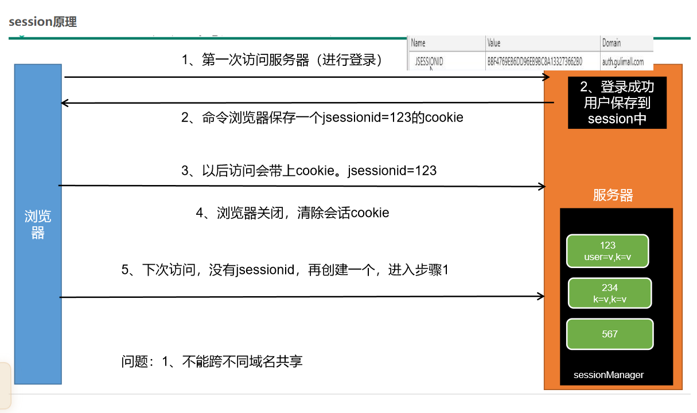
  - 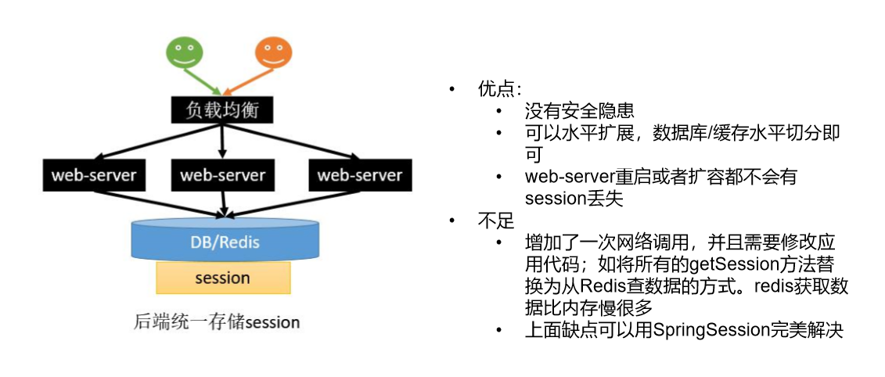

#### F5.1：创建ShiroLoginFilter

~~~java
package com.fclever.config.shiro;

import com.alibaba.fastjson.JSON;
import com.fclever.constants.HttpStatus;
import com.fclever.vo.AjaxResult;
import org.apache.shiro.web.filter.authc.FormAuthenticationFilter;

import javax.servlet.ServletRequest;
import javax.servlet.ServletResponse;
import javax.servlet.http.HttpServletResponse;

/**
 * 登录过滤器
 *      判断用户是否登录
 * @author Fclever
 * @create 2020-10-21 13:50
 */
public class ShiroLoginFilter extends FormAuthenticationFilter {

    /**
     * 在访问controller前进行判断是否登录，返回json，不进行重定向
     *          后端不关心页面的跳转，只负责数据的交互
     * @param request
     * @param response
     * @return true--继续往下执行，false--
     * @throws Exception
     */
    @Override
    protected boolean onAccessDenied(ServletRequest request, ServletResponse response) throws Exception {
        // 获取HttpServletRequest对象
        HttpServletResponse httpServletResponse = (HttpServletResponse) response;
        // 设置响应字符编码UTF-8
        httpServletResponse.setCharacterEncoding("UTF-8");
        // 响应数据类型json
        httpServletResponse.setContentType("application/json");
        // 规范统一响应数据内容
        AjaxResult ajaxResult = AjaxResult.fail();
        // 状态码：未授权
        ajaxResult.put("code", HttpStatus.UNAUTHORIZED);
        // 返回消息
        ajaxResult.put("msg", "登录认证失效，请重新登录！");
        // 输出
        httpServletResponse.getWriter().write(JSON.toJSON(ajaxResult).toString());
        return false;
    }
}

~~~

#### F5.2：创建TokenWebSessionManager

~~~java
package com.fclever.config.shiro;

import com.fclever.constants.Constants;
import org.apache.shiro.util.StringUtils;
import org.apache.shiro.web.session.mgt.DefaultWebSessionManager;
import org.apache.shiro.web.util.WebUtils;
import org.springframework.context.annotation.Configuration;

import javax.servlet.ServletRequest;
import javax.servlet.ServletResponse;
import java.io.Serializable;
import java.util.UUID;

/**
 * Token生成管理
 *      如果有token，从请求头中取出后直接返回前台
 *      如果没有就生成一个
 * @author Fclever
 * @create 2020-10-22 07:58
 */
@Configuration
public class TokenWebSessionManager extends DefaultWebSessionManager {

    /**
     * 获取请求头中保存的token，如果存在则返回，不存在则生成
     * @param request
     * @param response
     * @return
     */
    @Override
    protected Serializable getSessionId(ServletRequest request, ServletResponse response) {
        //从请求头里面得到请求携带的TOKEN 如果不存在就生成一个
        String token= WebUtils.toHttp(request).getHeader(Constants.TOKEN);
        // 如果token为null、“”、“ ” 返回false，否则返回true
        if(StringUtils.hasText(token)){
            return token;
        }else{
            // 使用UIID生成一个数
            return UUID.randomUUID().toString();
        }
    }
}
~~~

#### F5.3：创建ActiverUser

~~~java
package com.fclever.vo;

import com.fclever.domain.User;
import lombok.AllArgsConstructor;
import lombok.Data;
import lombok.NoArgsConstructor;

import java.io.Serializable;
import java.util.Collection;
import java.util.Collections;
import java.util.List;

/**
 * @author Fclever
 * @create 2020-10-22 08:44
 */
@Data
@AllArgsConstructor
@NoArgsConstructor
public class ActiverUser implements Serializable {

    private User user;

    private List<String> roles = Collections.EMPTY_LIST; // 用户所拥有的角色，默认为空

    private List<String> permissions = Collections.EMPTY_LIST; // 用户所拥有的权限，默认为空
}

~~~

#### F5.4：创建UserRealm

~~~java
package com.fclever.config.shiro;

import com.fclever.domain.User;
import com.fclever.service.UserService;
import com.fclever.vo.ActiverUser;
import org.apache.shiro.authc.AuthenticationException;
import org.apache.shiro.authc.AuthenticationInfo;
import org.apache.shiro.authc.AuthenticationToken;
import org.apache.shiro.authc.SimpleAuthenticationInfo;
import org.apache.shiro.authz.AuthorizationInfo;
import org.apache.shiro.authz.SimpleAuthorizationInfo;
import org.apache.shiro.realm.AuthorizingRealm;
import org.apache.shiro.subject.PrincipalCollection;
import org.apache.shiro.util.ByteSource;
import org.springframework.beans.factory.annotation.Autowired;
import org.springframework.context.annotation.Lazy;

/**
 * 认证和授权
 *          自定义Realm去匹配用户名和密码
 * @author Fclever
 * @create 2020-10-22 08:21
 */
public class UserRealm extends AuthorizingRealm {

    @Autowired
    @Lazy // 懒加载，使用到该实例的时候再去初始化
    private UserService userService;

    @Override
    public String getName() {
        return this.getClass().getSimpleName();
    }

    /**
     * 做认证---登录操作
     * @param token
     * @return
     * @throws AuthenticationException
     */
    @Override
    protected AuthenticationInfo doGetAuthenticationInfo(AuthenticationToken token) throws AuthenticationException {
        // 获取用户登录名   getPrincipal输入的用户名    getCredentials输入的密码
        String phone = token.getPrincipal().toString();
        // 根据电话查询用户是否存在
        User user = userService.queryUserByPhone(phone);
        if (null != user){ // 用户名验证正确，继续验证密码
            // 组装存放到redis中的对象ActiverUser
            /**
             * 从上面流程来看，对登录名做了验证，但是并没有获取输入的密码，然后对密码进行校验
             *      上面只是通过输入用户名从数据库中查询到了该条用户信息（包括密码，盐值）
             *      继承关系：shiroRealm----->AuthorizingRealm---->AuthenticatingRealm
             *      构建SimpleAuthenticationInfo的时候
             *      当执行"return info"之后，会调用AuthenticatingRealm的getAuthenticationInfo()方法
             *      在该方法中，调用了assertCredentialsMatch(token, info);这里面就会对token中保存的输入密码进行盐值加密，然后与数据库中密码进行匹配
             */
            ActiverUser activerUser = new ActiverUser();
            activerUser.setUser(user);
            SimpleAuthenticationInfo info = new SimpleAuthenticationInfo(
                    activerUser, user.getPassword(), ByteSource.Util.bytes(user.getSalt()), this.getName()
            );
            return info;
        }
        // 用户不存在返回null
        return null;
    }

    /**
     * 做授权---判断登录用户是否拥有对菜单或者按钮的操作权限
     * @param principals
     * @return
     */
    @Override
    protected AuthorizationInfo doGetAuthorizationInfo(PrincipalCollection principals) {
        // 该方法得到的对象就是doGetAuthenticationInfo方法返回的SimpleAuthenticationInfo中构造方法中Object principal
        ActiverUser activerUser = (ActiverUser) principals.getPrimaryPrincipal();
        SimpleAuthorizationInfo info = new SimpleAuthorizationInfo();
        return info;
    }
}

~~~

#### F5.5：创建ShiroProperties

~~~java
package com.fclever.config.shiro;

import lombok.Data;
import org.springframework.boot.context.properties.ConfigurationProperties;

/**
 * Shiro的配置信息
 * @author Fclever
 * @create 2020-10-23 13:12
 */
@ConfigurationProperties(prefix = "shiro")
@Data
public class ShiroProperties {

    /**
     * 密码加密方式
     */
    private String hashAlgorithmName = "md5";

    /**
     * 密码散列次数
     */
    private Integer hashIterations = 2;

    /**
     * 放行路径
     */
    private String[] anonUrls;

    /**
     * 拦截路径
     */
    private String[] authcUrls;

}

~~~

#### F5.6：创建ShiroAutoConfiguration

~~~java
package com.fclever.config.shiro;

import org.apache.shiro.authc.credential.HashedCredentialsMatcher;
import org.apache.shiro.spring.security.interceptor.AuthorizationAttributeSourceAdvisor;
import org.apache.shiro.spring.web.ShiroFilterFactoryBean;
import org.apache.shiro.web.mgt.DefaultWebSecurityManager;
import org.apache.shiro.web.session.mgt.DefaultWebSessionManager;
import org.crazycake.shiro.IRedisManager;
import org.crazycake.shiro.RedisManager;
import org.crazycake.shiro.RedisSessionDAO;
import org.springframework.aop.framework.autoproxy.DefaultAdvisorAutoProxyCreator;
import org.springframework.boot.autoconfigure.condition.ConditionalOnClass;
import org.springframework.boot.autoconfigure.data.redis.RedisProperties;
import org.springframework.boot.autoconfigure.web.servlet.DispatcherServletAutoConfiguration;
import org.springframework.boot.context.properties.EnableConfigurationProperties;
import org.springframework.boot.web.servlet.FilterRegistrationBean;
import org.springframework.context.annotation.Bean;
import org.springframework.context.annotation.Configuration;
import org.springframework.web.filter.DelegatingFilterProxy;
import redis.clients.jedis.JedisPool;
import redis.clients.jedis.JedisPoolConfig;

import javax.servlet.Filter;
import java.util.ArrayList;
import java.util.Collection;
import java.util.HashMap;

/**
 * Shiro自动配置
 * @author Fclever
 * @create 2020-10-23 13:41
 */
@Configuration
@EnableConfigurationProperties(value = {ShiroProperties.class, RedisProperties.class})
public class ShiroAutoConfiguration {

    // 有了@EnableConfigurationProperties，可以自动注入
    private ShiroProperties shiroProperties;

    // 有了@EnableConfigurationProperties，可以自动注入
    private RedisProperties redisProperties;

    // Shiro过滤器名称
    public static final String SHIRO_FILTER_NAME = "shiroFilter";
    
    
    /**
     * 全参构造器
     * @param shiroProperties
     * @param redisProperties
     */
    public ShiroAutoConfiguration(ShiroProperties shiroProperties, RedisProperties redisProperties) {
        this.shiroProperties = shiroProperties;
        this.redisProperties = redisProperties;
    }

    /**
     * 创建凭证匹配器
     *      将输入的密码进行MD5加密散列两次后与数据库对应密码进行匹配
     *      拿到新密码后与数据库中原有的已经加密过的密码匹配
     */
    @Bean
    public HashedCredentialsMatcher getHashedCredentialsMatcher() {
        HashedCredentialsMatcher matcher = new HashedCredentialsMatcher();
        // 注入散列算法名   MD5
        matcher.setHashAlgorithmName(shiroProperties.getHashAlgorithmName());
        // 注入散列次数  2次
        matcher.setHashIterations(shiroProperties.getHashIterations());
        return matcher;
    }

    /**
     * 创建自定义realm，并注入凭证匹配器
     * @param matcher 自定义凭证匹配器
     * @return
     */
    @Bean
    @ConditionalOnClass(value = {UserRealm.class})
    public UserRealm getUserRealm(HashedCredentialsMatcher matcher) {
        UserRealm userRealm = new UserRealm();
        // 注入凭证匹配器
        userRealm.setCredentialsMatcher(matcher);
        return userRealm;
    }

    /**
     * 创建安全管理器
     * @param defaultWebSessionManager  默认的session管理器
     * @param userRealm 自定义Realm
     * @return
     */
    @Bean
    @ConditionalOnClass(value = DefaultWebSecurityManager.class)
    public DefaultWebSecurityManager getSecurityManager(DefaultWebSessionManager defaultWebSessionManager, UserRealm userRealm){
        DefaultWebSecurityManager securityManager = new DefaultWebSecurityManager();
        // 注入自定义Realm
        securityManager.setRealm(userRealm);
        securityManager.setSessionManager(defaultWebSessionManager);
        return securityManager;
    }

    /**
     * 声明过滤器
     * @param securityManager   安全管理器
     * @return
     */
    @Bean(value = SHIRO_FILTER_NAME)
    public ShiroFilterFactoryBean getShiroFilterFactoryBean(DefaultWebSecurityManager securityManager){
        // 创建Shiro的过滤器
        ShiroFilterFactoryBean bean = new ShiroFilterFactoryBean();
        // 注入安全管理器
        bean.setSecurityManager(securityManager);
        // 处理用户未认证访问要认证的地址的跳转问题   默认是跳转到shiroProperties.getLoginUrl()现在改成以json串形式返回
        HashMap<String, Filter> filters = new HashMap<>();
        filters.put("authc", new ShiroLoginFilter());
        bean.setFilters(filters);
        HashMap<String, String> map = new HashMap<>();
        // 配置顺序不能错，先配置不拦截，然后配合拦截
        // 配置不拦截的路径
        String[] anonUrls = shiroProperties.getAnonUrls();
        if (anonUrls != null && anonUrls.length > 0){
            for (String anonUrl : anonUrls) {
                map.put(anonUrl, "anon");
            }
        }

        // 配置需要拦截的路径
        String[] authcUrls = this.shiroProperties.getAuthcUrls();
        if (authcUrls != null && authcUrls.length>0){
        for (String authcUrl : authcUrls) {
            map.put(authcUrl, "authc");
        }
    }
    // 配置过滤器
        bean.setFilterChainDefinitionMap(map);
        return bean;
}

    /**
     * 注册DelegatingFilterProxy
     * @return
     */
    @Bean
    public FilterRegistrationBean<DelegatingFilterProxy> registDelegatingFilterProxy() {
        // 创建注册器
        FilterRegistrationBean<DelegatingFilterProxy> bean = new FilterRegistrationBean<>();
        // 创建过滤器
        DelegatingFilterProxy proxy = new DelegatingFilterProxy();
        // 注入过滤器
        bean.setFilter(proxy);
        proxy.setTargetFilterLifecycle(true);
        proxy.setTargetBeanName(SHIRO_FILTER_NAME);
        Collection<String> servletNames = new ArrayList<>();
        servletNames.add(DispatcherServletAutoConfiguration.DEFAULT_DISPATCHER_SERVLET_REGISTRATION_BEAN_NAME);
        bean.setServletNames(servletNames);
        return bean;
    }

    /**
     * 分布式项目，要使用redis去存我们的登录session
     * @return
     */
    @Bean
    public IRedisManager redisManager() {
        // 因为RedisManager要操作redis，所以必须把redis的客户端给RedisManager
        RedisManager redisManager = new RedisManager();
        JedisPoolConfig jedisPoolConfig = new JedisPoolConfig();
        // 获取yml中配置的redis信息
        JedisPool jedisPool = new JedisPool(jedisPoolConfig, redisProperties.getHost(), redisProperties.getPort(), 10000, redisProperties.getPassword());
        redisManager.setJedisPool(jedisPool);
        return redisManager;
    }

    /**
     * 使用Redis 来存储登录的信息，传递RedisManager给RedisSessionDAO
     * @param redisManager
     * @return  sessionDAO还需要设置给SessionManager
     */
    @Bean
    public RedisSessionDAO redisSessionDAO(IRedisManager redisManager){
        RedisSessionDAO redisSessionDAO = new RedisSessionDAO();
        redisSessionDAO.setRedisManager(redisManager); // 操作哪个redis
        redisSessionDAO.setExpire(7 * 24 * 3600); // 用户的登录信息保存多久？7天
        return redisSessionDAO;
    }

    /**
     * sessionManager里面可以配置sessionDAO
     * @param redisSessionDAO
     * @return
     */
    @Bean
    public DefaultWebSessionManager defaultWebSecurityManager(RedisSessionDAO redisSessionDAO){
        DefaultWebSessionManager defaultWebSessionManager = new DefaultWebSessionManager();
        defaultWebSessionManager.setSessionDAO(redisSessionDAO);
        return defaultWebSessionManager;
    }

    /*加入注解的使用，不加入这个注解不生效---开始  如果在Controller中需要用到，那么就要加@Bean注解*/
    @Bean
    public AuthorizationAttributeSourceAdvisor authorizationAttributeSourceAdvisor(DefaultWebSecurityManager securityManager){
        AuthorizationAttributeSourceAdvisor authorizationAttributeSourceAdvisor = new AuthorizationAttributeSourceAdvisor();
        authorizationAttributeSourceAdvisor.setSecurityManager(securityManager);
        return authorizationAttributeSourceAdvisor;
    }

    @Bean
    public DefaultAdvisorAutoProxyCreator getDefaultAdvisorAutoProxyCreator(){
        DefaultAdvisorAutoProxyCreator advisorAutoProxyCreator = new DefaultAdvisorAutoProxyCreator();
        advisorAutoProxyCreator.setProxyTargetClass(true);
        return advisorAutoProxyCreator;
    }

    /*加入注解的使用，不加入这个注解不生效*/
}

~~~

### F6：LoginController写登录|退出|查询用户信息接口

- 与前端项目保持一致，user.js中

- 代码

  ~~~java
  package com.fclever.controller.system;
  
  import com.fclever.constants.Constants;
  import com.fclever.constants.HttpStatus;
  import com.fclever.domain.Menu;
  import com.fclever.domain.SimpleUser;
  import com.fclever.dto.LoginBodyDto;
  import com.fclever.service.MenuService;
  import com.fclever.vo.ActiverUser;
  import com.fclever.vo.AjaxResult;
  import com.fclever.vo.MenuTreeVo;
  import lombok.extern.log4j.Log4j2;
  import org.apache.shiro.SecurityUtils;
  import org.apache.shiro.authc.UsernamePasswordToken;
  import org.apache.shiro.subject.Subject;
  import org.springframework.beans.factory.annotation.Autowired;
  import org.springframework.web.bind.annotation.GetMapping;
  import org.springframework.web.bind.annotation.PostMapping;
  import org.springframework.web.bind.annotation.RequestBody;
  import org.springframework.web.bind.annotation.RestController;
  
  import javax.servlet.http.HttpServletRequest;
  import java.io.Serializable;
  import java.util.ArrayList;
  import java.util.List;
  
  /**
   * 系统关系登录相关
   * @author Fclever
   * @create 2020-10-26 08:52
   */
  @RestController
  @Log4j2
  public class LoginController {
  
      @Autowired
      private MenuService menuService;
  
      /**
       * 登录方法
       * @param loginBodyDto 保存用户输入的登录数据
       * @param request
       * @return
       */
      @PostMapping("login/doLogin")
      public AjaxResult login(@RequestBody LoginBodyDto loginBodyDto, HttpServletRequest request){
          // 创建统一返回类型对象
          AjaxResult ajaxResult = AjaxResult.success();
          // 获取输入的登录信息
          String username = loginBodyDto.getUsername();
          String password = loginBodyDto.getPassword();
          // 构造含有用户名和密码的token
          UsernamePasswordToken token = new UsernamePasswordToken(username, password);
          Subject subject = SecurityUtils.getSubject();
          try{
              subject.login(token);
              // 如果登录成功，将token保存到redis中
              Serializable webToken = subject.getSession().getId();
              ajaxResult.put(Constants.TOKEN, webToken);
          }catch (Exception e){
              log.error("用户名或密码不正确",e);
              ajaxResult = AjaxResult.error(HttpStatus.ERROR, "用户名或密码不正确");
          }
          return ajaxResult;
      }
  
      /**
       * 获取用户信息
       * @return
       */
      @GetMapping("login/getInfo")
      public AjaxResult getInfo() {
          Subject subject = SecurityUtils.getSubject();
          // 获取当前用户的信息|角色|权限
          // 从redis中获取， 在Shiro中做认证的时候，已经将登录用户输入的一些信息保存在了ActiveUser对象中，进而缓存在Redis中
          ActiverUser activerUser = (ActiverUser) subject.getPrincipal();
          AjaxResult ajax = AjaxResult.success();
          // 用户名|头像|角色|权限
          ajax.put("username", activerUser.getUser().getUserName());
          ajax.put("picture", activerUser.getUser().getPicture());
          ajax.put("roles", activerUser.getRoles());
          ajax.put("permissions", activerUser.getPermissions());
          return ajax;
      }
  
      /**
       * 用户退出
       * @return
       */
      @PostMapping("login/logout")
      public AjaxResult logout(){
          Subject subject = SecurityUtils.getSubject();
          subject.logout();
          return AjaxResult.success("用户退出成功");
      }
  
      /**
       * 获取对应该用户的要显示的菜单
       * @return
       */
      @GetMapping("login/getMenus")
      public AjaxResult getMenus() {
          Subject subject = SecurityUtils.getSubject();
          // 获取当前登录用户信息
          ActiverUser activerUser = (ActiverUser) subject.getPrincipal();
          // 判断类型是否为管理员
          boolean isAdmin = activerUser.getUser().getUserType().equals(Constants.USER_ADMIN);
          // 普通用户
          SimpleUser simpleUser = null;
          // 如果不是超级管理员
          if (!isAdmin){
              simpleUser = new SimpleUser(activerUser.getUser().getUserId(),activerUser.getUser().getUserName());
          }
          // 查询菜单树
          List<Menu> menus = menuService.selectMenuTree(isAdmin, simpleUser);
          // 构造返回给前端的菜单值对象
          List<MenuTreeVo> menuVos = new ArrayList<>();
          for (Menu menu : menus) {
              // 菜单id  和菜单路由地址
              menuVos.add(new MenuTreeVo(menu.getMenuId().toString(), menu.getPath()));
          }
          return AjaxResult.success(menuVos);
      }
  }
  
  ~~~

- 使用Yapi做做接口测试

  - 登录接口
    - 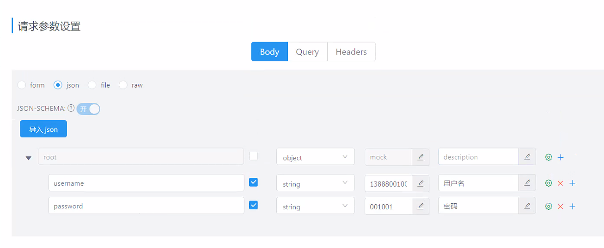
    - 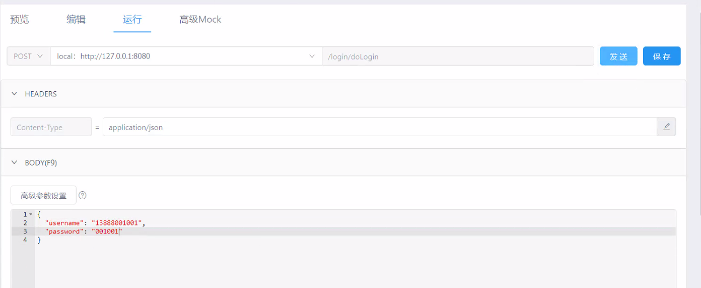
    - 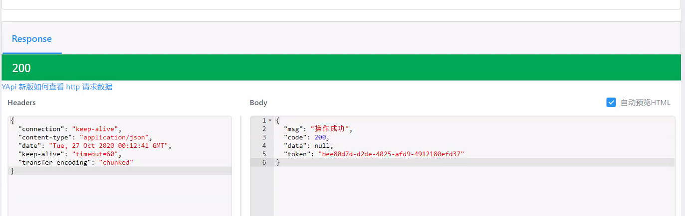
  - 测试获取用户信息接口（需要使用刚刚登录拿到的token）
    - 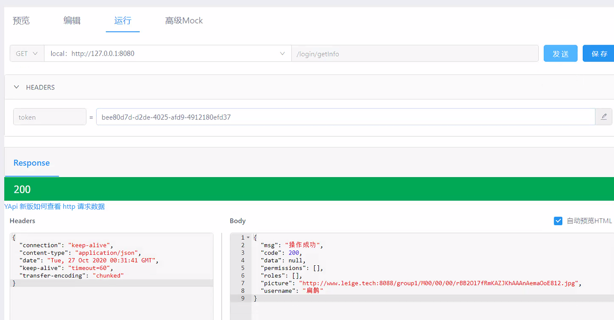
    - 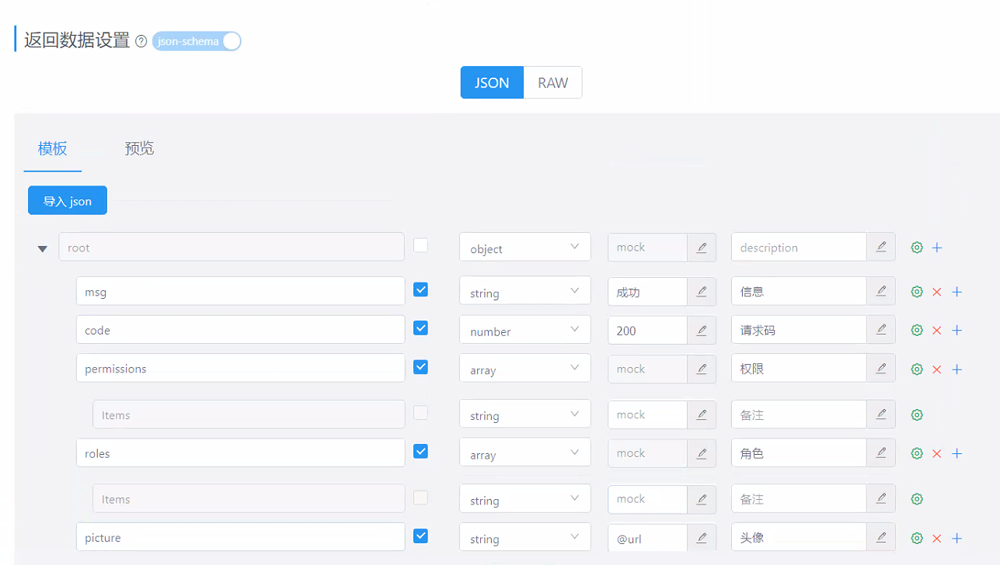
  - 退出登录
    - 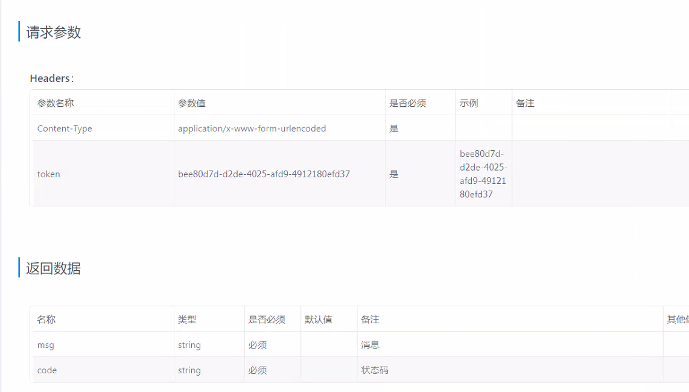
    - 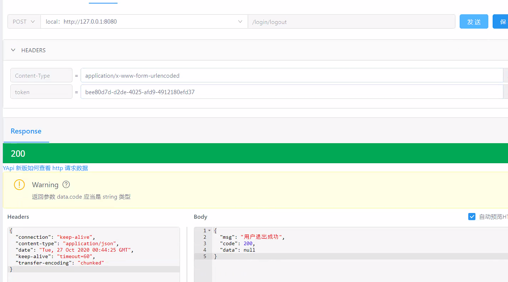
  - 查询菜单信息
    - 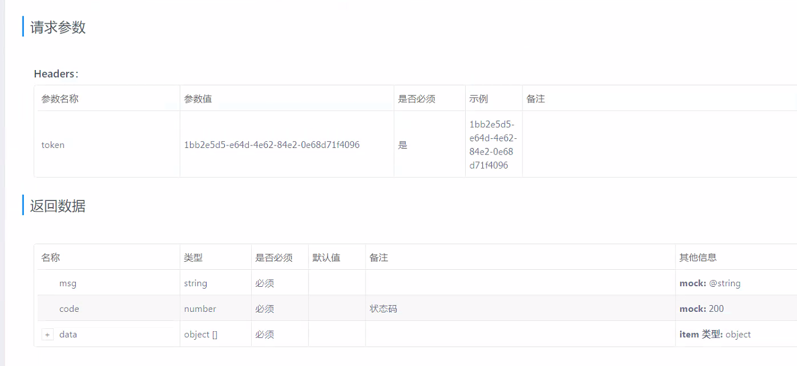
    - 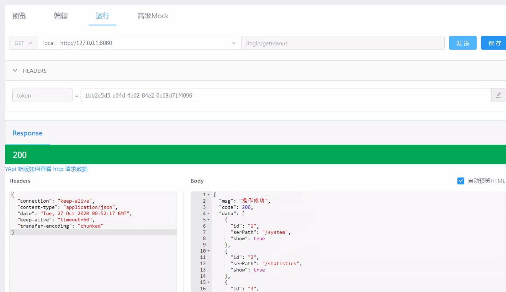

### F7：接口数据校验

- 如果出现像输入的密码账号为空这样的情况，就没必要去数据库进行查询了，目前的逻辑是拿到用户输入的账号密码，然后直接根据账号去数据库查用户信息，接着在匹配密码，操作可以省掉

- 改进方法

  - 在进行账号密码匹配之前，就可以对数据校验，如果校验不通过就不进行数据库操作了
  - SpringBoot为我们提供了一套校验规则

- 修改hospital-commons中的pom.xml文件

  ~~~java
  <!--后端数据校验框架-->
          <dependency>
              <groupId>org.springframework.boot</groupId>
              <artifactId>spring-boot-starter-validation</artifactId>
          </dependency>
  ~~~

  如果添加依赖后，还是报错或者找不到注解对应jar包，打开Projects Structure来手动加

- LoginBodyDto中对实体属性使用注解限制

  - 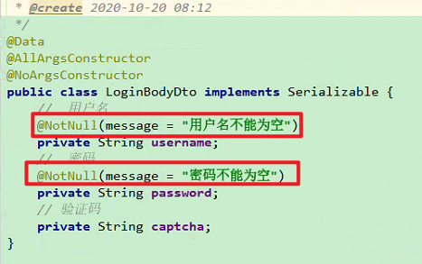

- 如果控制层中验证没有通过时，SpringBoot会抛出异常，这时可以采用全局异常处理类来处理这异常信息

  ~~~java
  package com.fclever.config.exception;
  
  import com.fclever.vo.AjaxResult;
  import org.springframework.web.bind.MethodArgumentNotValidException;
  import org.springframework.web.bind.annotation.ExceptionHandler;
  import org.springframework.web.bind.annotation.RestControllerAdvice;
  
  
  /**
   * 全局异常处理
   * @author Fclever
   * @create 2020-10-27 13:54
   */
  @RestControllerAdvice // Rest会以JSON的形式返回数据
  public class GlobalExceptionHandler {
  
      /**
       * 方法参数无效异常
       * 当系统出现MethodArgumentNotValidException这个异常时，会调用下面的方法
       * @param e
       * @return
       */
      @ExceptionHandler(value = MethodArgumentNotValidException.class)
      public AjaxResult jsonErrorHandler(MethodArgumentNotValidException e){
          return AjaxResult.error(e.getMessage());
      }
  }
  
  ~~~

  

- 使用YApi测试登录，不传递用户名和密码

  - 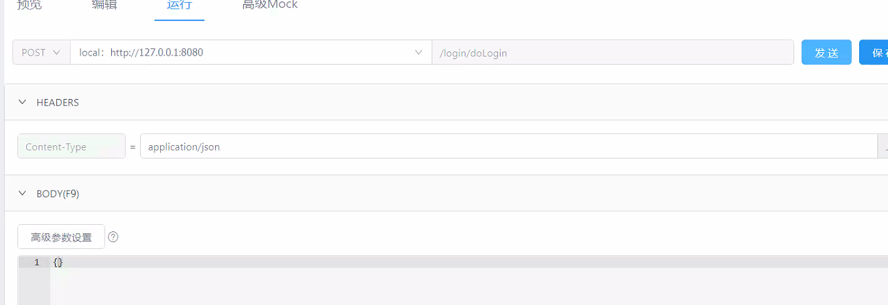

  - 返回Body值

    ~~~json
    {
      "msg": "Validation failed for argument [0] in public com.fclever.vo.AjaxResult com.fclever.controller.system.LoginController.login(com.fclever.dto.LoginBodyDto,javax.servlet.http.HttpServletRequest) with 2 errors: [Field error in object 'loginBodyDto' on field 'password': rejected value [null]; codes [NotNull.loginBodyDto.password,NotNull.password,NotNull.java.lang.String,NotNull]; arguments [org.springframework.context.support.DefaultMessageSourceResolvable: codes [loginBodyDto.password,password]; arguments []; default message [password]]; default message [密码不能为空]] [Field error in object 'loginBodyDto' on field 'username': rejected value [null]; codes [NotNull.loginBodyDto.username,NotNull.username,NotNull.java.lang.String,NotNull]; arguments [org.springframework.context.support.DefaultMessageSourceResolvable: codes [loginBodyDto.username,username]; arguments []; default message [username]]; default message [用户名不能为空]] ",
      "code": 500,
      "data": null
    }
    ~~~

  - 特别说明：在LoginBody类中属性只是添加了NotNull注解，也就是说对应属性为空时才会触发，比如下面这些情况

    - 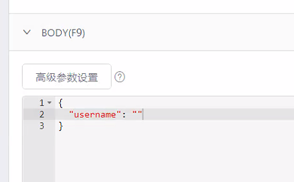

  - 传递“”这并不表示为空

### F8：接口数据校验【返回数据优化】

- F7中出现数据校验问题后，返回到前端的数据很多，而且不够明确，比如应该直接明确指出什么原因导致了什么问题

- F7中拿到的校验出错的信息都是通过==e.getMessage()==方法返回的，那么就可以断点调试在这一步，然后取出我们更直观有用的数据即可

  - 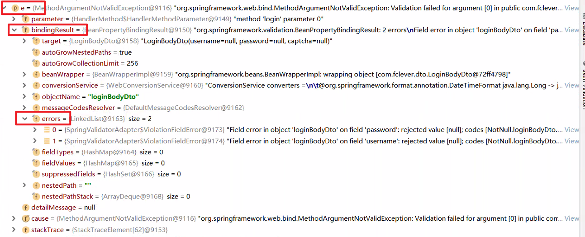
  - 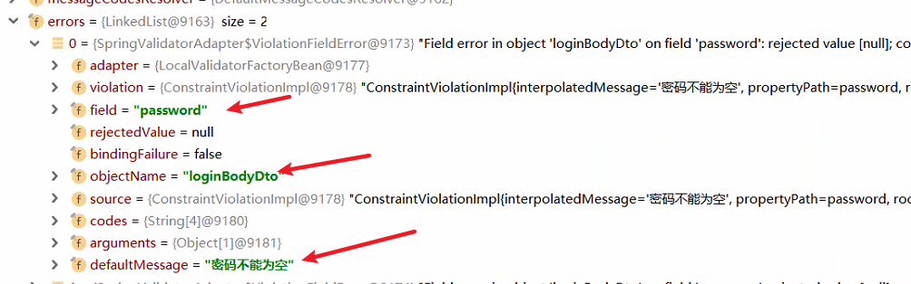

- 修改全局异常处理类

  - 第一次修改

    - 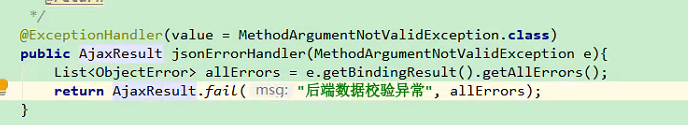

  - YApi测试

    - 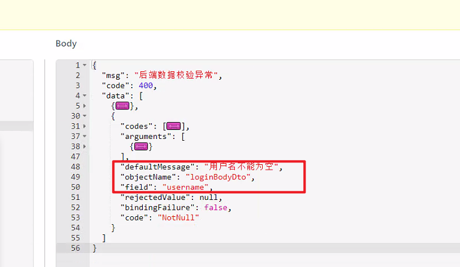

  - 第二次修改

    ~~~java
    package com.fclever.config.exception;
    
    import com.fclever.vo.AjaxResult;
    import org.springframework.validation.FieldError;
    import org.springframework.validation.ObjectError;
    import org.springframework.web.bind.MethodArgumentNotValidException;
    import org.springframework.web.bind.annotation.ExceptionHandler;
    import org.springframework.web.bind.annotation.RestControllerAdvice;
    
    import java.util.ArrayList;
    import java.util.HashMap;
    import java.util.List;
    import java.util.Map;
    
    
    /**
     * 全局异常处理
     * @author Fclever
     * @create 2020-10-27 13:54
     */
    @RestControllerAdvice // Rest会以JSON的形式返回数据
    public class GlobalExceptionHandler {
    
        /**
         * 方法参数无效异常
         * 当系统出现MethodArgumentNotValidException这个异常时，会调用下面的方法
         * @param e
         * @return
         */
        @ExceptionHandler(value = MethodArgumentNotValidException.class)
        public AjaxResult jsonErrorHandler(MethodArgumentNotValidException e){
            List<Map<String,Object>> list = new ArrayList<>();
            List<ObjectError> allErrors = e.getBindingResult().getAllErrors();
            for (ObjectError allError : allErrors) {
                Map<String, Object> map = new HashMap<>();
                map.put("defaultMessage", allError.getDefaultMessage());
                map.put("objectName", allError.getObjectName());
                // 转换类型，获取属性 FieldError extends ObjectError
                // field属性需要从FieldError获取
                FieldError fieldError = (FieldError)allError;
                map.put("field", fieldError.getField());
                list.add(map);
            }
            return AjaxResult.fail("后端数据校验异常", list);
        }
    }
    
    ~~~

    

  - YApi测试

    - 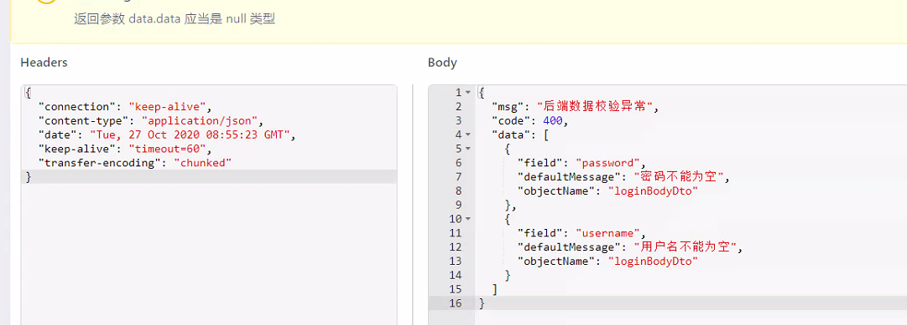

## 前端

### F9：用户登录

#### F9.1：登录

##### F9.1.1：修改view/login/index.vue，设置默认填充的用户名和密码

~~~vue
<template>
  

    <el-form ref="loginForm" :model="loginForm" :rules="loginRules" class="login-form" autocomplete="on" label-position="left">

      

        <h3 class="title">online-hospital在线医疗平台管理系统</h3>
      

      <el-form-item prop="username">
        
          <svg-icon icon-class="user" />
        
        <el-input
          ref="username"
          v-model="loginForm.username"
          placeholder="请输入用户名"
          name="username"
          type="text"
          tabindex="1"
          autocomplete="on"
        />
      </el-form-item>

      <el-tooltip v-model="capsTooltip" content="Caps lock is On" placement="right" manual>
        <el-form-item prop="password">
          
            <svg-icon icon-class="password" />
          
          <el-input
            :key="passwordType"
            ref="password"
            v-model="loginForm.password"
            :type="passwordType"
            placeholder="请输入密码"
            name="password"
            tabindex="2"
            autocomplete="on"
            @keyup.native="checkCapslock"
            @blur="capsTooltip = false"
            @keyup.enter.native="handleLogin"
          />
          
            <svg-icon :icon-class="passwordType === 'password' ? 'eye' : 'eye-open'" />
          
        </el-form-item>
      </el-tooltip>

      <el-button :loading="loading" type="primary" style="width:100%;margin-bottom:30px;" @click.native.prevent="handleLogin">登录</el-button>

      

<!--        
-->
<!--          Username : admin-->
<!--          Password : any-->
<!--        
-->
<!--        
-->
<!--          Username : editor-->
<!--          Password : any-->
<!--        
-->
           
        <el-button class="thirdparty-button" type="primary" @click="showDialog=true">
          第三方登录
        </el-button>
      

    </el-form>

    <el-dialog title="第三方登录" :visible.sync="showDialog">
      请选择第三方登录的方式（目前接口暂未开发）
       
       
       
      <social-sign />
    </el-dialog>
  

</template>

~~~

##### F9.1.2：修改store/modules/user.js

~~~js
import { login, logout, getInfo } from '@/api/user'
import { getToken, setToken, removeToken } from '@/utils/auth'
// import router, { resetRouter } from '@/router'
import { resetRouter } from '@/router'

const state = {
  token: getToken(),
  username: '',
  picture: '',
  // introduction: '',
  roles: [],
  permissions: []
}

const mutations = {
  SET_TOKEN: (state, token) => {
    state.token = token
  },
  // SET_INTRODUCTION: (state, introduction) => {
  //   state.introduction = introduction
  // },
  SET_USERNAME: (state, username) => {
    state.username = username
  },
  SET_PICTURE: (state, picture) => {
    state.picture = picture
  },
  SET_ROLES: (state, roles) => {
    state.roles = roles
  },
  SET_PERMISSIONS: (state, permissions) => {
    state.permissions = permissions
  }
}

const actions = {
  // 用户登录
  login({ commit }, userInfo) {
    // 从userInfo中取出用户名和密码
    const { username, password } = userInfo
    return new Promise((resolve, reject) => {
      // 调用api/user.js中的方法，向后端发送请求
      login({ username: username.trim(), password: password }).then(response => {
        // 响应数据格式根据YApi来看，与原来不同了
        const { token } = response
        // 登录成功后，从响应数据中获取token，保存到Vuex中
        // commit调用了mutations中的SET_TOKEN方法保存了token信息
        commit('SET_TOKEN', token)
        setToken(token)
        resolve()
      }).catch(error => {
        reject(error)
      })
    })
  },

  // 获取用户信息
  getInfo({ commit, state }) {
    return new Promise((resolve, reject) => {
      getInfo(state.token).then(response => {
        // const { data } = response
        // if (!data) {
        //   reject('Verification failed, please Login again.')
        // }
        const { username, picture, roles, permissions } = response

        // roles must be a non-empty array
        // if (!roles || roles.length <= 0) {
        //   reject('getInfo: roles must be a non-null array!')
        // }
        if (!username) {
          reject('用户名为空，请重新登录!')
        }
        // 获取角色
        commit('SET_ROLES', roles)
        // 获取用户名
        commit('SET_NAME', username)
        // 获取头像
        commit('SET_PICTURE', picture)
        // 获取权限
        commit('SET_PERMISSIONS', permissions)
        // 获取介绍
        // commit('SET_INTRODUCTION', introduction)
        resolve(response)
      }).catch(error => {
        reject(error)
      })
    })
  },

  // 退出登录
  logout({ commit, state, dispatch }) {
    return new Promise((resolve, reject) => {
      logout(state.token).then(() => {
        // 清空了token信息（在Vuex中）
        commit('SET_TOKEN', '')
        // 清空了角色信息（在Vuex中）
        commit('SET_ROLES', [])
        // 清空权限
        commit('SET_PERMISSIONS', [])
        // 删除token
        removeToken()
        // 重置路由
        resetRouter()

        // reset visited views and cached views
        // to fixed https://github.com/PanJiaChen/vue-element-admin/issues/2485
        dispatch('tagsView/delAllViews', null, { root: true })

        resolve()
      }).catch(error => {
        reject(error)
      })
    })
  },

  // remove token
  resetToken({ commit }) {
    return new Promise(resolve => {
      // 清空token
      commit('SET_TOKEN', '')
      // 清空角色
      commit('SET_ROLES', [])
      // 清空权限
      commit('SET_PERMISSIONS', [])
      removeToken()
      resolve()
    })
  }

  // 动态改变权限
  // async changeRoles({ commit, dispatch }, role) {
  //   const token = role + '-token'
  //
  //   commit('SET_TOKEN', token)
  //   setToken(token)
  //
  //   const { roles } = await dispatch('getInfo')
  //
  //   resetRouter()
  //
  //   // generate accessible routes map based on roles
  //   const accessRoutes = await dispatch('permission/generateRoutes', roles, { root: true })
  //   // dynamically add accessible routes
  //   router.addRoutes(accessRoutes)
  //
  //   // reset visited views and cached views
  //   dispatch('tagsView/delAllViews', null, { root: true })
  // }
}

export default {
  namespaced: true,
  state,
  mutations,
  actions
}

~~~

##### F9.1.3：修改src/api/user.js的真实API

~~~js
import request from '@/utils/request'

// 登录的后端接口
export function login(data) {
  // 向后端发送了一个post请求
  return request({
    url: '/login/doLogin',
    method: 'post',
    data // data是username和password
  })
}

// 登录成功之后获取用户信息的接口
export function getInfo(token) {
  return request({
    url: '/login/getInfo',
    method: 'get',
    params: { token }
  })
}

// 退出登录的接口
export function logout() {
  return request({
    url: '/login/logout',
    method: 'post'
  })
}

~~~

- 此时可以登录测试，看是否能成功，需要启动后端项目和虚拟机
- 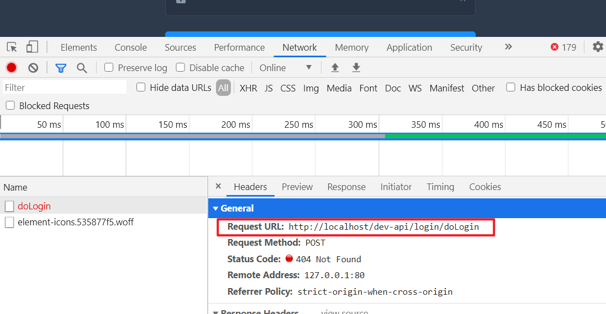
- 点击登录之后，发现并没有登录成功，在这里可以看到我们在api/user.js中配置的请求路径是/login/doLogin，此时前面添加了一个/dev-api的前缀，该前缀是在.env.development中配置的

##### F9.1.4：修改.env.development开发环境变量（这里没有修改）

~~~js
# just a flag
ENV = 'development'

# base api
VUE_APP_BASE_API = '/dev-api'

~~~

##### F9.1.5：修改vue.config.js配置代理

- 因为前后端分离，前后端在两个服务上配置，前端调用后端接口的时候肯定要进行跨域，而Vue提供了在前端处理跨域的解决方式

~~~js
'use strict'
const path = require('path')
const defaultSettings = require('./src/settings.js')

function resolve(dir) {
  return path.join(__dirname, dir)
}

const name = defaultSettings.title || 'vue Element Admin' // page title

// If your port is set to 80,
// use administrator privileges to execute the command line.
// For example, Mac: sudo npm run
// You can change the port by the following method:
// port = 9527 npm run dev OR npm run dev --port = 9527
// 修改项目的访问端口，如果为80，浏览器地址栏默认不显示
const port = process.env.port || process.env.npm_config_port || 80 // dev port

// All configuration item explanations can be find in https://cli.vuejs.org/config/
module.exports = {
  /**
   * You will need to set publicPath if you plan to deploy your site under a sub path,
   * for example GitHub Pages. If you plan to deploy your site to https://foo.github.io/bar/,
   * then publicPath should be set to "/bar/".
   * In most cases please use '/' !!!
   * Detail: https://cli.vuejs.org/config/#publicpath
   */
  publicPath: '/',
  outputDir: 'dist',
  assetsDir: 'static',
  lintOnSave: process.env.NODE_ENV === 'development',
  productionSourceMap: false,
  devServer: {
    port: port,
    open: true,
    overlay: {
      warnings: false,
      errors: true
    },
    // 这里提供了模拟数据，后期删除
    // before: require('./mock/mock-server.js')
    // 跨域代理配置
    proxy: {
      [process.env.VUE_APP_BASE_API]: {
        target: 'http://127.0.0.1:8080/', // 地址为后端服务器的地址
        changeOrigin: true,
        pathRewrite: {
          ['^' + process.env.VUE_APP_BASE_API]: ''
        }
      }
    }
  },
  configureWebpack: {
    // provide the app's title in webpack's name field, so that
    // it can be accessed in index.html to inject the correct title.
    name: name,
    resolve: {
      alias: {
        '@': resolve('src')
      }
    }
  },
  chainWebpack(config) {
    // it can improve the speed of the first screen, it is recommended to turn on preload
    // it can improve the speed of the first screen, it is recommended to turn on preload
    config.plugin('preload').tap(() => [
      {
        rel: 'preload',
        // to ignore runtime.js
        // https://github.com/vuejs/vue-cli/blob/dev/packages/@vue/cli-service/lib/config/app.js#L171
        fileBlacklist: [/\.map$/, /hot-update\.js$/, /runtime\..*\.js$/],
        include: 'initial'
      }
    ])

    // when there are many pages, it will cause too many meaningless requests
    config.plugins.delete('prefetch')

    // set svg-sprite-loader
    config.module
      .rule('svg')
      .exclude.add(resolve('src/icons'))
      .end()
    config.module
      .rule('icons')
      .test(/\.svg$/)
      .include.add(resolve('src/icons'))
      .end()
      .use('svg-sprite-loader')
      .loader('svg-sprite-loader')
      .options({
        symbolId: 'icon-[name]'
      })
      .end()

    config
      .when(process.env.NODE_ENV !== 'development',
        config => {
          config
            .plugin('ScriptExtHtmlWebpackPlugin')
            .after('html')
            .use('script-ext-html-webpack-plugin', [{
            // `runtime` must same as runtimeChunk name. default is `runtime`
              inline: /runtime\..*\.js$/
            }])
            .end()
          config
            .optimization.splitChunks({
              chunks: 'all',
              cacheGroups: {
                libs: {
                  name: 'chunk-libs',
                  test: /[\\/]node_modules[\\/]/,
                  priority: 10,
                  chunks: 'initial' // only package third parties that are initially dependent
                },
                elementUI: {
                  name: 'chunk-elementUI', // split elementUI into a single package
                  priority: 20, // the weight needs to be larger than libs and app or it will be packaged into libs or app
                  test: /[\\/]node_modules[\\/]_?element-ui(.*)/ // in order to adapt to cnpm
                },
                commons: {
                  name: 'chunk-commons',
                  test: resolve('src/components'), // can customize your rules
                  minChunks: 3, //  minimum common number
                  priority: 5,
                  reuseExistingChunk: true
                }
              }
            })
          // https:// webpack.js.org/configuration/optimization/#optimizationruntimechunk
          config.optimization.runtimeChunk('single')
        }
      )
  }
}

~~~

##### F9.1.6：配置代理之后要重启项目

##### F9.1.7：测试

- 重新登录进行测试
  - 
- 可以看到已经登录成功，并拿到相应数据了，但是页面并未跳转，而且提示Error

#### F9.2：解决登录成功之后不跳转的问题

- 原因：前置拦截和后置拦截处理的问题

- 修改src/utils/request.js

  ~~~js
  import axios from 'axios'
  import { MessageBox, Message } from 'element-ui'
  import store from '@/store'
  import { getToken } from '@/utils/auth'
  
  // 创建一个axios实例
  const service = axios.create({
    baseURL: process.env.VUE_APP_BASE_API, // 实际发送的URL=baseURL  +  请求配置的url  （baseURL当前就是/dev-api
    // withCredentials: true, // send cookies when cross-domain requests
    timeout: 5000 // 设置请求超时时间
  })
  
  // 请求拦截器
  service.interceptors.request.use(
    config => {
      // 在发送请求之前做的事情
      if (store.getters.token) {
        // 让每一个请求中都携带token
        // 【‘X-Token’】是一个自定义的header中的key
        // 可以根据实际情况改变它
        // 这里的token名称要和后端保持一致
        config.headers['token'] = getToken()
      }
      return config
    },
    error => {
      // 当请求出现问题时所做的一些事情
      console.log(error) // for debug
      return Promise.reject(error)
    }
  )
  
  // 响应拦截器
  service.interceptors.response.use(
    /**
     * 如果你想要得到诸如请求头或者状态的http信息
     * 请返回  response => response
     */
    /**
     * 通过自定义码来决定请求状态
     * 这里仅仅是一个例子
     * 你同样也可以根据http的状态码来决定这个状态
     * @param response
     * @returns {any|Promise<AxiosResponse<any>>}
     */
    response => {
      /**
       * 项目中存在的状态码
       * 400：参数存在问题
       * 401：未授权
       * 500：系统内部错误
       * 200：操作成功
       */
      const res = response.data // response.data才是后台返回给我们的数据
      if (res.code === 401) {
        // 未授权，身份过期  一个弹出框
        MessageBox.confirm('用户登录身份已过期，请重新登录', '系统提示', {
          confirmButtonText: '重新登录',
          cancelButtonText: '取消',
          type: 'warning'
        }).then(() => {
          store.dispatch('user/logout').then(() => { // 跳转到登录页面重新登录
            location.reload()
          })
        })
      } else if (res.code === 500) {
        Notification.error({
          title: '服务器内部出现异常，请联系管理员'
        })
        return Promise.reject('error') // 记录错误
      } else if (res.code !== 200) { // 可能是其他参数出错
        Notification.error({
          title: res.msg
        })
        return Promise.reject('error') // 记录错误
      } else {
        // 以上验证通过之后放行
        return res
      }
      // 如果响应的code值不是200，那么就判别为一个error
      // if (res.code !== 200) {
      //   Message({
      //     message: res.message || 'Error',
      //     type: 'error',
      //     duration: 5 * 1000
      //   })
      //
      //   // 50008: Illegal token; 50012: Other clients logged in; 50014: Token expired;
      //   if (res.code === 50008 || res.code === 50012 || res.code === 50014) {
      //     // to re-login
      //     MessageBox.confirm('You have been logged out, you can cancel to stay on this page, or log in again', 'Confirm logout', {
      //       confirmButtonText: 'Re-Login',
      //       cancelButtonText: 'Cancel',
      //       type: 'warning'
      //     }).then(() => {
      //       store.dispatch('user/resetToken').then(() => {
      //         location.reload()
      //       })
      //     })
      //   }
      //   return Promise.reject(new Error(res.message || 'Error'))
      // } else {
      //   return res
      // }
    },
    error => {
      console.log('err' + error) // for debug
      Message({
        message: error.message,
        type: 'error',
        duration: 5 * 1000
      })
      return Promise.reject(error)
    }
  )
  
  export default service
  
  ~~~

  

- 修改src/permission.js

  ~~~js
  import router from './router'
  import store from './store'
  import { Message } from 'element-ui'
  import NProgress from 'nprogress' // progress bar
  import 'nprogress/nprogress.css' // progress bar style
  import { getToken } from '@/utils/auth' // get token from cookie
  import getPageTitle from '@/utils/get-page-title'
  
  NProgress.configure({ showSpinner: false }) // NProgress Configuration
  
  const whiteList = ['/login', '/auth-redirect'] // no redirect whitelist
  
  // 全局前置守卫，触发任意导航时，都会触发全局前置守卫
  router.beforeEach(async(to, from, next) => {
    // 开始进度条
    NProgress.start()
  
    // 设置网页标题
    document.title = getPageTitle(to.meta.title)
  
    // 获取页面的token信息，判断用户是否已经登录
    const hasToken = getToken()
  
    if (hasToken) {
      // 已经登录了，判断请求路由是否为login，如果是login则不需要重复登录，直接跳转到首页即可
      if (to.path === '/login') {
        // 如果已经登录过了，那么跳转到首页
        next({ path: '/' })
        NProgress.done() // hack: https://github.com/PanJiaChen/vue-element-admin/pull/2939
      } else {
        // 如果请求路由不是去往登录页面，那么就需要判断当前用户的角色，来决定能否跳转到目标路由
        // 确定用户是否通过getInfo获得了他的角色
        // const hasRoles = store.getters.roles && store.getters.roles.length > 0
        // 目前角色都是空的，所以先以用户名来判断
        const hasUsername = store.getters.name !== ''
        // 如果已经获得了角色，那么就可以跳转到目标路由
        // -- 如果用户名不为空，表示已经登录过
        if (hasUsername) {
          next()
        } else {
          // 如果没有对应的角色，那么就需要请求后台获取用户信息和权限信息
          try {
            // 说明：角色必须是一个对象数组类型，比如【‘admin’】或者【‘developer’，‘editor’】
            // const { roles } = await store.dispatch('user/getInfo')
            await store.dispatch('user/getInfo')
  
            // 基于角色生成动态路由【菜单和权限】
            // 默认先给一个admin权限
            const accessRoutes = await store.dispatch('permission/generateRoutes', ['admin'])
  
            // 动态添加路由
            router.addRoutes(accessRoutes)
  
            // hack方法，以确保addRoutes是完整的
            // 设置replace: true，这样导航将不会留下历史记录
            next({ ...to, replace: true })
          } catch (error) {
            // 如果出错，则请求后台重置用户token并且跳转到登录页面，重新登录
            await store.dispatch('user/resetToken')
            Message.error(error || 'Has Error')
            next(`/login?redirect=${to.path}`)
            NProgress.done()
          }
        }
      }
    } else {
      /* has no token*/
      // 没有token，需要登录
      if (whiteList.indexOf(to.path) !== -1) {
        // in the free login whitelist, go directly
        // 如果在免登陆白名单中，则直接不需登录直接进入
        next()
      } else {
        // 否则将被重定向到登录页面
        next(`/login?redirect=${to.path}`)
        NProgress.done()
      }
    }
  })
  
  // 全局后置钩子
  router.afterEach(() => {
    // finish progress bar
    NProgress.done()
  })
  
  ~~~

- 修改store/modules/permission.js

  ~~~js
  import { asyncRoutes, constantRoutes } from '@/router'
  
  /**
   * Use meta.role to determine if the current user has permission
   * @param roles
   * @param route
   */
  function hasPermission(roles, route) {
    if (route.meta && route.meta.roles) {
      return roles.some(role => route.meta.roles.includes(role))
    } else {
      return true
    }
  }
  
  /**
   * Filter asynchronous routing tables by recursion
   * @param routes asyncRoutes
   * @param roles
   */
  export function filterAsyncRoutes(routes, roles) {
    const res = []
  
    routes.forEach(route => {
      const tmp = { ...route }
      if (hasPermission(roles, tmp)) {
        if (tmp.children) {
          tmp.children = filterAsyncRoutes(tmp.children, roles)
        }
        res.push(tmp)
      }
    })
  
    return res
  }
  
  const state = {
    routes: [],
    addRoutes: []
  }
  
  const mutations = {
    SET_ROUTES: (state, routes) => {
      state.addRoutes = routes
      state.routes = constantRoutes.concat(routes)
    }
  }
  
  const actions = {
    generateRoutes({ commit }, roles) {
      return new Promise(resolve => {
        let accessedRoutes
        // 如果角色包含admin，那就进行动态路由
        if (roles.includes('admin')) {
          accessedRoutes = asyncRoutes || []
        } else {
          // 否则进行过滤
          accessedRoutes = filterAsyncRoutes(asyncRoutes, roles)
        }
        commit('SET_ROUTES', accessedRoutes)
        resolve(accessedRoutes)
      })
    }
  }
  
  export default {
    namespaced: true,
    state,
    mutations,
    actions
  }
  
  ~~~

  

- 重新测试结果

  - 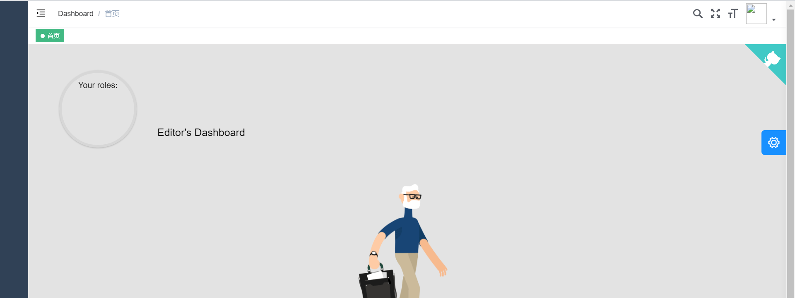

- 查看结果问题

  - 可以看到登录进入后显示的首页并不是统计的那个页面

  - 修改views/dashboard/index.vue

    ~~~vue
    <template>
      

        <component :is="currentRole" />
      

    </template>
    
    
    
    ~~~

    

#### F9.3：解决其他问题

- 面包屑的问题及控制台报错
  - 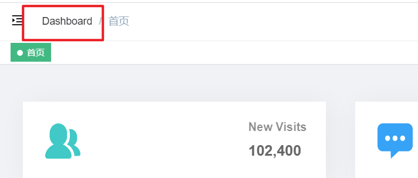
  - 多了一个Dashboard的显示
  - 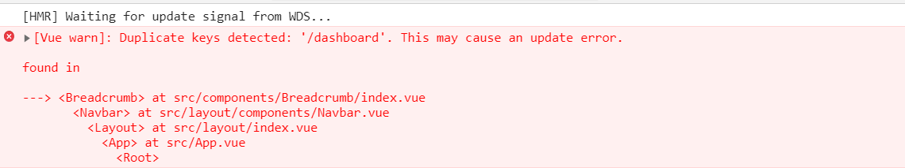
- 找到src/components/Breadcrumb/index.vue修改
  - 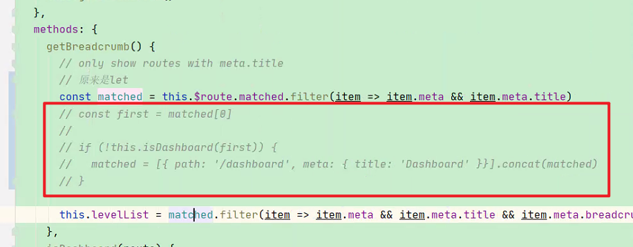

### F10：登录额加载菜单和后台关联问题

#### F10.1：加载菜单方案选择

- 概述
  - 目前系统中显示的菜单都是写死的数据，并没有从数据库的菜单表中查询获取，菜单表中每一个菜单都有path属性，我们可以根据path属性来控制是否显示该菜单
  - 使用vue-element-admin过程中，可以发现其中的菜单列表是通过遍历路由进行渲染的，由前端定义，可以在router.js中可以看到已经写死的路由信息，路由即菜单
    - 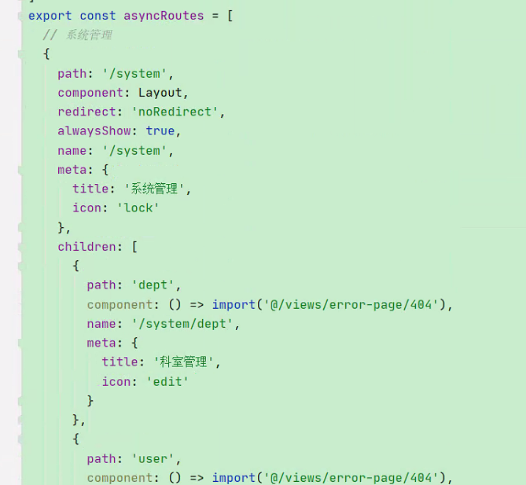
  - 好处是不同重复定义菜单列表信息和路由之间的绑定了；但是我们的菜单信息想要通过服务端进行动态输出来达到权限控制的效果就不是那么容易了。
  - 现在很多解决方案是由服务端输出完整的vue-element-admin路由信息并进行绑定，这样虽然能够达到动态菜单的效果，但是给服务端造成了不必要的烦恼。
  - 作为服务端开发：不关心菜单对应于哪个vue组件，也不希望将菜单的格式限定的过于严格，甚至不关心菜单的图标是什么，只需要严格按照服务端的要求显示或者隐藏菜单即可。
  - 最终选择方案：服务端只控制菜单显示或者隐藏，路由信息定义在前端，达到完美的前后端分离要求
- 两种方案
  - 所有的路由地址由后端提供，异步渲染
  - 所有的路由由前端提供，后台提供数据确定起那段哪些路径隐藏

#### F10.2：开始修改

##### F10.2.1：定义路由

- 在src/router/index.js中，常量路由为共用的一些路由，不会因为登录用户所属角色不同而改变，在动态路由ayncRoutes中每个路由都含有name属性，而且数据库的菜单表中存在path属性，==这里就可以根据name值与path的值的匹配==来动态决定菜单是否显示了
- src/router/index.js中的路由配置
  - 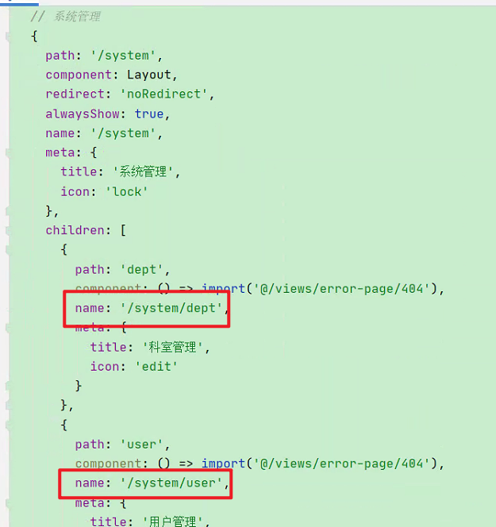

##### F10.2.2：服务端接口

- 服务端接口获取菜单信息的接口返回数据
  - 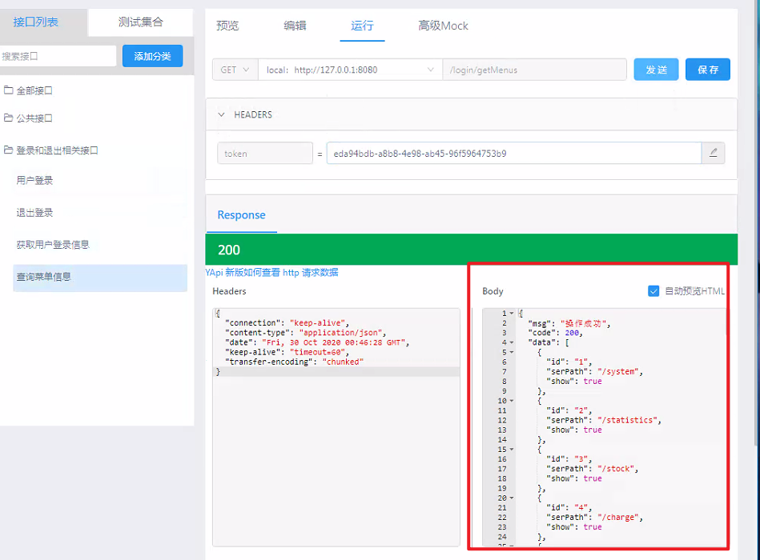

##### F10.2.3：修改api请求模块

- 添加菜单接口配置
  - 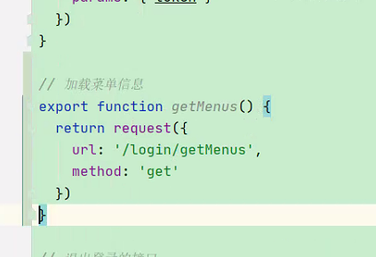

##### F10.2.4：配置store调用

- 项目中原本加载菜单的方式是在src/permission.js中进行加载的，这里不直接修改以下代码，新增一个关于菜单的js
  
- 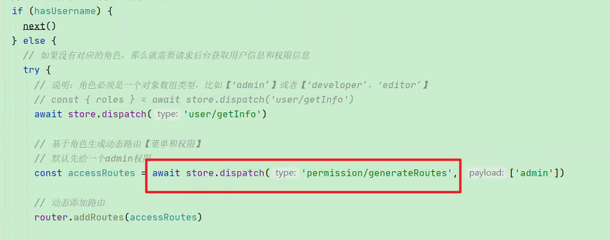
  
- 添加src/store/modules/menu.js

  ~~~js
  // 引入路由
  import { asyncRoutes, constantRoutes, lastRoute } from '@/router'
  // 引入api中获取菜单信息的接口
  import { getMenus } from '@/api/user'
  
  const state = {
    routes: []
  }
  // 保存菜单信息到Vuex中
  const mutations = {
    SET_ROUTES: (state, routes) => {
      state.routes = routes
    }
  }
  
  // 动态菜单定义在前端，后台只会返回对应登录用户有权限的菜单列表，通过遍历服务端的菜单数据，将没有获取到的菜单进行隐藏
  // 这样的好处是服务端无需返回前端菜单相关结果，并且菜单显示又可以通过服务端来控制，进行菜单的动态控制
  // 遵循了前后端分离的原则
  
  // routes：前端定义写死的异步路由信息,srvMenus：从服务端获取的菜单信息，
  function generateRoutes(routes, srvMenus) {
    // 遍历前端写死的异步路由列表
    for (let i = 0; i < routes.length; i++) {
      // 单个对象
      const routeItem = routes[i]
      // 设置默认不显示
      var showItem = false
      // 遍历服务端返回的当前用户可以操作的菜单
      for (let j = 0; j < srvMenus.length; j++) {
        // 单个对象
        const srvItem = srvMenus[j]
        // 如果前端路由对应不是undefined 并且 前端路由的name与服务端路由的name相等，且服务端菜单show为true
        // 前后端数据通过 serPath 属性来匹配
        if (routeItem.name !== undefined && routeItem.name === srvItem.serPath && srvItem.show === true) {
          // 那么该前端路由菜单需要显示
          showItem = true
          // 隐藏属性设置为false
          routes[i]['hidden'] = false
          break
        }
      }
      // 如果遍历的单个前端路由菜单依旧是false，表示并没有和服务端返回的菜单数据匹配，那么设置hidden为true
      if (showItem === false) {
        routes[i]['hidden'] = true
      }
      /**
       * 下面的if判断是否可以放入break前面呢？如果一级菜单都不行，那么二级菜单肯定也不能显示
       * 上面如果showItem已经判断为false，表示一级菜单不能显示，就算一级菜单下面还有二级菜单还有什么意义呢
        */
      // 深层次遍历子节点，如果当前前端菜单的children子节点不为空，并且长度大于0，那么继续匹配子菜单节点是否显示
      if (routeItem['children'] !== undefined && routeItem['children'].length > 0) {
        generateRoutes(routes[i]['children'], srvMenus)
      }
    }
  }
  
  const actions = {
    getMenus({ commit }, roles) {
      return new Promise(resolve => {
        // 查询与当前登录用户角色的菜单数据
        getMenus(state.token).then(async function(res) {
          // res:{“msg":"","code":"","data":[{"id":"","serPath":"","show":boolean},{}....]
          // 获取服务端返回的菜单数组对象
          const srvMenus = res.data
          // 获取异步路由对象
          var pushRouter = asyncRoutes
          // 根据服务端返回的菜单与前端定义的菜单数据进行匹配
          generateRoutes(pushRouter, srvMenus)
          // 定义常量保存实际需要显示的菜单信息
          const routeArr = []
          // 保存常量路由
          routeArr.push(...constantRoutes)
          // 保存与服务端动态匹配的路由
          routeArr.push(...pushRouter)
          // 保存
          routeArr.push(...lastRoute)
          commit('SET_ROUTES', routeArr)// 放到vuex里面
          resolve(routeArr)
        })
      })
    }
  }
  
  export default {
    namespaced: true,
    state,
    mutations,
    actions
  }
  
  ~~~

  

##### F10.2.5：修改store/getters.js

~~~js
const getters = {
  sidebar: state => state.app.sidebar,
  size: state => state.app.size,
  device: state => state.app.device,
  visitedViews: state => state.tagsView.visitedViews,
  cachedViews: state => state.tagsView.cachedViews,
  token: state => state.user.token,
  avatar: state => state.user.avatar,
  name: state => state.user.name,
  introduction: state => state.user.introduction,
  roles: state => state.user.roles,
  permission_routes: state => state.permission.routes,
  errorLogs: state => state.errorLog.logs,
  menuRoutes: state => state.menu.routes // 实际显示的菜单
}
export default getters

~~~

##### F10.2.6：动态渲染菜单修改src/permission.js

- 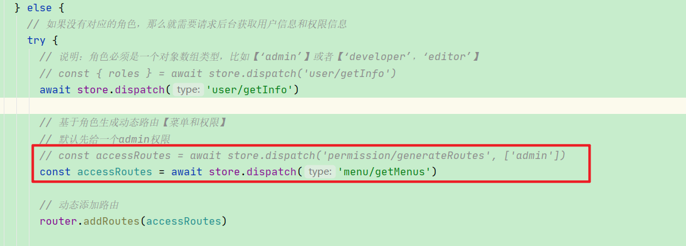

##### F10.2.7：登录测试--菜单不显示问题

- 
- 问题原因
  - 默认系统中，主页面上加载菜单的数据是使用的modules/permission.js助攻的路由数据，现在更换了新的数据，要改变主页面中菜单的数据引用

##### F10.2.8：修改加载菜单取数据的参数

- src/layout/components/Sidebar/index.vue
  - 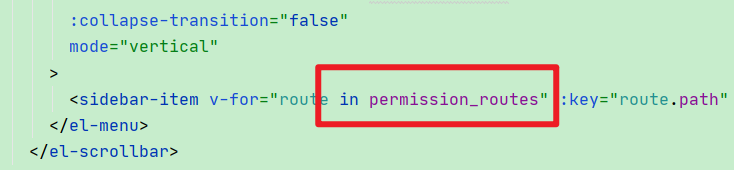
  - 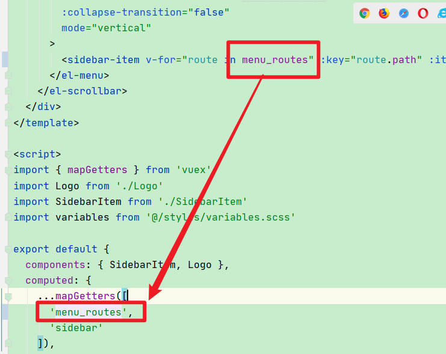

##### F10.2.9：修改完登录加载可以了

- 登录系统测试
  - 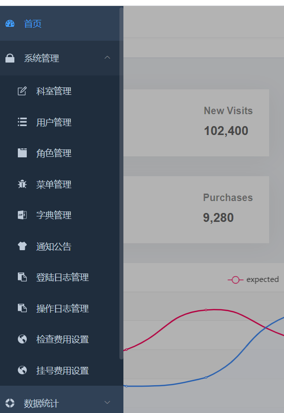

##### F10.2.10：修改数据库测试

- 将sys_menu表中一些菜单的status设置为1，然后刷新系统看对应菜单是否会显示，如果不显示那么就对了

# 字典类型管理

## 介绍

- 为什么将字段类型管理作为第一个内容进行开发？
  - 因为这里涉及的内容与其他各个模块很有关系，其他模块一些码表数据都是由字典类型管理模块来控制的（增删改查）
- 涉及到的数据库表（类型对应多个数据）
  - 字典类型表：sys_dict_type
  - 字段数据表：sys_dict_data
- YApi添加字典类型管理的接口文档
  - 以后这一块就不再单独写了，直接个人空间查看就行了

## 后端

### F1：生成字典类型相关代码

- 数据表：sys_dict_type
  - 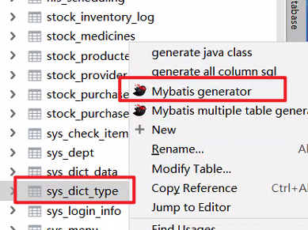
  - 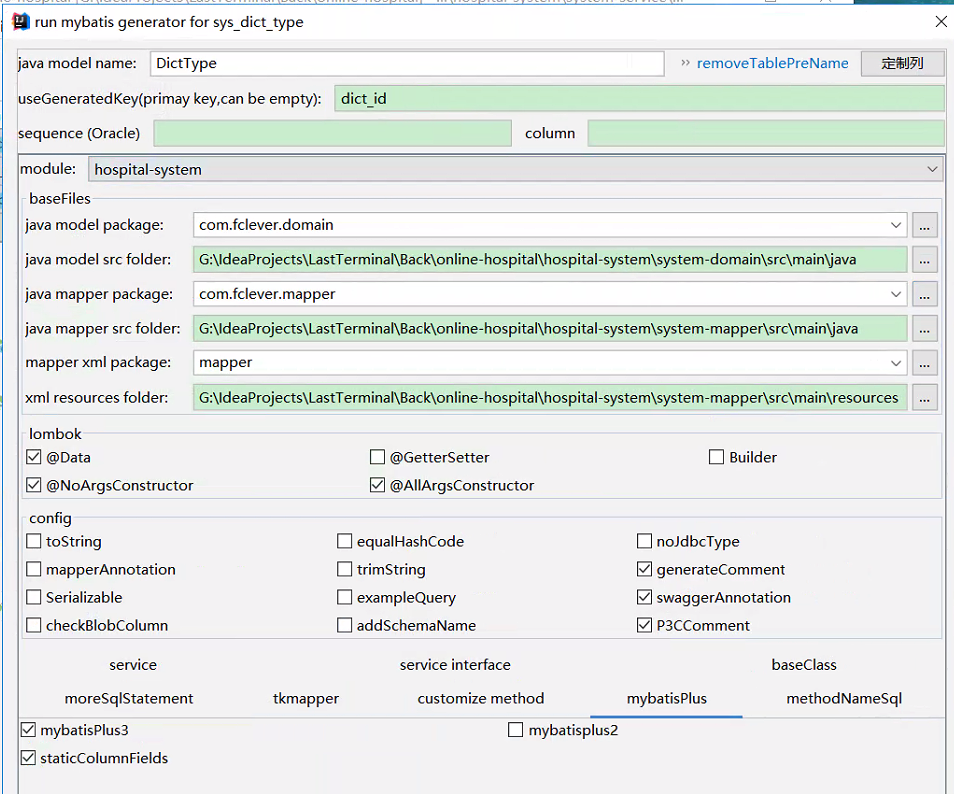
  - 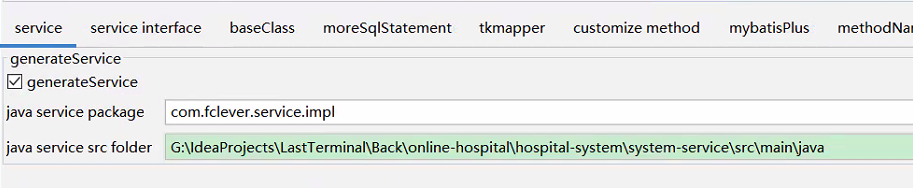
  - 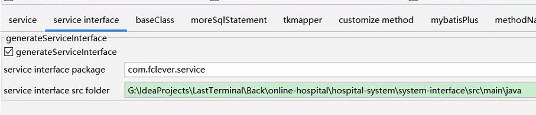

#### F1.1：【system-domain】DictType

#### F1.2：【system-domain】DictTypeDto

- 介绍

  - 在页面中进行查询时，往往不一定会查询对应表的所有字段；同样对数据进行添加的时候，也不一定是全部字段都进行添加，有些字段数据库会自动生成
  - 因此设置一个==数据传输==实体类来做交互（DataTransferObject）

- 添加

  ~~~JAVA
  package com.fclever.dto;
  
  import com.baomidou.mybatisplus.annotation.IdType;
  import com.baomidou.mybatisplus.annotation.TableField;
  import com.baomidou.mybatisplus.annotation.TableId;
  import io.swagger.annotations.ApiModel;
  import io.swagger.annotations.ApiModelProperty;
  import lombok.AllArgsConstructor;
  import lombok.Data;
  import lombok.EqualsAndHashCode;
  import lombok.NoArgsConstructor;
  
  import javax.validation.constraints.NotNull;
  import java.util.Date;
  
  /**
   * 数据传输类DataTransferObject
   *      查询和添加时不一定操作全部的
   * @author Fclever
   * @create 2020-11-02 20:21
   */
  @ApiModel(value="com-fclever-dto-DictTypeDto")
  @Data
  @AllArgsConstructor
  @NoArgsConstructor
  @EqualsAndHashCode(callSuper = false)
  public class DictTypeDto extends BaseDto{
  
      /**
       * 字典主键
       */
      @ApiModelProperty(value="字典主键")
      private Long dictId;
  
      /**
       * 字典名称
       */
      @NotNull(message = "字典名称不能为空")
      @ApiModelProperty(value="字典名称")
      private String dictName;
  
      /**
       * 字典类型
       */
      @NotNull(message = "字典类型不能为空")
      @ApiModelProperty(value="字典类型")
      private String dictType;
  
      /**
       * 状态（0正常 1停用）
       */
      @NotNull(message = "状态不能为空")
      @ApiModelProperty(value="状态（0正常 1停用）")
      private String status;
  
      /**
       * 创建者
       */
      @ApiModelProperty(value="创建者")
      private String createBy;
  
      /**
       * 创建时间
       */
      @ApiModelProperty(value="创建时间")
      private Date createTime;
  
      /**
       * 更新者
       */
      @ApiModelProperty(value="更新者")
      private String updateBy;
  
      /**
       * 更新时间
       */
      @ApiModelProperty(value="更新时间")
      private Date updateTime;
  
      /**
       * 备注
       */
      @ApiModelProperty(value="备注")
      private String remark;
  }
  
  ~~~

  

#### F1.3：【hospital-commons】DataGridView

- 做分页查询时，一般都需要返回总条数和实际查询的数据，在BaseDto中已经封装了页码|每页条数等，在commons再创建一个DataGridView来保存总条数和查询数据

- 添加

  ~~~java
  package com.fclever.vo;
  
  import io.swagger.annotations.ApiModel;
  import lombok.AllArgsConstructor;
  import lombok.Data;
  import lombok.NoArgsConstructor;
  
  import java.io.Serializable;
  import java.util.List;
  
  /**
   * 分页查询封装类
   *      总条数+实际数据
   * @author Fclever
   * @create 2020-11-02 20:32
   */
  @ApiModel(value="com-fclever-vo-DataGridView")
  @Data
  @AllArgsConstructor
  @NoArgsConstructor
  public class DataGridView implements Serializable {
  
      // 查询总条数
      private Long total;
      // 查询到的数据
      private List<?> data;
  }
  
  ~~~

  

#### F1.4：【system-mapper】DictTypeMapper

#### F1.5：【system-mapper】DictTypeMapper.xml

#### F1.6：【system-interface】DictTypeService

~~~java
package com.fclever.service;

import com.fclever.domain.DictType;
import com.baomidou.mybatisplus.extension.service.IService;
import com.fclever.dto.DictTypeDto;
import com.fclever.vo.DataGridView;

/**
@author Fclever
@create 2020-11-02 17:47
*/
public interface DictTypeService{

        /**
         * 分页查询字典类型
         *
         * @param dictTypeDto 查询添加使用的封装类
         * @return 分页查询封装类
         */
        DataGridView listPage(DictTypeDto dictTypeDto);

        /**
         * 查询所有字典类型
         *
         * @return 分页查询封装类
         */
        DataGridView list();

        /**
         * 检查字典类型是否存在
         *
         * @param dictId 字典类型主键id
         * @param dictType  字典类型
         * @return 是否存在的标志
         */
        Boolean checkDictTypeUnique(Long dictId, String dictType);

        /**
         * 插入新的字典类型
         *
         * @param dictTypeDto 查询添加使用的封装类
         * @return 是否插入成功标志
         */
        int insert(DictTypeDto dictTypeDto);

        /**
         * 修改的字典类型 
         *
         * @param dictTypeDto 待修改的内容
         * @return 是否修改成功标志
         */
        int update(DictTypeDto dictTypeDto);

        /**
         * 根据ID删除字典类型
         *
         * @param dictIds 待批量删除的字典类型主键
         * @return 是否删除成功的标志
         */
        int deleteDictTypeByIds(Long[] dictIds);

        /**
         * 根据ID查询一个字典类型
         *
         * @param dictId 待查询的字典类型id
         * @return 查询到的字典类型
         */
        DictType selectDictTypeById(Long dictId);
}

~~~

#### F1.7：【system-service】DictTypeServiceImpl

~~~java
package com.fclever.service.impl;

import cn.hutool.core.bean.BeanUtil;
import cn.hutool.core.date.DateUtil;
import com.baomidou.mybatisplus.core.conditions.query.QueryWrapper;
import com.baomidou.mybatisplus.core.toolkit.StringUtils;
import com.baomidou.mybatisplus.extension.plugins.pagination.Page;
import com.fclever.constants.Constants;
import com.fclever.dto.DictTypeDto;
import com.fclever.vo.DataGridView;
import org.springframework.beans.factory.annotation.Autowired;
import org.springframework.stereotype.Service;
import com.fclever.mapper.DictTypeMapper;
import com.fclever.domain.DictType;
import com.fclever.service.DictTypeService;

import java.util.Arrays;
import java.util.List;

/**
@author Fclever
@create 2020-11-02 17:47
*/
@Service
public class DictTypeServiceImpl implements DictTypeService{

    @Autowired
    private DictTypeMapper dictTypeMapper;

    /**
     * 分页查询字典类型
     * @param dictTypeDto 查询添加使用的封装类
     * @return
     */
    @Override
    public DataGridView listPage(DictTypeDto dictTypeDto) {
        // Mybatisplus   设置分页默认值，默认为第一页，条数为10
        Page<DictType> page = new Page<>(dictTypeDto.getPageNum(), dictTypeDto.getPageSize());
        // 封装查询条件
        QueryWrapper<DictType> qw = new QueryWrapper<>();
        // 先判断是否字典名称是否为空，如果不为空，则将val作为对应表字段进行模糊like查询
        qw.like(StringUtils.isNotBlank(dictTypeDto.getDictName()), DictType.COL_DICT_NAME, dictTypeDto.getDictName());
        qw.like(StringUtils.isNotBlank(dictTypeDto.getDictType()), DictType.COL_DICT_TYPE, dictTypeDto.getDictType());
        // 等于匹配，非空后，做精确匹配
        qw.eq(StringUtils.isNotBlank(dictTypeDto.getStatus()), DictType.COL_STATUS, dictTypeDto.getStatus());
        // 范围匹配，创建日期（开始时间----结束时间）
        // 大于等于
        qw.ge(dictTypeDto.getBeginTime() != null, DictType.COL_CREATE_TIME, dictTypeDto.getBeginTime());
        // 小于等于
        qw.le(dictTypeDto.getEndTime() != null, DictType.COL_CREATE_TIME, dictTypeDto.getEndTime());
        // 根据pw查询，并将数据保存到page中
        // 调用Mapper执行selectPage(分页查询），条件为qw，保存分页相关信息和查询数据到page中
        this.dictTypeMapper.selectPage(page, qw);
        // 构建分页查询的封装类   数据总条数+查询到的数据
        return new DataGridView(page.getTotal(),page.getRecords());
    }

    /**
     * 查询所有字典类型    处于可用状态的字典类型
     * @return 分页查询封装类
     */
    @Override
    public DataGridView list() {
        QueryWrapper<DictType> qw = new QueryWrapper<>();
        // 查询条件，状态为0，可用的状态
        qw.eq(DictType.COL_STATUS, Constants.STATUS_TRUE);
        return new DataGridView(null, this.dictTypeMapper.selectList(qw));
    }

    /**
     * 检查字典类型是否存在
     *      比如在添加或者修改等操作时，需要验证该字典类型是否存在，这时候就会调用
     *      添加操作时，dictId为空，
     *      修改操作时，需要注意修改后的
     * @param dictId 字典类型主键id
     * @param dictType  字典类型
     * @return 是否存在的标志
     */
    @Override
    public Boolean checkDictTypeUnique(Long dictId, String dictType) {
        // 如果dictId为null，表示为增加操作，那么给它一个-1，数据库id自增， 所以不会出现相同，否则为更新操作
        dictId = (dictId == null) ? -1L : dictId;
        // 查询条件：查询字典类型等于选择的字典类型
        QueryWrapper<DictType> qw = new QueryWrapper<>();
        qw.eq(DictType.COL_DICT_TYPE, dictType);
        // 执行查询
        DictType dbDictType = this.dictTypeMapper.selectOne(qw);
        /**
         * 如果是添加操作，默认id为null，因为通过数据库自动递增，如果根据待添加的类型能在数据库查到数据
         *      就说明该种字典类型已经存在了，不需要重复添加，返回false，停止该操作
         *
         *  如果是更新操作，默认id为对应记录的id，根据类型能查询到结果，并且id相同，就返回true，可以进行更新操作
          */
        // 如果能根据字典类型查询到一条结果，并且查询到的id不相等，那就说明数据库不存在
        if (null != dbDictType && dictId.longValue() != dbDictType.getDictId().longValue()){
            return true; // 说明不存在
        }
        return false; // 说明存在
    }

    /**
     * 插入新的字典类型
     * @param dictTypeDto 查询添加使用的封装类
     * @return 是否插入成功的标志
     */
    @Override
    public int insert(DictTypeDto dictTypeDto) {
        // 形参为数据传输实体类，但是调用Mapper进行持久化需要使用原本实体类
        DictType dictType = new DictType();
        // 两个实体属性对应，将值进行拷贝  使用hutools工具类
        BeanUtil.copyProperties(dictTypeDto, dictType);
        dictType.setCreateBy(dictTypeDto.getSimpleUser().getUserName());
        dictType.setCreateTime(DateUtil.date());
        return this.dictTypeMapper.insert(dictType);
    }

    /**
     * 修改字典类型
     * @param dictTypeDto 待修改的内容
     * @return 是否修改成功的标志
     */
    @Override
    public int update(DictTypeDto dictTypeDto) {
        // 形参为数据传输实体类，但是调用Mapper进行持久化需要使用原本实体类
        DictType dictType = new DictType();
        // 设置修改人
        BeanUtil.copyProperties(dictTypeDto, dictType);
        dictType.setUpdateBy(dictTypeDto.getSimpleUser().getUserName());
        return this.dictTypeMapper.updateById(dictType);
    }

    /**
     * 根据ID删除字典类型
     * @param dictIds 待批量删除的字典类型主键
     * @return 是否删除成功的标志
     */
    @Override
    public int deleteDictTypeByIds(Long[] dictIds) {
        // 数组转集合
        List<Long> ids = Arrays.asList(dictIds);
        // 如果不为空，并且长度大于0，调用Mapper进行批量删除
        if (null != ids && ids.size() > 0){
            return this.dictTypeMapper.deleteBatchIds(ids);
        }
        return -1;
    }

    /**
     * 根据ID查询一个字典类型
     * @param dictId 待查询的字典类型id
     * @return 查询到的字典类型
     */
    @Override
    public DictType selectDictTypeById(Long dictId) {
        return this.dictTypeMapper.selectById(dictId);
    }
}

~~~

### F2：【system-web】编写接口公共的ShiroSecurityUtils

- 在进行系统管理模块中的操作时，有时会使用到当前登录用户的信息，如用户名啥的，编写一个工具类来获取登录用户信息

- 代代码码

  ~~~java
  package com.fclever.utils;
  
  import com.fclever.constants.Constants;
  import com.fclever.domain.SimpleUser;
  import com.fclever.domain.User;
  import com.fclever.vo.ActiverUser;
  import org.apache.shiro.SecurityUtils;
  import org.apache.shiro.subject.Subject;
  
  import java.util.List;
  
  /**
   * 获取当前登录用户相关信息
   * @author Fclever
   * @create 2020-11-03 12:30
   */
  public class ShiroSecurityUtils {
  
      /**
       * 得到当前登陆的用户对象的ActiveUser（包括用户基本信息+角色+权限）
       *      存储在Redis中
       * @return
       */
      public static ActiverUser getCurrentActiveUser(){
          Subject subject= SecurityUtils.getSubject();
          ActiverUser activerUser= (ActiverUser) subject.getPrincipal();
          return activerUser;
      }
  
      /**
       * 得到当前登陆的用户对象User
       * @return
       */
      public static User getCurrentUser(){
          return getCurrentActiveUser().getUser();
      }
  
      /**
       * 得到当前登陆的用户对象SimpleUser（用户id+用户姓名）
       * @return
       */
      public static SimpleUser getCurrentSimpleUser(){
          User user = getCurrentActiveUser().getUser();
          return new SimpleUser(user.getUserId(),user.getUserName());
      }
  
      /**
       * 得到当前登陆的用户名称
       * @return
       */
      public static String getCurrentUserName(){
          return getCurrentActiveUser().getUser().getUserName();
      }
  
      /**
       * 得到当前登陆对象的角色编码
       * @return
       */
      public static List<String> getCurrentUserRoles(){
          return getCurrentActiveUser().getRoles();
      }
  
  
      /**
       * 得到当前登陆对象的权限编码
       * @return
       */
      public static List<String> getCurrentUserPermissions(){
          return getCurrentActiveUser().getPermissions();
      }
  
      /**
       * 判断当前用户是否是超级管理员
       * @return
       */
      public static boolean isAdmin(){
          return getCurrentUser().getUserType().equals(Constants.USER_ADMIN);
      }
  }
  
  ~~~

  

### F3：【system-web】编写接口DictTypeController

- 代码

  ~~~java
  package com.fclever.controller.system;
  
  import com.fclever.dto.DictTypeDto;
  import com.fclever.service.DictTypeService;
  import com.fclever.utils.ShiroSecurityUtils;
  import com.fclever.vo.AjaxResult;
  import com.fclever.vo.DataGridView;
  import org.springframework.beans.factory.annotation.Autowired;
  import org.springframework.validation.annotation.Validated;
  import org.springframework.web.bind.annotation.*;
  
  import javax.validation.constraints.NotEmpty;
  import javax.validation.constraints.NotNull;
  
  /**
   * 字典类型控制器
   * @author Fclever
   * @create 2020-11-03 14:35
   */
  @RestController
  @RequestMapping("system/dict/type")
  public class DictTypeController {
  
      @Autowired
      private DictTypeService dictTypeService;
  
      /**
       * 分页查询
       * @param dictTypeDto 分页查询参数
       * @return 消息+code+数据+total
       */
      @GetMapping("listForPage")
      public AjaxResult listForPage(DictTypeDto dictTypeDto){
          DataGridView dataGridView = this.dictTypeService.listPage(dictTypeDto);
          return AjaxResult.success("分页查询成功", dataGridView.getData(), dataGridView.getTotal());
      }
  
      /**
       * 添加字典类型
       * @param dictTypeDto 待添加字典类型
       * @return 消息+code
       */
      @PostMapping("addDictType")
      public AjaxResult addDictType(@Validated DictTypeDto dictTypeDto){
          // 检查数据库中是否已经存在了待添加的字典类型数据
          // 返回true表示可以存在，不能操作
          if (dictTypeService.checkDictTypeUnique(dictTypeDto.getDictId(), dictTypeDto.getDictType())){
              return AjaxResult.fail("新增字典["+dictTypeDto.getDictName()+"]失败，字典类型已经存在");
          }
          // 设置登录用户信息
          dictTypeDto.setSimpleUser(ShiroSecurityUtils.getCurrentSimpleUser());
          // 执行插入操作
          return AjaxResult.toAjax(this.dictTypeService.insert(dictTypeDto));
      }
  
      /**
       * 修改字典类型
       * @param dictTypeDto 待修改的数据
       * @return 消息+code
       */
      @PutMapping("updateDictType")
      public AjaxResult updateDictType(@Validated DictTypeDto dictTypeDto){
          // 检查数据库中是否已经存在了待修改的字典类型数据
          // 返回true表示可以存在，不能操作
          if (dictTypeService.checkDictTypeUnique(dictTypeDto.getDictId(), dictTypeDto.getDictType())){
              return AjaxResult.fail("修改字典["+dictTypeDto.getDictName()+"]失败，字典类型已经存在");
          }
          // 设置登录用户信息
          dictTypeDto.setSimpleUser(ShiroSecurityUtils.getCurrentSimpleUser());
          // 执行插入操作
          return AjaxResult.toAjax(this.dictTypeService.update(dictTypeDto));
      }
  
      /**
       * 根据id查询一个字典类型数据
       * @param dictId 字典类型主键id
       * @return 消息+code+数据
       */
      @GetMapping("getOne/{dictId}")
      public AjaxResult getOne(@PathVariable @Validated @NotNull(message = "字典主键ID不能为空")Long dictId){
          return AjaxResult.success(this.dictTypeService.selectDictTypeById(dictId));
      }
  
      /**
       * 根据id批量删除字典类型
       * @param dictIds 待批量删除的id
       * @return 消息+code
       */
      @DeleteMapping("deleteDictTypeByIds/{dictIds}")
      public AjaxResult deleteDictTypeByIds(@PathVariable @Validated @NotEmpty(message = "删除Id不能为空")Long[] dictIds){
          // 大于0，就表示成功
          return AjaxResult.toAjax(this.dictTypeService.deleteDictTypeByIds(dictIds));
      }
  
      /**
       * 查询所有状态可用的字典类型
       * @return 消息+code+数据+总条数
       */
      @GetMapping("selectAllDictType")
      public AjaxResult selectAllDictType(){
          return AjaxResult.success(this.dictTypeService.list());
      }
  }
  
  ~~~

  

### F4：YApi接口测试

- 需要先登录一下，拿到token
- 测试都没有问题

### F5：验证异常处理

- 在添加字典的时候，如果什么参数都不传递，发送请求时，会因为@Validated注解而报错，因为DictTypeDto类中属性上添加了非空校验

  - 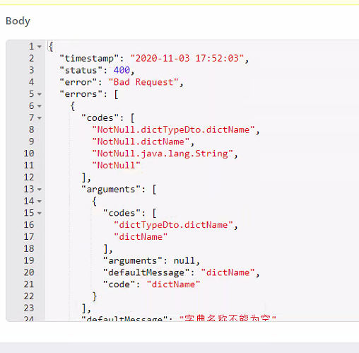
  - 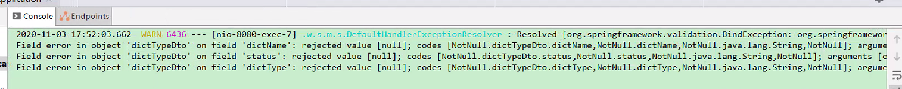
  - 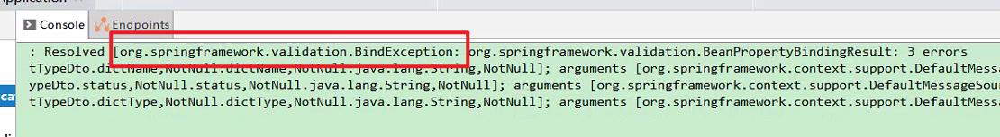

- 从控制台中可以看到，因为校验出错报的信息就是BindException异常

- 添加BindException异常处理方法

  - 代码

    ~~~java
    package com.fclever.config.exception;
    
    import com.fclever.vo.AjaxResult;
    import org.springframework.validation.BindException;
    import org.springframework.validation.BindingResult;
    import org.springframework.validation.FieldError;
    import org.springframework.validation.ObjectError;
    import org.springframework.web.bind.MethodArgumentNotValidException;
    import org.springframework.web.bind.annotation.ExceptionHandler;
    import org.springframework.web.bind.annotation.RestControllerAdvice;
    
    import java.util.ArrayList;
    import java.util.HashMap;
    import java.util.List;
    import java.util.Map;
    
    
    /**
     * 全局异常处理
     * @author Fclever
     * @create 2020-10-27 13:54
     */
    @RestControllerAdvice // Rest会以JSON的形式返回数据
    public class GlobalExceptionHandler {
    
        /**
         * 方法参数无效异常---如果页面传参是json对象，当json对象为空时能触发
         * 当系统出现MethodArgumentNotValidException这个异常时，会调用下面的方法
         * @param e
         * @return
         */
        @ExceptionHandler(value = MethodArgumentNotValidException.class)
        public AjaxResult jsonErrorHandler(MethodArgumentNotValidException e){
            return getAjaxResult(e.getBindingResult());
        }
    
        /**
         *
         * 当系统出现BindException这个异常时，会调用下面的方法
         * @param e
         * @return
         */
        @ExceptionHandler(value = BindException.class)
        public AjaxResult jsonErrorHandler(BindException e){
            return getAjaxResult(e.getBindingResult());
        }
    
        /**
         * 抽取公共模块
         * @param bindingResult
         * @return
         */
        private AjaxResult getAjaxResult(BindingResult bindingResult) {
            List<Map<String, Object>> list = new ArrayList<>();
            List<ObjectError> allErrors = bindingResult.getAllErrors();
            for (ObjectError allError : allErrors) {
                Map<String, Object> map = new HashMap<>();
                map.put("defaultMessage", allError.getDefaultMessage());
                map.put("objectName", allError.getObjectName());
                // 转换类型，获取属性 FieldError extends ObjectError
                // field属性需要从FieldError获取
                FieldError fieldError = (FieldError) allError;
                map.put("field", fieldError.getField());
                list.add(map);
            }
            return AjaxResult.fail("后端数据校验异常", list);
        }
    }
    
    ~~~

    

  - 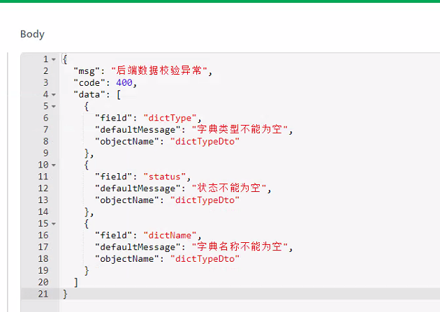

## 前端

### F6：创建src/api/system/dict/type.js

~~~js
import request from '@/utils/request'

// 分页查询字典类型
export function listForPage(query) {
  return request({
    url: '/system/dict/type/listForPage',
    method: 'get',
    params: query
  })
}
// 查询所有字典类型数据
export function selectAllDictType() {
  return request({
    url: '/system/dict/type/selectAllDictType',
    method: 'get'
  })
}
// 添加字典类型
export function addDictType(data) {
  return request({
    url: '/system/dict/type/addDictType',
    method: 'post',
    params: data
  })
}

// 更新字典类型数据
export function updateDictType(data) {
  return request({
    url: '/system/dict/type/updateDictType',
    method: 'put',
    params: data
  })
}
// 批量删除字典类型
export function deleteDictTypeByIds(dictIds) {
  return request({
    url: '/system/dict/type/deleteDictTypeByIds/' + dictIds,
    method: 'delete'
  })
}
// 根据字典类型ID查询一个字典信息
export function getDictTypeById(dictId) {
  return request({
    url: '/system/dict/type/getOne/' + dictId,
    method: 'get'
  })
}
// 字典缓存同步
export function dictCacheAsync() {
  return request({
    url: '/system/dict/type/dictCacheAsync',
    method: 'get'
  })
}

~~~

### F7：创建src/api/system/dict/data.js

~~~js
import request from '@/utils/request'

// 分页查询字典数据
export function listForPage(query) {
  return request({
    url: '/system/dict/data/listForPage',
    method: 'get',
    params: query
  })
}
// 添加字典数据
export function addDictData(data) {
  return request({
    url: '/system/dict/data/addDictData',
    method: 'post',
    params: data
  })
}
// 更新字典数据
export function updateDictData(data) {
  return request({
    url: '/system/dict/data/updateDictData',
    method: 'put',
    params: data
  })
}
// 根据字典数据ID批量删除字典数据信息
export function deleteDictDataByIds(dictCodeIds) {
  return request({
    url: '/system/dict/data/deleteDictDataByIds/' + dictCodeIds,
    method: 'delete'
  })
}
// 根据字典数据ID查询字典数据
export function getOne(dictCode) {
  return request({
    url: '/system/dict/data/getOne/' + dictCode,
    method: 'get'
  })
}
// 根据字典类型查询字典信息【公共】
export function getDataByType(dictType) {
  return request({
    url: '/system/dict/data/getDataByType/' + dictType,
    method: 'get'
  })
}

~~~

### F8：修改src/router/index.js

- 修改字典类型的路由跳转
  - 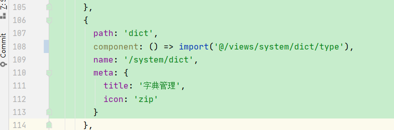

### F9：创建src/utils/hospital-utils.js

- 不同模块中，关于日期的范围查询条件，都需要进行拆分为开始日期和结束日期，但是element-ui会将选择的日期范围存储在一起，因此我们后续处理的时候必须要进行拆分成开始日期和结束日期

- 同时这种情况不仅仅出现在某个模块，会重复出现，因此这里将其封装为工具方法

- 同理，很多页面也需要查询状态的字典数据（正常，停用）

  ~~~js
  // 项目通用方法的封装
  
  /**
   * 重置表单数据
   * @param refName 页面表单对应的ref属性的值
   */
  export function resetForm(refName) {
    if (this.$refs[refName]) {
      this.$refs[refName].resetFields()
    }
  }
  /**
   * 将查询条件中选择的日期范围构造为beginTime和endTime的形式
   * @param params  封装查询条件的对象
   * @param dateRange 选择的日期范围
   * @returns {*} 添加开始时间和结束时间的查询条件
   */
  export function addDateRange(params, dateRange) {
    // params实际为查询条件,该方法只是添加了开始和结束时间的条件
    var search = params
    // 初始化开始时间和结束时间为空
    search.beginTime = ''
    search.endTime = ''
    // 如果查询条件中选择的时间范围不为(null,'',undefined)
    if (dateRange != null && dateRange !== '' && dateRange !== undefined) {
      // 赋值设置
      search.beginTime = this.dateRange[0]
      search.endTime = this.dateRange[1]
    }
    // 将结果返回
    return search
  }
  /**
   * 码表转换
   * @param datas 对应字典类型的全部数据
   * @param value 待转换的码值
   * @returns {string}
   */
  export function transferDictCode(datas, value) {
    var actions = []
    Object.keys(datas).map((key) => {
      if (datas[key].dictValue === value) {
        actions.push(datas[key].dictLabel)
        return false
      }
    })
    return actions.join('')
  }
  
  ~~~

- 因为这个文件封装的通用方法适用于整个项目,这里将其全局挂载一下,这样每个模块调用就方便多了

### F10：修改src/main.js

- 将通用的方法和消息进行挂载,方便后续其他页面中调用

~~~js
import Vue from 'vue'
import Cookies from 'js-cookie'
import 'normalize.css/normalize.css' // 一个可定制的css重置样式集,使浏览器呈现的所有元素，更一致和符合现代标准
import Element from 'element-ui'
import './styles/element-variables.scss'
// import enLang from 'element-ui/lib/locale/lang/en'// 如果使用中文语言包请默认支持，无需额外引入，请删除该依赖
import '@/styles/index.scss' // 全局css样式
import App from './App'
import store from './store' // Vuex
import router from './router' // 路由管理
import './icons' // 图标管理
import './permission' // 权限控制
import './utils/error-log' // 错误日志
import * as filters from './filters' // 全局过滤器

import { resetForm, addDateRange, transferDictCode } from '@/utils/hospital-uitls' // 通用方法(重置表单,日期范围拆分,码表转换)
import { getDataByType } from '@/api/system/dict/data' // 根据字典类型获取字典数据

// 全局方法挂载(这里挂载了自定义的全局通用方法)
Vue.prototype.resetForm = resetForm
Vue.prototype.addDateRange = addDateRange
Vue.prototype.selectDictLabel = transferDictCode
Vue.prototype.getDataByType = getDataByType // 加载全局的根据字典类型查询字典的方法[基本每个页面都要使用]
// 挂载全局消息框
// 成功消息
Vue.prototype.msgSuccess = function(msg) {
  this.$message({ showClose: true, message: msg, type: 'success' })
}
// 错误信息
Vue.prototype.msgError = function(msg) {
  this.$message({ showClose: true, message: msg, type: 'error' })
}
// 提示信息
Vue.prototype.msgInfo = function(msg) {
  this.$message.info(msg)
}

/**
 * If you don't want to use mock-server
 * you want to use MockJs for mock api
 * you can execute: mockXHR()
 *
 * Currently MockJs will be used in the production environment,
 * please remove it before going online ! ! !
 */
// 使用项目本身提供的模拟数据,后面就用不到了
// if (process.env.NODE_ENV === 'production') {
//   const { mockXHR } = require('../mock')
//   mockXHR()
// }

Vue.use(Element, {
  size: Cookies.get('size') || 'medium', // set element-ui default size
  // locale: enLang // 如果使用中文，无需设置，请删除
})

// register global utility filters
Object.keys(filters).forEach(key => {
  Vue.filter(key, filters[key])
})

Vue.config.productionTip = false

new Vue({
  el: '#app',
  router,
  store,
  render: h => h(App)
})

~~~

### F11：创建src/view/system/dict/type.vue

~~~vue
<!--字典类型页面-->
<template>
  

    <!--查询条件开始-->
    <!--
      ref:
      model:绑定查询条件部分的数据绑定,与queryParams有关,点击查询按钮时,将查询参数传递到后台
      inline:变为行内域
      label-width:设置每个标签的宽度,指定在el-form上时,其直接子标签form-item会继承该值
    -->
    <el-form ref="queryForm" :model="queryParams" :inline="true" label-width="68px">
      <el-form-item label="字典名称" prop="dictName">
        <!--input输入框
          v-model:指定与queryParams中哪个属性进行动态绑定
          placeholder:输入框内默认填充的数据,获得焦点后消失
          clearable:是否可以一键清除
          size:输入框大小,影响内容大小
        -->
        <el-input
          v-model="queryParams.dictName"
          placeholder="请输入字典名称"
          clearable
          size="small"
          style="width:140px"
        />
      </el-form-item>
      <el-form-item label="字典类型" prop="dictType">
        <el-input
          v-model="queryParams.dictType"
          placeholder="请输入字典类型"
          clearable
          size="small"
          style="width:140px"
        />
      </el-form-item>
      <el-form-item label="状态" prop="status">
        <!--select下拉框-->
        <el-select
          v-model="queryParams.status"
          placeholder="字典状态"
          clearable
          size="small"
          style="width:140px"
        >
          <!--下拉框内容,遍历statusOptions属性,这里面保存了查询的状态的码表
            key:唯一标注
            label:标签
            value:实际存储的值
          -->
          <el-option
            v-for="dict in statusOptions"
            :key="dict.dictValue"
            :label="dict.dictLabel"
            :value="dict.dictValue"
          />
        </el-select>
      </el-form-item>
      <el-form-item label="创建时间">
        <!--date-picker:日期选择框
          value-format:日期格式
          type:类型,这里是可以选取范围数据
          range-separator:分隔符,页面显示中会把开始日期和结束日期用该符号分割开
          start-placeholder:第一个空的默认显示内容
          end-placeholder:第二个空的默认显示内容
        -->
        <el-date-picker
          v-model="dateRange"
          size="small"
          style="width:280px"
          value-format="yyyy-MM-dd"
          type="daterange"
          range-separator="-"
          start-placeholder="开始日期"
          end-placeholder="结束日期"
        />
      </el-form-item>
      <el-form-item>
        <!--查询和清空按钮-->
        <el-button type="primary" icon="el-icon-search" size="mini" @click="handleQuery">查询</el-button>
        <el-button type="primary" icon="el-icon-refresh" size="mini" @click="resetQuery">清空</el-button>
      </el-form-item>
    </el-form>
    <!--查询条件结束-->
    <!--操作栏按钮开始-->
    <!--el-row:表示一行数据
      gutter:每一栏之间的间隔
    -->
    <el-row :gutter="10" style="margin-bottom: 8px;">
      <!--el-col:表示一列
        span:指定该列所占的宽度,最大指定为24
      -->
      <el-col :span="1.5">
        <!--新增按钮:尺寸mini-->
        <el-button type="primary" icon="el-icon-plus" size="mini" @click="handleAdd">新增</el-button>
      </el-col>
      <el-col :span="1.5">
        <!--修改按钮:只有在选中一条记录的时候,才会处于可用状态-->
        <el-button type="success" icon="el-icon-edit" size="mini" :disabled="!single" @click="handleUpdate">修改</el-button>
      </el-col>
      <el-col :span="1.5">
        <!--删除按钮,只要有选中数据就可用,不管一条还是多条-->
        <el-button type="danger" icon="el-icon-delete" size="mini" :disabled="!multiple" @click="handleDelete">批量删除</el-button>
      </el-col>
      <el-col :span="1.5">
        <!--同步缓存按钮-->
        <el-button type="warning" icon="el-icon-refresh" size="mini" @click="handleCacheAsync">同步最新数据到缓存</el-button>
      </el-col>
    </el-row>
    <!--操作栏按钮结束-->
    <!--数据列表开始-->
    <!--el-table:数据列表
      v-loading:v-loading在接口未请求到数据之前，显示加载中，直到请求到数据后消失
      border:表示有边框
      data:数据列表中显示的数据从哪获取
      @selection-change:当选择项发生变化时会触发该事件
    -->
    <el-table v-loading="loading" border :data="dictTypeTableList" @selection-change="handleSelectionChnage">
      <!--el-table-column:每一行中的每一列
        prop:对应从:data中取出的数据
        align:对齐方式
        label:列名
        show-overflow-tooltip:默认情况下数据过长不够显示的时候是换行显示,如果需要单行显示,可以使用这个,并且当鼠标移动到此处时会显示实际内容的提示信息
      -->
      <el-table-column type="selection" width="55" align="center" />
      <el-table-column label="字典编号" prop="dictId" align="center" />
      <el-table-column label="字典名称" prop="dictName" align="center" :show-overflow-tooltip="true" />
      <el-table-column label="字典类型" prop="dictType" align="center" :show-overflow-tooltip="true">
        <!--字典类型  slot-scope="scope" 来取得作用域插槽:data绑定的数据-->
        <!--        <template slot-scope="scope">-->
        <!--          &lt;!&ndash;动态绑定字典类型点击时所触发的操作,跳转路由,并携带该条数据的编号&ndash;&gt;-->
        <!--          <router-link :to="'/dict/data/' + scope.row.dictId" class="link-type">-->
        <!--            {{ scope.row.dictType }}-->
        <!--          </router-link>-->
        <!--        </template>-->
      </el-table-column>
      <!--formatter:用于按照指定要求来格式化此处需要显示的值,显示在列表中的数据是经过statusFormatter处理后的内容-->
      <el-table-column label="状态" prop="status" align="center" :formatter="statusFormatter" />
      <el-table-column label="备注" prop="remark" align="center" :show-overflow-tooltip="true" />
      <el-table-column label="创建时间" prop="createTime" align="center" width="180" />
      <el-table-column label="操作" align="center">
        <!--slot-scope="scope" 取到当前单元格-->
        <template slot-scope="scope">
          <!--传递该条数据到具体处理方法中-->
          <el-button type="text" icon="el-icon-edit" size="mini" @click="handleUpdate(scope.row)">修改</el-button>
          <el-button type="text" icon="el-icon-delete" size="mini" @click="handleDelete(scope.row)">删除</el-button>
        </template>
      </el-table-column>
    </el-table>
    <!--数据列表结束-->
    <!--底部分页开始-->
    <!--pagination:分页控件
      v-show:控制是否显示分页控件的条件,当数据列表中数据不为空才显示
      current-page:当前显示第几页
      page-sizes:可选的每页显示条数
      page-size:默认每页显示条数
      layout:设置分页格式:总数,每页条数,前一页,当前页,下一页,跳转至某一页
      total:总数
      @size-change:改变每页显示条数后触发方法
      @current-change:当前页发生改变的时候触发的方法
    -->
    <el-pagination
      v-show="total>0"
      :current-page="queryParams.pageNum"
      :page-sizes="[5, 10, 20, 30]"
      :page-size="queryParams.pageSize"
      layout="total, sizes, prev, pager, next, jumper"
      :total="total"
      @size-change="handleSizeChange"
      @current-change="handleCurrentChange"
    />
    <!--底部分页结束-->
    <!--新增和修改模态框开始-->
    <!--dialog:对话框
      title:模态框标题
      visible.sync:表示是否显示
      center:居中
      append-to-body:如果需要在一个对话框内部嵌套另一个对话框，需要使用append-to-body属性
    -->
    <el-dialog
      :title="title"
      :visible.sync="open"
      width="500px"
      center
      append-to-body
    >
      <!--添加和修改的表单
        rules:做表单数据前端校验
        label-width:标签宽度(文字)
      -->
      <el-form ref="form" :model="form" :rules="rules" label-width="80px">
        <el-form-item label="字典名称" prop="dictName">
          <el-input v-model="form.dictName" placeholder="请输入字典名称" clearable size="small" />
        </el-form-item>
        <el-form-item label="字典类型" prop="dictType">
          <el-input v-model="form.dictType" placeholder="请输入字典类型" clearable size="small" />
        </el-form-item>
        <el-form-item label="状态" prop="status">
          <!--单选框-->
          <el-radio-group v-model="form.status">
            <el-radio
              v-for="dict in statusOptions"
              :key="dict.dictValue"
              :label="dict.dictValue"
              :value="dict.dictValue"
            >{{ dict.dictLabel }}</el-radio>
          </el-radio-group>
        </el-form-item>
        <el-form-item label="备注" prop="remark">
          <el-input v-model="form.remark" type="textarea" placeholder="请输入字典备注" clearable size="small" />
        </el-form-item>
      </el-form>
      
        <el-button type="primary" @click="handleSubmit">保 存</el-button>
        <el-button @click="cancel">取 消</el-button>
      
    </el-dialog>
    <!--新增和修改模态框结束-->
  

</template>

~~~

### F12：修改src/utils/request.js解决后端返回验证错的问题

- 使用《通知》的方式来处理
- 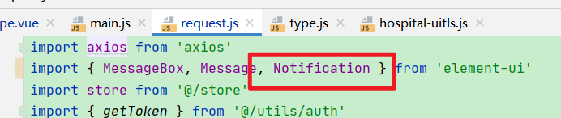
- 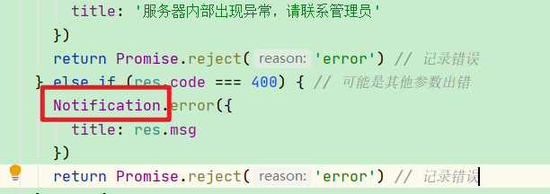

### F13：type.vue修改

~~~vue
handleSubmit() {
      // 打开遮罩
      this.loading = true
      if (this.form.dictId === undefined) {
        // 添加操作
        // 表单前端校验，如果不通过就不会执行后端方法
        this.$refs['form'].validate((valid) => {
          if (valid) { // 通过校验
            // 调用保存字典类型的api，调用引入的api不可以使用this.xxx,因为不是当前页面的方法
            addDictType(this.form).then(res => {
              // 显示保存成功的消息,调用全局消息
              this.msgSuccess('保存成功')
              // 关闭遮罩
              this.loading = false
              // 列表数据重新查询
              this.getDictTypeList()
              // 关闭模态框
              this.open = false
            }).catch(() => {
              // 出现异常的处理方式
              // 已经通过响应拦截器处理了该类型的异常，并显示了提示信息
              // 关闭遮罩
              this.loading = false
            })
          } else {
            this.msgError('数据校验不通过')
            this.loading = false
          }
        })
      } else {
        // 修改操作
        // 表单前端校验，如果不通过就不会执行后端方法
        this.$refs['form'].validate((valid) => {
          if (valid) {
            updateDictType(this.form).then(res => {
              // 显示修改成功的消息,调用全局消息
              this.msgSuccess('修改成功')
              // 关闭遮罩
              this.loading = false
              // 列表数据重新查询
              this.getDictTypeList()
              // 关闭模态框
              this.open = false
            }).catch(() => {
              // 出现异常的处理方式
              // 已经通过响应拦截器处理了该类型的异常，并显示了提示信息
              // 关闭遮罩
              this.loading = false
            })
          } else {
            this.msgError('数据校验不通过')
            this.loading = false
          }
        })
      }
    },
~~~

### F14：效果展示

- 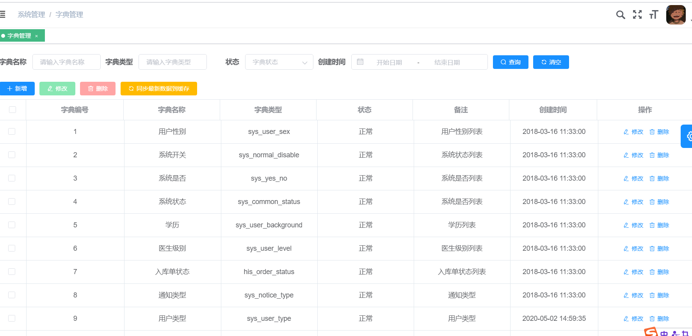

# 字典数据管理

## 后端

### F1：生成字典数据相关代码

- 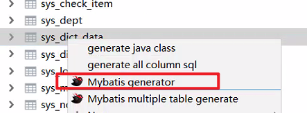
- 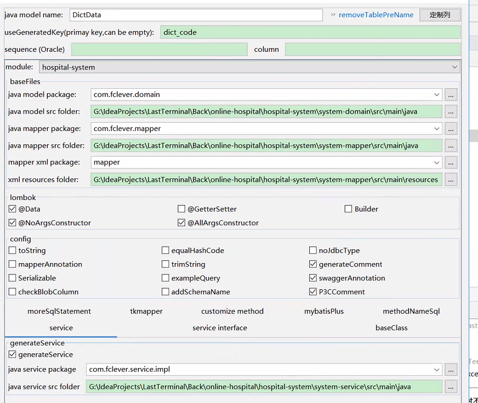
- 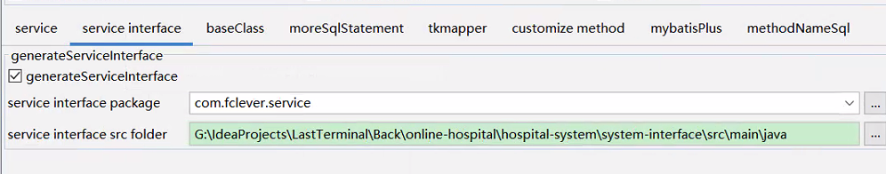

#### F1.1：【system-domain】DictData

#### F1.2：【system-domain】DictDataDto

~~~java
package com.fclever.dto;

import io.swagger.annotations.ApiModel;
import io.swagger.annotations.ApiModelProperty;
import lombok.AllArgsConstructor;
import lombok.Data;
import lombok.EqualsAndHashCode;
import lombok.NoArgsConstructor;

import javax.validation.constraints.NotNull;
import java.util.Date;

/**
 * 字典数据数据传输类
 * @author Fclever
 * @create 2020-11-03 20:35
 */
@ApiModel(value="com-fclever-domain-DictData")
@Data
@EqualsAndHashCode(callSuper=true)
@AllArgsConstructor
@NoArgsConstructor
public class DictDataDto extends BaseDto{

    /**
     * 字典编码
     */
    @ApiModelProperty(value="字典编码")
    private Long dictCode;

    /**
     * 字典排序
     */
    @ApiModelProperty(value="字典排序")
    @NotNull(message = "字典排序不能为空")
    private Integer dictSort;

    /**
     * 字典标签
     */
    @ApiModelProperty(value="字典标签")
    @NotNull(message = "字典标签不能为空")
    private String dictLabel;

    /**
     * 字典键值
     */
    @ApiModelProperty(value="字典键值")
    @NotNull(message = "字典键值不能为空")
    private String dictValue;

    /**
     * 字典类型
     */
    @ApiModelProperty(value="字典类型")
    @NotNull(message = "字典类型不能为空")
    private String dictType;

    /**
     * 状态（0正常 1停用）
     */
    @ApiModelProperty(value="状态（0正常 1停用）")
    @NotNull(message = "状态不能为空")
    private String status;

    /**
     * 备注
     */
    @ApiModelProperty(value="备注")
    private String remark;

    /**
     * 创建者
     */
    @ApiModelProperty(value="创建者")
    private String createBy;

    /**
     * 创建时间
     */
    @ApiModelProperty(value="创建时间")
    private Date createTime;

    /**
     * 更新者
     */
    @ApiModelProperty(value="更新者")
    private String updateBy;

    /**
     * 更新时间
     */
    @ApiModelProperty(value="更新时间")
    private Date updateTime;
}

~~~

#### F1.3：【system-mapper】DictDataMapper

#### F1.4：【system-mapper】DictDataMapper.xml

#### F1.5：【system-interface】DictDataService

~~~java
package com.fclever.service;

import com.fclever.domain.DictData;
import com.baomidou.mybatisplus.extension.service.IService;
import com.fclever.dto.DictDataDto;
import com.fclever.vo.DataGridView;

import java.util.List;

/**
@author Fclever
@create 2020-11-03 20:11
*/
public interface DictDataService{

    /**
     * 分页查询字典数据
     *
     * @param dictDataDto 查询条件
     * @return 分页查询封装对象  total+数据
     */
    DataGridView listPage(DictDataDto dictDataDto);

    /**
     * 插入新的字典数据
     *
     * @param dictDataDto 待插入数据
     * @return 插入成功的标志
     */
    int insert(DictDataDto dictDataDto);

    /**
     * 修改字典数据
     *
     * @param dictDataDto 待修改数据
     * @return  修改成功的标志
     */
    int update(DictDataDto dictDataDto);

    /**
     * 根据ID删除字典数据
     *
     * @param dictCodeIds 待删除的数据集合
     * @return 删除成功的标志
     */
    int deleteDictDataByIds(Long[] dictCodeIds);

    /**
     * 根据字典类型查询字典数据
     *
     * @param dictType 待查询的字典类型
     * @return 查询到的字典数据集合
     */
    List<DictData> selectDictDataByDictType(String dictType);

    /**
     * 根据ID查询一个字典数据
     *
     * @param dictCode 字典数据主键
     * @return 查询到的字典数据
     */
    DictData selectDictDataById(Long dictCode);
}

~~~

#### F1.6：【system-service】DictDataServiceImpl

~~~java
package com.fclever.service.impl;

import cn.hutool.core.bean.BeanUtil;
import cn.hutool.core.date.DateUtil;
import cn.hutool.core.util.StrUtil;
import cn.hutool.json.JSON;
import com.baomidou.mybatisplus.core.conditions.query.QueryWrapper;
import com.baomidou.mybatisplus.core.toolkit.StringUtils;
import com.baomidou.mybatisplus.extension.plugins.pagination.Page;
import com.fclever.constants.Constants;
import com.fclever.dto.DictDataDto;
import com.fclever.vo.DataGridView;
import org.springframework.beans.factory.annotation.Autowired;
import org.springframework.stereotype.Service;
import javax.annotation.Resource;
import java.util.Arrays;
import java.util.List;
import com.baomidou.mybatisplus.extension.service.impl.ServiceImpl;
import com.fclever.domain.DictData;
import com.fclever.mapper.DictDataMapper;
import com.fclever.service.DictDataService;
/**
@author Fclever
@create 2020-11-03 20:11
*/
@Service
public class DictDataServiceImpl implements DictDataService{

    @Autowired
    private DictDataMapper dictDataMapper;

    /**
     * 分页查询字典数据
     * @param dictDataDto 查询条件
     * @return 封装的查询条件
     */
    @Override
    public DataGridView listPage(DictDataDto dictDataDto) {
        // 分页  默认第一页，每页10条记录
        Page<DictData> page=new Page<>(dictDataDto.getPageNum(),dictDataDto.getPageSize());
        // 拼接查询参数
        QueryWrapper<DictData> qw=new QueryWrapper<>();
        // 字典类型相等（页面中字典名称）
        qw.eq(StringUtils.isNotBlank(dictDataDto.getDictType()),DictData.COL_DICT_TYPE,dictDataDto.getDictType());
        // 字典标签模糊查询
        qw.like(StringUtils.isNotBlank(dictDataDto.getDictLabel()),DictData.COL_DICT_LABEL,dictDataDto.getDictLabel());
        // 字典数据状态精确匹配
        qw.eq(StringUtils.isNotBlank(dictDataDto.getStatus()),DictData.COL_STATUS,dictDataDto.getStatus());
        // 执行查询，查询后数据存放于page中
        this.dictDataMapper.selectPage(page,qw);
        // 封装分页数据
        return new DataGridView(page.getTotal(),page.getRecords());
    }

    /**
     * 插入新的字典数据
     *
     * @param dictDataDto 待插入数据
     * @return 插入成功的标志
     */
    @Override
    public int insert(DictDataDto dictDataDto) {
        // 持久化实体对象
        DictData dictData=new DictData();
        // 拷贝数据   源--》目标
        BeanUtil.copyProperties(dictDataDto,dictData);
        //设置创建者名称，创建时间
        dictData.setCreateBy(dictDataDto.getSimpleUser().getUserName());
        dictData.setCreateTime(DateUtil.date());
        // 执行插入操作
        return this.dictDataMapper.insert(dictData);
    }

    /**
     * 根据id修改字典数据
     *
     * @param dictDataDto 待修改数据
     * @return  修改成功的标志
     */
    @Override
    public int update(DictDataDto dictDataDto) {
        // 持久化实体对象
        DictData dictData=new DictData();
        // 拷贝属性  源--》目标
        BeanUtil.copyProperties(dictDataDto,dictData);
        //设置修改人名称
        dictData.setUpdateBy(dictDataDto.getSimpleUser().getUserName());
        // 根据id执行修改操作
        return this.dictDataMapper.updateById(dictData);
    }

    /**
     * 根据ID删除字典数据
     *
     * @param dictCodeIds 待删除的字典数据主键
     * @return 删除成功的标志
     */
    @Override
    public int deleteDictDataByIds(Long[] dictCodeIds) {
        // 数组转化为集合
        List<Long> ids= Arrays.asList(dictCodeIds);
        // 判断不为空并且长度大于0
        if(null != ids && ids.size() > 0){
            // 根据字典id批量删除字典数据
            return this.dictDataMapper.deleteBatchIds(ids);
        }else{
            // 返回-1，表示id为空
            return -1;
        }
    }

    /**
     * 根据字典类型查询字典数据
     *
     * @param dictType 待查询的字典类型
     * @return 查询到的字典数据集合
     */
    @Override
    public List<DictData> selectDictDataByDictType(String dictType) {
        QueryWrapper<DictData> qw = new QueryWrapper<>();
        // 既然根据类型去查，类型肯定不为空
        qw.eq(DictData.COL_DICT_TYPE, dictType);
        // 设置排序
        qw.orderByAsc(DictData.COL_DICT_SORT);
        // 有效  数据
        qw.eq(DictData.COL_STATUS, Constants.STATUS_TRUE);
        return this.dictDataMapper.selectList(qw);
    }

    /**
     * 根据ID查询一个字典数据
     *
     * @param dictCode 字典数据主键
     * @return 查询到的字典数据
     */
    @Override
    public DictData selectDictDataById(Long dictCode) {
        return this.dictDataMapper.selectById(dictCode);
    }
}

~~~

### F2：【system-web】DictDataController

~~~java
package com.fclever.controller.system;

import com.fclever.domain.DictData;
import com.fclever.dto.DictDataDto;
import com.fclever.service.DictDataService;
import com.fclever.utils.ShiroSecurityUtils;
import com.fclever.vo.AjaxResult;
import com.fclever.vo.DataGridView;
import org.springframework.beans.factory.annotation.Autowired;
import org.springframework.validation.annotation.Validated;
import org.springframework.web.bind.annotation.*;

import javax.validation.constraints.NotBlank;
import javax.validation.constraints.NotEmpty;
import javax.validation.constraints.NotNull;
import java.util.List;

/**
 * 字典数据控制器
 * @author Fclever
 * @create 2020-11-04 08:46
 */
@RestController
@RequestMapping("system/dict/data")
public class DictDataController {

    @Autowired
    private DictDataService dictDataService;

    /**
     * 分页查询
     * @param dictDataDto 分页查询参数
     * @return 消息+code+数据+total
     */
    @GetMapping("listForPage")
    public AjaxResult listForPage(DictDataDto dictDataDto){
        DataGridView dataGridView = this.dictDataService.listPage(dictDataDto);
        return AjaxResult.success("分页查询成功", dataGridView.getData(), dataGridView.getTotal());
    }

    /**
     * 添加字典数据
     * @param dictDataDto 待添加字典数据
     * @return 消息+code
     */
    @PostMapping("addDictData")
    public AjaxResult addDictData(@Validated DictDataDto dictDataDto){
        // 设置登录用户信息
        dictDataDto.setSimpleUser(ShiroSecurityUtils.getCurrentSimpleUser());
        // 执行插入操作
        return AjaxResult.toAjax(this.dictDataService.insert(dictDataDto));
    }

    /**
     * 修改字典数据
     * @param dictDataDto 待修改的字典数据
     * @return 消息+code
     */
    @PutMapping("updateDictData")
    public AjaxResult updateDictData(@Validated DictDataDto dictDataDto){
        // 设置登录用户信息
        dictDataDto.setSimpleUser(ShiroSecurityUtils.getCurrentSimpleUser());
        // 执行插入操作
        return AjaxResult.toAjax(this.dictDataService.update(dictDataDto));
    }

    /**
     * 根据id查询一个字典数据
     * @param dictCode 字典主键id
     * @return 消息+code+数据
     */
    @GetMapping("getOne/{dictCode}")
    public AjaxResult getOne(@PathVariable @Validated @NotBlank(message = "字典数据主键ID不能为空")Long dictCode){
        return AjaxResult.success(this.dictDataService.selectDictDataById(dictCode));
    }

    /**
     * 根据id批量删除字典数据
     * @param dictCodeIds 待批量删除的id
     * @return 消息+code
     */
    @DeleteMapping("deleteDictDataByIds/{dictCodeIds}")
    public AjaxResult deleteDictDataByIds(@PathVariable @Validated @NotBlank(message = "删除Id不能为空")Long[] dictCodeIds){
        // 大于0，就表示成功
        return AjaxResult.toAjax(this.dictDataService.deleteDictDataByIds(dictCodeIds));
    }

    /**
     * 根据字典类型查询字典数据
     *
     * @param dictType 待查询的字典类型
     * @return 查询到的字典数据集合
     */
    @GetMapping("getDataByType/{dictType}")
    public AjaxResult getDataByType(@PathVariable @Validated @NotNull(message = "字典类型不能为空") String dictType){
        List<DictData> dictDataList = this.dictDataService.selectDictDataByDictType(dictType);
        return AjaxResult.success("根据字典类型查询数据成功", dictDataList);
    }
}

~~~

### F3：YApi测试

- 测试通过

## 前端

- 在字典类型数据列表中，点击字典类型可以进入到该字典类型的详细数据页面

### F4：创建src/view/system/dict/data.vue

~~~vue
<!--字典数据页面-->
<template>
  

    <!--查询条件开始-->
    <!--
      ref:
      model:绑定查询条件部分的数据绑定,与queryParams有关,点击查询按钮时,将查询参数传递到后台
      inline:变为行内域
      label-width:设置每个标签的宽度,指定在el-form上时,其直接子标签form-item会继承该值
    -->
    <el-form ref="queryForm" :model="queryParams" :inline="true" label-width="68px">
      <el-form-item label="字典类型" prop="dictType">
        <!--input输入框
          v-model:指定与queryParams中哪个属性进行动态绑定
          placeholder:输入框内默认填充的数据,获得焦点后消失
          clearable:是否可以一键清除
          size:输入框大小,影响内容大小
        -->
        <!--select下拉框-->
        <el-select
          v-model="queryParams.dictType"
          placeholder="请选择字典类型"
          clearable
          size="small"
          style="width:140px"
        >
          <!--下拉框内容,遍历dictTypeOptions属性,这里面保存了查询到的所有的字典类型数据
            key:唯一标注
            label:标签
            value:实际存储的值
          -->
          <el-option
            v-for="dict in dictTypeOptions"
            :key="dict.dictType"
            :label="dict.dictName"
            :value="dict.dictType"
          />
        </el-select>
      </el-form-item>
      <el-form-item label="字典标签" prop="dictLabel">
        <el-input
          v-model="queryParams.dictLabel"
          placeholder="请输入字典标签"
          clearable
          size="small"
          style="width:140px"
        />
      </el-form-item>
      <el-form-item label="状态" prop="status">
        <!--select下拉框-->
        <el-select
          v-model="queryParams.status"
          placeholder="字典状态"
          clearable
          size="small"
          style="width:140px"
        >
          <!--下拉框内容,遍历statusOptions属性,这里面保存了查询的状态的码表
            key:唯一标注
            label:标签
            value:实际存储的值
          -->
          <el-option
            v-for="dict in statusOptions"
            :key="dict.dictValue"
            :label="dict.dictLabel"
            :value="dict.dictValue"
          />
        </el-select>
      </el-form-item>
      <el-form-item>
        <!--查询和清空按钮-->
        <el-button type="primary" icon="el-icon-search" size="mini" @click="handleQuery">查询</el-button>
        <el-button type="primary" icon="el-icon-refresh" size="mini" @click="resetQuery">清空</el-button>
      </el-form-item>
    </el-form>
    <!--查询条件结束-->
    <!--操作栏按钮开始-->
    <el-row :gutter="10" style="margin-bottom: 8px;">
      <!--el-col:表示一列
        span:指定该列所占的宽度,最大指定为24
      -->
      <el-col :span="1.5">
        <!--新增按钮:尺寸mini-->
        <el-button type="primary" icon="el-icon-plus" size="mini" @click="handleAdd">新增</el-button>
      </el-col>
      <el-col :span="1.5">
        <!--修改按钮:只有在选中一条记录的时候,才会处于可用状态-->
        <el-button type="success" icon="el-icon-edit" size="mini" :disabled="!single" @click="handleUpdate">修改</el-button>
      </el-col>
      <el-col :span="1.5">
        <!--删除按钮,只要有选中数据就可用,不管一条还是多条-->
        <el-button type="danger" icon="el-icon-delete" size="mini" :disabled="!multiple" @click="handleDelete">批量删除</el-button>
      </el-col>
    </el-row>
    <!--操作栏按钮结束-->
    <!--数据列表开始-->
    <el-table v-loading="loading" border :data="dictDataTableList" @selection-change="handleSelectionChnage">
      <!--el-table-column:每一行中的每一列
        prop:对应从:data中取出的数据
        align:对齐方式
        label:列名
        show-overflow-tooltip:默认情况下数据过长不够显示的时候是换行显示,如果需要单行显示,可以使用这个,并且当鼠标移动到此处时会显示实际内容的提示信息
      -->
      <el-table-column type="selection" width="55" align="center" />
      <el-table-column label="字典编码" prop="dictCode" align="center" />
      <el-table-column label="字典标签" prop="dictLabel" align="center" />
      <el-table-column label="字典键值" prop="dictValue" align="center" />
      <el-table-column label="字典排序" prop="dictSort" align="center" />
      <!--formatter:用于按照指定要求来格式化此处需要显示的值,显示在列表中的数据是经过statusFormatter处理后的内容-->
      <el-table-column label="状态" prop="status" align="center" :formatter="statusFormatter" />
      <el-table-column label="备注" prop="remark" align="center" :show-overflow-tooltip="true" />
      <el-table-column label="创建时间" prop="createTime" align="center" width="180" />
      <el-table-column label="操作" align="center">
        <!--字典类型  slot-scope="scope" 来取得作用域插槽:data绑定的数据-->
        <template slot-scope="scope">
          <!--传递该条数据到具体处理方法中-->
          <el-button type="text" icon="el-icon-edit" size="mini" @click="handleUpdate(scope.row)">修改</el-button>
          <el-button type="text" icon="el-icon-delete" size="mini" @click="handleDelete(scope.row)">删除</el-button>
        </template>
      </el-table-column>
    </el-table>
    <!--数据列表结束-->
    <!--分页控件开始-->
    <el-pagination
      v-show="total>0"
      :current-page="queryParams.pageNum"
      :page-sizes="[5, 10, 20, 30]"
      :page-size="queryParams.pageSize"
      layout="total, sizes, prev, pager, next, jumper"
      :total="total"
      @size-change="handleSizeChange"
      @current-change="handleCurrentChange"
    />
    <!--分页控件结束-->
    <!--新增和修改模态框开始-->
    <el-dialog
      :title="title"
      :visible.sync="open"
      width="500px"
      center
      append-to-body
    >
      <el-form ref="form" :model="form" :rules="rules" label-width="80px">
        <el-form-item label="字典类型" prop="dictType">
          <el-input v-model="form.dictType" :disabled="true" size="small" />
        </el-form-item>
        <el-form-item label="数据标签" prop="dictLabel">
          <el-input v-model="form.dictLabel" placeholder="请输入数据标签" clearable size="small" />
        </el-form-item>
        <el-form-item label="数据键值" prop="dictValue">
          <el-input v-model="form.dictValue" placeholder="请输入数据键值" clearable size="small" />
        </el-form-item>
        <el-form-item label="排序显示" prop="dictSort">
          <!--el-input-number
              计数器 这里设置了最小为0，低于0之后无法减少
              步进为1
          -->
          <el-input-number v-model="form.dictSort" placeholder="请输入数据键值" clearable size="small" :min="0" />
        </el-form-item>
        <el-form-item label="状态" prop="status">
          <el-radio-group v-model="form.status">
            <el-radio
              v-for="dict in statusOptions"
              :key="dict.dictValue"
              :label="dict.dictValue"
              :value="dict.dictValue"
            >{{ dict.dictLabel }}</el-radio>
          </el-radio-group>
        </el-form-item>
        <el-form-item label="备注" prop="remark">
          <el-input v-model="form.remark" type="textarea" placeholder="请输入字典备注" clearable size="small" />
        </el-form-item>
      </el-form>
      
        <el-button type="primary" @click="handleSubmit">确 定</el-button>
        <el-button @click="cancel">取 消</el-button>
      
    </el-dialog>
    <!--新增和修改模态框结束-->
  

</template>

~~~

### F5：修改src/view/system/dict/type.vue的数据列表

- 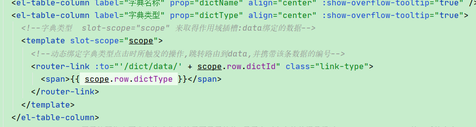

### F6：修改src/router/index.js

- 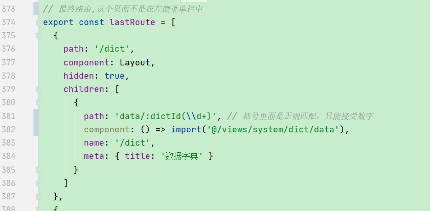

### F7：解决数据多了一层data问题

# 字典缓存处理

- 数据字典在其他系统管理其他菜单下也会经常用到，比如状态啥的，之前的方式都是通过DictDataServiceImpl中的selectDictDataByDictTypeMapper方法来从数据库根据字典类型来进行查询，对数据库操作很频繁
- 让其他菜单模块的使用的字典数据从缓存中查询，可以在字典管理中，增设一个《同步缓存》按钮，把最新的字典数据更新到缓存中，然后点击后其他菜单模块的内容就是最新的了

## 后端

### F1：【hospital-system】修改pom.xml（添加内容）

~~~xml
<!--redis依赖-->
        <dependency>
            <groupId>org.springframework.boot</groupId>
            <artifactId>spring-boot-starter-data-redis</artifactId>
        </dependency>
~~~

### F2：【system-web】修改DictTypeController

~~~java
/**
     * 同步字典数据到缓存（包括字典类型+对应类型数据），如果缓存原来有内容，则直接覆盖
     * @return
             */
    @GetMapping("dictCacheAsync")
    public AjaxResult dictCacheAsync(){
        try{
            this.dictTypeService.dictCacheAsync();
            return AjaxResult.success();
        }catch (Exception e){
            e.printStackTrace();
            // 出现异常则返回错误信息
            return AjaxResult.error();
        }
    }
~~~

### F3：【system-interface】修改DictTypeService

~~~java
/**
         * 同步字典类型数据+字典数据到缓存，其他菜单模块查询字典数据直接从缓存获取
         */
        void dictCacheAsync();
~~~

### F4：【hospital-commons】修改Constant

~~~java
/**
     * redis的字典前缀
     */
    public static final String DICT_REDIS_PROFIX="dict:";
~~~

### F5：【system-service】修改DictTypeServiceImpl

~~~java
/**
     * 同步字典类型数据+字典数据到缓存，其他菜单模块查询字典数据直接从缓存获取
     * 1. 先查询出所有可用的字典数据
     * 2. 再根据字典的类型查询对应类型的字典数据
     * 3. 把整个字典数据生成json，保存到redis中
     * 保存到Redis中key的形式
     *  dict:dictType
     * 保存到Redis中value形式
     *  对应字典类型的所有字典数据的数组，数组内容单条数据为一条对象
     * 实际形式：dict:sys_user_sex   --->  [{},{},{}]
     *
     */
    @Override
    public void dictCacheAsync() {
        // 封装查询结果
        QueryWrapper<DictType> qwType = new QueryWrapper<>();
        // 状态为可用
        qwType.eq(DictType.COL_STATUS, Constants.STATUS_TRUE);
        // 执行查询保存结果
        List<DictType> dictTypeList = this.dictTypeMapper.selectList(qwType);
        for (DictType dictType : dictTypeList) {
            // 根据字典类型查询对应的字典数据
            QueryWrapper<DictData> qwData = new QueryWrapper<>();
            // 类型匹配
            qwData.eq(DictData.COL_DICT_TYPE, dictType.getDictType());
            // 并且为可用状态的字典数据
            qwData.eq(DictData.COL_STATUS, dictType.getStatus());
            qwData.orderByAsc(DictData.COL_DICT_SORT);
            // 执行查询，并接收List集合
            List<DictData> dictDataList = dictDataMapper.selectList(qwData);
            // 转成json
            String json = JSON.toJSONString(dictDataList);
            // 保存内容(Reids保存格式）
            ValueOperations<String, String> opsForValue = redisTemplate.opsForValue();
            opsForValue.set(Constants.DICT_REDIS_PROFIX+dictType.getDictType(), json);

        }
    }
~~~

### F6：【system-service】修改DictDataServiceImpl

~~~java
/**
     * 根据字典类型查询字典数据
     *
     * @param dictType 待查询的字典类型
     * @return 查询到的字典数据集合
     */
    @Override
    public List<DictData> selectDictDataByDictType(String dictType) {
        // 之前是从数据库里面根据字典类型来获取对应的字典数据，现在在字典类型实现类中进行了缓存同步，就直接根据key从缓存中获取就可以了
//        QueryWrapper<DictData> qw = new QueryWrapper<>();
//        // 既然根据类型去查，类型肯定不为空
//        qw.eq(DictData.COL_DICT_TYPE, dictType);
//        // 设置排序
//        qw.orderByAsc(DictData.COL_DICT_SORT);
//        // 有效  数据
//        qw.eq(DictData.COL_STATUS, Constants.STATUS_TRUE);
//        return this.dictDataMapper.selectList(qw);
        // 设置从Redis中获取的前缀
        String key = Constants.DICT_REDIS_PROFIX + dictType;
        ValueOperations<String, String> opsForValue = redisTemplate.opsForValue();
        // 根据key获取json值对象
        String json = opsForValue.get(key);
        // 将JSON对象转换为数组对象，根据DictData实体类进行解析
        List<DictData> dictDataList = JSON.parseArray(json, DictData.class);
        return dictDataList;
    }
~~~

### F7：YApi测试

- 使用RedisDesktopManager工具测试
  - 192.168.125.20:6390   root
  - 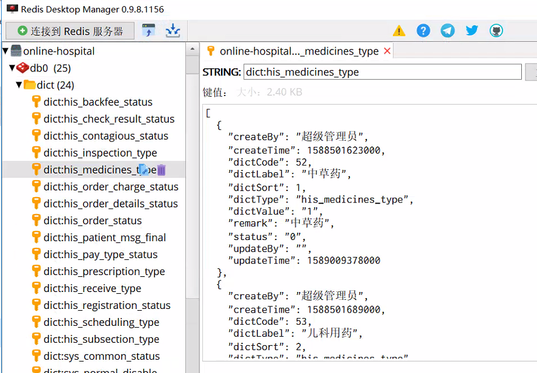

# 操作日志管理

- 记录用户使用该系统的所有操作，登录，增删改查，访问等等
- 切面的概念和应用，对控制层方法植入切面，对于方法执行的成功和失败都通过切面来记录

## 后端

### F1：生成操作日志相关代码

- 对应表：sys_operation_log
- 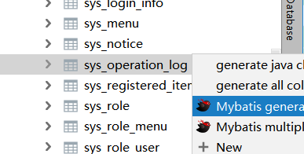
- 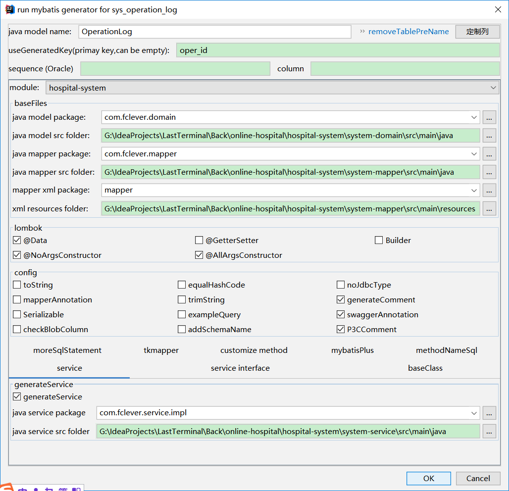

#### F1.1：【system-domain】OperationLog

#### F1.2：【system-domain】OperationLogDto

~~~java
package com.fclever.dto;

import com.baomidou.mybatisplus.annotation.IdType;
import com.baomidou.mybatisplus.annotation.TableField;
import com.baomidou.mybatisplus.annotation.TableId;
import com.baomidou.mybatisplus.annotation.TableName;
import com.fclever.domain.BaseEntity;
import io.swagger.annotations.ApiModel;
import io.swagger.annotations.ApiModelProperty;
import lombok.AllArgsConstructor;
import lombok.Data;
import lombok.EqualsAndHashCode;
import lombok.NoArgsConstructor;

import java.util.Date;

/**
@author Fclever
@create 2020-11-16 08:32
*/

/**
    * 操作日志记录
    */
@ApiModel(value="com-fclever-domain-OperationLog")
@Data
@EqualsAndHashCode(callSuper=true)
@AllArgsConstructor
@NoArgsConstructor
public class OperationLogDto extends BaseDto {

    /**
     * 模块标题
     */
    @TableField(value = "title")
    private String title;

    /**
     * 业务类型（0其它 1新增 2修改 3删除）
     */
    @TableField(value = "business_type")
    private String businessType;

    /**
     * 操作人员
     */
    @TableField(value = "oper_name")
    private String operName;

    /**
     * 操作状态（0正常 1异常）
     */
    @TableField(value = "status")
    private String status;
}
~~~

#### F1.3：【system-mapper】OperationLogMapper

#### F1.4：【system-mapper】OperationLogMapper.xml

#### F1.5：【system-interface】OperationLogService

~~~java
package com.fclever.service;

import com.fclever.domain.OperationLog;
import com.baomidou.mybatisplus.extension.service.IService;
import com.fclever.dto.OperationLogDto;
import com.fclever.vo.DataGridView;

/**
@author Fclever
@create 2020-11-16 08:32
*/
public interface OperationLogService{

    /**
     * 插入操作日志
     * @param operationLog 待插入的实体类
     */
    void insertOperationLog(OperationLog operationLog);

    /**
     * 分页查询操作日志
     * @param operationLogDto 查询条件
     * @return 分页数据
     */
    DataGridView listForPage(OperationLogDto operationLogDto);

    /**
     * 根据id删除操作日志（含批量）
     * @param operationIds
     * @return 是否操作成功的标志
     */
    int deleteOperationLogsByIds(Long[] operationIds);

    /**
     * 清空所有的操作日志
     * @return 是否操作成功的标志
     */
    int clearAllOperationLog();

}

~~~

#### F1.6：【system-service】OperationLogServiceImpl

~~~java
package com.fclever.service.impl;

import com.baomidou.mybatisplus.core.conditions.query.QueryWrapper;
import com.baomidou.mybatisplus.core.toolkit.StringUtils;
import com.baomidou.mybatisplus.extension.plugins.pagination.Page;
import com.fclever.dto.OperationLogDto;
import com.fclever.vo.DataGridView;
import org.springframework.beans.factory.annotation.Autowired;
import org.springframework.stereotype.Service;
import java.util.Arrays;
import java.util.List;
import com.fclever.domain.OperationLog;
import com.fclever.mapper.OperationLogMapper;
import com.fclever.service.OperationLogService;
/**
@author Fclever
@create 2020-11-16 08:32
*/
@Service
public class OperationLogServiceImpl implements OperationLogService{

    @Autowired
    private OperationLogMapper operationLogMapper;

    /**
     * 插入操作日志
     * @param operationLog 待插入的实体类
     */
    @Override
    public void insertOperationLog(OperationLog operationLog) {
        operationLogMapper.insert(operationLog);
    }

    /**
     * 分页查询操作日志
     * @param operationLogDto 查询条件
     * @return 分页数据
     */
    @Override
    public DataGridView listForPage(OperationLogDto operationLogDto) {
        // 分页对象
        Page<OperationLog> page = new Page<>(operationLogDto.getPageNum(), operationLogDto.getPageSize());
        // 查询条件对象
        QueryWrapper<OperationLog> qw = new QueryWrapper<>();
        // 封装查询条件
        // 模糊查询操作人员名称
        qw.like(StringUtils.isNotBlank(operationLogDto.getOperName()), OperationLog.COL_OPER_NAME, operationLogDto.getOperName());
        // 模糊查询模块标题
        qw.like(StringUtils.isNotBlank(operationLogDto.getTitle()), OperationLog.COL_TITLE, operationLogDto.getTitle());
        // 精确匹配业务类型   增删改  其他
        qw.eq(StringUtils.isNotBlank(operationLogDto.getBusinessType()), OperationLog.COL_BUSINESS_TYPE, operationLogDto.getBusinessType());
        // 精确匹配 操作状态  异常和正常
        qw.eq(StringUtils.isNotBlank(operationLogDto.getStatus()), OperationLog.COL_STATUS, operationLogDto.getStatus());
        // 范围匹配  开始时间《= 操作时间 《= 结束时间
        qw.ge(null != operationLogDto.getBeginTime(), OperationLog.COL_OPER_TIME, operationLogDto.getBeginTime());
        qw.le(null != operationLogDto.getEndTime(), OperationLog.COL_OPER_TIME, operationLogDto.getEndTime());
        // 根据操作时间降序排序
        qw.orderByDesc(OperationLog.COL_OPER_TIME);
        // 执行查询
        this.operationLogMapper.selectPage(page, qw);
        // 返回数据
        return new DataGridView(page.getTotal(), page.getRecords());
    }

    /**
     * 根据id删除操作日志（含批量）
     * @param operationIds
     * @return 是否操作成功的标志 0 失败，>0成功
     */
    @Override
    public int deleteOperationLogsByIds(Long[] operationIds) {
        if (null != operationIds && operationIds.length > 0){
            // 封装id数组为集合对象
            List<Long> ids = Arrays.asList(operationIds);
            // 执行批量删除方法
            return operationLogMapper.deleteBatchIds(ids);
        }
        return 0;
    }

    /**
     * 清空所有的操作日志
     * @return 是否操作成功的标志
     */
    @Override
    public int clearAllOperationLog() {
        // 执行删除操作，不传递条件表示为全删除
        return operationLogMapper.delete(null);
    }
}

~~~

### F2：编写操作切面相关代码

#### F2.1：【hospital-commons】创建Log注解

~~~java
package com.fclever.aspectj.annotation;

import com.fclever.aspectj.enums.BusinessType;
import com.fclever.aspectj.enums.OperatorType;

import java.lang.annotation.*;

/**
 * 自定义操作日志注解
 *      修饰注解的注解---元注解
 *      @Target 声明该注解的作用范围，这里只能作用在参数和方法上
 *      @Retention  声明该注解不仅被保存到class文件中，jvm加载class文件之后，仍然存在
 *      @Documented 声明该注解会被javadoc工具记录
 * @author Fclever
 * @create 2020-11-16 12:23
 */
@Target({ ElementType.PARAMETER,ElementType.METHOD})
@Retention(RetentionPolicy.RUNTIME)
@Documented
public @interface Log {

    /**
     * 模块
     *      默认为“”
     */
    public String title() default "";

    /**
     * 业务类型  增删改  其他
     *      默认为其他
     */
    public BusinessType businessType() default BusinessType.OTHER;

    /**
     * 操作人类别
     *      默认为后台用户
     */
    public OperatorType operatorType() default OperatorType.MANAGE;

    /**
     * 是否保存请求的参数
     *      默认保存
     */
    public boolean isSaveRequestData() default true;
}

~~~

#### F2.2：【hospital-commons】创建OperatorStatus注解

~~~java
package com.fclever.aspectj.enums;

/**
 * 操作状态
 * @author Fclever
 * @create 2020-11-16 13:12
 */
public enum OperatorStatus {

    /**
     * 成功
     */
    SUCCESS,

    /**
     * 失败
     */
    FAIL
}

~~~

#### F2.3：【hospital-commons】创建BusinessType注解

~~~java
package com.fclever.aspectj.enums;

/**
 * 业务类型枚举类
 *      增删改和其他
 * @author Fclever
 * @create 2020-11-16 12:28
 */
public enum BusinessType {

    /**
     * 其它
     */
    OTHER,

    /**
     * 新增
     */
    INSERT,

    /**
     * 修改
     */
    UPDATE,

    /**
     * 删除
     */
    DELETE,

    /**
     * 授权
     */
    GRANT,

    /**
     * 导出
     */
    EXPORT,

    /**
     * 导入
     */
    IMPORT,

    /**
     * 强退
     */
    FORCE,

    /**
     * 生成代码
     */
    GENCODE,

    /**
     * 清空数据
     */
    CLEAN
}

~~~

#### F2.4：【hospital-commons】创建OperationType注解

~~~java
package com.fclever.aspectj.enums;

/**
 * 操作用户类型
 *      PC端（网页后端）|手机端|其他
 * @author Fclever
 * @create 2020-11-16 12:29
 */
public enum OperatorType {

    /**
     * 其它
     */
    OTHER,

    /**
     * 后台用户
     */
    MANAGE,

    /**
     * 手机端用户
     */
    MOBILE
}

~~~

#### F2.5：【system-web】创建ServletUtils工具类

- 辅助获取请求参数

~~~java
package com.fclever.utils;

import org.springframework.web.context.request.RequestAttributes;
import org.springframework.web.context.request.RequestContextHolder;
import org.springframework.web.context.request.ServletRequestAttributes;

import javax.servlet.http.HttpServletRequest;
import javax.servlet.http.HttpServletResponse;

/**
 * 请求相关工具类
 *      获取请求request，响应response，请求参数requestAttribute
 * @author Fclever
 * @create 2020-11-16 14:11
 */
public class ServletUtils {

    /**
     * ServletRequestAttributes获取
     * @return ServletRequestAttributes
     */
    public static ServletRequestAttributes getRequestAttributes(){
        RequestAttributes requestAttributes = RequestContextHolder.getRequestAttributes();
        return (ServletRequestAttributes)requestAttributes;
    }

    /**
     * 获取Request对象
     * @return Request对象
     */
    public static HttpServletRequest getRequest(){
        return getRequestAttributes().getRequest();
    }

    /**
     * 获取Response对象
     * @return Response对象
     */
    public static HttpServletResponse getResponse(){
        return getRequestAttributes().getResponse();
    }
}

~~~

#### F2.6：【system-web】创建OperationLogAspect切面类用来记录操作日志

~~~java
package com.fclever.aspectj;

import cn.hutool.core.date.DateUtil;
import com.alibaba.fastjson.JSON;
import com.fclever.aspectj.annotation.Log;
import com.fclever.aspectj.enums.OperatorStatus;
import com.fclever.domain.OperationLog;
import com.fclever.domain.User;
import com.fclever.service.OperationLogService;
import com.fclever.utils.AddressUtils;
import com.fclever.utils.IpUtils;
import com.fclever.utils.ServletUtils;
import com.fclever.utils.ShiroSecurityUtils;
import lombok.extern.log4j.Log4j2;
import org.apache.commons.lang3.StringUtils;
import org.aspectj.lang.JoinPoint;
import org.aspectj.lang.Signature;
import org.aspectj.lang.annotation.AfterReturning;
import org.aspectj.lang.annotation.AfterThrowing;
import org.aspectj.lang.annotation.Aspect;
import org.aspectj.lang.annotation.Pointcut;
import org.aspectj.lang.reflect.MethodSignature;
import org.springframework.beans.factory.annotation.Autowired;
import org.springframework.http.HttpMethod;
import org.springframework.stereotype.Component;
import org.springframework.web.multipart.MultipartFile;
import org.springframework.web.servlet.HandlerMapping;

import javax.servlet.http.HttpServletRequest;
import javax.servlet.http.HttpServletResponse;
import java.lang.reflect.Method;
import java.util.Map;

/**
 * 系统操作日志切面类
 *      @Component:注册为组件交给SpringIOC管理
 *      @Aspect 声明为切面
 *      @Log4j2 日志记录
 * @author Fclever
 * @create 2020-11-16 14:33
 */
@Component
@Aspect
@Log4j2
public class OperationLogAspect {

    // 保存日志的接口
    @Autowired
    private OperationLogService operationLogService;

    /**
     * 声明切面的切入点----一方法的形式，后面使用该切点的时候直接使用方法名即可
     *      指定只要Controller中使用了@Log注解的方法都需要使用切入
     */
    @Pointcut("@annotation(com.fclever.aspectj.annotation.Log)")
    public void logPointCut(){}

    /**
     * 后置通知
     *      正常处理完请求后执行
     *      pointcut：指定匹配的切点
     *      returning：获取m目标方法的返回值
     * @param joinPoint 匹配的切点
     * @param jsonResult    目标方法的返回值（该项目为json类型）
     */
    @AfterReturning(pointcut = "logPointCut()", returning = "jsonResult")
    public void doAfterReturning(JoinPoint joinPoint, Object jsonResult) {
        // 调用处理日志的方法
        handleLog(joinPoint, null, jsonResult);
    }

    /**
     * 异常通知
     *      目标方法出现异常时执行
     * @param joinPoint 切点
     * @param e 目标方法抛出的异常
     */
    @AfterThrowing(value = "logPointCut()", throwing = "e")
    public void doAfterThrowing(JoinPoint joinPoint, Exception e) {
        // 调用处理日志的方法
        handleLog(joinPoint, e, null);
    }

    /**
     * 处理日志，并保存到数据库
     * @param joinPoint 匹配的切点
     * @param e 目标方法抛出的异常
     * @param jsonResult    目标方法的返回值（该项目为json类型）
     */
    protected void handleLog(final JoinPoint joinPoint, final Exception e, Object jsonResult) {
        try {
            // 根据切入点表达式获取注解
            Log annotationLog = getAnnotationLog(joinPoint);
            if (annotationLog == null) {
                return;
            }

            // 获取当前的用户
            User loginUser = ShiroSecurityUtils.getCurrentUser();

            /*---------------操作日志实体对象------------*/
            // 创建操作日志对象
            OperationLog operationLog = new OperationLog();
            // 1. 设置状态   ordinal就是返回枚举对象在枚举类型中的序数 从0开始
            operationLog.setStatus(String.valueOf(OperatorStatus.SUCCESS.ordinal()));
            // 2. 设置本次操作的IP地址  1.202.74.201
            String ip = IpUtils.getIpAddr(ServletUtils.getRequest());
            operationLog.setOperIp(ip);
            // 3. 设置本次操作的真实地址  北京市北京 电信
            String address = AddressUtils.getRealAddressByIP(ip);
            operationLog.setOperLocation(address);
            // 4. 设置请求的返回参数到操作日志对象中
            operationLog.setJsonResult(JSON.toJSONString(jsonResult));
            // 5. 设置请求URL
            operationLog.setOperUrl(ServletUtils.getRequest().getRequestURI());
            // 6. 将登录用户设置为操作人员名称
            if (loginUser != null){
                operationLog.setOperName(loginUser.getUserName());
            }
            // 7. 如果目标方法抛出了异常，设置状态为FAIL，并且设置错误信息
            if (e != null) {
                operationLog.setStatus(String.valueOf(OperatorStatus.FAIL.ordinal()));
                // 数据库保存错误信息的字典长度就是2000
                operationLog.setErrorMsg(StringUtils.substring(e.getMessage(), 0, 2000));
            }
            // 8. 设置操作的方法名称 类名称+类中的方法名
            String className = joinPoint.getTarget().getClass().getName();
            String methodName = joinPoint.getSignature().getName();
            operationLog.setMethod(className + "." + methodName + "()");
            // 9. 设置请求方式
            operationLog.setRequestMethod(ServletUtils.getRequest().getMethod());
            // 10. 处理@Log注解上的参数
            getControllerMethodDescription(joinPoint, annotationLog, operationLog);
            // 11. 设置操作执行时间为当前时间
            operationLog.setOperTime(DateUtil.date());
            // 保存数据库
            operationLogService.insertOperationLog(operationLog);
        } catch (Exception exception) {
            // 记录本地异常日志
            log.error("==前置通知异常==");
            log.error("异常信息:{}", exception.getMessage());
            exception.printStackTrace();
        }
    }

    /**
     * 根据切入点表达式获取对应的注解对象
     * @param joinPoint 切入点表达式
     * @return 切入点表达式对应的注解对象
     */
    private Log getAnnotationLog(JoinPoint joinPoint) {
        Signature signature = joinPoint.getSignature();
        MethodSignature methodSignature = (MethodSignature) signature;
        Method method = methodSignature.getMethod();
        if (method != null) {
            return method.getAnnotation(Log.class);
        }
        return null;
    }

    /**
     * 获取使用了@Log注解的方法的描述信息 用于Controller层注解
     * @param joinPoint 切入点表达式
     * @param controllerLog     @Log注解的实体对象
     * @param operationLog  操作日志实体对象
     */
    private void getControllerMethodDescription(JoinPoint joinPoint, Log controllerLog, OperationLog operationLog) {
        // 设置业务类型   从Controller层方法获取时增删改还是其他，这些信息在Controller中的@Log注解中可以获取到
        operationLog.setBusinessType(String.valueOf(controllerLog.businessType().ordinal()));
        // 设置模块标题
        operationLog.setTitle(controllerLog.title());
        // 设置操作人员类别   后台用户  手机端用户  其他，这些信息在控制层方法上的@Log注解上可以获取
        operationLog.setOperatorType(controllerLog.operatorType().ordinal());
        // 根据Controller层中方法的@Log注解的是否需要保存请求参数的内容，来决定是否保存请求参数到操作日志对象中
        if (controllerLog.isSaveRequestData()) {
            // 获取参数的信息，赋值到操作日志对象中
            setRequestValue(joinPoint, operationLog);
        }
    }

    /**
     * 获取请求的参数，放到操作日志对象中
     * @param joinPoint 切入点
     * @param operationLog  操作日志对象
     */
    private void setRequestValue(JoinPoint joinPoint, OperationLog operationLog) {
        // 获取请求方式post，get，put，delete等
        String requestMethod = operationLog.getRequestMethod();
        // put和post请求
        if (HttpMethod.PUT.name().equals(requestMethod) || HttpMethod.POST.name().equals(requestMethod)) {
            String params = argsArrayToString(joinPoint.getArgs());
            // 设置请求参数
            operationLog.setOperParam(StringUtils.substring(params, 0, 2000));
        } else {
            Map<?, ?> paramsMap = (Map<?, ?>) ServletUtils.getRequest().getAttribute(HandlerMapping.URI_TEMPLATE_VARIABLES_ATTRIBUTE);
            // 设置请求参数
            operationLog.setOperParam(StringUtils.substring(paramsMap.toString(), 0, 2000));
        }
    }

    /**
     * 参数拼装
     * @param paramsArray
     * @return
     */
    private String argsArrayToString(Object[] paramsArray) {
        String params = "";
        if (paramsArray != null && paramsArray.length > 0) {
            for (int i = 0; i < paramsArray.length; i++) {
                if (!isFilterObject(paramsArray[i])) {
                    Object jsonObj = JSON.toJSON(paramsArray[i]);
                    params += jsonObj.toString() + " ";
                }
            }
        }
        return params.trim();
    }
    /**
     * 判断是否需要过滤的对象。
     *
     * @param o 对象信息。
     * @return 如果是需要过滤的对象，则返回true；否则返回false。
     */
    public boolean isFilterObject(final Object o)
    {
        return o instanceof MultipartFile || o instanceof HttpServletRequest
                || o instanceof HttpServletResponse;
    }
}

~~~

- 通过YApi测试一下登录日志记录是否合适
  - 首先在登录的Controller的对应方法上添加一个@Log注解，然后通过YApi执行登录操作，查看对应数据库中sys_operation_log表，看是否可以记录到操作日志
  - 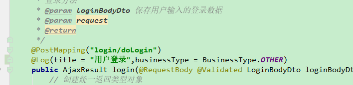
  - 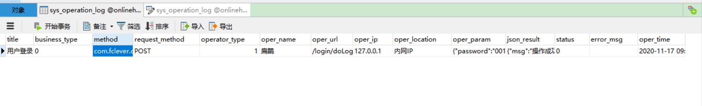
- 后续仅对Controller中的对数据库增删改操作的方法记录日志，因为查询的返回值往往很大，不方便存储

#### F2.7：【system-web】修改LoginController

- 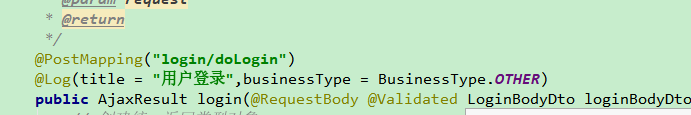
- 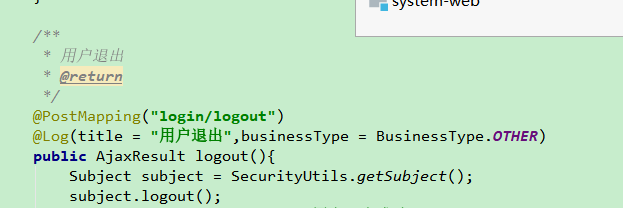

#### F2.8：【system-web】修改DictTypeController

- 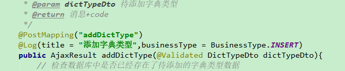
- 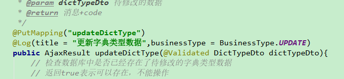
- 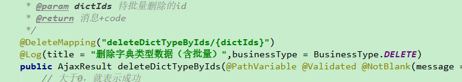

#### F2.9：【system-web】修改DictDataController

- 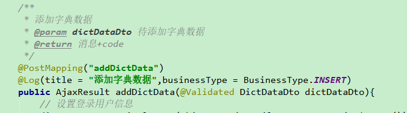
- 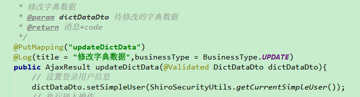
- 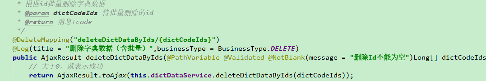

### F3：【system-web】编写接口控制器OperLogController

~~~java
package com.fclever.controller.system;

import com.fclever.dto.OperationLogDto;
import com.fclever.service.OperationLogService;
import com.fclever.vo.AjaxResult;
import com.fclever.vo.DataGridView;
import lombok.extern.log4j.Log4j2;
import org.springframework.beans.factory.annotation.Autowired;
import org.springframework.web.bind.annotation.*;

/**
 * 操作日志管理的控制层
 * @author Fclever
 * @create 2020-11-17 13:22
 */
@RestController
@RequestMapping("system/operationLog")
public class OperationLogController {

    @Autowired
    private OperationLogService operationLogService;

    /**
     * 分页查询操作日志记录
     * @param operLogDto 封装的查询条件
     * @return 查询结果
     */
    @GetMapping("listForPage")
    public AjaxResult listForPage(OperationLogDto operLogDto){
        DataGridView list = operationLogService.listForPage(operLogDto);
        return AjaxResult.success("查询成功",list.getData(),list.getTotal());
    }

    /**
     * 根据id删除对应的操作日志信息（含批量）
     * @param operIds 待删除的id集合
     * @return 删除结果
     */
    @DeleteMapping("deleteOperationLogByIds/{operIds}")
    public AjaxResult deleteOperLogByIds(@PathVariable Long[] operIds){
        return AjaxResult.toAjax(this.operationLogService.deleteOperationLogsByIds(operIds));
    }

    /**
     * 清空操作日志表数据
     * @return 操作结果
     */
    @DeleteMapping("clearAllOperationLog")
    public AjaxResult clearAllOperLog(){
        return AjaxResult.toAjax(this.operationLogService.clearAllOperationLog());
    }
}

~~~

### F4：YApi测试

- 测试通过

## 前端

### F5：创建src/api/system/operator/operationLog.js

~~~js
import request from '@/utils/request'

// 分页查询操作日志信息
export function listForPage(query) {
  return request({
    url: '/system/operationLog/listForPage',
    method: 'get',
    params: query
  })
}

// 根据ID删除操作日志信息
export function deleteOperationLogByIds(ids) {
  return request({
    url: '/system/operationLog/deleteOperationLogByIds/' + ids,
    method: 'delete'
  })
}

// 清空所有操作日志
export function clearAllOperationLog() {
  return request({
    url: '/system/operationLog/clearAllOperationLog',
    method: 'delete'
  })
}

~~~

### F6：创建src/views/system/operationLog/index.vue

~~~vue
<template>
  

    <!-- 查询条件开始 -->
    <el-form ref="queryForm" :model="queryParams" :inline="true" label-width="68px">
      <el-form-item label="模块名称" prop="title">
        <el-input
          v-model="queryParams.title"
          placeholder="请输入模块名称"
          clearable
          size="small"
          style="width:140px"
        />
      </el-form-item>
      <el-form-item label="操作人员" prop="operName">
        <el-input
          v-model="queryParams.operName"
          placeholder="请输入操作人员"
          clearable
          size="small"
          style="width:140px"
        />
      </el-form-item>
      <el-form-item label="操作类型" prop="businessType">
        <el-select
          v-model="queryParams.businessType"
          placeholder="请选择类型"
          clearable
          size="small"
          style="width:140px"
        >
          <el-option
            v-for="dict in businessTypeOptions"
            :key="dict.dictValue"
            :label="dict.dictLabel"
            :value="dict.dictValue"
          />
        </el-select>
      </el-form-item>
      <el-form-item label="状态" prop="status">
        <el-select
          v-model="queryParams.status"
          placeholder="请选择状态"
          clearable
          size="small"
          style="width:140px"
        >
          <el-option
            v-for="dict in statusOptions"
            :key="dict.dictValue"
            :label="dict.dictLabel"
            :value="dict.dictValue"
          />
        </el-select>
      </el-form-item>
      <el-form-item label="创建时间">
        <el-date-picker
          v-model="dateRange"
          size="small"
          style="width:240px"
          value-format="yyyy-MM-dd"
          type="daterange"
          range-separator="-"
          start-placeholde="开始日期"
          end-placeholde="结束日期"
        />
      </el-form-item>
      <el-form-item>
        <el-button type="primary" icon="el-icon-search" size="mini" @click="handleQuery">查询</el-button>
        <el-button type="normal" icon="el-icon-refresh" size="mini" @click="resetQuery">清空</el-button>
      </el-form-item>
    </el-form>
    <!-- 查询条件结束 -->
    <!-- 操作按钮开始 -->
    <el-row :gutter="10" style="margin-bottom: 8px;">
      <el-col :span="1.5">
        <el-button type="danger" icon="el-icon-delete" size="mini" :disabled="multiple" @click="handleDelete">删除</el-button>
      </el-col>
      <el-col :span="1.5">
        <el-button type="warning" icon="el-icon-thumb" size="mini" @click="handleClearInfo">清空所有操作日志</el-button>
      </el-col>
    </el-row>
    <!-- 操作按钮结束 -->
    <!-- 数据列表开始 -->
    <el-table v-loading="loading" border :data="operationLogTableList" @selection-change="handleSelectionChange">
      <el-table-column type="selection" width="55" align="center" />
      <!--当行内容过多并且不想显示横向滚动条时，可以使用 Table 展开行功能-->
      <!--通过设置 type="expand" 和 Scoped slot 可以开启展开行功能-->
      <el-table-column type="expand">
        <template slot-scope="props">
          <el-form label-position="left" inline class="demo-table-expand">
            <el-form-item label="操作模块">
              {{ props.row.title }}
            </el-form-item>
            <el-form-item label="登陆信息">
              <!--操作人名称 // 操作时的IP地址 // 操作时的地址-->
              {{ props.row.operName }} // {{ props.row.operIp }} // {{ props.row.operLocation }}
            </el-form-item>
            <el-form-item label="请求地址">
              {{ props.row.operUrl }}
            </el-form-item>
            <el-form-item label="操作方法">
              {{ props.row.requestMethod }}
            </el-form-item>
            <el-form-item label="请求参数">
              {{ props.row.operParam }}
            </el-form-item>
            <el-form-item label="返回参数">
              {{ props.row.jsonResult }}
            </el-form-item>
            <el-form-item label="操作状态">
              {{ props.row.status==0 ? '成功' : '失败' }}
            </el-form-item>
            <el-form-item label="操作时间">
              {{ props.row.operTime }}
            </el-form-item>
            <el-form-item label="异常信息">
              {{ props.row.errorMsg }}
            </el-form-item>
          </el-form>
        </template>
      </el-table-column>
      <el-table-column label="日志ID" align="center" prop="operId" />
      <el-table-column label="模块名称" align="center" prop="title" />
      <el-table-column label="操作类型" align="center" prop="businessType" :formatter="businessTypeFormatter" />
      <el-table-column label="请求方式" width="180" align="center" prop="requestMethod" />
      <el-table-column label="操作人员名称" align="center" prop="operName" />
      <el-table-column label="主机" align="center" prop="operIp" />
      <el-table-column label="操作地点" align="center" prop="operLocation" />
      <el-table-column label="操作状态" prop="status" align="center" :formatter="statusFormatter" />
      <el-table-column label="操作时间" align="center" prop="operTime" width="200" />
      <el-table-column label="操作" align="center" width="100">
        <template slot-scope="scope">
          <el-button type="text" icon="el-icon-delete" size="mini" @click="handleDelete(scope.row)">删除</el-button>
        </template>
      </el-table-column>
    </el-table>
    <!-- 数据列表结束 -->
    <!-- 分页控件开始 -->
    <el-pagination
      v-show="total>0"
      :current-page="queryParams.pageNum"
      :page-sizes="[5,10,20,30]"
      :page-size="queryParams.pageSize"
      layout="total,sizes,prev,pager,next,jumper"
      :total="total"
      @size-change="handleSizeChange"
      @current-change="handleCurrentChange"
    />
    <!-- 分页控件结束 -->
  

</template>

<!--scoped：表示这个标签的所有样式只会在当前这个组件中生效-->

~~~

### F7：修改src/router/index.js

- 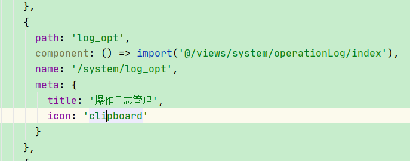

### F8：测试

- 通过
- 

# 登录日志管理

- 功能需求：记录用户登录的相关信息
- 数据库表：sys_login_log
- 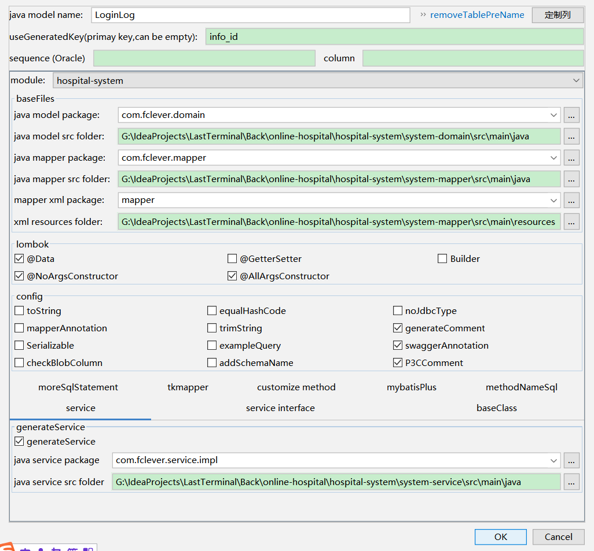

## 后端

### F1：生成登陆日志相关代码

#### F1.1：【system-domain】LoginLog

~~~java
package com.fclever.domain;

import com.baomidou.mybatisplus.annotation.IdType;
import com.baomidou.mybatisplus.annotation.TableField;
import com.baomidou.mybatisplus.annotation.TableId;
import com.baomidou.mybatisplus.annotation.TableName;
import io.swagger.annotations.ApiModel;
import io.swagger.annotations.ApiModelProperty;
import java.util.Date;
import lombok.AllArgsConstructor;
import lombok.Data;
import lombok.EqualsAndHashCode;
import lombok.NoArgsConstructor;

/**
@author Fclever
@create 2020-11-19 08:29
*/
/**
    * 登录日志表
    */
@ApiModel(value="com-fclever-domain-LoginLog")
@Data
@EqualsAndHashCode(callSuper=true)
@AllArgsConstructor
@NoArgsConstructor
@TableName(value = "sys_login_log")
public class LoginLog extends BaseEntity {
    /**
     * 访问ID
     */
    @TableId(value = "info_id", type = IdType.AUTO)
    @ApiModelProperty(value="访问ID")
    private Long infoId;

    /**
     * 用户名称
     */
    @TableField(value = "user_name")
    @ApiModelProperty(value="用户名称")
    private String userName;

    /**
     * 登陆账号
     */
    @TableField(value = "login_account")
    @ApiModelProperty(value="登陆账号")
    private String loginAccount;

    /**
     * 登录IP地址
     */
    @TableField(value = "ip_addr")
    @ApiModelProperty(value="登录IP地址")
    private String ipAddr;

    /**
     * 登录地点
     */
    @TableField(value = "login_location")
    @ApiModelProperty(value="登录地点")
    private String loginLocation;

    /**
     * 浏览器类型
     */
    @TableField(value = "browser")
    @ApiModelProperty(value="浏览器类型")
    private String browser;

    /**
     * 操作系统
     */
    @TableField(value = "os")
    @ApiModelProperty(value="操作系统")
    private String os;

    /**
     * 登录状态（0成功 1失败）字典表
     */
    @TableField(value = "login_status")
    @ApiModelProperty(value="登录状态（0成功 1失败）字典表")
    private String loginStatus;

    /**
     * 登陆类型0系统用户1患者用户 字典表
     */
    @TableField(value = "login_type")
    @ApiModelProperty(value="登陆类型0系统用户1患者用户 字典表")
    private String loginType;

    /**
     * 提示消息
     */
    @TableField(value = "msg")
    @ApiModelProperty(value="提示消息")
    private String msg;

    /**
     * 访问时间
     */
    @TableField(value = "login_time")
    @ApiModelProperty(value="访问时间")
    private Date loginTime;

    public static final String COL_INFO_ID = "info_id";

    public static final String COL_USER_NAME = "user_name";

    public static final String COL_LOGIN_ACCOUNT = "login_account";

    public static final String COL_IP_ADDR = "ip_addr";

    public static final String COL_LOGIN_LOCATION = "login_location";

    public static final String COL_BROWSER = "browser";

    public static final String COL_OS = "os";

    public static final String COL_LOGIN_STATUS = "login_status";

    public static final String COL_LOGIN_TYPE = "login_type";

    public static final String COL_MSG = "msg";

    public static final String COL_LOGIN_TIME = "login_time";
}
~~~

#### F1.2：【system-domain】LoginLogDto

~~~java
package com.fclever.dto;

import com.baomidou.mybatisplus.annotation.IdType;
import com.baomidou.mybatisplus.annotation.TableField;
import com.baomidou.mybatisplus.annotation.TableId;
import com.baomidou.mybatisplus.annotation.TableName;
import com.fclever.domain.BaseEntity;
import io.swagger.annotations.ApiModel;
import io.swagger.annotations.ApiModelProperty;
import lombok.AllArgsConstructor;
import lombok.Data;
import lombok.EqualsAndHashCode;
import lombok.NoArgsConstructor;

import java.util.Date;

/**
@author Fclever
@create 2020-11-19 08:29
*/

/**
    * 登录日志表
 *      与前端进行交互，封装查询条件
    */
@ApiModel(value="com-fclever-domain-LoginLog")
@Data
@EqualsAndHashCode(callSuper=true)
@AllArgsConstructor
@NoArgsConstructor
public class LoginLogDto extends BaseDto {

    /**
     * 用户名称
     */
    @TableField(value = "user_name")
    @ApiModelProperty(value="用户名称")
    private String userName;

    /**
     * 登陆账号
     */
    @TableField(value = "login_account")
    @ApiModelProperty(value="登陆账号")
    private String loginAccount;

    /**
     * 登录IP地址
     */
    @TableField(value = "ip_addr")
    @ApiModelProperty(value="登录IP地址")
    private String ipAddr;

    /**
     * 登录状态（0成功 1失败）字典表
     */
    @TableField(value = "login_status")
    @ApiModelProperty(value="登录状态（0成功 1失败）字典表")
    private String loginStatus;

    /**
     * 登陆类型0系统用户1患者用户 字典表
     */
    @TableField(value = "login_type")
    @ApiModelProperty(value="登陆类型0系统用户1患者用户 字典表")
    private String loginType;

    /**
     * 访问时间
     */
    @TableField(value = "login_time")
    @ApiModelProperty(value="访问时间")
    private Date loginTime;
}
~~~

#### F1.3：【system-mapper】LoginLogMapper

#### F1.4：【system-mapper】LoginLogMapper.xml

#### F1.5：【system-interface】LoginLogService

~~~java
package com.fclever.service;

import com.fclever.domain.LoginLog;
import com.baomidou.mybatisplus.extension.service.IService;
    /**
@author Fclever
@create 2020-11-19 08:29
*/
public interface LoginLogService{

}

~~~

#### F1.6：【system-service】LoginLogServiceImpl

~~~java
package com.fclever.service.impl;

import org.springframework.stereotype.Service;
import javax.annotation.Resource;
import java.util.List;
import com.baomidou.mybatisplus.extension.service.impl.ServiceImpl;
import com.fclever.domain.LoginLog;
import com.fclever.mapper.LoginLogMapper;
import com.fclever.service.LoginLogService;
/**
@author Fclever
@create 2020-11-19 08:29
*/
@Service
public class LoginLogServiceImpl implements LoginLogService{

}

~~~

### F2：【system-web】编写LoginLogController

~~~java
package com.fclever.controller.system;

import com.fclever.dto.LoginLogDto;
import com.fclever.dto.OperationLogDto;
import com.fclever.service.LoginLogService;
import com.fclever.service.OperationLogService;
import com.fclever.vo.AjaxResult;
import com.fclever.vo.DataGridView;
import org.springframework.beans.factory.annotation.Autowired;
import org.springframework.web.bind.annotation.*;

/**
 * @author Fclever
 * @create 2020-11-19 08:46
 */
@RestController
@RequestMapping("system/loginLog")
public class LoginLogController {

    @Autowired
    private LoginLogService loginLogService;

    /**
     * 分页查询登录日志记录
     * @param loginLogDto 封装的查询条件
     * @return 查询结果
     */
    @GetMapping("listForPage")
    public AjaxResult listForPage(LoginLogDto loginLogDto){
        DataGridView list = loginLogService.listForPage(loginLogDto);
        return AjaxResult.success("查询成功",list.getData(),list.getTotal());
    }

    /**
     * 根据id删除对应的登录日志信息（含批量）
     * @param infoIds 待删除的id集合
     * @return 删除结果
     */
    @DeleteMapping("deleteLoginLogByIds/{infoIds}")
    public AjaxResult deleteOperLogByIds(@PathVariable Long[] infoIds){
        return AjaxResult.toAjax(this.loginLogService.deleteLoginLogByIds(infoIds));
    }

    /**
     * 清空操作日志表数据
     * @return 操作结果
     */
    @DeleteMapping("clearAllLoginLog")
    public AjaxResult clearAllLoginLog(){
        return AjaxResult.toAjax(this.loginLogService.clearAllLoginLog());
    }
}

~~~

### F3：【hospital-commons】常量类Constant添加内容

- 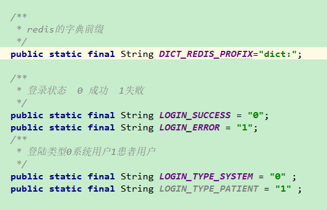

### F4：【system-web】修改LoginController

- 修改原Controller，然后添加一些新内容

~~~java
@Autowired
    private LoginLogService loginLogService;

    /**
     * 登录方法
     *      @Log  默认还有  后台用户+保存请求参数
     *      同时记录登录信息，并封装登录日志LoginLog对象，保存到数据库中
     * @param loginBodyDto 保存用户输入的登录数据
     * @param request
     * @return
     */
    @PostMapping("login/doLogin")
//    @Log(title = "用户登录",businessType = BusinessType.OTHER) 这里就不需要切入日志了，在登录处理逻辑中会将登录的日志记录到登录日志表
    public AjaxResult login(@RequestBody @Validated LoginBodyDto loginBodyDto, HttpServletRequest request){
        // 创建统一返回类型对象
        AjaxResult ajaxResult = AjaxResult.success();
        // 获取输入的登录信息
        String username = loginBodyDto.getUsername();
        String password = loginBodyDto.getPassword();
        // 构造含有用户名和密码的token
        UsernamePasswordToken token = new UsernamePasswordToken(username, password);
        Subject subject = SecurityUtils.getSubject();
        // 封装用户登录信息  保存到登录日志表
        LoginLog loginLog = getLoginInformation(request);
        // 设置登录账号 目前为手机号
        loginLog.setLoginAccount(loginBodyDto.getUsername());
        try{
            subject.login(token);
            // 如果登录成功，将token保存到redis中
            Serializable webToken = subject.getSession().getId();
            ajaxResult.put(Constants.TOKEN, webToken);
            // 登录成功设置状态
            loginLog.setLoginStatus(Constants.LOGIN_SUCCESS);
            // 设置登录用户名
            loginLog.setUserName(ShiroSecurityUtils.getCurrentUserName());
            // 设置成功信息
            loginLog.setMsg("登录成功");
        }catch (Exception e){
            log.error("用户名或密码不正确",e);
            ajaxResult = AjaxResult.error(HttpStatus.ERROR, "用户名或密码不正确");
            // 失败之后设置相关信息到登录日志对象
            loginLog.setLoginStatus(Constants.LOGIN_ERROR);
            // 设置登录用户名
            loginLog.setUserName(ShiroSecurityUtils.getCurrentUserName());
            // 设置登录失败信息
            loginLog.setMsg("用户名或密码不正确");
        }
        // 不论成功还是失败都需要将封装好的登录日志信息存入数据库
        this.loginLogService.insertLoginLog(loginLog);
        return ajaxResult;
    }

/**
     * 继续封装登录日志实体类中的属性
     * @param request   请求
     * @return 登录日志实体类
     */
    private LoginLog getLoginInformation(HttpServletRequest request){
        // 创建登录日志实体对象
        LoginLog loginLog = new LoginLog();
        // 设置IP地址和登录位置
        final String ip = IpUtils.getIpAddr(request);
        loginLog.setIpAddr(ip);
        String address = AddressUtils.getRealAddressByIP(ip);
        loginLog.setLoginLocation(address);
        // User-Agent通常格式：Mozilla/5.0  (平台）  引擎版本  浏览器版本号
        final UserAgent userAgent = UserAgent.parseUserAgentString(request.getHeader("User-Agent"));
        // 从User-Agent中获取登录者操作系统
        String os = userAgent.getOperatingSystem().getName();
        loginLog.setOs(os);
        // 从User-Agent中获取登录者浏览器类型
        String browser = userAgent.getBrowser().getName();
        loginLog.setBrowser(browser);
        // 设置登录时间  yyyy-MM-dd HH:mm:ss
        loginLog.setLoginTime(DateUtil.date());
        // 设置登录类型  默认为系统用户
        loginLog.setLoginType(Constants.LOGIN_TYPE_SYSTEM);
        return loginLog;
    }
~~~

### F5：YApi测试

- 测试登录操作，看是否可以记录到数据库
- 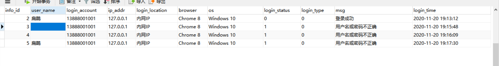

## 前端

### F6：创建src/api/system/loginLog.js

~~~js
import request from '@/utils/request'

// 分页查询登录日志信息
export function listForPage(query) {
  return request({
    url: '/system/loginLog/listForPage',
    method: 'get',
    params: query
  })
}

// 根据id删除登录日志信息
export function deleteLoginLogByIds(infoIds) {
  return request({
    url: '/system/loginLog/deleteLoginLogByIds/' + infoIds,
    method: 'delete'
  })
}

// 清空所有登录日志信息
export function clearAllLoginLog() {
  return request({
    url: '/system/loginLog/clearAllLoginLog',
    method: 'delete'
  })
}

~~~

### F7：创建src/views/system/loginLog/index.vue

~~~vue
<template>
  

    <!-- 查询条件开始 -->
    <el-form ref="queryForm" :model="queryParams" :inline="true" label-width="68px">
      <el-form-item label="用户名称" prop="userName">
        <el-input
          v-model="queryParams.userName"
          placeholder="请输入用户名称"
          clearable
          size="small"
          style="width:140px"
        />
      </el-form-item>
      <el-form-item label="用户账号" prop="loginAccount">
        <el-input
          v-model="queryParams.loginAccount"
          placeholder="请输入用户账号"
          clearable
          size="small"
          style="width:140px"
        />
      </el-form-item>
      <el-form-item label="IP地址" prop="ipAddr">
        <el-input
          v-model="queryParams.ipAddr"
          placeholder="请输入IP地址"
          clearable
          size="small"
          style="width:130px"
        />
      </el-form-item>
      <el-form-item label="登录状态" prop="loginStatus">
        <el-select
          v-model="queryParams.loginStatus"
          placeholder="请选择登录状态"
          clearable
          size="small"
          style="width:140px"
        >
          <el-option
            v-for="dict in statusOptions"
            :key="dict.dictValue"
            :label="dict.dictLabel"
            :value="dict.dictValue"
          />
        </el-select>
      </el-form-item>
      <el-form-item label="登录类型" prop="loginType">
        <el-select
          v-model="queryParams.loginType"
          placeholder="请选择登录类型"
          clearable
          size="small"
          style="width:140px"
        >
          <el-option
            v-for="dict in loginTypeOptions"
            :key="dict.dictValue"
            :label="dict.dictLabel"
            :value="dict.dictValue"
          />
        </el-select>
      </el-form-item>
      <el-form-item label="创建时间">
        <el-date-picker
          v-model="dateRange"
          size="small"
          style="width:280px"
          value-format="yyyy-MM-dd"
          type="daterange"
          range-separator="-"
          start-placeholder="开始日期"
          end-placeholder="结束日期"
        />
      </el-form-item>
      <el-form-item>
        <el-button type="primary" icon="el-icon-search" size="mini" @click="handleQuery">查询</el-button>
        <el-button type="normal" icon="el-icon-refresh" size="mini" @click="resetQuery">清空</el-button>
      </el-form-item>
    </el-form>
    <!-- 查询条件结束 -->
    <!-- 操作按钮开始 -->
    <el-row :gutter="10" style="margin-bottom: 8px;">
      <el-col :span="1.5">
        <el-button type="danger" icon="el-icon-delete" size="mini" :disabled="multiple" @click="handleDelete">删除</el-button>
      </el-col>
      <el-col :span="1.5">
        <el-button type="warning" icon="el-icon-thumb" size="mini" @click="handleClearInfo">清空所有登录日志</el-button>
      </el-col>
    </el-row>
    <!-- 操作按钮结束 -->
    <!-- 数据列表开始 -->
    <el-table v-loading="loading" border :data="loginLogTableList" @selection-change="handleSelectionChange">
      <el-table-column type="selection" width="55" align="center" />
      <!--当行内容过多并且不想显示横向滚动条时，可以使用 Table 展开行功能-->
      <!--通过设置 type="expand" 和 Scoped slot 可以开启展开行功能-->
      <el-table-column label="日志ID" align="center" prop="infoId" />
      <el-table-column label="用户名称" align="center" prop="userName" />
      <el-table-column label="用户账号" align="center" prop="loginAccount"/>
      <el-table-column label="IP地址" width="180" align="center" prop="ipAddr" />
      <el-table-column label="登录地址" align="center" prop="loginLocation" />
      <el-table-column label="浏览器" align="center" prop="browser" />
      <el-table-column label="操作系统" align="center" prop="os" />
      <el-table-column label="登录状态" prop="loginStatus" align="center" :formatter="statusFormatter" />
      <el-table-column label="登录类型" align="center" prop="loginType" width="200"  :formatter="loginTypeFormatter" />
      <el-table-column label="操作" align="center" width="100">
        <template slot-scope="scope">
          <el-button type="text" icon="el-icon-delete" size="mini" @click="handleDelete(scope.row)">删除</el-button>
        </template>
      </el-table-column>
    </el-table>
    <!-- 数据列表结束 -->
    <!-- 分页控件开始 -->
    <el-pagination
      v-show="total>0"
      :current-page="queryParams.pageNum"
      :page-sizes="[5,10,20,30]"
      :page-size="queryParams.pageSize"
      layout="total,sizes,prev,pager,next,jumper"
      :total="total"
      @size-change="handleSizeChange"
      @current-change="handleCurrentChange"
    />
    <!-- 分页控件结束 -->
  

</template>

<!--scoped：表示这个标签的所有样式只会在当前这个组件中生效-->

~~~

### F8：修改src/router/index.js

- 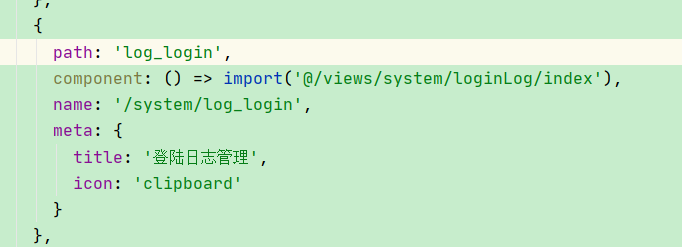

### F8：前端测试

- 测试成功

# 科室管理

## 后端

- 数据库表：sys_dept
- 

### F1：生成科室表相关代码

#### F1.1：【system-domain】Dept

~~~java
package com.fclever.domain;

import com.baomidou.mybatisplus.annotation.IdType;
import com.baomidou.mybatisplus.annotation.TableField;
import com.baomidou.mybatisplus.annotation.TableId;
import com.baomidou.mybatisplus.annotation.TableName;
import io.swagger.annotations.ApiModel;
import io.swagger.annotations.ApiModelProperty;
import java.util.Date;
import lombok.AllArgsConstructor;
import lombok.Data;
import lombok.EqualsAndHashCode;
import lombok.NoArgsConstructor;

/**
@author Fclever
@create 2020-11-21 20:47
*/
/**
    * 科室信息表
    */
@ApiModel(value="com-fclever-domain-Dept")
@Data
@EqualsAndHashCode(callSuper=true)
@AllArgsConstructor
@NoArgsConstructor
@TableName(value = "sys_dept")
public class Dept extends BaseEntity {
    /**
     * 科室主键id
     */
    @TableId(value = "dept_id", type = IdType.AUTO)
    @ApiModelProperty(value="科室主键id")
    private Long deptId;

    /**
     * 科室名称
     */
    @TableField(value = "dept_name")
    @ApiModelProperty(value="科室名称")
    private String deptName;

    /**
     * 挂号编号
     */
    @TableField(value = "reg_number")
    @ApiModelProperty(value="挂号编号")
    private Integer regNumber;

    /**
     * 科室编号
     */
    @TableField(value = "dept_number")
    @ApiModelProperty(value="科室编号")
    private String deptNumber;

    /**
     * 显示顺序
     */
    @TableField(value = "order_num")
    @ApiModelProperty(value="显示顺序")
    private Integer orderNum;

    /**
     * 负责人
     */
    @TableField(value = "dept_leader")
    @ApiModelProperty(value="负责人")
    private String deptLeader;

    /**
     * 联系电话
     */
    @TableField(value = "contact_phone")
    @ApiModelProperty(value="联系电话")
    private String contactPhone;

    /**
     * 科室状态（0正常 1停用）
     */
    @TableField(value = "status")
    @ApiModelProperty(value="科室状态（0正常 1停用）")
    private String status;

    /**
     * 创建时间
     */
    @TableField(value = "create_time")
    @ApiModelProperty(value="创建时间")
    private Date createTime;

    /**
     * 更新时间
     */
    @TableField(value = "update_time")
    @ApiModelProperty(value="更新时间")
    private Date updateTime;

    /**
     * 创建者
     */
    @TableField(value = "create_by")
    @ApiModelProperty(value="创建者")
    private String createBy;

    /**
     * 更新者
     */
    @TableField(value = "update_by")
    @ApiModelProperty(value="更新者")
    private String updateBy;

    public static final String COL_DEPT_ID = "dept_id";

    public static final String COL_DEPT_NAME = "dept_name";

    public static final String COL_REG_NUMBER = "reg_number";

    public static final String COL_DEPT_NUMBER = "dept_number";

    public static final String COL_ORDER_NUM = "order_num";

    public static final String COL_DEPT_LEADER = "dept_leader";

    public static final String COL_CONTACT_PHONE = "contact_phone";

    public static final String COL_STATUS = "status";

    public static final String COL_CREATE_TIME = "create_time";

    public static final String COL_UPDATE_TIME = "update_time";

    public static final String COL_CREATE_BY = "create_by";

    public static final String COL_UPDATE_BY = "update_by";
}
~~~

#### F1.2：【system-domain】DeptDto

~~~java
package com.fclever.dto;

import com.baomidou.mybatisplus.annotation.IdType;
import com.baomidou.mybatisplus.annotation.TableField;
import com.baomidou.mybatisplus.annotation.TableId;
import com.baomidou.mybatisplus.annotation.TableName;
import com.fclever.domain.BaseEntity;
import io.swagger.annotations.ApiModel;
import io.swagger.annotations.ApiModelProperty;
import lombok.AllArgsConstructor;
import lombok.Data;
import lombok.EqualsAndHashCode;
import lombok.NoArgsConstructor;

import javax.validation.constraints.NotNull;
import java.util.Date;

/**
@author Fclever
@create 2020-11-21 20:47
*/

/**
    * 科室信息表
 *          封装查询条件
 *          如果有新增或者更新操作，那么需要根据具体需求来决定要保留更多字段
 *          并且根据需求来设置字段后端校验
    */
@ApiModel(value="com-fclever-dto-DeptDto")
@Data
@EqualsAndHashCode(callSuper=true)
@AllArgsConstructor
@NoArgsConstructor
public class DeptDto extends BaseDto {
    /**
     * 科室主键id
     */
    @ApiModelProperty(value="科室主键id")
    private Long deptId;

    /**
     * 科室名称
     */
    @NotNull(message = "科室名称不能为空")
    @ApiModelProperty(value="科室名称")
    private String deptName;

    /**
     * 挂号编号
     */
    @NotNull(message = "挂号编号不能为空")
    @ApiModelProperty(value="挂号编号")
    private Integer regNumber;

    /**
     * 科室编号
     */
    @NotNull(message = "科室编号不能为空")
    @ApiModelProperty(value="科室编号")
    private String deptNumber;

    /**
     * 显示顺序
     */
    @NotNull(message = "显示顺序不能为空")
    @ApiModelProperty(value="显示顺序")
    private Integer orderNum;

    /**
     * 负责人
     */
    @ApiModelProperty(value="负责人")
    private String deptLeader;

    /**
     * 联系电话
     */
    @ApiModelProperty(value="联系电话")
    private String contactPhone;

    /**
     * 科室状态（0正常 1停用）
     */
    @ApiModelProperty(value="科室状态（0正常 1停用）")
    private String status;
}
~~~

#### F1.3：【system-mapper】DeptMapper

#### F1.4：【system-mapper】DeptMapper.xml

#### F1.5：【system-interface】DeptService

~~~java
package com.fclever.service;

import com.fclever.domain.Dept;
import com.baomidou.mybatisplus.extension.service.IService;
import com.fclever.dto.DeptDto;
import com.fclever.vo.DataGridView;

import java.util.List;

/**
@author Fclever
@create 2020-11-21 20:47
*/
public interface DeptService{

    /**
     * 修改科室信息
     * @param deptDto 待修改的数据
     * @return 是否修改成功的标志
     */
    int updateDept(DeptDto deptDto);

    /**
     * 分页查询科室信息
     * @param deptDto 查询条件
     * @return 查询结果
     */
    DataGridView listForPage(DeptDto deptDto);

    /**
     * 查询所有科室信息（有效）
     * @return 查询结果
     */
    List<Dept> selectAllDept();

    /**
     * 根据id删除科室信息(含批量）
     * @param deptIds 待删除的主键id
     * @return 是否删除成功标志
     */
    int deleteDeptByIds(Long[] deptIds);

    /**
     * 根据id查询指定科室信息
     * @param deptId 指定科室的主键id
     * @return 查询到的科室信息
     */
    Dept getDeptById(Long deptId);

    /**
     * 添加科室信息
     * @param deptDto 待添加的信息（仅保存前端传递的数据，额外的单独设置保存）
     * @return 是否插入成功标志
     */
    int addDept(DeptDto deptDto);
}

~~~

#### F1.6：【system-service】DeptServiceImpl

~~~java
package com.fclever.service.impl;

import cn.hutool.core.bean.BeanUtil;
import cn.hutool.core.date.DateUtil;
import com.baomidou.mybatisplus.core.conditions.query.QueryWrapper;
import com.baomidou.mybatisplus.core.toolkit.StringUtils;
import com.baomidou.mybatisplus.extension.plugins.pagination.Page;
import com.fclever.constants.Constants;
import com.fclever.dto.DeptDto;
import com.fclever.vo.DataGridView;
import org.springframework.beans.factory.annotation.Autowired;
import org.springframework.stereotype.Service;
import java.util.Arrays;
import java.util.List;
import com.fclever.mapper.DeptMapper;
import com.fclever.domain.Dept;
import com.fclever.service.DeptService;
/**
@author Fclever
@create 2020-11-21 20:47
*/
@Service
public class DeptServiceImpl implements DeptService{

    @Autowired
    private DeptMapper deptMapper;

    /**
     * 修改科室信息
     * @param deptDto 待修改的数据
     * @return 是否修改成功的标志
     */
    @Override
    public int updateDept(DeptDto deptDto) {
        // 形参为前后端数据传输的内容，创建与数据库交互的完全实体对象
        Dept dept = new Dept();
        // 拷贝
        BeanUtil.copyProperties(deptDto, dept);
        dept.setUpdateBy(deptDto.getSimpleUser().getUserName());
        // 更新时间字段在数据库进行了设置
        return this.deptMapper.updateById(dept);
    }

    /**
     * 分页查询科室信息
     * @param deptDto 查询条件
     * @return 查询结果
     */
    @Override
    public DataGridView listForPage(DeptDto deptDto) {
        // 创建分页对象
        Page<Dept> page = new Page<>(deptDto.getPageNum(), deptDto.getPageSize());
        // 创建查询条件对象
        QueryWrapper<Dept> qw = new QueryWrapper<>();
        // 模糊匹配  科室名称
        qw.like(StringUtils.isNotBlank(deptDto.getDeptName()), Dept.COL_DEPT_NAME, deptDto.getDeptName());
        // 精确匹配状态
        qw.eq(StringUtils.isNotBlank(deptDto.getStatus()), Dept.COL_STATUS, deptDto.getStatus());
        // 创建时间范围匹配
        qw.ge(deptDto.getBeginTime() != null, Dept.COL_CREATE_TIME, deptDto.getBeginTime());
        qw.le(deptDto.getEndTime() != null, Dept.COL_CREATE_TIME, deptDto.getEndTime());
        // 根据显示顺序进行排序
        qw.orderByAsc(Dept.COL_ORDER_NUM);
        // 执行查询
        this.deptMapper.selectPage(page, qw);
        // 封装结果并返回
        return new DataGridView(page.getTotal(), page.getRecords());
    }

    /**
     * 查询所有科室信息（有效）
     * @return 查询结果
     */
    @Override
    public List<Dept> selectAllDept() {
        // 创建查询条件对象
        QueryWrapper<Dept> qw = new QueryWrapper<>();
        // 精确匹配状态
        qw.eq(Dept.COL_STATUS, Constants.STATUS_TRUE);
        // 根据显示顺序进行排序
        qw.orderByAsc(Dept.COL_ORDER_NUM);
        // 封装结果并返回
        return this.deptMapper.selectList(qw);
    }

    /**
     * 根据id删除科室信息(含批量）
     * @param deptIds 待删除的主键id
     * @return 是否删除成功标志
     */
    @Override
    public int deleteDeptByIds(Long[] deptIds) {
        // 转成数组
        List<Long> deptList = Arrays.asList(deptIds);
        if (deptList != null && deptList.size() > 0){
            return this.deptMapper.deleteBatchIds(deptList);
        }
        return 0;
    }

    /**
     * 根据id查询指定科室信息
     * @param deptId 指定科室的主键id
     * @return 查询到的科室信息
     */
    @Override
    public Dept getDeptById(Long deptId) {
        return this.deptMapper.selectById(deptId);
    }

    /**
     * 添加科室信息
     * @param deptDto 待添加的信息（仅保存前端传递的数据，额外的单独设置保存）
     * @return 是否插入成功标志
     */
    @Override
    public int addDept(DeptDto deptDto) {
        // 创建保存到数据库的实体对象，涉及到与数据库的增加要用完全实体类
        Dept dept = new Dept();
        BeanUtil.copyProperties(deptDto, dept);
        dept.setCreateBy(deptDto.getSimpleUser().getUserName());
        dept.setCreateTime(DateUtil.date());
        return this.deptMapper.insert(dept);
    }
}

~~~

### F2：【system-web】创建DeptController

~~~java
package com.fclever.controller.system;

import com.fclever.aspectj.annotation.Log;
import com.fclever.aspectj.enums.BusinessType;
import com.fclever.domain.Dept;
import com.fclever.dto.DeptDto;
import com.fclever.service.DeptService;
import com.fclever.utils.ShiroSecurityUtils;
import com.fclever.vo.AjaxResult;
import com.fclever.vo.DataGridView;
import org.springframework.beans.factory.annotation.Autowired;
import org.springframework.validation.annotation.Validated;
import org.springframework.web.bind.annotation.*;

import javax.validation.constraints.NotNull;
import java.util.List;

/**
 * 科室管理控制层
 * @author Fclever
 * @create 2020-11-22 12:29
 */
@RestController
@RequestMapping("system/dept")
public class DeptController {

    @Autowired
    private DeptService deptService;

    /**
     * 修改科室信息
     * @param deptDto 待修改的数据
     * @return 统一返回实体
     */
    @PutMapping("updateDept")
    @Log(title = "更新科室信息",businessType = BusinessType.UPDATE)
    public AjaxResult updateDept(@Validated DeptDto deptDto){
        // 这里设置的登录用户将作为更新者进行保存
        deptDto.setSimpleUser(ShiroSecurityUtils.getCurrentSimpleUser());
        return AjaxResult.toAjax(this.deptService.updateDept(deptDto));
    }

    /**
     * 分页查询科室信息
     * @param deptDto 查询条件
     * @return 统一返回实体
     */
    @GetMapping("listForPage")
    public AjaxResult listForPage(DeptDto deptDto){
        DataGridView list = this.deptService.listForPage(deptDto);
        return AjaxResult.success("查询成功",list.getData(),list.getTotal());
    }

    /**
     * 查询所有科室信息（有效）
     * @return 统一返回实体
     */
    @GetMapping("selectAllDept")
    public AjaxResult selectAllDept(){
        return AjaxResult.success(this.deptService.selectAllDept());
    }

    /**
     * 根据id删除科室信息(含批量）
     * @param deptIds 待删除的主键id
     * @return 统一返回实体
     */
    @DeleteMapping("deleteDeptByIds/{deptIds}")
    @Log(title = "根据id删除科室信息（含批量)",businessType = BusinessType.DELETE)
    public AjaxResult deleteDeptByIds(@PathVariable @Validated @NotNull(message = "要删除的id不能为空") Long[] deptIds){
        return AjaxResult.toAjax(this.deptService.deleteDeptByIds(deptIds));
    }

    /**
     * 根据id查询指定科室信息
     * @param deptId 指定科室的主键id
     * @return 统一返回实体
     */
    @GetMapping("getDeptById/{deptId}")
    public AjaxResult getDeptById(@PathVariable @Validated @NotNull(message = "科室id不能为空") Long deptId){
        return AjaxResult.success(this.deptService.getDeptById(deptId));
    }

    /**
     * 添加科室信息
     * @param deptDto 待添加的信息（仅保存前端传递的数据，额外的单独设置保存）
     * @return 统一返回实体
     */
    @PostMapping("addDept")
    @Log(title = "添加科室信息",businessType = BusinessType.INSERT)
    public AjaxResult addDept(@Validated DeptDto deptDto){
        // 获取当前登录用户信息，这里的登录用户作为创建者来保存
        deptDto.setSimpleUser(ShiroSecurityUtils.getCurrentSimpleUser());
        return AjaxResult.toAjax(this.deptService.addDept(deptDto));
    }
}

~~~

### F3：Yapi测试

- 通过

## 前端

### F4：创建src/api/system/dept/dept.js

~~~js
import request from '@/utils/request'

// 修改科室信息
export function updateDept(data) {
  return request({
    url: '/system/dept/updateDept',
    method: 'put',
    params: data
  })
}

// 分页查询科室信息
export function listForPage(query) {
  return request({
    url: '/system/dept/listForPage',
    method: 'get',
    params: query
  })
}

// 查询所有科室信息(状态为有效）
export function selectAllDept() {
  return request({
    url: '/system/dept/selectAllDept',
    method: 'get'
  })
}

// 根据id删除科室信息
export function deleteDeptByIds(deptIds) {
  return request({
    url: '/system/dept/deleteDeptByIds/' + deptIds,
    method: 'delete'
  })
}

// 根据id查询科室信息
export function getDeptById(deptId) {
  return request({
    url: '/system/dept/getDeptById/' + deptId,
    method: 'get'
  })
}

// 添加科室信息
export function addDept(data) {
  return request({
    url: '/system/dept/addDept',
    method: 'post',
    params: data
  })
}

~~~

### F5：创建src/views/system/dept/index.vue

~~~vue
<!--字典类型页面-->
<template>
  

    <!--查询条件开始-->
    <!--
      ref:
      model:绑定查询条件部分的数据绑定,与queryParams有关,点击查询按钮时,将查询参数传递到后台
      inline:变为行内域
      label-width:设置每个标签的宽度,指定在el-form上时,其直接子标签form-item会继承该值
    -->
    <el-form ref="queryForm" :model="queryParams" :inline="true" label-width="68px">
      <el-form-item label="科室名称" prop="deptName">
        <!--input输入框
          v-model:指定与queryParams中哪个属性进行动态绑定
          placeholder:输入框内默认填充的数据,获得焦点后消失
          clearable:是否可以一键清除
          size:输入框大小,影响内容大小
        -->
        <el-input
          v-model="queryParams.deptName"
          placeholder="请输入科室名称"
          clearable
          size="small"
          style="width:140px"
        />
      </el-form-item>
      <el-form-item label="状态" prop="status">
        <!--select下拉框-->
        <el-select
          v-model="queryParams.status"
          placeholder="字典状态"
          clearable
          size="small"
          style="width:140px"
        >
          <!--下拉框内容,遍历statusOptions属性,这里面保存了查询的状态的码表
            key:唯一标注
            label:标签
            value:实际存储的值
          -->
          <el-option
            v-for="dict in statusOptions"
            :key="dict.dictValue"
            :label="dict.dictLabel"
            :value="dict.dictValue"
          />
        </el-select>
      </el-form-item>
      <el-form-item label="创建时间">
        <!--date-picker:日期选择框
          value-format:日期格式
          type:类型,这里是可以选取范围数据
          range-separator:分隔符,页面显示中会把开始日期和结束日期用该符号分割开
          start-placeholder:第一个空的默认显示内容
          end-placeholder:第二个空的默认显示内容
        -->
        <el-date-picker
          v-model="dateRange"
          size="small"
          style="width:280px"
          value-format="yyyy-MM-dd"
          type="daterange"
          range-separator="-"
          start-placeholder="开始日期"
          end-placeholder="结束日期"
        />
      </el-form-item>
      <el-form-item>
        <!--查询和清空按钮-->
        <el-button type="primary" icon="el-icon-search" size="mini" @click="handleQuery">查询</el-button>
        <el-button type="primary" icon="el-icon-refresh" size="mini" @click="resetQuery">清空</el-button>
      </el-form-item>
    </el-form>
    <!--查询条件结束-->
    <!--操作栏按钮开始-->
    <!--el-row:表示一行数据
      gutter:每一栏之间的间隔
    -->
    <el-row :gutter="10" style="margin-bottom: 8px;">
      <!--el-col:表示一列
        span:指定该列所占的宽度,最大指定为24
      -->
      <el-col :span="1.5">
        <!--新增按钮:尺寸mini-->
        <el-button type="primary" icon="el-icon-plus" size="mini" @click="handleAdd">新增</el-button>
      </el-col>
      <el-col :span="1.5">
        <!--修改按钮:只有在选中一条记录的时候,才会处于可用状态-->
        <el-button type="success" icon="el-icon-edit" size="mini" :disabled="!single" @click="handleUpdate">修改</el-button>
      </el-col>
      <el-col :span="1.5">
        <!--删除按钮,只要有选中数据就可用,不管一条还是多条-->
        <el-button type="danger" icon="el-icon-delete" size="mini" :disabled="!multiple" @click="handleDelete">批量删除</el-button>
      </el-col>
    </el-row>
    <!--操作栏按钮结束-->
    <!--数据列表开始-->
    <!--el-table:数据列表
      v-loading:v-loading在接口未请求到数据之前，显示加载中，直到请求到数据后消失
      border:表示有边框
      data:数据列表中显示的数据从哪获取
      @selection-change:当选择项发生变化时会触发该事件
    -->
    <el-table v-loading="loading" border :data="deptTableList" @selection-change="handleSelectionChnage">
      <!--el-table-column:每一行中的每一列
        prop:对应从:data中取出的数据
        align:对齐方式
        label:列名
        show-overflow-tooltip:默认情况下数据过长不够显示的时候是换行显示,如果需要单行显示,可以使用这个,并且当鼠标移动到此处时会显示实际内容的提示信息
      -->
      <el-table-column type="selection" width="55" align="center" />
      <el-table-column label="科室ID" prop="deptId" align="center" />
      <el-table-column label="科室名称" prop="deptName" align="center"/>
      <el-table-column label="科室编号" prop="deptNumber" align="center"/>
      <el-table-column label="科室挂号量" prop="regNumber" align="center"/>
      <el-table-column label="负责人" prop="deptLeader" align="center"/>
      <el-table-column label="联系电话" prop="contactPhone" align="center"/>
      <!--formatter:用于按照指定要求来格式化此处需要显示的值,显示在列表中的数据是经过statusFormatter处理后的内容-->
      <el-table-column label="状态" prop="status" align="center" :formatter="statusFormatter" />
      <el-table-column label="创建时间" prop="createTime" align="center" width="180" />
      <el-table-column label="操作" align="center">
        <!--slot-scope="scope" 取到当前单元格-->
        <template slot-scope="scope">
          <!--传递该条数据到具体处理方法中-->
          <el-button type="text" icon="el-icon-edit" size="mini" @click="handleUpdate(scope.row)">修改</el-button>
          <el-button type="text" icon="el-icon-delete" size="mini" @click="handleDelete(scope.row)">删除</el-button>
        </template>
      </el-table-column>
    </el-table>
    <!--数据列表结束-->
    <!--底部分页开始-->
    <!--pagination:分页控件
      v-show:控制是否显示分页控件的条件,当数据列表中数据不为空才显示
      current-page:当前显示第几页
      page-sizes:可选的每页显示条数
      page-size:默认每页显示条数
      layout:设置分页格式:总数,每页条数,前一页,当前页,下一页,跳转至某一页
      total:总数
      @size-change:改变每页显示条数后触发方法
      @current-change:当前页发生改变的时候触发的方法
    -->
    <el-pagination
      v-show="total>0"
      :current-page="queryParams.pageNum"
      :page-sizes="[5, 10, 20, 30]"
      :page-size="queryParams.pageSize"
      layout="total, sizes, prev, pager, next, jumper"
      :total="total"
      @size-change="handleSizeChange"
      @current-change="handleCurrentChange"
    />
    <!--底部分页结束-->
    <!--新增和修改模态框开始-->
    <!--dialog:对话框
      title:模态框标题
      visible.sync:表示是否显示
      center:居中
      append-to-body:如果需要在一个对话框内部嵌套另一个对话框，需要使用append-to-body属性
    -->
    <el-dialog
      :title="title"
      :visible.sync="open"
      width="500px"
      center
      append-to-body
    >
      <!--添加和修改的表单
        rules:做表单数据前端校验
        label-width:标签宽度(文字)
      -->
      <el-form ref="form" :model="form" :rules="rules" label-width="80px">
        <el-form-item label="科室名称" prop="deptName">
          <el-input v-model="form.deptName" placeholder="请输入科室名称" clearable size="small" />
        </el-form-item>
        <el-form-item label="科室编号" prop="deptNumber">
          <el-input v-model="form.deptNumber" placeholder="请输入科室编号" clearable size="small" />
        </el-form-item>
        <el-form-item label="挂号编号" prop="regNumber">
          <el-input-number v-model="form.regNumber" placeholder="请输入挂号编号" clearable size="small" />
        </el-form-item>
        <el-form-item label="负责人" prop="deptLeader">
          <el-input v-model="form.deptLeader" placeholder="请输入负责人" clearable size="small" />
        </el-form-item>
        <el-form-item label="联系电话" prop="contactPhone">
          <el-input v-model="form.contactPhone" placeholder="请输入联系电话" clearable size="small" />
        </el-form-item>
        <el-form-item label="显示顺序" prop="orderNum">
          <el-input-number v-model="form.orderNum" placeholder="请输入显示顺序" clearable size="small" />
        </el-form-item>
        <el-form-item label="状态" prop="status">
          <!--单选框-->
          <el-radio-group v-model="form.status">
            <el-radio
              v-for="dict in statusOptions"
              :key="dict.dictValue"
              :label="dict.dictValue"
              :value="dict.dictValue"
            >{{ dict.dictLabel }}</el-radio>
          </el-radio-group>
        </el-form-item>
      </el-form>
      
        <el-button type="primary" @click="handleSubmit">保 存</el-button>
        <el-button @click="cancel">取 消</el-button>
      
    </el-dialog>
    <!--新增和修改模态框结束-->
  

</template>

~~~

### F6：修改src/router/index.js

- 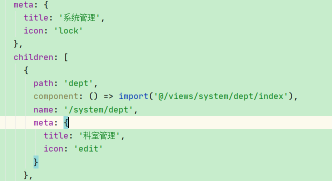

### F7：前端测试

- 通过

# 菜单管理

## 后端

### F1：创建和修改相关代码

#### F1.1：【system-domain】Menu

- 之前已生成

#### F1.2：【system-domain】MenuDto

~~~java
package com.fclever.dto;

import com.baomidou.mybatisplus.annotation.IdType;
import com.baomidou.mybatisplus.annotation.TableField;
import com.baomidou.mybatisplus.annotation.TableId;
import com.baomidou.mybatisplus.annotation.TableName;
import com.fclever.domain.BaseEntity;
import io.swagger.annotations.ApiModel;
import io.swagger.annotations.ApiModelProperty;
import lombok.AllArgsConstructor;
import lombok.Data;
import lombok.EqualsAndHashCode;
import lombok.NoArgsConstructor;

import javax.validation.constraints.NotNull;
import java.util.Date;

/**
@author Fclever
@create 2020-10-21 09:04
*/

/**
    * 菜单权限表
    */
@ApiModel(value="com-fclever-dto-MenuDto")
@Data
@EqualsAndHashCode(callSuper=true)
@AllArgsConstructor
@NoArgsConstructor
public class MenuDto extends BaseDto {
    /**
     * 菜单ID
     */
    @ApiModelProperty(value="菜单ID")
    private Long menuId;

    /**
     * 父菜单ID
     */
    @ApiModelProperty(value="父菜单ID")
    private Long parentId;

    /**
     * 父节点ID集合
     */
    @ApiModelProperty(value="父节点ID集合")
    private String parentIds;

    /**
     * 菜单名称
     */
    @NotNull(message = "菜单名称不能为空")
    @ApiModelProperty(value="菜单名称")
    private String menuName;

    /**
     * 菜单类型（M目录 C菜单 F按钮）
     */
    @NotNull(message = "菜单类型不能为空")
    @ApiModelProperty(value="菜单类型（M目录 C菜单 F按钮）")
    private String menuType;

    /**
     * 权限标识
     */
    @ApiModelProperty(value="权限标识")
    private String percode;

    /**
     * 路由地址
     */
    @ApiModelProperty(value="路由地址")
    private String path;

    /**
     * 备注
     */
    @ApiModelProperty(value="备注")
    private String remark;

    /**
     * 菜单状态（0正常 1停用）
     */
    @NotNull(message = "菜单状态不能为空")
    @ApiModelProperty(value="菜单状态（0正常 1停用）")
    private String status;
}
~~~

#### F1.3：【system-mapper】MenuMapper

~~~java
package com.fclever.mapper;

import com.baomidou.mybatisplus.core.mapper.BaseMapper;
import com.fclever.domain.Menu;
import org.apache.ibatis.annotations.Param;

import java.util.List;

/**
 * @author Fclever
 * @create 2020-10-21 09:04
 */
public interface MenuMapper extends BaseMapper<Menu> {

    /**
     * 根据菜单id查询它的子菜单的个数
     *      按alt+enter  可以辅助生成xml中SQL，并且为形参添加注解
     * @param menuId
     * @return 查询到的子菜单个数
     */
    Long queryChildCountByMenuId(@Param("menuId") Long menuId);
}

~~~

#### F1.4：【system-mapper】MenuMapper.xml

- 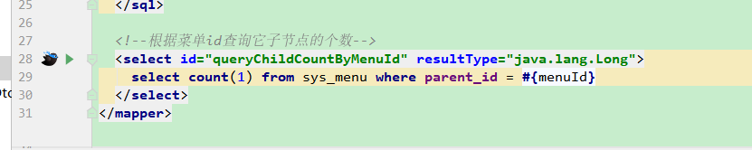

#### F1.5：【system-interface】MenuService

~~~java
package com.fclever.service;

import com.fclever.domain.Menu;
import com.baomidou.mybatisplus.extension.service.IService;
import com.fclever.domain.SimpleUser;
import com.fclever.dto.MenuDto;
import com.fclever.vo.DataGridView;

import java.util.List;

/**
@author Fclever
@create 2020-10-21 09:04
*/
public interface MenuService{

    /**
     * 查询菜单信息
     *  sys_user表中user_type=0 超级管理员  user_type=1普通用户
     * 如查用户是超级管理员，那么查询所有菜单和权限
     * 如果用户是普通用户，那么根据用户ID关联角色和权限
     * @param isAdmin 是否是超级管理员
     * @param  simpleUser  如果isAdmin=true  simpleUser可以为空
     */
    List<Menu> selectMenuTree(boolean isAdmin, SimpleUser simpleUser);

    /**
     * 修改菜单信息
     * @param menuDto 待修改的数据
     * @return 修改是否成功标志
     */
    int updateMenu(MenuDto menuDto);

    /**
     * 查询所有菜单信息
     * @param menuDto 查询条件
     * @return 查询到的数据
     */
    List<Menu> listAllMenus(MenuDto menuDto);

    /**
     * 根据id删除指定菜单信息
     * @param menuId 待删除的菜单id集合
     * @return 是否删除成功标志
     */
    int deleteMenuById(Long menuId);

    /**
     * 根据id查询菜单信息
     * @param menuId 待查询的菜单id
     * @return 查询到的菜单实体对象
     */
    Menu getMenuById(Long menuId);

    /**
     * 添加菜单信息
     * @param menuDto 添加的数据
     * @return 是否添加成功标志
     */
    int addMenu(MenuDto menuDto);

    /**
     * 判断指定菜单id是否含有子节点
     * @param menuId
     * @return
     */
    boolean hasChildByMenuId(Long menuId);
}

~~~

#### F1.6：【system-service】MenuServiceImpl

~~~java
package com.fclever.service.impl;

import cn.hutool.core.bean.BeanUtil;
import cn.hutool.core.date.DateUtil;
import cn.hutool.core.util.StrUtil;
import com.baomidou.mybatisplus.core.conditions.query.QueryWrapper;
import com.baomidou.mybatisplus.core.toolkit.StringUtils;
import com.fclever.constants.Constants;
import com.fclever.domain.SimpleUser;
import com.fclever.dto.MenuDto;
import org.springframework.beans.factory.annotation.Autowired;
import org.springframework.stereotype.Service;
import javax.annotation.Resource;
import java.util.List;
import com.baomidou.mybatisplus.extension.service.impl.ServiceImpl;
import com.fclever.domain.Menu;
import com.fclever.mapper.MenuMapper;
import com.fclever.service.MenuService;
/**
@author Fclever
@create 2020-10-21 09:04
*/
@Service
public class MenuServiceImpl implements MenuService{

    @Autowired
    private MenuMapper menuMapper;

    /**
     * 查询菜单信息
     *  超级管理员则查询所有
     *  如果是普通用户，则根据用户id查询对应菜单和权限
     * @param isAdmin 是否是超级管理员
     * @param  simpleUser  如果isAdmin=true  simpleUser可以为空
     * @return
     */
    @Override
    public List<Menu> selectMenuTree(boolean isAdmin, SimpleUser simpleUser) {
        QueryWrapper<Menu> qw=new QueryWrapper<>();
        // 菜单状态为正常（非停用）
        qw.eq(Menu.COL_STATUS, Constants.STATUS_TRUE);
        // 菜单类型为  一级菜单和二级菜单
        qw.in(Menu.COL_MENU_TYPE,Constants.MENU_TYPE_M,Constants.MENU_TYPE_C);
        // 根据父级菜单的id倒序排序
        qw.orderByAsc(Menu.COL_PARENT_ID);
        if(isAdmin){
            return menuMapper.selectList(qw);
        }else{
            //根据用户id查询用户拥有的菜单信息
            return menuMapper.selectList(qw);
        }
    }

    /**
     * 修改菜单信息
     * @param menuDto 待修改的数据
     * @return 修改是否成功标志
     */
    @Override
    public int updateMenu(MenuDto menuDto) {
        // 拷贝
        Menu menu = new Menu();
        BeanUtil.copyProperties(menuDto, menu);
        // 设置修改人
        menu.setUpdateBy(menuDto.getSimpleUser().getUserName());
        return this.menuMapper.updateById(menu);
    }

    /**
     * 查询所有菜单信息
     * @param menuDto 查询条件
     * @return 查询到的数据
     */
    @Override
    public List<Menu> listAllMenus(MenuDto menuDto) {
        // 构建查询对象
        QueryWrapper<Menu> qw = new QueryWrapper<>();
        // 封装查询条件
        qw.like(StringUtils.isNotBlank(menuDto.getMenuName()), Menu.COL_MENU_NAME, menuDto.getMenuName());
        qw.eq(StringUtils.isNotBlank(menuDto.getStatus()), Menu.COL_STATUS,menuDto.getStatus());
        // 执行查询并返回结果
        return this.menuMapper.selectList(qw);
    }

    /**
     * 根据id删除指定菜单信息
     * @param menuId 待删除的菜单id集合
     * @return 是否删除成功标志
     */
    @Override
    public int deleteMenuById(Long menuId) {
        return this.menuMapper.deleteById(menuId);
    }

    /**
     * 根据id查询菜单信息
     * @param menuId 待查询的菜单id
     * @return 查询到的菜单实体对象
     */
    @Override
    public Menu getMenuById(Long menuId) {
        return this.menuMapper.selectById(menuId);
    }

    /**
     * 添加菜单信息
     * @param menuDto 添加的数据
     * @return 是否添加成功标志
     */
    @Override
    public int addMenu(MenuDto menuDto) {
        Menu menu = new Menu();
        // 拷贝
        BeanUtil.copyProperties(menuDto, menu);
        // 设置创建人
        menu.setCreateBy(menuDto.getSimpleUser().getUserName());
        // 设置创建时间
        menu.setCreateTime(DateUtil.date());
        return this.menuMapper.insert(menu);
    }

    /**
     * 判断指定菜单id是否含有子节点
     * @param menuId
     * @return
     */
    @Override
    public boolean hasChildByMenuId(Long menuId) {
        Long count = this.menuMapper.queryChildCountByMenuId(menuId);
        return count > 0L ? true : false;
    }
}

~~~

### F2：【system-web】MenuController

~~~java
package com.fclever.controller.system;

import com.fclever.aspectj.annotation.Log;
import com.fclever.aspectj.enums.BusinessType;
import com.fclever.constants.Constants;
import com.fclever.domain.Menu;
import com.fclever.dto.MenuDto;
import com.fclever.service.MenuService;
import com.fclever.utils.ShiroSecurityUtils;
import com.fclever.vo.AjaxResult;
import org.springframework.beans.factory.annotation.Autowired;
import org.springframework.validation.annotation.Validated;
import org.springframework.web.bind.annotation.*;

import java.util.List;

/**
 * @author Fclever
 * @create 2020-11-24 07:58
 */
@RestController
@RequestMapping("system/menu")
public class MenuController {

    @Autowired
    private MenuService menuService;

    /**
     * 修改菜单信息
     * @param menuDto 待修改的数据
     * @return 修改是否成功标志
     */
    @PutMapping("updateMenu")
    @Log(title = "更新菜单信息",businessType = BusinessType.UPDATE)
    public AjaxResult updateMenu(@Validated MenuDto menuDto){
        // 这里设置的就是修改人了
        menuDto.setSimpleUser(ShiroSecurityUtils.getCurrentSimpleUser());
        return AjaxResult.toAjax(this.menuService.updateMenu(menuDto));
    }

    /**
     * 查询所有菜单信息
     * @param menuDto 查询条件
     * @return 查询到的数据
     */
    @GetMapping("listAllMenus")
    public AjaxResult listAllMenus(MenuDto menuDto){
        List<Menu> menus = this.menuService.listAllMenus(menuDto);
        return AjaxResult.success(menus);
    }

    /**
     * 查询菜单的下拉树
     * @return 查询的数据
     */
    @GetMapping("selectMenuTree")
    public AjaxResult selectMenuTree(){
        MenuDto menuDto = new MenuDto();
        // 只查询状态为可用的
        menuDto.setStatus(Constants.STATUS_TRUE);
        return this.listAllMenus(menuDto);
    }

    /**
     * 根据id删除指定菜单信息
     * @param menuId 待删除的菜单id集合
     * @return 是否删除成功标志
     */
    @DeleteMapping("deleteMenuById/{menuId}")
    @Log(title = "根据id删除菜单信息",businessType = BusinessType.DELETE)
    public AjaxResult deleteMenuById(@PathVariable Long menuId){
        // 删除前要判断当前删除菜单是否含有子节点，如果有不允许删除
        boolean hasChildren = this.menuService.hasChildByMenuId(menuId);
        if (hasChildren) {
            return AjaxResult.fail("当前要删除的菜单含有子菜单，请先删除子菜单后进行该操作！");
        }
        return AjaxResult.success(this.menuService.deleteMenuById(menuId));
    }

    /**
     * 根据id查询菜单信息
     * @param menuId 待查询的菜单id
     * @return 查询到的菜单实体对象
     */
    @GetMapping("getMenuById/{menuId}")
    public AjaxResult getMenuById(@PathVariable Long menuId){
        Menu menu = this.menuService.getMenuById(menuId);
        return AjaxResult.success(menu);
    }

    /**
     * 添加菜单信息
     * @param menuDto 添加的数据
     * @return 是否添加成功标志
     */
    @PostMapping("addMenu")
    @Log(title = "添加菜单信息",businessType = BusinessType.INSERT)
    public AjaxResult addMenu(@Validated MenuDto menuDto){
        // 保存创建者信息
        menuDto.setSimpleUser(ShiroSecurityUtils.getCurrentSimpleUser());
        return AjaxResult.toAjax(this.menuService.addMenu(menuDto));
    }
}

~~~

### F3：YApi测试

- 测试通过

## 前端

### F4：创建src/api/system/menu/menu.js

~~~js
import request from '@/utils/request'

// 更新菜单数据
export function updateMenu(data) {
  return request({
    url: '/system/menu/updateMenu',
    method: 'put',
    params: data
  })
}

// 查询所有菜单数据
export function listAllMenus(query) {
  return request({
    url: '/system/menu/listAllMenus',
    method: 'get',
    params: query
  })
}

// 查询菜单树
export function selectMenuTree() {
  return request({
    url: '/system/menu/selectMenuTree',
    method: 'get'
  })
}

// 根据菜单id删除菜单信息
export function deleteMenuById(menuId) {
  return request({
    url: '/system/menu/deleteMenuById/' + menuId,
    method: 'delete'
  })
}

// 根据菜单id查询指定菜单数据
export function getMenuById(menuId) {
  return request({
    url: '/system/menu/getMenuById/' + menuId,
    method: 'get'
  })
}

// 添加菜单信息
export function addMenu(data) {
  return request({
    url: '/system/menu/addMenu',
    method: 'post',
    params: data
  })
}

~~~

### F5：修改src/utils/hospital-utils.js，配置组装菜单数据的方法

- 

### F6：修改src/main.js，全局挂载src/utils/his-utils.js新增的方法

- 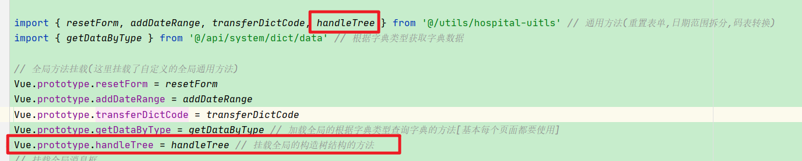

### F7：创建src/views/system/menu/index.vue

~~~vue
<!--字典类型页面-->
<template>
  

    <!--查询条件开始-->
    <!--
      ref:
      model:绑定查询条件部分的数据绑定,与queryParams有关,点击查询按钮时,将查询参数传递到后台
      inline:变为行内域
      label-width:设置每个标签的宽度,指定在el-form上时,其直接子标签form-item会继承该值
    -->
    <el-form ref="queryForm" :model="queryParams" :inline="true" label-width="68px">
      <el-form-item label="菜单名称" prop="menuName">
        <!--input输入框
          v-model:指定与queryParams中哪个属性进行动态绑定
          placeholder:输入框内默认填充的数据,获得焦点后消失
          clearable:是否可以一键清除
          size:输入框大小,影响内容大小
        -->
        <el-input
          v-model="queryParams.menuName"
          placeholder="请输入菜单名称"
          clearable
          size="small"
          style="width:140px"
        />
      </el-form-item>
      <el-form-item label="状态" prop="status">
        <!--select下拉框-->
        <el-select
          v-model="queryParams.status"
          placeholder="请选择菜单状态"
          clearable
          size="small"
          style="width:140px"
        >
          <!--下拉框内容,遍历statusOptions属性,这里面保存了查询的状态的码表
            key:唯一标注
            label:标签
            value:实际存储的值
          -->
          <el-option
            v-for="dict in statusOptions"
            :key="dict.dictValue"
            :label="dict.dictLabel"
            :value="dict.dictValue"
          />
        </el-select>
      </el-form-item>
      <el-form-item>
        <!--查询和清空按钮-->
        <el-button type="primary" icon="el-icon-search" size="mini" @click="handleQuery">查询</el-button>
        <el-button type="primary" icon="el-icon-refresh" size="mini" @click="resetQuery">清空</el-button>
      </el-form-item>
    </el-form>
    <!--查询条件结束-->
    <!--操作栏按钮开始-->
    <!--el-row:表示一行数据
      gutter:每一栏之间的间隔
    -->
    <el-row :gutter="10" style="margin-bottom: 8px;">
      <!--el-col:表示一列
        span:指定该列所占的宽度,最大指定为24
      -->
      <el-col :span="1.5">
        <!--新增按钮:尺寸mini-->
        <el-button type="primary" icon="el-icon-plus" size="mini" @click="handleAdd">新增</el-button>
      </el-col>
    </el-row>
    <!--操作栏按钮结束-->
    <!--数据列表开始-->
    <!--el-table:数据列表
      v-loading:v-loading在接口未请求到数据之前，显示加载中，直到请求到数据后消失
      border:表示有边框
      data:数据列表中显示的数据从哪获取
      @selection-change:当选择项发生变化时会触发该事件
    -->
    <el-table
      v-loading="loading"
      border
      :data="menuTableList"
      row-key="menuId"
      :tree-props="{children: 'children', hasChildren: 'hasChildren'}">
      <!--el-table-column:每一行中的每一列
        prop:对应从:data中取出的数据
        align:对齐方式
        label:列
        lazy:懒加载
        show-overflow-tooltip:默认情况下数据过长不够显示的时候是换行显示,如果需要单行显示,可以使用这个,并且当鼠标移动到此处时会显示实际内容的提示信息
      -->
      <el-table-column label="菜单名称" prop="menuName" align="left" header-align="center"></el-table-column>
      <el-table-column label="菜单类型" prop="menuType" align="center">
        <template slot-scope="scope">
          <el-tag :type="scope.row.menuType === 'M' ? '' : scope.row.menuType === 'C' ? 'success' : 'info'">
            {{scope.row.menuType === 'M' ? '目录' : scope.row.menuType === 'C' ? '菜单' : '权限'}}
          </el-tag>
<!--          <el-tag v-if="scope.row.menuType === 'M'">目录</el-tag>-->
<!--          <el-tag type="success" v-else-if="scope.row.menuType === 'C'">菜单</el-tag>-->
<!--          <el-tag type="info" v-else>权限</el-tag>-->
        </template>
      </el-table-column>
      <el-table-column label="路由路径" prop="path" align="center" ></el-table-column>
      <el-table-column label="权限标识" prop="percode" align="center" ></el-table-column>
      <!--formatter:用于按照指定要求来格式化此处需要显示的值,显示在列表中的数据是经过statusFormatter处理后的内容-->
      <el-table-column label="状态" prop="status" align="center" :formatter="statusFormatter" />
      <el-table-column label="备注" prop="remark" align="center" width="180" />
      <el-table-column label="创建时间" prop="createTime" align="center" width="180" />
      <el-table-column label="操作" align="center">
        <!--slot-scope="scope" 取到当前单元格-->
        <template slot-scope="scope">
          <!--传递该条数据到具体处理方法中-->
          <el-button type="text" icon="el-icon-plus" size="mini" @click="handleAdd(scope.row)">新增</el-button>
          <el-button type="text" icon="el-icon-edit" size="mini" @click="handleUpdate(scope.row)">修改</el-button>
          <el-button type="text" icon="el-icon-delete" size="mini" @click="handleDelete(scope.row)">删除</el-button>
        </template>
      </el-table-column>
    </el-table>
    <!--数据列表结束-->
    <!--新增和修改模态框开始-->
    <!--dialog:对话框
      title:模态框标题
      visible.sync:表示是否显示
      center:居中
      append-to-body:如果需要在一个对话框内部嵌套另一个对话框，需要使用append-to-body属性
    -->
    <el-dialog
      :title="title"
      :visible.sync="open"
      width="500px"
      center
      append-to-body
    >
      <!--添加和修改的表单
        rules:做表单数据前端校验
        label-width:标签宽度(文字)
      -->
      <el-form ref="form" :model="form" :rules="rules" label-width="80px">
        <el-row>
          <el-col :span="24">
            <el-form-item label="上级菜单" prop="parentId">
              <!--options:构造的树形数据
                :show-count   是否显示每个层级下的数量
              -->
              <treeselect
                v-model="form.parentId"
                :options="menuTreeOptions"
                :show-count="true"
                :normalizer="normalizer"
                :disabled="addOption"
                @select="change"
                placeholder="请选择上级菜单"/>
            </el-form-item>
          </el-col>
        </el-row>
        <el-row>
          <el-col :span="24">
            <el-form-item label="菜单类型" prop="menuType">
              <el-radio-group v-model="form.menuType" disabled>
                <el-radio label="M">目录</el-radio>
                <el-radio label="C">菜单</el-radio>
                <el-radio label="F">权限</el-radio>
              </el-radio-group>
            </el-form-item>
          </el-col>
        </el-row>
        <el-row>
          <el-col :span="12">
            <el-form-item label="菜单名称" prop="menuName">
              <el-input v-model="form.menuName" placeholder="请输入菜单名称" clearable size="small"></el-input>
            </el-form-item>
          </el-col>
          <el-col :span="12">
            <el-form-item label="路由地址" prop="path">
              <el-input v-model="form.path" placeholder="请输入路由地址" clearable size="small"></el-input>
            </el-form-item>
          </el-col>
        </el-row>
        <el-row>
          <el-col :span="12">
            <el-form-item label="状态" prop="status">
              <!--单选框-->
              <el-radio-group v-model="form.status">
                <el-radio
                  v-for="menu in statusOptions"
                  :key="menu.dictValue"
                  :label="menu.dictValue"
                  :value="menu.dictValue"
                >{{ menu.dictLabel }}</el-radio>
              </el-radio-group>
            </el-form-item>
          </el-col>
          <el-col :span="12">
            <el-form-item v-if="form.menuType === 'F'" label="权限标识" prop="percode">
              <el-input v-model="form.percode" placeholder="请输入权限标识" clearable size="small"></el-input>
            </el-form-item>
          </el-col>
        </el-row>
        <el-row>
          <el-col :span="24">
            <el-form-item label="备注" prop="remark">
              <!--autosize  根据用户输入内容进行自适应   resize="none"  不允许用户调整大小-->
              <el-input v-model="form.remark" type="textarea" placeholder="请输入备注" clearable size="small" autosize resize="none"></el-input>
            </el-form-item>
          </el-col>
        </el-row>
      </el-form>
      
        <el-button type="primary" @click="handleSubmit">保 存</el-button>
        <el-button @click="cancel">取 消</el-button>
      
    </el-dialog>
    <!--新增和修改模态框结束-->
  

</template>

~~~

### F8：修改src/router/index.js

- 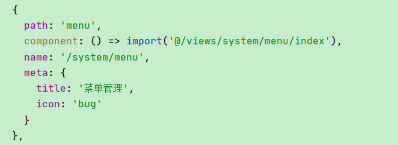

### F9：安装vue-treeselect第三方组件做添加和修改

- https://www.vue-treeselect.cn/
- npm install --save @riophae/vue-treeselect
- 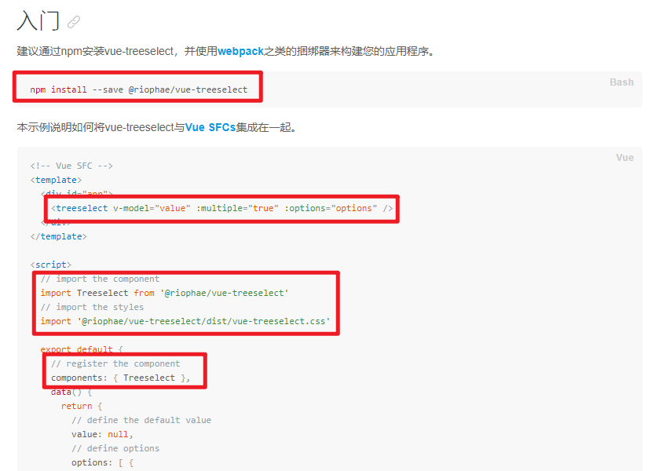

### F10：测试

- 测试通过

# 角色管理

## 后端

- 数据库表
  - sys_role
  - 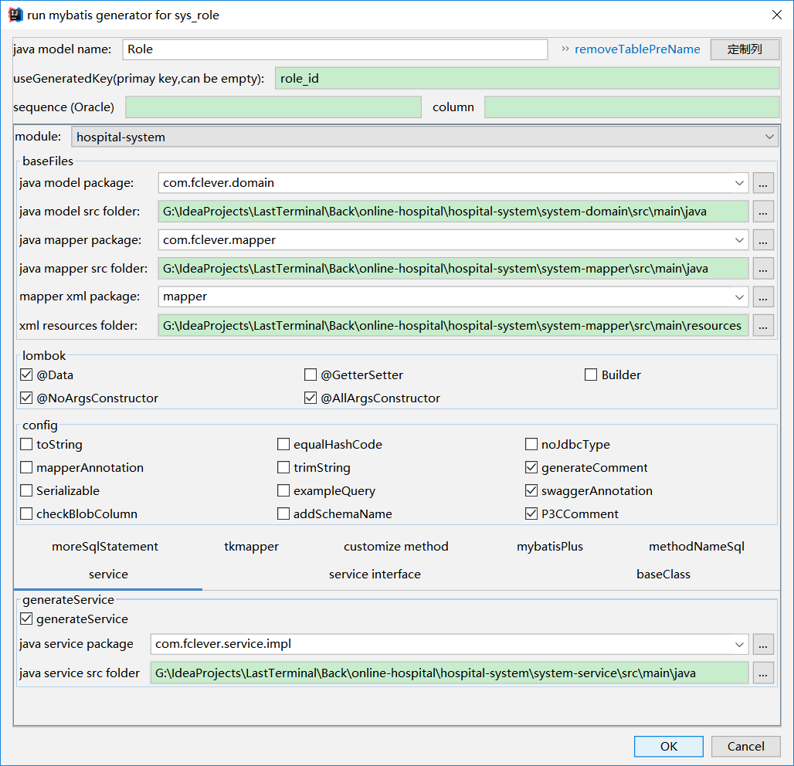

### F1：角色增删改查代码

#### F1.1：【system-domain】Role

~~~java
package com.fclever.domain;

import com.baomidou.mybatisplus.annotation.IdType;
import com.baomidou.mybatisplus.annotation.TableField;
import com.baomidou.mybatisplus.annotation.TableId;
import com.baomidou.mybatisplus.annotation.TableName;
import io.swagger.annotations.ApiModel;
import io.swagger.annotations.ApiModelProperty;
import java.util.Date;
import lombok.AllArgsConstructor;
import lombok.Data;
import lombok.EqualsAndHashCode;
import lombok.NoArgsConstructor;

/**
@author Fclever
@create 2020-11-29 11:19
*/
/**
    * 角色信息表
    */
@ApiModel(value="com-fclever-domain-Role")
@Data
@EqualsAndHashCode(callSuper=true)
@AllArgsConstructor
@NoArgsConstructor
@TableName(value = "sys_role")
public class Role extends BaseEntity {
    /**
     * 角色ID
     */
    @TableId(value = "role_id", type = IdType.AUTO)
    @ApiModelProperty(value="角色ID")
    private Long roleId;

    /**
     * 角色名称
     */
    @TableField(value = "role_name")
    @ApiModelProperty(value="角色名称")
    private String roleName;

    /**
     * 角色码值
     */
    @TableField(value = "role_code")
    @ApiModelProperty(value="角色码值")
    private String roleCode;

    /**
     * 显示顺序
     */
    @TableField(value = "role_sort")
    @ApiModelProperty(value="显示顺序")
    private Integer roleSort;

    /**
     * 备注
     */
    @TableField(value = "remark")
    @ApiModelProperty(value="备注")
    private String remark;

    /**
     * 角色状态（0正常 1停用）
     */
    @TableField(value = "status")
    @ApiModelProperty(value="角色状态（0正常 1停用）")
    private String status;

    /**
     * 创建时间
     */
    @TableField(value = "create_time")
    @ApiModelProperty(value="创建时间")
    private Date createTime;

    /**
     * 更新时间
     */
    @TableField(value = "update_time")
    @ApiModelProperty(value="更新时间")
    private Date updateTime;

    /**
     * 创建者
     */
    @TableField(value = "create_by")
    @ApiModelProperty(value="创建者")
    private String createBy;

    /**
     * 更新者
     */
    @TableField(value = "update_by")
    @ApiModelProperty(value="更新者")
    private String updateBy;

    /**
     * 删除标志（0代表存在 2代表删除）
     */
    @TableField(value = "del_flag")
    @ApiModelProperty(value="删除标志（0代表存在 2代表删除）")
    private String delFlag;

    public static final String COL_ROLE_ID = "role_id";

    public static final String COL_ROLE_NAME = "role_name";

    public static final String COL_ROLE_CODE = "role_code";

    public static final String COL_ROLE_SORT = "role_sort";

    public static final String COL_REMARK = "remark";

    public static final String COL_STATUS = "status";

    public static final String COL_CREATE_TIME = "create_time";

    public static final String COL_UPDATE_TIME = "update_time";

    public static final String COL_CREATE_BY = "create_by";

    public static final String COL_UPDATE_BY = "update_by";

    public static final String COL_DEL_FLAG = "del_flag";
}
~~~

#### F1.2：【system-domain】RoleDto

~~~java
package com.fclever.dto;

import com.baomidou.mybatisplus.annotation.IdType;
import com.baomidou.mybatisplus.annotation.TableField;
import com.baomidou.mybatisplus.annotation.TableId;
import com.baomidou.mybatisplus.annotation.TableName;
import com.fclever.domain.BaseEntity;
import io.swagger.annotations.ApiModel;
import io.swagger.annotations.ApiModelProperty;
import lombok.AllArgsConstructor;
import lombok.Data;
import lombok.EqualsAndHashCode;
import lombok.NoArgsConstructor;

import javax.validation.constraints.NotBlank;
import javax.validation.constraints.NotNull;
import java.util.Date;

/**
@author Fclever
@create 2020-11-29 11:19
*/

/**
    * 角色信息表  数据传输，封住
    */
@ApiModel(value="com-fclever-dto-RoleDto")
@Data
@EqualsAndHashCode(callSuper=true)
@AllArgsConstructor
@NoArgsConstructor
public class RoleDto extends BaseDto {
    /**
     * 角色ID
     */
    @ApiModelProperty(value="角色ID")
    private Long roleId;

    /**
     * 角色名称
     */
    @NotBlank(message = "角色名称不能为空")
    @ApiModelProperty(value="角色名称")
    private String roleName;

    /**
     * 角色码值
     */
    @NotBlank(message = "角色码值不能为空")
    @ApiModelProperty(value="角色码值")
    private String roleCode;

    /**
     * 显示顺序
     */
    @NotNull(message = "显示顺序不能为空")
    @ApiModelProperty(value="显示顺序")
    private Integer roleSort;

    /**
     * 备注
     */
    @ApiModelProperty(value="备注")
    private String remark;

    /**
     * 角色状态（0正常 1停用）
     */
    @NotBlank(message = "角色状态不能为空")
    @ApiModelProperty(value="角色状态（0正常 1停用）")
    private String status;

    /**
     * 删除标志（0代表存在 2代表删除）
     */
    @ApiModelProperty(value="删除标志（0代表存在 2代表删除）")
    private String delFlag;
}
~~~

#### F1.3：【system-interface】RoleService

~~~java
package com.fclever.service;

import com.fclever.domain.Role;
import com.baomidou.mybatisplus.extension.service.IService;
import com.fclever.dto.RoleDto;
import com.fclever.vo.DataGridView;

import java.util.List;

/**
@author Fclever
@create 2020-11-29 11:19
*/
public interface RoleService{

    /**
     * 分页查询角色信息
     * @param roleDto   查询条件
     * @return 返回数据
     */
    DataGridView listRoleForPage(RoleDto roleDto);

    /**
     * 添加角色信息
     * @param roleDto 添加的数据
     * @return 是否插入成功标志
     */
    int addRole(RoleDto roleDto);

    /**
     * 根据角色id查询对应角色信息
     * @param roleId 角色id
     * @return 查询到的数据
     */
    Role getRoleById(Long roleId);

    /**
     * 更新角色信息
     * @param roleDto  待更新的数据
     * @return  是否更新成功的标志
     */
    int updateRole(RoleDto roleDto);

    /**
     * 根据id删除角色信息（含批量）
     * @param roleIds   待删除的角色id集合
     * @return 是否删除成功标志
     */
    int deleteRoleByIds(Long[] roleIds);

    /**
     * 查询所有可用状态的菜单
     * @return  查询结果
     */
    List<Role> selectAllRoles();
}

~~~

#### F1.4：【system-service】RoleServiceImpl

~~~java
package com.fclever.service.impl;

import cn.hutool.core.bean.BeanUtil;
import cn.hutool.core.date.DateUtil;
import com.baomidou.mybatisplus.core.conditions.query.QueryWrapper;
import com.baomidou.mybatisplus.core.toolkit.StringUtils;
import com.baomidou.mybatisplus.extension.plugins.pagination.Page;
import com.fclever.constants.Constants;
import com.fclever.dto.RoleDto;
import com.fclever.vo.DataGridView;
import org.springframework.beans.factory.annotation.Autowired;
import org.springframework.stereotype.Service;
import javax.annotation.Resource;
import java.util.Arrays;
import java.util.List;
import com.baomidou.mybatisplus.extension.service.impl.ServiceImpl;
import com.fclever.domain.Role;
import com.fclever.mapper.RoleMapper;
import com.fclever.service.RoleService;
/**
@author Fclever
@create 2020-11-29 11:19
*/
@Service
public class RoleServiceImpl implements RoleService{

    @Autowired
    private RoleMapper roleMapper;

    /**
     * 分页查询角色信息
     * @param roleDto   查询条件
     * @return 返回数据
     */
    @Override
    public DataGridView listRoleForPage(RoleDto roleDto) {
        // 创建分页对象
        Page<Role> page = new Page<>(roleDto.getPageNum(), roleDto.getPageSize());
        // 封装查询条件
        QueryWrapper<Role> qw = new QueryWrapper<>();
        // 执行查询，并封装返回数据到分页实体
        // 模糊查询角色名称
        qw.like(StringUtils.isNotBlank(roleDto.getRoleName()), Role.COL_ROLE_NAME, roleDto.getRoleName());
        // 模糊查询角色码值
        qw.like(StringUtils.isNotBlank(roleDto.getRoleCode()), Role.COL_ROLE_CODE, roleDto.getRoleCode());
        // 精确匹配状态
        qw.eq(StringUtils.isNotBlank(roleDto.getStatus()), Role.COL_STATUS, roleDto.getStatus());
        // 范围匹配创建时间
        qw.ge(roleDto.getBeginTime() != null, Role.COL_CREATE_TIME, roleDto.getBeginTime());
        qw.le(roleDto.getEndTime() != null, Role.COL_CREATE_TIME,roleDto.getEndTime());
        // 按显示顺序排序
        qw.orderByAsc(Role.COL_ROLE_SORT);
        // 返回
        this.roleMapper.selectPage(page, qw);
        return new DataGridView(page.getTotal(), page.getRecords());
    }

    /**
     * 添加角色信息
     * @param roleDto 添加的数据
     * @return 是否插入成功标志
     */
    @Override
    public int addRole(RoleDto roleDto) {
        // 创建Role对象，与数据库交互
        Role role = new Role();
        BeanUtil.copyProperties(roleDto, role);
        // 设置创建人和创建时间
        role.setCreateBy(roleDto.getSimpleUser().getUserName());
        role.setCreateTime(DateUtil.date());
        return this.roleMapper.insert(role);
    }

    /**
     * 根据角色id查询对应角色信息
     * @param roleId 角色id
     * @return 查询到的数据
     */
    @Override
    public Role getRoleById(Long roleId) {
        return this.roleMapper.selectById(roleId);
    }

    /**
     * 更新角色信息
     * @param roleDto  待更新的数据
     * @return  是否更新成功的标志
     */
    @Override
    public int updateRole(RoleDto roleDto) {
        // 创建Role实体  与数据库交互
        Role role = new Role();
        // 拷贝数据
        BeanUtil.copyProperties(roleDto, role);
        // 设置更新人
        role.setUpdateBy(roleDto.getSimpleUser().getUserName());
        return this.roleMapper.updateById(role);
    }

    /**
     * 根据id删除角色信息（含批量）
     *      一个用户可以有多个角色，一个角色可以对应多个菜单
     *       删除一个用户的话，对应的用户--角色表中的数据也要删除
     *       删除一个角色的话，对应的用户--角色表中对应用户下的该角色记录也要删除，对应的角色--菜单表中对应角色的记录也要删除
     *       删除一个菜单的话，对应的角色--菜单表中对应角色下的该菜单记录也要删除
     * @param roleIds   待删除的角色id集合
     * @return 是否删除成功标志
     */
    @Override
    public int deleteRoleByIds(Long[] roleIds) {
        List<Long> roleIdsList = Arrays.asList(roleIds);
        if (roleIdsList != null && roleIdsList.size() >0 ){
            // 根据角色id删除sys_role_menu的数据
            this.roleMapper.deleteRoleMenuByRoleIds(roleIdsList);
            // 根据角色id删除sys_role_user的数据
            this.roleMapper.deleteRoleUserByRoleIds(roleIdsList);
            // 删除角色表数据
            return this.roleMapper.deleteBatchIds(roleIdsList);
        }
        return 0;
    }

    /**
     * 查询所有可用状态的菜单
     * @return  查询结果
     */
    @Override
    public List<Role> selectAllRoles() {
        // 封装查询条件
        QueryWrapper<Role> qw = new QueryWrapper<>();
        // 精确匹配状态
        qw.eq(Role.COL_STATUS, Constants.STATUS_TRUE);
        // 返回
        return this.roleMapper.selectList(qw);
    }
}

~~~

#### F1.5：【system-mapper】RoleMapper

~~~java
package com.fclever.mapper;

import com.baomidou.mybatisplus.core.mapper.BaseMapper;
import com.fclever.domain.Role;
import org.apache.ibatis.annotations.Param;

import java.util.List;

/**
@author Fclever
@create 2020-11-29 11:19
*/
public interface RoleMapper extends BaseMapper<Role> {

    /**
     * 根据角色id删除sys_role_menu的数据
     * @param roleIdsList 待删除的角色id
     */
    void deleteRoleMenuByRoleIds(@Param("roleIdsList") List<Long> roleIdsList);

    /**
     * 根据角色id删除sys_role_user的数据
     * @param roleIdsList 待删除的角色id
     */
    void deleteRoleUserByRoleIds(@Param("roleIdsList") List<Long> roleIdsList);
}
~~~

#### F1.6：【system-mapper】RoleMapper.xml

~~~xml
<?xml version="1.0" encoding="UTF-8"?>
<!DOCTYPE mapper PUBLIC "-//mybatis.org//DTD Mapper 3.0//EN" "http://mybatis.org/dtd/mybatis-3-mapper.dtd">
<mapper namespace="com.fclever.mapper.RoleMapper">
  <resultMap id="BaseResultMap" type="com.fclever.domain.Role">
    <!--@mbg.generated-->
    <!--@Table sys_role-->
    <id column="role_id" jdbcType="BIGINT" property="roleId" />
    <result column="role_name" jdbcType="VARCHAR" property="roleName" />
    <result column="role_code" jdbcType="VARCHAR" property="roleCode" />
    <result column="role_sort" jdbcType="INTEGER" property="roleSort" />
    <result column="remark" jdbcType="VARCHAR" property="remark" />
    <result column="status" jdbcType="CHAR" property="status" />
    <result column="create_time" jdbcType="TIMESTAMP" property="createTime" />
    <result column="update_time" jdbcType="TIMESTAMP" property="updateTime" />
    <result column="create_by" jdbcType="VARCHAR" property="createBy" />
    <result column="update_by" jdbcType="VARCHAR" property="updateBy" />
    <result column="del_flag" jdbcType="CHAR" property="delFlag" />
  </resultMap>
  <sql id="Base_Column_List">
    <!--@mbg.generated-->
    role_id, role_name, role_code, role_sort, remark, `status`, create_time, update_time, 
    create_by, update_by, del_flag
  </sql>

  <!--根据角色id删除sys_role_menu的数据-->
  <delete id="deleteRoleMenuByRoleIds">
    delete from sys_role_menu
    <where>
      <foreach collection="roleIdsList" open="role_id in (" separator="," close=")" item="roleId">
        #{roleId}
      </foreach>
    </where>
  </delete>

  <!--根据角色id删除sys_role_user的数据-->
  <delete id="deleteRoleUserByRoleIds">
    delete from sys_role_user
    <where>
      <foreach collection="roleIdsList" open="role_id in (" separator="," close=")" item="roleId">
        #{roleId}
      </foreach>
    </where>
  </delete>
</mapper>
~~~

#### F1.7：【system-web】RoleController

~~~java
package com.fclever.controller.system;

import com.fclever.domain.Role;
import com.fclever.dto.RoleDto;
import com.fclever.service.RoleService;
import com.fclever.utils.ShiroSecurityUtils;
import com.fclever.vo.AjaxResult;
import com.fclever.vo.DataGridView;
import org.aspectj.weaver.loadtime.Aj;
import org.springframework.beans.factory.annotation.Autowired;
import org.springframework.validation.annotation.Validated;
import org.springframework.web.bind.annotation.*;

import javax.validation.constraints.NotNull;
import java.util.List;

/**
 * 角色管理控制层
 * @author Fclever
 * @create 2020-11-29 13:55
 */
@RestController
@RequestMapping("system/role")
public class RoleController {

    @Autowired
    private RoleService roleService;

    /**
     * 分页查询角色信息
     * @param roleDto   查询条件
     * @return 返回数据
     */
    @GetMapping("listRoleForPage")
    public AjaxResult listRoleForPage(RoleDto roleDto){
        DataGridView list = this.roleService.listRoleForPage(roleDto);
        return AjaxResult.success("分页查询成功", list.getData(),list.getTotal());
    }

    /**
     * 添加角色信息
     * @param roleDto 添加的数据
     * @return 是否插入成功标志
     */
    @PostMapping("addRole")
    public AjaxResult addRole(@Validated RoleDto roleDto){
        roleDto.setSimpleUser(ShiroSecurityUtils.getCurrentSimpleUser());
        return AjaxResult.toAjax(this.roleService.addRole(roleDto));
    }

    /**
     * 根据角色id查询对应角色信息
     * @param roleId 角色id
     * @return 查询到的数据
     */
    @GetMapping("getRoleById/{roleId}")
    public AjaxResult getRoleById(@PathVariable Long roleId){
        Role role = this.roleService.getRoleById(roleId);
        return AjaxResult.success(role);
    }

    /**
     * 更新角色信息
     * @param roleDto  待更新的数据
     * @return  是否更新成功的标志
     */
    @PutMapping("updateRole")
    public AjaxResult updateRole(@Validated RoleDto roleDto){
        roleDto.setSimpleUser(ShiroSecurityUtils.getCurrentSimpleUser());
        return AjaxResult.toAjax(this.roleService.updateRole(roleDto));
    }

    /**
     * 根据id删除角色信息（含批量）
     * @param roleIds   待删除的角色id集合
     * @return 是否删除成功标志
     */
    @DeleteMapping("deleteRoleByIds/{roleIds}")
    public AjaxResult deleteRoleByIds(@PathVariable Long[] roleIds){
        return AjaxResult.toAjax(this.roleService.deleteRoleByIds(roleIds));
    }

    /**
     * 查询所有可用状态的菜单
     * @return  查询结果
     */
    @GetMapping("selectAllRoles")
    public AjaxResult selectAllRoles(){
        List<Role> roles = this.roleService.selectAllRoles();
        return AjaxResult.success(roles);
    }
}

~~~

#### F1.8：测试

- 测试通过

## 前端

### F2：增删改查

#### F2.1：创建src/api/system/role/role.js

~~~js
import request from '@/utils/request'

// 分页查询
export function listRoleForPage(query) {
  return request({
    url: '/system/role/listRoleForPage',
    method: 'get',
    params: query
  })
}

// 添加角色信息
export function addRole(data) {
  return request({
    url: '/system/role/addRole',
    method: 'post',
    params: data
  })
}

// 根据角色id查询角色信息
export function getRoleById(roleId) {
  return request({
    url: '/system/role/getRoleById/' + roleId,
    method: 'get'
  })
}

// 修改角色信息
export function updateRole(data) {
  return request({
    url: '/system/role/updateRole',
    method: 'put',
    params: data
  })
}

// 根据角色删除角色信息（含批量和删除角色-用户表和角色-菜单表数据）
export function deleteRoleByIds(roleIds) {
  return request({
    url: '/system/role/deleteRoleByIds/' + roleIds,
    method: 'delete'
  })
}

// 查询所有角色信息（可用状态）
export function selectAllRoles() {
  return request({
    url: '/system/role/selectAllRoles',
    method: 'get'
  })
}

~~~

#### F2.2：创建src/views/system/role/role/index.vue

~~~vue
<!--字典类型页面-->
<template>
  

    <!--查询条件开始-->
    <!--
      ref:
      model:绑定查询条件部分的数据绑定,与queryParams有关,点击查询按钮时,将查询参数传递到后台
      inline:变为行内域
      label-width:设置每个标签的宽度,指定在el-form上时,其直接子标签form-item会继承该值
    -->
    <el-form ref="queryForm" :model="queryParams" :inline="true" label-width="68px">
      <el-form-item label="角色名称" prop="roleName">
        <!--input输入框
          v-model:指定与queryParams中哪个属性进行动态绑定
          placeholder:输入框内默认填充的数据,获得焦点后消失
          clearable:是否可以一键清除
          size:输入框大小,影响内容大小
        -->
        <el-input
          v-model="queryParams.roleName"
          placeholder="请输入角色名称"
          clearable
          size="small"
          style="width:140px"
        />
      </el-form-item>
      <el-form-item label="角色码值" prop="roleCode">
        <el-input
          v-model="queryParams.roleCode"
          placeholder="请输入角色码值"
          clearable
          size="small"
          style="width:140px"
        />
      </el-form-item>
      <el-form-item label="状态" prop="status">
        <!--select下拉框-->
        <el-select
          v-model="queryParams.status"
          placeholder="状态"
          clearable
          size="small"
          style="width:140px"
        >
          <!--下拉框内容,遍历statusOptions属性,这里面保存了查询的状态的码表
            key:唯一标注
            label:标签
            value:实际存储的值
          -->
          <el-option
            v-for="dict in statusOptions"
            :key="dict.dictValue"
            :label="dict.dictLabel"
            :value="dict.dictValue"
          />
        </el-select>
      </el-form-item>
      <el-form-item label="创建时间">
        <!--date-picker:日期选择框
          value-format:日期格式
          type:类型,这里是可以选取范围数据
          range-separator:分隔符,页面显示中会把开始日期和结束日期用该符号分割开
          start-placeholder:第一个空的默认显示内容
          end-placeholder:第二个空的默认显示内容
        -->
        <el-date-picker
          v-model="dateRange"
          size="small"
          style="width:280px"
          value-format="yyyy-MM-dd"
          type="daterange"
          range-separator="-"
          start-placeholder="开始日期"
          end-placeholder="结束日期"
        />
      </el-form-item>
      <el-form-item>
        <!--查询和清空按钮-->
        <el-button type="primary" icon="el-icon-search" size="mini" @click="handleQuery">查询</el-button>
        <el-button type="primary" icon="el-icon-refresh" size="mini" @click="resetQuery">清空</el-button>
      </el-form-item>
    </el-form>
    <!--查询条件结束-->
    <!--操作栏按钮开始-->
    <!--el-row:表示一行数据
      gutter:每一栏之间的间隔
    -->
    <el-row :gutter="10" style="margin-bottom: 8px;">
      <!--el-col:表示一列
        span:指定该列所占的宽度,最大指定为24
      -->
      <el-col :span="1.5">
        <!--新增按钮:尺寸mini-->
        <el-button type="primary" icon="el-icon-plus" size="mini" @click="handleAdd">新增</el-button>
      </el-col>
      <el-col :span="1.5">
        <!--修改按钮:只有在选中一条记录的时候,才会处于可用状态-->
        <el-button type="success" icon="el-icon-edit" size="mini" :disabled="!single" @click="handleUpdate">修改</el-button>
      </el-col>
      <el-col :span="1.5">
        <!--删除按钮,只要有选中数据就可用,不管一条还是多条-->
        <el-button type="danger" icon="el-icon-delete" size="mini" :disabled="!multiple" @click="handleDelete">批量删除</el-button>
      </el-col>
    </el-row>
    <!--操作栏按钮结束-->
    <!--数据列表开始-->
    <!--el-table:数据列表
      v-loading:v-loading在接口未请求到数据之前，显示加载中，直到请求到数据后消失
      border:表示有边框
      data:数据列表中显示的数据从哪获取
      @selection-change:当选择项发生变化时会触发该事件
    -->
    <el-table v-loading="loading" border :data="roleTableList" @selection-change="handleSelectionChnage">
      <!--el-table-column:每一行中的每一列
        prop:对应从:data中取出的数据
        align:对齐方式
        label:列名
        show-overflow-tooltip:默认情况下数据过长不够显示的时候是换行显示,如果需要单行显示,可以使用这个,并且当鼠标移动到此处时会显示实际内容的提示信息
      -->
      <el-table-column type="selection" width="55" align="center" />
      <el-table-column label="角色ID" prop="roleId" align="center" width="100"/>
      <el-table-column label="角色名称" prop="roleName" align="center" :show-overflow-tooltip="true" />
      <el-table-column label="角色码值" prop="roleCode" align="center" :show-overflow-tooltip="true"></el-table-column>
      <!--formatter:用于按照指定要求来格式化此处需要显示的值,显示在列表中的数据是经过statusFormatter处理后的内容-->
      <el-table-column label="显示顺序" prop="roleSort" align="center" width="100"/>
      <el-table-column label="状态" prop="status" align="center" width="100" :formatter="statusFormatter" />
      <el-table-column label="备注" prop="remark" align="center" :show-overflow-tooltip="true" />
      <el-table-column label="创建时间" prop="createTime" align="center" width="180" />
      <el-table-column label="操作" align="center">
        <!--slot-scope="scope" 取到当前单元格-->
        <template slot-scope="scope">
          <!--传递该条数据到具体处理方法中-->
          <el-button type="text" icon="el-icon-edit" size="mini" @click="handleUpdate(scope.row)">修改</el-button>
          <el-button type="text" icon="el-icon-delete" size="mini" @click="handleDelete(scope.row)">删除</el-button>
        </template>
      </el-table-column>
    </el-table>
    <!--数据列表结束-->
    <!--底部分页开始-->
    <!--pagination:分页控件
      v-show:控制是否显示分页控件的条件,当数据列表中数据不为空才显示
      current-page:当前显示第几页
      page-sizes:可选的每页显示条数
      page-size:默认每页显示条数
      layout:设置分页格式:总数,每页条数,前一页,当前页,下一页,跳转至某一页
      total:总数
      @size-change:改变每页显示条数后触发方法
      @current-change:当前页发生改变的时候触发的方法
    -->
    <el-pagination
      v-show="total>0"
      :current-page="queryParams.pageNum"
      :page-sizes="[5, 10, 20, 30]"
      :page-size="queryParams.pageSize"
      layout="total, sizes, prev, pager, next, jumper"
      :total="total"
      @size-change="handleSizeChange"
      @current-change="handleCurrentChange"
    />
    <!--底部分页结束-->
    <!--新增和修改模态框开始-->
    <!--dialog:对话框
      title:模态框标题
      visible.sync:表示是否显示
      center:居中
      append-to-body:如果需要在一个对话框内部嵌套另一个对话框，需要使用append-to-body属性
    -->
    <el-dialog
      :title="title"
      :visible.sync="open"
      width="500px"
      center
      append-to-body
    >
      <!--添加和修改的表单
        rules:做表单数据前端校验
        label-width:标签宽度(文字)
      -->
      <el-form ref="form" :model="form" :rules="rules" label-width="80px">
        <el-form-item label="角色名称" prop="roleName">
          <el-input v-model="form.roleName" placeholder="请输入角色名称" clearable size="small" />
        </el-form-item>
        <el-form-item label="角色码值" prop="roleCode">
          <el-input v-model="form.roleCode" placeholder="请输入角色码值" clearable size="small" />
        </el-form-item>
        <el-form-item label="显示顺序" prop="roleSort">
          <el-input-number v-model="form.roleSort" size="small" :min="0"/>
        </el-form-item>
        <el-form-item label="状态" prop="status">
          <!--单选框-->
          <el-radio-group v-model="form.status">
            <el-radio
              v-for="dict in statusOptions"
              :key="dict.dictValue"
              :label="dict.dictValue"
              :value="dict.dictValue"
            >{{ dict.dictLabel }}</el-radio>
          </el-radio-group>
        </el-form-item>
        <el-form-item label="备注" prop="remark">
          <el-input v-model="form.remark" type="textarea" placeholder="请输入字典备注" clearable size="small" />
        </el-form-item>
      </el-form>
      
        <el-button type="primary" @click="handleSubmit">保 存</el-button>
        <el-button @click="cancel">取 消</el-button>
      
    </el-dialog>
    <!--新增和修改模态框结束-->
  

</template>

~~~

#### F2.3：修改src/router/index.js

- 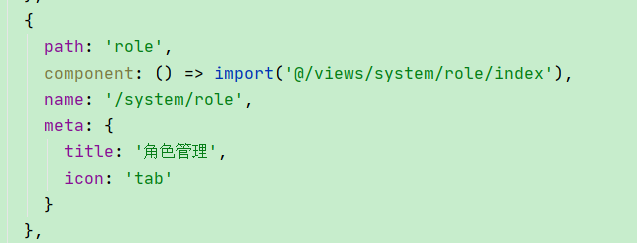

### F3：给角色分配菜单权限

#### F3.1：修改src/api/system/menu.js

- 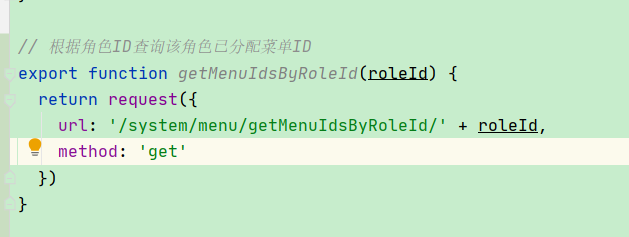

#### F3.2：修改src/api/system/role.js

- 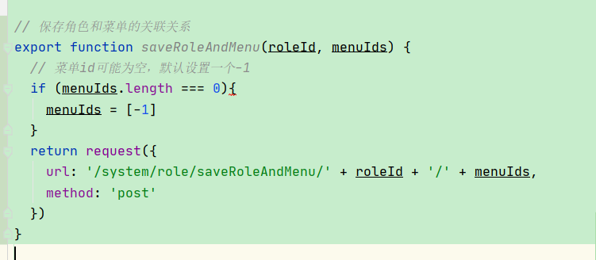

#### F3.3：修改src/views/system/role/index.vue

~~~vue
<!--字典类型页面-->
<template>
  

    <!--查询条件开始-->
    <!--
      ref:
      model:绑定查询条件部分的数据绑定,与queryParams有关,点击查询按钮时,将查询参数传递到后台
      inline:变为行内域
      label-width:设置每个标签的宽度,指定在el-form上时,其直接子标签form-item会继承该值
    -->
    <el-form ref="queryForm" :model="queryParams" :inline="true" label-width="68px">
      <el-form-item label="角色名称" prop="roleName">
        <!--input输入框
          v-model:指定与queryParams中哪个属性进行动态绑定
          placeholder:输入框内默认填充的数据,获得焦点后消失
          clearable:是否可以一键清除
          size:输入框大小,影响内容大小
        -->
        <el-input
          v-model="queryParams.roleName"
          placeholder="请输入角色名称"
          clearable
          size="small"
          style="width:140px"
        />
      </el-form-item>
      <el-form-item label="角色码值" prop="roleCode">
        <el-input
          v-model="queryParams.roleCode"
          placeholder="请输入角色码值"
          clearable
          size="small"
          style="width:140px"
        />
      </el-form-item>
      <el-form-item label="状态" prop="status">
        <!--select下拉框-->
        <el-select
          v-model="queryParams.status"
          placeholder="状态"
          clearable
          size="small"
          style="width:140px"
        >
          <!--下拉框内容,遍历statusOptions属性,这里面保存了查询的状态的码表
            key:唯一标注
            label:标签
            value:实际存储的值
          -->
          <el-option
            v-for="dict in statusOptions"
            :key="dict.dictValue"
            :label="dict.dictLabel"
            :value="dict.dictValue"
          />
        </el-select>
      </el-form-item>
      <el-form-item label="创建时间">
        <!--date-picker:日期选择框
          value-format:日期格式
          type:类型,这里是可以选取范围数据
          range-separator:分隔符,页面显示中会把开始日期和结束日期用该符号分割开
          start-placeholder:第一个空的默认显示内容
          end-placeholder:第二个空的默认显示内容
        -->
        <el-date-picker
          v-model="dateRange"
          size="small"
          style="width:280px"
          value-format="yyyy-MM-dd"
          type="daterange"
          range-separator="-"
          start-placeholder="开始日期"
          end-placeholder="结束日期"
        />
      </el-form-item>
      <el-form-item>
        <!--查询和清空按钮-->
        <el-button type="primary" icon="el-icon-search" size="mini" @click="handleQuery">查询</el-button>
        <el-button type="primary" icon="el-icon-refresh" size="mini" @click="resetQuery">清空</el-button>
      </el-form-item>
    </el-form>
    <!--查询条件结束-->
    <!--操作栏按钮开始-->
    <!--el-row:表示一行数据
      gutter:每一栏之间的间隔
    -->
    <el-row :gutter="10" style="margin-bottom: 8px;">
      <!--el-col:表示一列
        span:指定该列所占的宽度,最大指定为24
      -->
      <el-col :span="1.5">
        <!--新增按钮:尺寸mini-->
        <el-button type="primary" icon="el-icon-plus" size="mini" @click="handleAdd">新增</el-button>
      </el-col>
      <el-col :span="1.5">
        <!--修改按钮:只有在选中一条记录的时候,才会处于可用状态-->
        <el-button type="success" icon="el-icon-edit" size="mini" :disabled="!single" @click="handleUpdate">修改</el-button>
      </el-col>
      <el-col :span="1.5">
        <!--删除按钮,只要有选中数据就可用,不管一条还是多条-->
        <el-button type="danger" icon="el-icon-delete" size="mini" :disabled="!multiple" @click="handleDelete">批量删除</el-button>
      </el-col>
      <el-col :span="1.5">
        <!--删除按钮,只要有选中数据就可用,不管一条还是多条-->
        <el-button type="warning" icon="el-icon-thumb" size="mini" :disabled="!single" @click="handleAssign">分配菜单</el-button>
      </el-col>
    </el-row>
    <!--操作栏按钮结束-->
    <!--数据列表开始-->
    <!--el-table:数据列表
      v-loading:v-loading在接口未请求到数据之前，显示加载中，直到请求到数据后消失
      border:表示有边框
      data:数据列表中显示的数据从哪获取
      @selection-change:当选择项发生变化时会触发该事件
    -->
    <el-table v-loading="loading" border :data="roleTableList" @selection-change="handleSelectionChnage">
      <!--el-table-column:每一行中的每一列
        prop:对应从:data中取出的数据
        align:对齐方式
        label:列名
        show-overflow-tooltip:默认情况下数据过长不够显示的时候是换行显示,如果需要单行显示,可以使用这个,并且当鼠标移动到此处时会显示实际内容的提示信息
      -->
      <el-table-column type="selection" width="55" align="center" />
      <el-table-column label="角色ID" prop="roleId" align="center" width="100"/>
      <el-table-column label="角色名称" prop="roleName" align="center" :show-overflow-tooltip="true" />
      <el-table-column label="角色码值" prop="roleCode" align="center" :show-overflow-tooltip="true"></el-table-column>
      <!--formatter:用于按照指定要求来格式化此处需要显示的值,显示在列表中的数据是经过statusFormatter处理后的内容-->
      <el-table-column label="显示顺序" prop="roleSort" align="center" width="100"/>
      <el-table-column label="状态" prop="status" align="center" width="100" :formatter="statusFormatter" />
      <el-table-column label="备注" prop="remark" align="center" :show-overflow-tooltip="true" />
      <el-table-column label="创建时间" prop="createTime" align="center" width="180" />
      <el-table-column label="操作" align="center">
        <!--slot-scope="scope" 取到当前单元格-->
        <template slot-scope="scope">
          <!--传递该条数据到具体处理方法中-->
          <el-button type="text" icon="el-icon-edit" size="mini" @click="handleUpdate(scope.row)">修改</el-button>
          <el-button type="text" icon="el-icon-delete" size="mini" @click="handleDelete(scope.row)">删除</el-button>
          <el-button type="text" icon="el-icon-thumb" size="mini" @click="handleAssign(scope.row)">分配菜单</el-button>
        </template>
      </el-table-column>
    </el-table>
    <!--数据列表结束-->
    <!--底部分页开始-->
    <!--pagination:分页控件
      v-show:控制是否显示分页控件的条件,当数据列表中数据不为空才显示
      current-page:当前显示第几页
      page-sizes:可选的每页显示条数
      page-size:默认每页显示条数
      layout:设置分页格式:总数,每页条数,前一页,当前页,下一页,跳转至某一页
      total:总数
      @size-change:改变每页显示条数后触发方法
      @current-change:当前页发生改变的时候触发的方法
    -->
    <el-pagination
      v-show="total>0"
      :current-page="queryParams.pageNum"
      :page-sizes="[5, 10, 20, 30]"
      :page-size="queryParams.pageSize"
      layout="total, sizes, prev, pager, next, jumper"
      :total="total"
      @size-change="handleSizeChange"
      @current-change="handleCurrentChange"
    />
    <!--底部分页结束-->
    <!--新增和修改模态框开始-->
    <!--dialog:对话框
      title:模态框标题
      visible.sync:表示是否显示
      center:居中
      append-to-body:如果需要在一个对话框内部嵌套另一个对话框，需要使用append-to-body属性
    -->
    <el-dialog
      :title="title"
      :visible.sync="open"
      width="500px"
      center
      append-to-body
    >
      <!--添加和修改的表单
        rules:做表单数据前端校验
        label-width:标签宽度(文字)
      -->
      <el-form ref="form" :model="form" :rules="rules" label-width="80px">
        <el-form-item label="角色名称" prop="roleName">
          <el-input v-model="form.roleName" placeholder="请输入角色名称" clearable size="small" />
        </el-form-item>
        <el-form-item label="角色码值" prop="roleCode">
          <el-input v-model="form.roleCode" placeholder="请输入角色码值" clearable size="small" />
        </el-form-item>
        <el-form-item label="显示顺序" prop="roleSort">
          <el-input-number v-model="form.roleSort" size="small" :min="0"/>
        </el-form-item>
        <el-form-item label="状态" prop="status">
          <!--单选框-->
          <el-radio-group v-model="form.status">
            <el-radio
              v-for="dict in statusOptions"
              :key="dict.dictValue"
              :label="dict.dictValue"
              :value="dict.dictValue"
            >{{ dict.dictLabel }}</el-radio>
          </el-radio-group>
        </el-form-item>
        <el-form-item label="备注" prop="remark">
          <el-input v-model="form.remark" type="textarea" placeholder="请输入字典备注" clearable size="small" />
        </el-form-item>
      </el-form>
      
        <el-button type="primary" @click="handleSubmit">保 存</el-button>
        <el-button @click="cancel">取 消</el-button>
      
    </el-dialog>
    <!--新增和修改模态框结束-->
    <!--分配菜单模态框开始-->
    <el-dialog
      :title="title"
      :visible.sync="assignOpen"
      width="500px"
      center
      append-to-body>
      <!--
      node-key：每个树节点用来作为唯一标识的属性，整棵树应该是唯一的
        :props
          label：	指定节点标签为节点对象的某个属性值
          children：指定子树为节点对象的某个属性值

      -->
      <el-tree
        ref="tree"
        :data="menuOptions"
        show-checkbox
        node-key="menuId"
        highlight-current
        empty-text="数据加载中，请稍后ing"
        :props="{id: 'menuId', children: 'children', label: 'menuName'}"
      >
      </el-tree>
      
        <el-button type="primary" @click="handleAssignSave">保 存</el-button>
        <el-button @click="cancelAssign">取 消</el-button>
      
    </el-dialog>
    <!--分配菜单模态框结束-->
  

</template>

~~~

## 后端接续

### F2：角色分配菜单

#### F2.1：【system-web】修改MenuController

~~~java
/**
     * 根据角色id查询该角色已经分配的所有菜单id（仅仅查询子菜单id）
     * @param roleId    角色id
     * @return  查询结果
     */
    @GetMapping("getMenuIdsByRoleId/{roleId}")
    public AjaxResult getMenuIdsByRoleId(@PathVariable Long roleId){
        List<Long> menuIds = this.menuService.getMenuIdsByRoleId(roleId);
        return AjaxResult.success("查询对应角色的菜单权限成功",menuIds);
    }
~~~

#### F2.2：【system-interface】修改MenuService

- 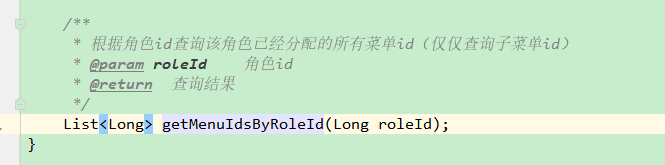

#### F2.3：【system-service】修改MenuServiceImpl

- 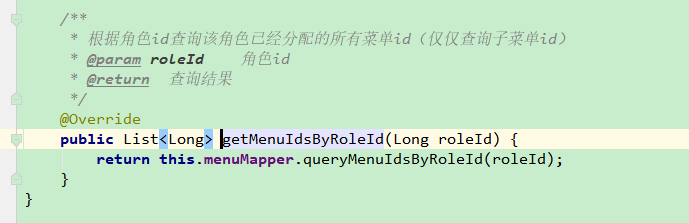

#### F2.4：【system-mapper】修改MenuMapper

- 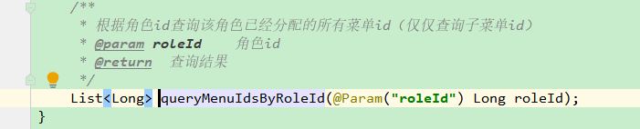

#### F2.5：【system-mapper】修改MenuMapper.xml

~~~XML
<!--根据角色id查询该角色已经分配的所有菜单id(仅仅查询子菜单id  not in就是用来排除是父菜单id的条件）-->
  <!--
    select rmone.menu_id from sys_role_menu rmone
    where rmone.role_id = #{roleId}
          可以查询到角色-菜单关联表中，要查询的角色id已经分配的菜单id
          但是这样的查询结果中含有父菜单id，如果按这种形式返回到前台，那么会导致某个父菜单下明明仅仅选择了非全部子菜单，
          但是显示为全部勾选
    and rm.menu_id not in
    (
        select m.parent_id from sys_menu m
        inner join sys_role_menu rmtwo
        on m.menu_id = rmtwo.menu_id and rmtwo.role_id = #{roleId}
    )
          这里进行进一步过滤，联合菜单表和角色-菜单关联表，查找出两表中menu_id相同的记录
          并且筛选出这些记录中在关联表中的角色id为查询的角色id，这样的话，就可以查询出所有和外层select同样的结果
          但是最终是通过菜单表，找到以上数据的父菜单id，只要外层查询结果的菜单id不再这些父菜单id之内，就表示为子菜单id
    以下两个SQL查询结果是一样的
          select rmone.menu_id from sys_role_menu rmone
          where rmone.role_id = #{roleId}

          select m.menu_id from sys_menu m
          inner join sys_role_menu rmtwo
          on m.menu_id = rmtwo.menu_id and rmtwo.role_id = #{roleId}
    括号内的作用+and rm.menu_id not in  就是为了把父菜单排除掉，因为只要返回子菜单，前端就可以自动判断父菜单是全选还是半选
  -->
  <select id="queryMenuIdsByRoleId" resultType="java.lang.Long">
    select rmone.menu_id from sys_role_menu rmone
    where rmone.role_id = #{roleId} and rmone.menu_id not in
    (
        select distinct(m.parent_id) from sys_menu m
        inner join sys_role_menu rmtwo
        on m.menu_id = rmtwo.menu_id and rmtwo.role_id = #{roleId}
    )
  </select>
~~~

#### F2.6：【system-web】修改RoleController

- 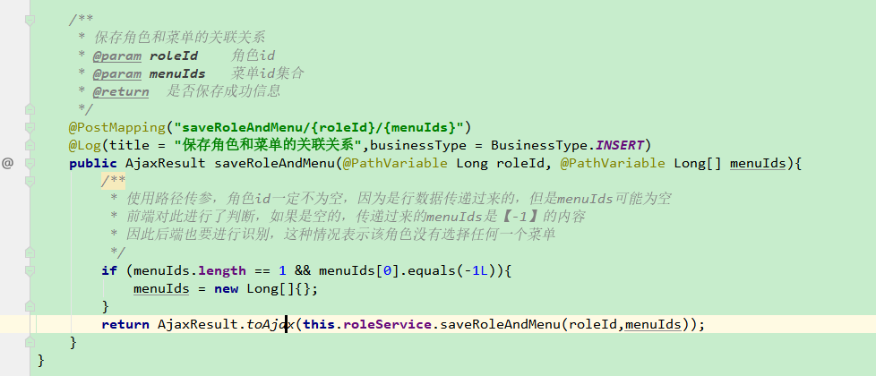

#### F2.7：【system-interface】修改RoleService

- 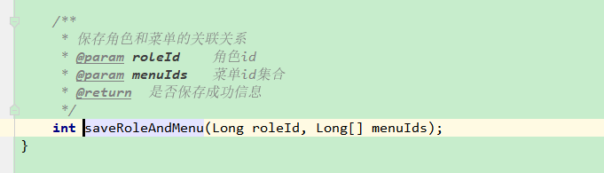

#### F2.8：【system-service】修改RoleServiceImpl

- 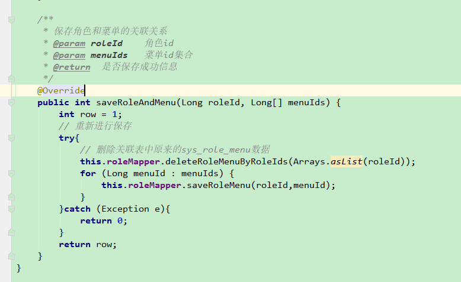

#### F2.9：【system-mapper】修改RoleMapper

- 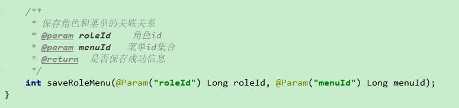

#### F2.10：【system-mapper】修改RoleMapper.xml

- 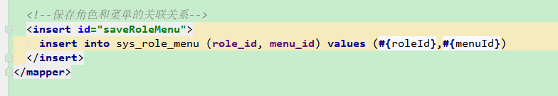

#### F2.11：测试

- 通过

# 用户管理

- 数据库表
  - sys_user
  - 代码之前已经生成过了
  - 有些字段需要修改一下注释和名称

## 后端

### F1：用户增删改查重置代码相关代码

#### F1.1：【hospital-commons】创建AppMd5Utils

~~~java
package com.fclever.utils;

import org.apache.shiro.crypto.hash.Md5Hash;

import java.util.UUID;

/**
 * Md5加密工具类
 * @author Fclever
 * @create 2020-11-30 12:12
 */
public class Md5Utils {

    /**
     * 生成盐
     * @return
     */
    public static String createSalt(){
        return UUID.randomUUID().toString().replace("-", "").toUpperCase();
    }

    /**
     * 生成加密字符串
     * @param source 待加密数据
     * @param salt  盐值
     * @param hashIterations  散列次数
     * @return
     */
    public static String md5(String source, String salt, Integer hashIterations){
        return new Md5Hash(source,salt,hashIterations).toString();
    }
}

~~~

#### F1.2：【hospital-commons】修改pom.xml

~~~xml
<!--Shiro核心包（包含加密jar）-->
        <dependency>
            <groupId>org.apache.shiro</groupId>
            <artifactId>shiro-core</artifactId>
            <version>1.4.2</version>
        </dependency>
~~~

#### F1.3：【system-domain】修改User

~~~java
package com.fclever.domain;

import com.baomidou.mybatisplus.annotation.IdType;
import com.baomidou.mybatisplus.annotation.TableField;
import com.baomidou.mybatisplus.annotation.TableId;
import com.baomidou.mybatisplus.annotation.TableName;
import com.fasterxml.jackson.annotation.JsonIgnoreProperties;
import io.swagger.annotations.ApiModel;
import io.swagger.annotations.ApiModelProperty;
import java.util.Date;
import lombok.AllArgsConstructor;
import lombok.Data;
import lombok.EqualsAndHashCode;
import lombok.NoArgsConstructor;

/**
@author Fclever
@create 2020-10-20 13:13
*/
/**
    * 用户信息表
    */
@ApiModel(value="com-fclever-domain-User")
@Data
@EqualsAndHashCode(callSuper=true)
@AllArgsConstructor
@NoArgsConstructor
@TableName(value = "sys_user")
@JsonIgnoreProperties(value = {"salt","password","unionId","openId"}) // 忽略一些属性，不用返回到前端，避免信息泄露
public class User extends BaseEntity{
    /**
     * 用户ID
     */
    @TableId(value = "user_id", type = IdType.AUTO)
    @ApiModelProperty(value="用户ID")
    private Long userId;

    /**
     * 部门ID
     */
    @TableField(value = "dept_id")
    @ApiModelProperty(value="科室ID")
    private Long deptId;

    /**
     * 用户账号
     */
    @TableField(value = "user_name")
    @ApiModelProperty(value="用户名称")
    private String userName;

    /**
     * 用户类型（0超级用户为 1为系统用户）
     */
    @TableField(value = "user_type")
    @ApiModelProperty(value="用户类型（0超级用户为 1为系统用户）")
    private String userType;

    /**
     * 用户性别（0男 1女 2未知）
     */
    @TableField(value = "sex")
    @ApiModelProperty(value="用户性别（0男 1女 2未知）")
    private String sex;

    /**
     * 年龄
     */
    @TableField(value = "age")
    @ApiModelProperty(value="年龄")
    private Integer age;

    /**
     * 头像
     */
    @TableField(value = "picture")
    @ApiModelProperty(value="头像")
    private String picture;

    /**
     * 学历 sys_dict_type:sys_user_background
     */
    @TableField(value = "background")
    @ApiModelProperty(value="学历 字典：sys_user_background")
    private String background;

    /**
     * 电话
     */
    @TableField(value = "phone")
    @ApiModelProperty(value="电话")
    private String phone;

    /**
     * 用户邮箱
     */
    @TableField(value = "email")
    @ApiModelProperty(value="用户邮箱")
    private String email;

    /**
     * 擅长
     */
    @TableField(value = "hobby")
    @ApiModelProperty(value="爱好")
    private String hobby;

    /**
     * 荣誉
     */
    @TableField(value = "honor")
    @ApiModelProperty(value="荣誉")
    private String honor;

    /**
     * 简介
     */
    @TableField(value = "introduction")
    @ApiModelProperty(value="简介")
    private String introduction;

    /**
     * 
医生级别sys_dict_type:sys_user_level
     */
    @TableField(value = "user_rank")
    @ApiModelProperty(value=",医生级别   字典：sys_user_level")
    private String userRank;

    /**
     * 密码
     */
    @TableField(value = "password")
    @ApiModelProperty(value="密码")
    private String password;

    /**
     * 最后一次登录时间
     */
    @TableField(value = "last_login_time")
    @ApiModelProperty(value="最后一次登录时间")
    private Date lastLoginTime;

    /**
     * 最后登陆IP
     */
    @TableField(value = "last_login_ip")
    @ApiModelProperty(value="最后登陆IP")
    private String lastLoginIp;

    /**
     * 帐号状态（0正常 1停用）
     */
    @TableField(value = "status")
    @ApiModelProperty(value="帐号状态（0正常 1停用）")
    private String status;

    @TableField(value = "union_id")
    @ApiModelProperty(value="")
    private String unionId;

    /**
     * 用户授权登录openid 扩展第三方登陆使用
     */
    @TableField(value = "open_id")
    @ApiModelProperty(value="用户授权登录openid 扩展第三方登陆使用")
    private String openId;

    /**
     * 创建时间
     */
    @TableField(value = "create_time")
    @ApiModelProperty(value="创建时间")
    private Date createTime;

    /**
     * 更新时间
     */
    @TableField(value = "update_time")
    @ApiModelProperty(value="更新时间")
    private Date updateTime;

    /**
     * 创建者
     */
    @TableField(value = "create_by")
    @ApiModelProperty(value="创建者")
    private String createBy;

    /**
     * 更新者
     */
    @TableField(value = "update_by")
    @ApiModelProperty(value="更新者")
    private String updateBy;

    /**
     * 盐
     */
    @TableField(value = "salt")
    @ApiModelProperty(value="盐")
    private String salt;

    /**
     * 删除标志（0正常 1删除）
     */
    @TableField(value = "del_flag")
    @ApiModelProperty(value="删除标志（0正常 1删除）")
    private String delFlag;

    /**
     * 是否需要参与排班0需要,1 不需要
     */
    @TableField(value = "scheduling_flag")
    @ApiModelProperty(value="是否需要参与排班0需要,1 不需要")
    private String schedulingFlag;

    public static final String COL_USER_ID = "user_id";

    public static final String COL_DEPT_ID = "dept_id";

    public static final String COL_USER_NAME = "user_name";

    public static final String COL_USER_TYPE = "user_type";

    public static final String COL_SEX = "sex";

    public static final String COL_AGE = "age";

    public static final String COL_PICTURE = "picture";

    public static final String COL_BACKGROUND = "background";

    public static final String COL_PHONE = "phone";

    public static final String COL_EMAIL = "email";

    public static final String COL_HOBBY = "hobby";

    public static final String COL_HONOR = "honor";

    public static final String COL_INTRODUCTION = "introduction";

    public static final String COL_USER_RANK = "user_rank";

    public static final String COL_PASSWORD = "password";

    public static final String COL_LAST_LOGIN_TIME = "last_login_time";

    public static final String COL_LAST_LOGIN_IP = "last_login_ip";

    public static final String COL_STATUS = "status";

    public static final String COL_UNION_ID = "union_id";

    public static final String COL_OPEN_ID = "open_id";

    public static final String COL_CREATE_TIME = "create_time";

    public static final String COL_UPDATE_TIME = "update_time";

    public static final String COL_CREATE_BY = "create_by";

    public static final String COL_UPDATE_BY = "update_by";

    public static final String COL_SALT = "salt";

    public static final String COL_DEL_FLAG = "del_flag";

    public static final String COL_SCHEDULING_FLAG = "scheduling_flag";
}
~~~

#### F1.4：【system-domain】创建UserDto

~~~java
package com.fclever.dto;

import com.baomidou.mybatisplus.annotation.IdType;
import com.baomidou.mybatisplus.annotation.TableField;
import com.baomidou.mybatisplus.annotation.TableId;
import com.baomidou.mybatisplus.annotation.TableName;
import com.fclever.domain.BaseEntity;
import io.swagger.annotations.ApiModel;
import io.swagger.annotations.ApiModelProperty;
import lombok.AllArgsConstructor;
import lombok.Data;
import lombok.EqualsAndHashCode;
import lombok.NoArgsConstructor;

import javax.validation.constraints.NotBlank;
import javax.validation.constraints.NotNull;
import java.util.Date;

/**
@author Fclever
@create 2020-10-20 13:13
*/

/**
    * 用户信息表
    */
@ApiModel(value="com-fclever-dto-UserDto")
@Data
@EqualsAndHashCode(callSuper=true)
@AllArgsConstructor
@NoArgsConstructor
public class UserDto extends BaseDto{
    /**
     * 用户ID
     */
    @ApiModelProperty(value="用户ID")
    private Long userId;

    /**
     * 部门ID
     */
    @ApiModelProperty(value="科室ID")
    @NotNull(message = "科室id不能为空")
    private Long deptId;

    /**
     * 用户账号
     */
    @ApiModelProperty(value="用户名称")
    @NotBlank(message = "用户名称不能为空")
    private String userName;

    /**
     * 用户类型（0超级用户为 1为系统用户）
     */
    @ApiModelProperty(value="用户类型（0超级用户为 1为系统用户）")
    private String userType;

    /**
     * 用户性别（0男 1女 2未知）
     */
    @ApiModelProperty(value="用户性别（0男 1女 2未知）")
    @NotBlank(message = "用户性别不能为空")
    private String sex;

    /**
     * 年龄
     */
    @ApiModelProperty(value="年龄")
    private Integer age;

    /**
     * 头像
     */
    @ApiModelProperty(value="头像")
    private String picture;

    /**
     * 学历 sys_dict_type:sys_user_background
     */
    @ApiModelProperty(value="学历 字典：sys_user_background")
    @NotBlank(message = "用户学历不能为空")
    private String background;

    /**
     * 电话
     */
    @ApiModelProperty(value="电话")
    @NotBlank(message = "电话不能为空")
    private String phone;

    /**
     * 用户邮箱
     */
    @ApiModelProperty(value="用户邮箱")
    private String email;

    /**
     * 擅长
     */
    @ApiModelProperty(value="爱好")
    private String hobby;

    /**
     * 荣誉
     */
    @ApiModelProperty(value="荣誉")
    private String honor;

    /**
     * 简介
     */
    @ApiModelProperty(value="简介")
    private String introduction;

    /**
     * 医生级别sys_dict_type:sys_user_level
     */
    @ApiModelProperty(value=",医生级别   字典：sys_user_level")
    @NotBlank(message = "医生级别不能为空")
    private String userRank;

    /**
     * 帐号状态（0正常 1停用）
     */
    @ApiModelProperty(value="帐号状态（0正常 1停用）")
    @NotBlank(message = "账号状态不能为空")
    private String status;

    /**
     * 是否需要参与排班0需要,1 不需要
     */
    @ApiModelProperty(value="是否需要参与排班0需要,1 不需要")
    @NotBlank(message = "是否排班信息不能为空")
    private String schedulingFlag;
}
~~~

#### F1.5：【system-interface】修改UserService

~~~java
package com.fclever.service;

import com.fclever.domain.User;
import com.baomidou.mybatisplus.extension.service.IService;
import com.fclever.dto.UserDto;
import com.fclever.vo.DataGridView;

import java.util.List;

/**
@author Fclever
@create 2020-10-20 13:13
*/
public interface UserService{

    /**
     * 根据手机号查询用户
     *      用户登录是通过手机号和密码
     *      shiro验证：先通过手机号判断用户是否存在，如果存在则继续判断密码正确与否
     * @param phone
     * @return
     */
    User queryUserByPhone(String phone);

    /**
     * 分页查询用户信息
     * @param userDto 查询条件
     * @return 查询结果
     */
    DataGridView listUserForPage(UserDto userDto);

    /**
     * 添加用户信息
     * @param userDto 待添加数据
     * @return 插入成功标志
     */
    int addUser(UserDto userDto);

    /**
     * 根据用户id查询用户
     *      登录之后需要获取用户相关信息，基于token，也就需要用id来查询
     * @param userId
     * @return 查询结果
     */
    User getUserById(Long userId);

    /**
     * 修改用户信息
     * @param userDto 待修改数据
     * @return 修改成功标志
     */
    int updateUser(UserDto userDto);

    /**
     * 根据id删除用户信息（含批量）
     * @param userIds 待删除的用户id数组
     * @return 是否删除成功标志
     */
    int deleteUserByIds(Long[] userIds);

    /**
     * 重置用户密码
     * @param userIds 待重置密码的用户id数组
     * @return 是否重置成功的标志
     */
    int resetPassword(Long[] userIds);

    /**
     * 查询所有用户信息（可用）
     * @return 查询结果
     */
    List<User> selectAllUser();
}

~~~

#### F1.6：【system-service】修改UserServiceImpl

~~~java
package com.fclever.service.impl;

import cn.hutool.core.bean.BeanUtil;
import cn.hutool.core.date.DateUtil;
import com.baomidou.mybatisplus.core.conditions.query.QueryWrapper;
import com.baomidou.mybatisplus.core.toolkit.StringUtils;
import com.baomidou.mybatisplus.extension.plugins.pagination.Page;
import com.fclever.constants.Constants;
import com.fclever.dto.UserDto;
import com.fclever.mapper.RoleMapper;
import com.fclever.mapper.UserMapper;
import com.fclever.utils.Md5Utils;
import com.fclever.vo.DataGridView;
import org.springframework.beans.factory.annotation.Autowired;
import org.springframework.stereotype.Service;
import com.fclever.domain.User;
import com.fclever.service.UserService;

import java.util.Arrays;
import java.util.List;

/**
@author Fclever
@create 2020-10-20 13:13
*/
@Service
public class UserServiceImpl implements UserService{

    @Autowired
    private UserMapper userMapper;

    @Autowired
    private RoleMapper roleMapper;

    /**
     * 根据手机号查询用户
     *      用户登录是通过手机号和密码
     *      shiro验证：先通过手机号判断用户是否存在，如果存在则继续判断密码正确与否
     * @param phone
     * @return
     */
    @Override
    public User queryUserByPhone(String phone) {
        // 创建查询条件对象
        QueryWrapper<User> qw = new QueryWrapper<>();
        // 封装查询条件
        qw.eq(User.COL_PHONE, phone);
        // 执行查询操作
        User user = this.userMapper.selectOne(qw);
        return user;
    }

    /**
     * 分页查询用户信息
     * @param userDto 查询条件
     * @return 查询结果
     */
    @Override
    public DataGridView listUserForPage(UserDto userDto) {
        // 创建分页对象
        Page<User> page = new Page<>(userDto.getPageNum(), userDto.getPageSize());
        // 创建查询条件对象
        QueryWrapper<User> qw = new QueryWrapper<>();
        // 封装查询条件
        // 精确匹配科室名称---下拉码表，保存的是科室id
        qw.eq(userDto.getDeptId() != null,User.COL_DEPT_ID, userDto.getDeptId());
        // 模糊匹配用户名称
        qw.like(StringUtils.isNotBlank(userDto.getUserName()), User.COL_USER_NAME, userDto.getUserName());
        // 模糊匹配手机号
        qw.like(StringUtils.isNotBlank(userDto.getPhone()), User.COL_PHONE, userDto.getPhone());
        // 精确匹配状态
        qw.eq(StringUtils.isNotBlank(userDto.getStatus()), User.COL_STATUS, userDto.getStatus());
        // 范围匹配创建时间
        qw.ge(userDto.getBeginTime() != null,User.COL_CREATE_TIME, userDto.getBeginTime());
        qw.le(userDto.getBeginTime() != null,User.COL_CREATE_TIME, userDto.getEndTime());
        qw.orderByAsc(User.COL_UNION_ID);
        // 执行查询
        this.userMapper.selectPage(page, qw);
        // 封装返回数据并返回
        return new DataGridView(page.getTotal(), page.getRecords());
    }

    /**
     * 添加用户信息
     * @param userDto 待添加数据
     * @return 插入成功标志
     */
    @Override
    public int addUser(UserDto userDto) {
        // 创建User
        User user = new User();
        // 值拷贝
        BeanUtil.copyProperties(userDto, user);
        // 设置一些默认值
        user.setUserType(Constants.USER_NORMAL); // 系统用户，超级管理员是固定的
        // 取出电话前5位，进行盐加密之后保存为密码
        String defaultPassword = user.getPhone().substring(5);
        user.setSalt(Md5Utils.createSalt());
        user.setPassword(Md5Utils.md5(defaultPassword, user.getSalt(), 2));
        // 设置创建者和创建时间
        user.setCreateBy(userDto.getSimpleUser().getUserName());
        user.setCreateTime(DateUtil.date());
        // 执行插入操作
        return this.userMapper.insert(user);
    }

    /**
     * 根据用户id查询用户
     *      登录之后需要获取用户相关信息，基于token，也就需要用id来查询
     * @param userId 待查询的用户id
     * @return 查询结果
     */
    @Override
    public User getUserById(Long userId) {
        return this.userMapper.selectById(userId);
    }

    /**
     * 修改用户信息
     * @param userDto 待修改数据
     * @return 修改成功标志
     */
    @Override
    public int updateUser(UserDto userDto) {
        // 创建User实体
        User user = new User();
        // 值拷贝
        BeanUtil.copyProperties(userDto, user);
        // 设置更新人
        user.setUpdateBy(userDto.getSimpleUser().getUserName());
        // 执行更新
        return this.userMapper.updateById(user);
    }

    /**
     * 根据id删除用户信息（含批量）
     * @param userIds 待删除的用户id数组
     * @return 是否删除成功标志
     */
    @Override
    public int deleteUserByIds(Long[] userIds) {
        List<Long> userIdsList = Arrays.asList(userIds);
        if (userIdsList != null && userIdsList.size() >0 ){
            // 也要删除对应的用户--角色表数据
            this.roleMapper.deleteRoleUserByUserIds(userIdsList);
            return this.userMapper.deleteBatchIds(userIdsList);
        }
        return 0;
    }

    /**
     * 重置用户密码
     * @param userIds 待重置密码的用户id数组
     * @return 是否重置成功的标志
     */
    @Override
    public int resetPassword(Long[] userIds) {
        int row = 0;
        for (Long userId : userIds) {
            User user = this.userMapper.selectById(userId);
            String defaultPassword = "";
            // 如果是超级管理员，密码就是123456
            if (user.getUserType().equals(Constants.USER_ADMIN)){
                defaultPassword = "123456";
            }else {
                // 电话号码为11位，substring截取的是从索引为5（包括）的位置开始截取到最后
                // "Harbison".substring(3) returns "bison"
                defaultPassword = user.getPhone().substring(5);
            }
            user.setSalt(Md5Utils.createSalt());
            user.setPassword(Md5Utils.md5(defaultPassword, user.getSalt(), 2));
            row += this.userMapper.updateById(user);
        }
        return row > 0 ? row : 0;
    }

    /**
     * 查询所有用户信息（可用）
     * @return 查询结果
     */
    @Override
    public List<User> selectAllUser() {
        // 创建查询条件对象
        QueryWrapper<User> qw = new QueryWrapper<>();
        // 设置查询条件
        qw.eq(User.COL_STATUS, Constants.STATUS_TRUE);
        // 系统用户
        qw.eq(User.COL_USER_TYPE, Constants.USER_NORMAL);
        qw.orderByAsc(User.COL_USER_ID);
        // 执行查询操作并返回结果
        return this.userMapper.selectList(qw);
    }

}

~~~

#### F1.7：【system-mapper】修改RoleMapper

- 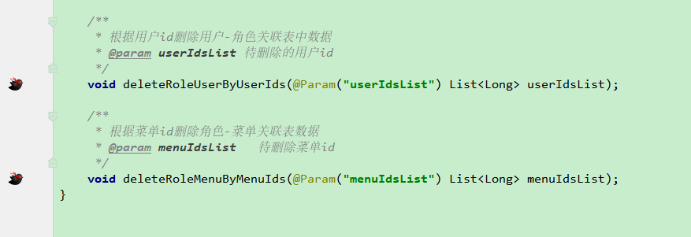

#### F1.8：【system-mapper】修改RoleMapper.xml

- 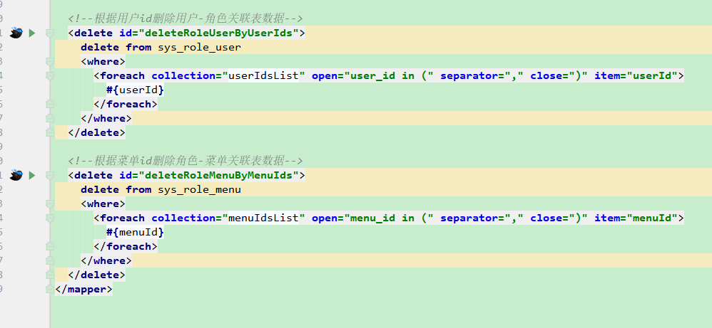

#### F1.9：【system-service】修改MenuServiceImpl

- 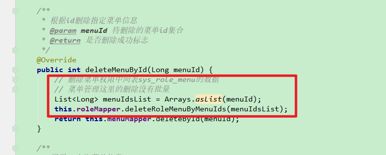

#### F1.10：【system-web】创建UserController

~~~java
package com.fclever.controller.system;

import com.fclever.aspectj.annotation.Log;
import com.fclever.aspectj.enums.BusinessType;
import com.fclever.dto.UserDto;
import com.fclever.service.UserService;
import com.fclever.utils.ShiroSecurityUtils;
import com.fclever.vo.AjaxResult;
import com.fclever.vo.DataGridView;
import org.springframework.beans.factory.annotation.Autowired;
import org.springframework.validation.annotation.Validated;
import org.springframework.web.bind.annotation.*;

import javax.validation.constraints.NotEmpty;
import javax.validation.constraints.NotNull;
import java.util.List;

/**
 * 用户管理控制层
 * @author Fclever
 * @create 2020-11-30 18:14
 */
@RestController
@RequestMapping("system/user")
public class UserController {
    
    @Autowired
    private UserService userService;

    /**
     * 分页查询用户信息
     * @param userDto 查询条件
     * @return 结果
     */
    @GetMapping("listUserForPage")
    public AjaxResult listUserForPage(UserDto userDto){
        DataGridView list = this.userService.listUserForPage(userDto);
        return AjaxResult.success("分页查询用户信息成功", list.getData(), list.getTotal());
    }

    /**
     * 添加用户信息
     * @param userDto 待添加数据
     * @return 结果
     */
    @PostMapping("addUser")
    @Log(title = "添加用户信息",businessType = BusinessType.INSERT)
    public AjaxResult addUser(@Validated UserDto userDto){
        // 设置登录用户作为创建者
        userDto.setSimpleUser(ShiroSecurityUtils.getCurrentSimpleUser());
        return AjaxResult.toAjax(this.userService.addUser(userDto));
    }

    /**
     * 根据用户id查询用户
     *      登录之后需要获取用户相关信息，基于token，也就需要用id来查询
     * @param userId
     * @return 结果
     */
    @GetMapping("getUserById/{userId}")
    public AjaxResult getUserById(@PathVariable  @Validated @NotEmpty(message = "用户id不能为空") Long userId){
        return AjaxResult.success(this.userService.getUserById(userId));
    }

    /**
     * 修改用户信息
     * @param userDto 待修改数据
     * @return 结果
     */
    @PutMapping("updateUser")
    @Log(title = "修改用户信息",businessType = BusinessType.UPDATE)
    public AjaxResult updateUser(@Validated UserDto userDto){
        // 设置登录用户作为更新这
        userDto.setSimpleUser(ShiroSecurityUtils.getCurrentSimpleUser());
        return AjaxResult.toAjax(this.userService.updateUser(userDto));
    }

    /**
     * 根据id删除用户信息（含批量）
     * @param userIds 待删除的用户id数组
     * @return 结果
     */
    @DeleteMapping("deleteUserByIds/{userIds}")
    @Log(title = "删除用户信息（含批量）",businessType = BusinessType.DELETE)
    public AjaxResult deleteUserByIds(@PathVariable  @Validated @NotNull(message = "用户id不能为空") Long[] userIds){
        return AjaxResult.toAjax(this.userService.deleteUserByIds(userIds));
    }

    /**
     * 重置用户密码
     * @param userIds 待重置密码的用户id数组
     * @return 结果
     */
    @PutMapping("resetPassword/{userIds}")
    @Log(title = "重置用户密码",businessType = BusinessType.UPDATE)
    public AjaxResult resetPassword(@PathVariable @Validated @NotEmpty(message = "用户id不能为空") Long[] userIds){
        if (userIds.length > 0){
            return AjaxResult.toAjax(this.userService.resetPassword(userIds));
        }
        return AjaxResult.fail("重置密码失败，请至少选择一个用户");
    }

    /**
     * 查询所有用户信息（可用）
     * @return 结果
     */
    @GetMapping("selectAllUser")
    public AjaxResult selectAllUser(){
        return AjaxResult.success(this.userService.selectAllUser());
    }
}

~~~

## 前端

### F2：用户管理增删改查

#### F2.1：创建src/api/system/user/user.js

~~~js
import request from '@/utils/request'

// 分页查询用户信息
export function listUserForPage(query) {
  return request({
    url: '/system/user/listUserForPage',
    method: 'get',
    params: query
  })
}

// 添加用户信息
export function addUser(data) {
  return request({
    url: '/system/user/addUser',
    method: 'post',
    params: data
  })
}

// 根据用户id查询对应的用户信息
export function getUserById(userId) {
  return request({
    url: '/system/user/getUserById/' + userId,
    method: 'get'
  })
}

// 修改用户信息
export function updateUser(data) {
  return request({
    url: '/system/user/updateUser',
    method: 'put',
    params: data
  })
}

// 根据id删除用户信息（含批量）
export function deleteUserByIds(userIds) {
  return request({
    url: '/system/user/deleteUserByIds/' + userIds,
    method: 'delete'
  })
}

// 重置用户密码
export function resetPassword(userIds) {
  return request({
    url: '/system/user/resetPassword/' + userIds,
    method: 'put'
  })
}

// 查询所有用户信息（可用|系统用户）
export function selectAllUser() {
  return request({
    url: '/system/user/selectAllUser',
    method: 'get'
  })
}
~~~

#### F2.2：修改src/router/index.js

- 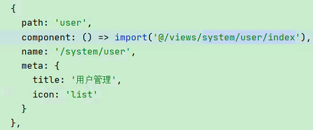

#### F2.3：创建src/views/system/user/index.vue

~~~vue
<!--用户管理页面-->
<template>
  

    <!--查询条件开始-->
    <!--
      ref:
      model:绑定查询条件部分的数据绑定,与queryParams有关,点击查询按钮时,将查询参数传递到后台
      inline:变为行内域
      label-width:设置每个标签的宽度,指定在el-form上时,其直接子标签form-item会继承该值
    -->
    <el-form ref="queryForm" :model="queryParams" :inline="true" label-width="68px">
      <el-form-item label="所属科室" prop="deptId">
        <!--select下拉框-->
        <el-select
          v-model="queryParams.deptId"
          placeholder="请选择科室"
          clearable
          size="small"
          style="width:140px"
        >
          <!--下拉框内容,遍历statusOptions属性,这里面保存了查询的状态的码表
            key:唯一标注
            label:标签
            value:实际存储的值
          -->
          <el-option
            v-for="dict in deptOptions"
            :key="dict.deptId"
            :label="dict.deptName"
            :value="dict.deptId"
          />
        </el-select>
      </el-form-item>
      <el-form-item label="用户名称" prop="userName">
        <!--input输入框
          v-model:指定与queryParams中哪个属性进行动态绑定
          placeholder:输入框内默认填充的数据,获得焦点后消失
          clearable:是否可以一键清除
          size:输入框大小,影响内容大小
        -->
        <el-input
          v-model="queryParams.userName"
          placeholder="请输入用户名称"
          clearable
          size="small"
          style="width:140px"
        />
      </el-form-item>
      <el-form-item label="手机号码" prop="phone">
        <el-input
          v-model="queryParams.phone"
          placeholder="请输入手机号"
          clearable
          size="small"
          style="width:140px"
        />
      </el-form-item>
      <el-form-item label="状态" prop="status">
        <!--select下拉框-->
        <el-select
          v-model="queryParams.status"
          placeholder="状态"
          clearable
          size="small"
          style="width:140px"
        >
          <!--下拉框内容,遍历statusOptions属性,这里面保存了查询的状态的码表
            key:唯一标注
            label:标签
            value:实际存储的值
          -->
          <el-option
            v-for="dict in statusOptions"
            :key="dict.dictValue"
            :label="dict.dictLabel"
            :value="dict.dictValue"
          />
        </el-select>
      </el-form-item>
      <el-form-item label="创建时间">
        <!--date-picker:日期选择框
          value-format:日期格式
          type:类型,这里是可以选取范围数据
          range-separator:分隔符,页面显示中会把开始日期和结束日期用该符号分割开
          start-placeholder:第一个空的默认显示内容
          end-placeholder:第二个空的默认显示内容
        -->
        <el-date-picker
          v-model="dateRange"
          size="small"
          style="width:280px"
          value-format="yyyy-MM-dd"
          type="daterange"
          range-separator="-"
          start-placeholder="开始日期"
          end-placeholder="结束日期"
        />
      </el-form-item>
      <el-form-item>
        <!--查询和清空按钮-->
        <el-button type="primary" icon="el-icon-search" size="mini" @click="handleQuery">查询</el-button>
        <el-button type="primary" icon="el-icon-refresh" size="mini" @click="resetQuery">清空</el-button>
      </el-form-item>
    </el-form>
    <!--查询条件结束-->
    <!--操作栏按钮开始-->
    <!--el-row:表示一行数据
      gutter:每一栏之间的间隔
    -->
    <el-row :gutter="10" style="margin-bottom: 8px;">
      <!--el-col:表示一列
        span:指定该列所占的宽度,最大指定为24
      -->
      <el-col :span="1.5">
        <!--新增按钮:尺寸mini-->
        <el-button type="primary" icon="el-icon-plus" size="mini" @click="handleAdd">新增</el-button>
      </el-col>
      <el-col :span="1.5">
        <!--修改按钮:只有在选中一条记录的时候,才会处于可用状态-->
        <el-button type="success" icon="el-icon-edit" size="mini" :disabled="!single" @click="handleUpdate">修改</el-button>
      </el-col>
      <el-col :span="1.5">
        <!--删除按钮,只要有选中数据就可用,不管一条还是多条-->
        <el-button type="danger" icon="el-icon-delete" size="mini" :disabled="!multiple" @click="handleDelete">批量删除</el-button>
      </el-col>
      <el-col :span="1.5">
        <!--重置密码  多选-->
        <el-button type="info" icon="el-icon-refresh" size="mini" @click="resetPassword">重置密码</el-button>
      </el-col>
    </el-row>
    <!--操作栏按钮结束-->
    <!--数据列表开始-->
    <!--el-table:数据列表
      v-loading:v-loading在接口未请求到数据之前，显示加载中，直到请求到数据后消失
      border:表示有边框
      data:数据列表中显示的数据从哪获取
      @selection-change:当选择项发生变化时会触发该事件
    -->
    <el-table v-loading="loading" border :data="userTableList" @selection-change="handleSelectionChange">
      <!--el-table-column:每一行中的每一列
        prop:对应从:data中取出的数据
        align:对齐方式
        label:列名
        show-overflow-tooltip:默认情况下数据过长不够显示的时候是换行显示,如果需要单行显示,可以使用这个,并且当鼠标移动到此处时会显示实际内容的提示信息
      -->
      <el-table-column type="selection" width="55" align="center" />
      <el-table-column type="expand">
        <template slot-scope="scope">
          <el-form label-position="left" inline class="demo-table-expand">
            <el-form-item label="邮箱">
              {{scope.row.email}}
            </el-form-item>
            <el-form-item label="擅长">
              {{scope.row.hobby}}
            </el-form-item>
            <el-form-item label="荣誉">
              {{scope.row.honor}}
            </el-form-item>
            <el-form-item label="简介">
              {{scope.row.introduction}}
            </el-form-item>
          </el-form>
        </template>
      </el-table-column>
      <el-table-column label="用户ID" prop="userId" align="center" width="100"/>
      <el-table-column label="用户名称" prop="userName" align="center" :show-overflow-tooltip="true" />
      <!--部门如何显示-->
      <el-table-column label="所属部门" prop="deptId" align="center" :show-overflow-tooltip="true" :formatter="deptFormatter"></el-table-column>
      <!--formatter:用于按照指定要求来格式化此处需要显示的值,显示在列表中的数据是经过statusFormatter处理后的内容-->
      <el-table-column label="手机号码" prop="phone" align="center" width="110"/>
      <el-table-column label="性别" prop="sex" align="center" width="100" :formatter="sexFormatter"/>
      <el-table-column label="年龄" prop="age" align="center" width="100"/>
      <el-table-column label="是否排班" prop="schedulingFlag" align="center" width="100" :formatter="schedulingFlagFormatter"/>
      <el-table-column label="级别" prop="userRank" align="center" width="100" :formatter="userRankFormatter"/>
      <el-table-column label="学历" prop="background" align="center" width="100" :formatter="backgroundFormatter"/>
      <el-table-column label="状态" prop="status" align="center" width="100" :formatter="statusFormatter" />
      <el-table-column label="创建时间" prop="createTime" align="center" width="180" />
      <el-table-column label="操作" align="center">
        <!--slot-scope="scope" 取到当前单元格-->
        <template slot-scope="scope">
          <!--传递该条数据到具体处理方法中-->
          <el-button type="text" icon="el-icon-edit" size="mini" @click="handleUpdate(scope.row)">修改</el-button>
          <el-button v-if="scope.row.userId != 1" type="text" icon="el-icon-delete" size="mini" @click="handleDelete(scope.row)">删除</el-button>
        </template>
      </el-table-column>
    </el-table>
    <!--数据列表结束-->
    <!--底部分页开始-->
    <!--pagination:分页控件
      v-show:控制是否显示分页控件的条件,当数据列表中数据不为空才显示
      current-page:当前显示第几页
      page-sizes:可选的每页显示条数
      page-size:默认每页显示条数
      layout:设置分页格式:总数,每页条数,前一页,当前页,下一页,跳转至某一页
      total:总数
      @size-change:改变每页显示条数后触发方法
      @current-change:当前页发生改变的时候触发的方法
    -->
    <el-pagination
      v-show="total>0"
      :current-page="queryParams.pageNum"
      :page-sizes="[5, 10, 20, 30]"
      :page-size="queryParams.pageSize"
      layout="total, sizes, prev, pager, next, jumper"
      :total="total"
      @size-change="handleSizeChange"
      @current-change="handleCurrentChange"
    />
    <!--底部分页结束-->
    <!--新增和修改模态框开始-->
    <!--dialog:对话框
      title:模态框标题
      visible.sync:表示是否显示
      center:居中
      append-to-body:如果需要在一个对话框内部嵌套另一个对话框，需要使用append-to-body属性
    -->
    <el-dialog
      :title="title"
      :visible.sync="open"
      width="800px"
      center
      append-to-body
    >
      <el-form ref="form" :model="form" :rules="rules" label-width="100px">
        <el-row>
          <el-col :span="12">
            <el-form-item label="用户名称" prop="userName">
              <el-input v-model="form.userName" style="width:240px" placeholder="请输入用户名称" clearable size="small" />
            </el-form-item></el-col>
          <el-col :span="12">
            <el-form-item label="手机号" prop="phone">
              <el-input v-model="form.phone" style="width:240px" placeholder="请输入手机号" clearable size="small" />
            </el-form-item></el-col>
        </el-row>
        <el-row>
          <el-col :span="12">
            <el-form-item label="所属科室" prop="deptId">
              <el-select
                v-model="form.deptId"
                placeholder="所属科室"
                clearable
                size="small"
                style="width:240px"
              >
                <el-option
                  v-for="item in deptOptions"
                  :key="item.deptId"
                  :label="item.deptName"
                  :value="item.deptId"
                />
              </el-select>
            </el-form-item>
          </el-col>
          <el-col :span="12">
            <el-form-item label="用户级别" prop="userRank">
              <el-select
                v-model="form.userRank"
                placeholder="用户级别"
                clearable
                size="small"
                style="width:240px"
              >
                <el-option
                  v-for="item in userRankOptions"
                  :key="item.dictValue"
                  :label="item.dictLabel"
                  :value="item.dictValue"
                />
              </el-select>
            </el-form-item>
          </el-col>
        </el-row>
        <el-row>
          <el-col :span="12">
            <el-form-item label="年龄" prop="age">
              <el-input-number v-model="form.age" clearable size="small" :min="0"/>
            </el-form-item>
          </el-col>
          <el-col :span="12">
            <el-form-item label="背景" prop="background">
              <el-select
                v-model="form.background"
                placeholder="学历"
                clearable
                size="small"
                style="width:240px"
              >
                <el-option
                  v-for="item in backgroundOptions"
                  :key="item.dictValue"
                  :label="item.dictLabel"
                  :value="item.dictValue"
                />
              </el-select>
            </el-form-item>
          </el-col>
        </el-row>
        <el-row>
          <el-col :span="12">
            <el-form-item label="性别" prop="sex">
              <el-radio-group v-model="form.sex">
                <el-radio
                  v-for="item in sexOptions"
                  :key="item.dictValue"
                  :label="item.dictValue"
                  :value="item.dictValue"
                >{{ item.dictLabel }}</el-radio>
              </el-radio-group>
            </el-form-item>
          </el-col>
          <el-col :span="12">
            <el-form-item label="状态" prop="status">
              <el-radio-group v-model="form.status">
                <el-radio
                  v-for="item in statusOptions"
                  :key="item.dictValue"
                  :label="item.dictValue"
                  :value="item.dictValue"
                >{{ item.dictLabel }}</el-radio>
              </el-radio-group>
            </el-form-item>
          </el-col>
        </el-row>
        <el-row>
          <el-col :span="12">
            <el-form-item label="是否参与排班" prop="schedulingFlag">
              <el-radio-group v-model="form.schedulingFlag">
                <el-radio
                  v-for="item in schedulingFlagOptions"
                  :key="item.dictValue"
                  :label="item.dictValue"
                  :value="item.dictValue"
                >{{ item.dictLabel }}</el-radio>
              </el-radio-group>
            </el-form-item>
          </el-col>
          <el-col :span="12">
            <el-form-item label="邮箱" prop="email">
              <el-input v-model="form.email" style="width:240px" placeholder="请输入用户邮箱" clearable size="small" />
            </el-form-item>
          </el-col>
        </el-row>
        <el-row>
          <el-col :span="24">
            <el-form-item label="擅长" prop="hobby">
              <el-input v-model="form.hobby" type="textarea" placeholder="请输入用户擅长" autosize resize="none"/>
            </el-form-item>
          </el-col>
          <el-col :span="24">
            <el-form-item label="荣誉" prop="honor">
              <el-input v-model="form.honor" type="textarea" placeholder="请输入用户相关荣誉" autosize resize="none"/>
            </el-form-item>
          </el-col>
          <el-col :span="24">
            <el-form-item label="简介" prop="introduction">
              <el-input v-model="form.introduction" type="textarea" placeholder="请输入用户简介" autosize resize="none"/>
            </el-form-item>
          </el-col>
        </el-row>
      </el-form>
      
        <el-button type="primary" @click="handleSubmit">确 定</el-button>
        <el-button @click="cancel">取 消</el-button>
      
    </el-dialog>
    <!--新增和修改模态框结束-->
    <!--分配菜单模态框开始-->
    <el-dialog
      :title="title"
      :visible.sync="assignOpen"
      width="500px"
      center
      append-to-body>
      <!--
      node-key：每个树节点用来作为唯一标识的属性，整棵树应该是唯一的
        :props
          label：	指定节点标签为节点对象的某个属性值
          children：指定子树为节点对象的某个属性值

      -->
      <el-tree
        ref="tree"
        :data="roleOptions"
        show-checkbox
        node-key="menuId"
        highlight-current
        empty-text="数据加载中，请稍后ing"
        :props="{id: 'menuId', children: 'children', label: 'menuName'}"
      >
      </el-tree>
      
<!--        <el-button type="primary" @click="handleAssignSave">保 存</el-button>-->
<!--        <el-button @click="cancelAssign">取 消</el-button>-->
      
    </el-dialog>
    <!--分配菜单模态框结束-->
  

</template>

~~~

### F3：分配角色

#### F3.1：修改src/api/system/role/role.js

- 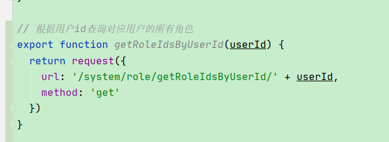

#### F3.2：修改src/api/system/user/user.js

- 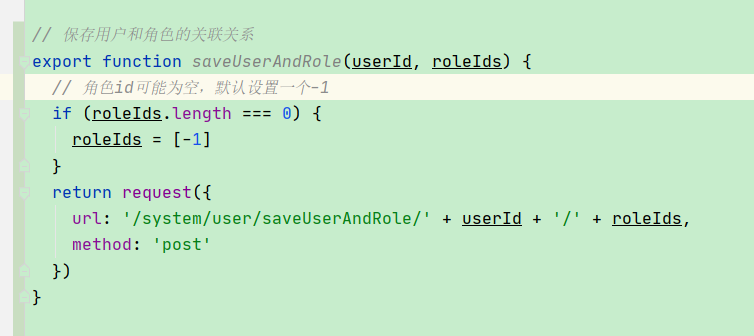

#### F3.2：修改src/views/system/user/index.vue

~~~vue
<!--用户管理页面-->
<template>
  

    <!--查询条件开始-->
    <!--
      ref:
      model:绑定查询条件部分的数据绑定,与queryParams有关,点击查询按钮时,将查询参数传递到后台
      inline:变为行内域
      label-width:设置每个标签的宽度,指定在el-form上时,其直接子标签form-item会继承该值
    -->
    <el-form ref="queryForm" :model="queryParams" :inline="true" label-width="68px">
      <el-form-item label="所属科室" prop="deptId">
        <!--select下拉框-->
        <el-select
          v-model="queryParams.deptId"
          placeholder="请选择科室"
          clearable
          size="small"
          style="width:140px"
        >
          <!--下拉框内容,遍历statusOptions属性,这里面保存了查询的状态的码表
            key:唯一标注
            label:标签
            value:实际存储的值
          -->
          <el-option
            v-for="dict in deptOptions"
            :key="dict.deptId"
            :label="dict.deptName"
            :value="dict.deptId"
          />
        </el-select>
      </el-form-item>
      <el-form-item label="用户名称" prop="userName">
        <!--input输入框
          v-model:指定与queryParams中哪个属性进行动态绑定
          placeholder:输入框内默认填充的数据,获得焦点后消失
          clearable:是否可以一键清除
          size:输入框大小,影响内容大小
        -->
        <el-input
          v-model="queryParams.userName"
          placeholder="请输入用户名称"
          clearable
          size="small"
          style="width:140px"
        />
      </el-form-item>
      <el-form-item label="手机号码" prop="phone">
        <el-input
          v-model="queryParams.phone"
          placeholder="请输入手机号"
          clearable
          size="small"
          style="width:140px"
        />
      </el-form-item>
      <el-form-item label="状态" prop="status">
        <!--select下拉框-->
        <el-select
          v-model="queryParams.status"
          placeholder="状态"
          clearable
          size="small"
          style="width:140px"
        >
          <!--下拉框内容,遍历statusOptions属性,这里面保存了查询的状态的码表
            key:唯一标注
            label:标签
            value:实际存储的值
          -->
          <el-option
            v-for="dict in statusOptions"
            :key="dict.dictValue"
            :label="dict.dictLabel"
            :value="dict.dictValue"
          />
        </el-select>
      </el-form-item>
      <el-form-item label="创建时间">
        <!--date-picker:日期选择框
          value-format:日期格式
          type:类型,这里是可以选取范围数据
          range-separator:分隔符,页面显示中会把开始日期和结束日期用该符号分割开
          start-placeholder:第一个空的默认显示内容
          end-placeholder:第二个空的默认显示内容
        -->
        <el-date-picker
          v-model="dateRange"
          size="small"
          style="width:280px"
          value-format="yyyy-MM-dd"
          type="daterange"
          range-separator="-"
          start-placeholder="开始日期"
          end-placeholder="结束日期"
        />
      </el-form-item>
      <el-form-item>
        <!--查询和清空按钮-->
        <el-button type="primary" icon="el-icon-search" size="mini" @click="handleQuery">查询</el-button>
        <el-button type="primary" icon="el-icon-refresh" size="mini" @click="resetQuery">清空</el-button>
      </el-form-item>
    </el-form>
    <!--查询条件结束-->
    <!--操作栏按钮开始-->
    <!--el-row:表示一行数据
      gutter:每一栏之间的间隔
    -->
    <el-row :gutter="10" style="margin-bottom: 8px;">
      <!--el-col:表示一列
        span:指定该列所占的宽度,最大指定为24
      -->
      <el-col :span="1.5">
        <!--新增按钮:尺寸mini-->
        <el-button type="primary" icon="el-icon-plus" size="mini" @click="handleAdd">新增</el-button>
      </el-col>
      <el-col :span="1.5">
        <!--修改按钮:只有在选中一条记录的时候,才会处于可用状态-->
        <el-button type="success" icon="el-icon-edit" size="mini" :disabled="!single" @click="handleUpdate">修改</el-button>
      </el-col>
      <el-col :span="1.5">
        <!--删除按钮,只要有选中数据就可用,不管一条还是多条-->
        <el-button type="danger" icon="el-icon-delete" size="mini" :disabled="!multiple" @click="handleDelete">批量删除</el-button>
      </el-col>
      <el-col :span="1.5">
        <el-button type="warning" icon="el-icon-refresh" size="mini" :disabled="!single" @click="handleAssign">分配角色</el-button>
      </el-col>
      <el-col :span="1.5">
        <!--重置密码  多选-->
        <el-button type="info" icon="el-icon-refresh" size="mini" @click="resetPassword">重置密码</el-button>
      </el-col>
    </el-row>
    <!--操作栏按钮结束-->
    <!--数据列表开始-->
    <!--el-table:数据列表
      v-loading:v-loading在接口未请求到数据之前，显示加载中，直到请求到数据后消失
      border:表示有边框
      data:数据列表中显示的数据从哪获取
      @selection-change:当选择项发生变化时会触发该事件
    -->
    <el-table v-loading="loading" border :data="userTableList" @selection-change="handleSelectionChange">
      <!--el-table-column:每一行中的每一列
        prop:对应从:data中取出的数据
        align:对齐方式
        label:列名
        show-overflow-tooltip:默认情况下数据过长不够显示的时候是换行显示,如果需要单行显示,可以使用这个,并且当鼠标移动到此处时会显示实际内容的提示信息
      -->
      <el-table-column type="selection" width="55" align="center" />
      <el-table-column type="expand">
        <template slot-scope="scope">
          <el-form label-position="left" inline class="demo-table-expand">
            <el-form-item label="邮箱">
              {{scope.row.email}}
            </el-form-item>
            <el-form-item label="擅长">
              {{scope.row.hobby}}
            </el-form-item>
            <el-form-item label="荣誉">
              {{scope.row.honor}}
            </el-form-item>
            <el-form-item label="简介">
              {{scope.row.introduction}}
            </el-form-item>
          </el-form>
        </template>
      </el-table-column>
      <el-table-column label="用户ID" prop="userId" align="center" width="100"/>
      <el-table-column label="用户名称" prop="userName" align="center" :show-overflow-tooltip="true" />
      <!--部门如何显示-->
      <el-table-column label="所属部门" prop="deptId" align="center" :show-overflow-tooltip="true" :formatter="deptFormatter"></el-table-column>
      <!--formatter:用于按照指定要求来格式化此处需要显示的值,显示在列表中的数据是经过statusFormatter处理后的内容-->
      <el-table-column label="手机号码" prop="phone" align="center" width="110"/>
      <el-table-column label="性别" prop="sex" align="center" width="100" :formatter="sexFormatter"/>
      <el-table-column label="年龄" prop="age" align="center" width="100"/>
      <el-table-column label="是否排班" prop="schedulingFlag" align="center" width="100" :formatter="schedulingFlagFormatter"/>
      <el-table-column label="级别" prop="userRank" align="center" width="100" :formatter="userRankFormatter"/>
      <el-table-column label="学历" prop="background" align="center" width="100" :formatter="backgroundFormatter"/>
      <el-table-column label="状态" prop="status" align="center" width="100" :formatter="statusFormatter" />
      <el-table-column label="创建时间" prop="createTime" align="center" width="180" />
      <el-table-column label="操作" align="center">
        <!--slot-scope="scope" 取到当前单元格-->
        <template slot-scope="scope">
          <!--传递该条数据到具体处理方法中-->
          <el-button type="text" icon="el-icon-edit" size="mini" @click="handleUpdate(scope.row)">修改</el-button>
          <el-button v-if="scope.row.userId != 1" type="text" icon="el-icon-delete" size="mini" @click="handleDelete(scope.row)">删除</el-button>
          <el-button v-if="scope.row.userId != 1" type="text" icon="el-icon-refresh" size="mini" @click="handleAssign(scope.row)">分配角色</el-button>
        </template>
      </el-table-column>
    </el-table>
    <!--数据列表结束-->
    <!--底部分页开始-->
    <!--pagination:分页控件
      v-show:控制是否显示分页控件的条件,当数据列表中数据不为空才显示
      current-page:当前显示第几页
      page-sizes:可选的每页显示条数
      page-size:默认每页显示条数
      layout:设置分页格式:总数,每页条数,前一页,当前页,下一页,跳转至某一页
      total:总数
      @size-change:改变每页显示条数后触发方法
      @current-change:当前页发生改变的时候触发的方法
    -->
    <el-pagination
      v-show="total>0"
      :current-page="queryParams.pageNum"
      :page-sizes="[5, 10, 20, 30]"
      :page-size="queryParams.pageSize"
      layout="total, sizes, prev, pager, next, jumper"
      :total="total"
      @size-change="handleSizeChange"
      @current-change="handleCurrentChange"
    />
    <!--底部分页结束-->
    <!--新增和修改模态框开始-->
    <!--dialog:对话框
      title:模态框标题
      visible.sync:表示是否显示
      center:居中
      append-to-body:如果需要在一个对话框内部嵌套另一个对话框，需要使用append-to-body属性
    -->
    <el-dialog
      :title="title"
      :visible.sync="open"
      width="800px"
      center
      append-to-body
    >
      <el-form ref="form" :model="form" :rules="rules" label-width="100px">
        <el-row>
          <el-col :span="12">
            <el-form-item label="用户名称" prop="userName">
              <el-input v-model="form.userName" style="width:240px" placeholder="请输入用户名称" clearable size="small" />
            </el-form-item></el-col>
          <el-col :span="12">
            <el-form-item label="手机号" prop="phone">
              <el-input v-model="form.phone" style="width:240px" placeholder="请输入手机号" clearable size="small" />
            </el-form-item></el-col>
        </el-row>
        <el-row>
          <el-col :span="12">
            <el-form-item label="所属科室" prop="deptId">
              <el-select
                v-model="form.deptId"
                placeholder="所属科室"
                clearable
                size="small"
                style="width:240px"
              >
                <el-option
                  v-for="item in deptOptions"
                  :key="item.deptId"
                  :label="item.deptName"
                  :value="item.deptId"
                />
              </el-select>
            </el-form-item>
          </el-col>
          <el-col :span="12">
            <el-form-item label="用户级别" prop="userRank">
              <el-select
                v-model="form.userRank"
                placeholder="用户级别"
                clearable
                size="small"
                style="width:240px"
              >
                <el-option
                  v-for="item in userRankOptions"
                  :key="item.dictValue"
                  :label="item.dictLabel"
                  :value="item.dictValue"
                />
              </el-select>
            </el-form-item>
          </el-col>
        </el-row>
        <el-row>
          <el-col :span="12">
            <el-form-item label="年龄" prop="age">
              <el-input-number v-model="form.age" clearable size="small" :min="0"/>
            </el-form-item>
          </el-col>
          <el-col :span="12">
            <el-form-item label="背景" prop="background">
              <el-select
                v-model="form.background"
                placeholder="学历"
                clearable
                size="small"
                style="width:240px"
              >
                <el-option
                  v-for="item in backgroundOptions"
                  :key="item.dictValue"
                  :label="item.dictLabel"
                  :value="item.dictValue"
                />
              </el-select>
            </el-form-item>
          </el-col>
        </el-row>
        <el-row>
          <el-col :span="12">
            <el-form-item label="性别" prop="sex">
              <el-radio-group v-model="form.sex">
                <el-radio
                  v-for="item in sexOptions"
                  :key="item.dictValue"
                  :label="item.dictValue"
                  :value="item.dictValue"
                >{{ item.dictLabel }}</el-radio>
              </el-radio-group>
            </el-form-item>
          </el-col>
          <el-col :span="12">
            <el-form-item label="状态" prop="status">
              <el-radio-group v-model="form.status">
                <el-radio
                  v-for="item in statusOptions"
                  :key="item.dictValue"
                  :label="item.dictValue"
                  :value="item.dictValue"
                >{{ item.dictLabel }}</el-radio>
              </el-radio-group>
            </el-form-item>
          </el-col>
        </el-row>
        <el-row>
          <el-col :span="12">
            <el-form-item label="是否参与排班" prop="schedulingFlag">
              <el-radio-group v-model="form.schedulingFlag">
                <el-radio
                  v-for="item in schedulingFlagOptions"
                  :key="item.dictValue"
                  :label="item.dictValue"
                  :value="item.dictValue"
                >{{ item.dictLabel }}</el-radio>
              </el-radio-group>
            </el-form-item>
          </el-col>
          <el-col :span="12">
            <el-form-item label="邮箱" prop="email">
              <el-input v-model="form.email" style="width:240px" placeholder="请输入用户邮箱" clearable size="small" />
            </el-form-item>
          </el-col>
        </el-row>
        <el-row>
          <el-col :span="24">
            <el-form-item label="擅长" prop="hobby">
              <el-input v-model="form.hobby" type="textarea" placeholder="请输入用户擅长" autosize resize="none"/>
            </el-form-item>
          </el-col>
          <el-col :span="24">
            <el-form-item label="荣誉" prop="honor">
              <el-input v-model="form.honor" type="textarea" placeholder="请输入用户相关荣誉" autosize resize="none"/>
            </el-form-item>
          </el-col>
          <el-col :span="24">
            <el-form-item label="简介" prop="introduction">
              <el-input v-model="form.introduction" type="textarea" placeholder="请输入用户简介" autosize resize="none"/>
            </el-form-item>
          </el-col>
        </el-row>
      </el-form>
      
        <el-button type="primary" @click="handleSubmit">确 定</el-button>
        <el-button @click="cancel">取 消</el-button>
      
    </el-dialog>
    <!--新增和修改模态框结束-->
    <!--分配菜单模态框开始-->
    <el-dialog
      :title="title"
      :visible.sync="assignOpen"
      width="800px"
      center
      append-to-body>
      <el-table ref="roleList" v-loading="loading" border :data="roleTableList" @selection-change="handleRoleSelectionChange">
        <!--el-table-column:每一行中的每一列
          prop:对应从:data中取出的数据
          align:对齐方式
          label:列名
          show-overflow-tooltip:默认情况下数据过长不够显示的时候是换行显示,如果需要单行显示,可以使用这个,并且当鼠标移动到此处时会显示实际内容的提示信息
        -->
        <el-table-column type="selection" width="55" align="center" />
        <el-table-column label="角色ID" prop="roleId" align="center" width="100"/>
        <el-table-column label="角色名称" prop="roleName" align="center" :show-overflow-tooltip="true" />
        <el-table-column label="角色码值" prop="roleCode" align="center" :show-overflow-tooltip="true"></el-table-column>
        <el-table-column label="备注" prop="remark" align="center" :show-overflow-tooltip="true" />
        <el-table-column label="创建时间" prop="createTime" align="center" width="180" />
      </el-table>
      
        <el-button type="primary" @click="handleAssignSave">保 存</el-button>
        <el-button @click="cancelAssign">取 消</el-button>
      
    </el-dialog>
    <!--分配菜单模态框结束-->
  

</template>

~~~

## 后端接续

### F2：用户分配角色代码

#### F2.1：【system-web】修改RoleController

- 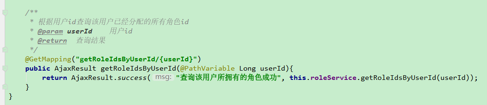

#### F2.2：【system-interface】修改RoleService

- 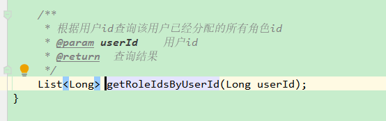

#### F2.3：【system-service】修改RoleServiceImpl

- 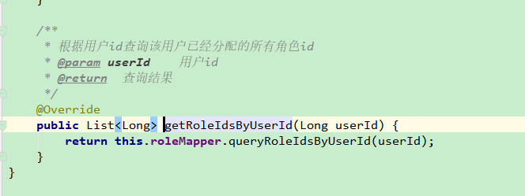

#### F2.4：【system-mapper】修改RoleMapper

- 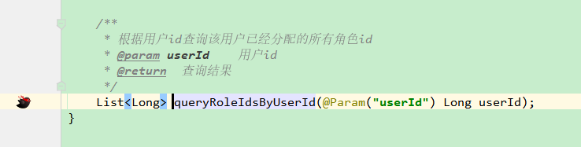

#### F2.5：【system-mapper】修改RoleMapper.xml

- 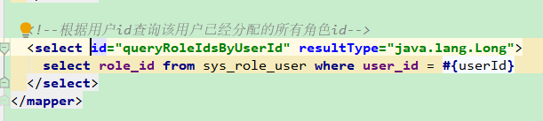

#### F2.6：【system-web】修改UserController

- 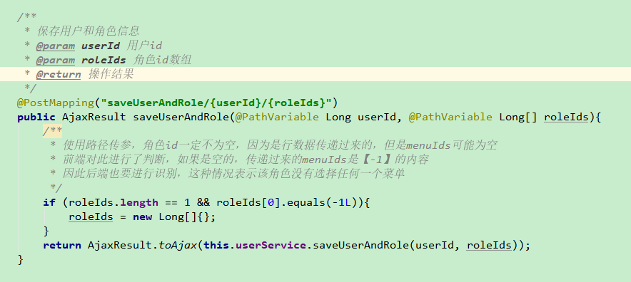

#### F2.7：【system-interface】修改UserService

- 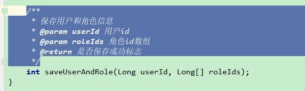

#### F2.8：【system-service】修改UserServiceImpl

- 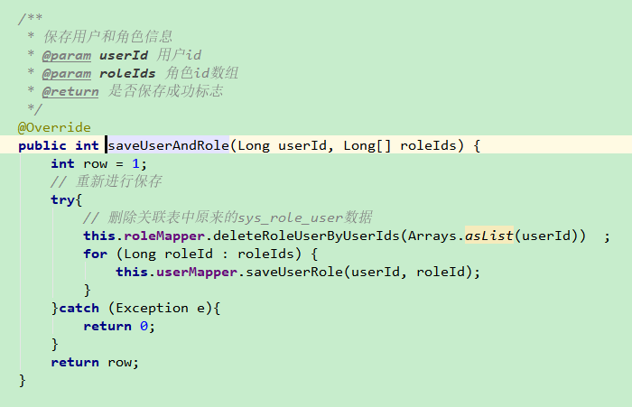

#### F2.9：【system-mapper】修改UserMapper

- 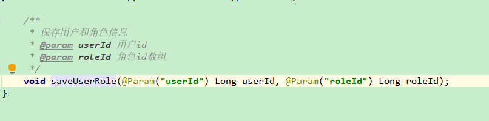

#### F2.10：【system-mapper】修改UserMapper.xml

- 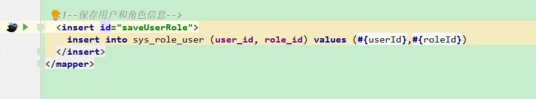

#### F2.6：测试

- 测试通过

# 通知公告管理

## 后端

- 数据库表
  - sys_notice
  - 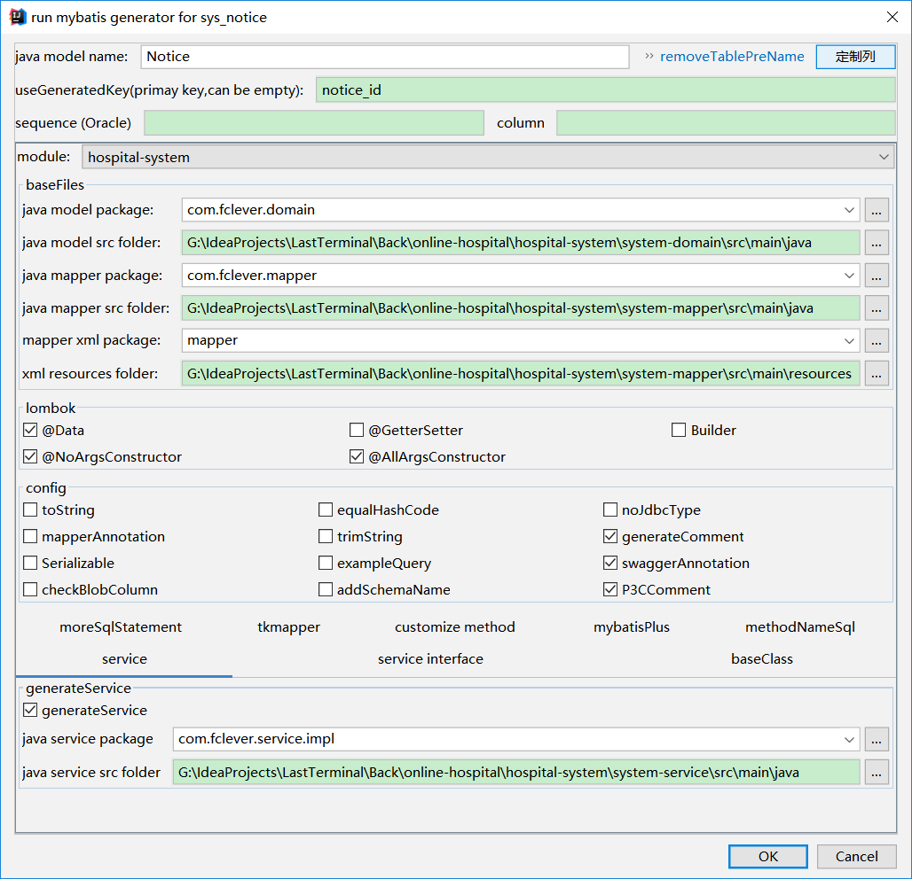

### F1：生成后端代码

#### F1.1：【system-domain】Notice

~~~java
package com.fclever.domain;

import com.baomidou.mybatisplus.annotation.IdType;
import com.baomidou.mybatisplus.annotation.TableField;
import com.baomidou.mybatisplus.annotation.TableId;
import com.baomidou.mybatisplus.annotation.TableName;
import io.swagger.annotations.ApiModel;
import io.swagger.annotations.ApiModelProperty;
import java.util.Date;
import lombok.AllArgsConstructor;
import lombok.Data;
import lombok.EqualsAndHashCode;
import lombok.NoArgsConstructor;

/**
@author Fclever
@create 2020-12-02 23:39
*/
/**
    * 通知公告表
    */
@ApiModel(value="com-fclever-domain-Notice")
@Data
@EqualsAndHashCode(callSuper=true)
@AllArgsConstructor
@NoArgsConstructor
@TableName(value = "sys_notice")
public class Notice extends BaseEntity {
    /**
     * 通知ID
     */
    @TableId(value = "notice_id", type = IdType.AUTO)
    @ApiModelProperty(value="通知ID")
    private Integer noticeId;

    /**
     * 通知标题
     */
    @TableField(value = "notice_title")
    @ApiModelProperty(value="通知标题")
    private String noticeTitle;

    /**
     * 通知类型（1通知 2公告）
     */
    @TableField(value = "notice_type")
    @ApiModelProperty(value="通知类型（1通知 2公告）")
    private String noticeType;

    /**
     * 通知内容
     */
    @TableField(value = "notice_content")
    @ApiModelProperty(value="通知内容")
    private String noticeContent;

    /**
     * 通知状态（0正常 1关闭）
     */
    @TableField(value = "status")
    @ApiModelProperty(value="通知状态（0正常 1关闭）")
    private String status;

    /**
     * 创建者
     */
    @TableField(value = "create_by")
    @ApiModelProperty(value="创建者")
    private String createBy;

    /**
     * 创建时间
     */
    @TableField(value = "create_time")
    @ApiModelProperty(value="创建时间")
    private Date createTime;

    /**
     * 更新者
     */
    @TableField(value = "update_by")
    @ApiModelProperty(value="更新者")
    private String updateBy;

    /**
     * 更新时间
     */
    @TableField(value = "update_time")
    @ApiModelProperty(value="更新时间")
    private Date updateTime;

    /**
     * 备注
     */
    @TableField(value = "remark")
    @ApiModelProperty(value="备注")
    private String remark;

    public static final String COL_NOTICE_ID = "notice_id";

    public static final String COL_NOTICE_TITLE = "notice_title";

    public static final String COL_NOTICE_TYPE = "notice_type";

    public static final String COL_NOTICE_CONTENT = "notice_content";

    public static final String COL_STATUS = "status";

    public static final String COL_CREATE_BY = "create_by";

    public static final String COL_CREATE_TIME = "create_time";

    public static final String COL_UPDATE_BY = "update_by";

    public static final String COL_UPDATE_TIME = "update_time";

    public static final String COL_REMARK = "remark";
}
~~~

#### F1.2：【system-domain】NoticeDto

~~~Java
package com.fclever.dto;

import com.baomidou.mybatisplus.annotation.IdType;
import com.baomidou.mybatisplus.annotation.TableField;
import com.baomidou.mybatisplus.annotation.TableId;
import com.baomidou.mybatisplus.annotation.TableName;
import com.fclever.domain.BaseEntity;
import io.swagger.annotations.ApiModel;
import io.swagger.annotations.ApiModelProperty;
import lombok.AllArgsConstructor;
import lombok.Data;
import lombok.EqualsAndHashCode;
import lombok.NoArgsConstructor;

import javax.validation.constraints.NotBlank;
import java.util.Date;

/**
@author Fclever
@create 2020-12-02 23:39
*/

/**
    * 通知公告表
    */
@ApiModel(value="com-fclever-dto-NoticeDto")
@Data
@EqualsAndHashCode(callSuper=true)
@AllArgsConstructor
@NoArgsConstructor
public class NoticeDto extends BaseDto {
    /**
     * 通知ID
     */
    @ApiModelProperty(value="通知ID")
    private Integer noticeId;

    /**
     * 通知标题
     */
    @ApiModelProperty(value="通知标题")
    @NotBlank(message = "通知标题不能为空")
    private String noticeTitle;

    /**
     * 通知类型（1通知 2公告）
     */
    @ApiModelProperty(value="通知类型（1通知 2公告）")
    @NotBlank(message = "通知类型不能为空")
    private String noticeType;

    /**
     * 通知内容
     */
    @ApiModelProperty(value="通知内容")
    @NotBlank(message = "通知内容不能为空")
    private String noticeContent;

    /**
     * 通知状态（0正常 1关闭）
     */
    @ApiModelProperty(value="通知状态（0正常 1关闭）")
    @NotBlank(message = "通知状态不能为空")
    private String status;

    /**
     * 创建者
     */
    @ApiModelProperty(value="创建者")
    private String createBy;

    /**
     * 备注
     */
    @ApiModelProperty(value="备注")
    private String remark;
}
~~~

#### F1.3：【system-mapper】NoticeMapper

~~~java
package com.fclever.mapper;

import com.baomidou.mybatisplus.core.mapper.BaseMapper;
import com.fclever.domain.Notice;

/**
@author Fclever
@create 2020-12-02 23:39
*/
public interface NoticeMapper extends BaseMapper<Notice> {
}
~~~

#### F1.4：【system-mapper】NoticeMapper.xml

~~~java
<?xml version="1.0" encoding="UTF-8"?>
<!DOCTYPE mapper PUBLIC "-//mybatis.org//DTD Mapper 3.0//EN" "http://mybatis.org/dtd/mybatis-3-mapper.dtd">
<mapper namespace="com.fclever.mapper.NoticeMapper">
  <resultMap id="BaseResultMap" type="com.fclever.domain.Notice">
    <!--@mbg.generated-->
    <!--@Table sys_notice-->
    <id column="notice_id" jdbcType="INTEGER" property="noticeId" />
    <result column="notice_title" jdbcType="VARCHAR" property="noticeTitle" />
    <result column="notice_type" jdbcType="CHAR" property="noticeType" />
    <result column="notice_content" jdbcType="VARCHAR" property="noticeContent" />
    <result column="status" jdbcType="CHAR" property="status" />
    <result column="create_by" jdbcType="VARCHAR" property="createBy" />
    <result column="create_time" jdbcType="TIMESTAMP" property="createTime" />
    <result column="update_by" jdbcType="VARCHAR" property="updateBy" />
    <result column="update_time" jdbcType="TIMESTAMP" property="updateTime" />
    <result column="remark" jdbcType="VARCHAR" property="remark" />
  </resultMap>
  <sql id="Base_Column_List">
    <!--@mbg.generated-->
    notice_id, notice_title, notice_type, notice_content, `status`, create_by, create_time, 
    update_by, update_time, remark
  </sql>
</mapper>
~~~

#### F1.5：【system-interface】NoticeService

~~~java
package com.fclever.service;

import com.fclever.domain.Notice;
import com.baomidou.mybatisplus.extension.service.IService;
import com.fclever.dto.NoticeDto;
import com.fclever.vo.DataGridView;

/**
@author Fclever
@create 2020-12-02 23:39
*/
public interface NoticeService {

    /**
     * 修改通知公告
     * @param noticeDto 待修改的数据
     * @return 修改成功标志
     */
    int updateNotice(NoticeDto noticeDto);

    /**
     * 分页查询所有通知公告
     * @param noticeDto 查询条件
     * @return 查询结果
     */
    DataGridView listNoticeForPage(NoticeDto noticeDto);

    /**
     * 根据id删除通知公告（含批量）
     * @param noticeIds 待删除的通知公告id数组
     * @return 是否删除成功标志
     */
    int deleteNoticeByIds(Long[] noticeIds);

    /**
     * 根据id获取指定通知公告信息
     * @param noticeId 查询的通知id
     * @return 查询到的数据
     */
    Notice getNoticeById(Long noticeId);

    /**
     * 添加通知公告信息
     * @param noticeDto 待添加内容
     * @return 是否添加成功标志
     */
    int addNotice(NoticeDto noticeDto);
}

~~~

#### F1.6：【system-service】NoticeServiceImpl

~~~java
package com.fclever.service.impl;

import cn.hutool.core.bean.BeanUtil;
import cn.hutool.core.date.DateUtil;
import com.baomidou.mybatisplus.core.conditions.query.QueryWrapper;
import com.baomidou.mybatisplus.core.toolkit.StringUtils;
import com.baomidou.mybatisplus.extension.plugins.pagination.Page;
import com.fclever.dto.NoticeDto;
import com.fclever.vo.DataGridView;
import org.springframework.beans.factory.annotation.Autowired;
import org.springframework.stereotype.Service;
import javax.annotation.Resource;
import java.util.Arrays;
import java.util.List;
import com.baomidou.mybatisplus.extension.service.impl.ServiceImpl;
import com.fclever.domain.Notice;
import com.fclever.mapper.NoticeMapper;
import com.fclever.service.NoticeService;
/**
@author Fclever
@create 2020-12-02 23:39
*/
@Service
public class NoticeServiceImpl implements NoticeService{

    @Autowired
    private NoticeMapper noticeMapper;

    /**
     * 修改通知公告
     * @param noticeDto 待修改的数据
     * @return 修改成功标志
     */
    @Override
    public int updateNotice(NoticeDto noticeDto) {
        // 创建通知实体类
        Notice notice = new Notice();
        // 值拷贝
        BeanUtil.copyProperties(noticeDto, notice);
        // 设置更新人
        notice.setUpdateBy(noticeDto.getSimpleUser().getUserName());
        //执行更新操作
        return this.noticeMapper.updateById(notice);
    }

    /**
     * 分页查询所有通知公告
     * @param noticeDto 查询条件
     * @return 查询结果
     */
    @Override
    public DataGridView listNoticeForPage(NoticeDto noticeDto) {
        // 创建分页对象
        Page<Notice> page = new Page<>(noticeDto.getPageNum(), noticeDto.getPageSize());
        // 创建查询条件对象
        QueryWrapper<Notice> qw = new QueryWrapper<>();
        // 封装查询条件
        // 模糊匹配通知公告标题
        qw.like(StringUtils.isNotBlank(noticeDto.getNoticeTitle()), Notice.COL_NOTICE_TITLE, noticeDto.getNoticeTitle());
        // 模糊匹配创建者
        qw.like(StringUtils.isNotBlank(noticeDto.getCreateBy()), Notice.COL_CREATE_BY, noticeDto.getCreateBy());
        // 精确匹配公告类型
        qw.eq(StringUtils.isNotBlank(noticeDto.getNoticeType()), Notice.COL_NOTICE_TYPE, noticeDto.getNoticeType());
        // 精确匹配公告状态
        qw.eq(StringUtils.isNotBlank(noticeDto.getStatus()), Notice.COL_STATUS, noticeDto.getStatus());
        // 排序  创建时间升序
        qw.orderByAsc(Notice.COL_CREATE_TIME);
        // 执行查询
        this.noticeMapper.selectPage(page, qw);
        // 封装分页并返回
        return new DataGridView(page.getTotal(), page.getRecords());
    }

    /**
     * 根据id删除通知公告（含批量）
     * @param noticeIds 待删除的通知公告id数组
     * @return 是否删除成功标志
     */
    @Override
    public int deleteNoticeByIds(Long[] noticeIds) {
        List<Long> noticeIdsList = Arrays.asList(noticeIds);
        if (noticeIdsList != null && noticeIdsList.size() > 0 ){
            return this.noticeMapper.deleteBatchIds(noticeIdsList);
        }
        return 0;
    }

    /**
     * 根据id获取指定通知公告信息
     * @param noticeId 查询的通知id
     * @return 查询到的数据
     */
    @Override
    public Notice getNoticeById(Long noticeId) {
        return this.noticeMapper.selectById(noticeId);
    }

    /**
     * 添加通知公告信息
     * @param noticeDto 待添加内容
     * @return 是否添加成功标志
     */
    @Override
    public int addNotice(NoticeDto noticeDto) {
        // 创建Notice实体
        Notice notice = new Notice();
        // 值拷贝
        BeanUtil.copyProperties(noticeDto, notice);
        // 设置创建人和创建时间
        notice.setCreateBy(noticeDto.getSimpleUser().getUserName());
        notice.setCreateTime(DateUtil.date());
        // 执行保存
        return this.noticeMapper.insert(notice);
    }
}

~~~

### F2：【system-web】NoticeController

~~~java
package com.fclever.controller.system;

import com.fclever.aspectj.annotation.Log;
import com.fclever.aspectj.enums.BusinessType;
import com.fclever.domain.Notice;
import com.fclever.dto.NoticeDto;
import com.fclever.service.NoticeService;
import com.fclever.utils.ShiroSecurityUtils;
import com.fclever.vo.AjaxResult;
import com.fclever.vo.DataGridView;
import org.springframework.beans.factory.annotation.Autowired;
import org.springframework.validation.annotation.Validated;
import org.springframework.web.bind.annotation.*;

/**
 * 通知公告控制层
 * @author Fclever
 * @create 2020-12-03 10:49
 */
@RestController
@RequestMapping("system/notice")
public class NoticeController {

    @Autowired
    private NoticeService noticeService;

    /**
     * 修改通知公告
     * @param noticeDto 待修改的数据
     * @return 修改成功标志
     */
    @PutMapping("updateNotice")
    @Log(title = "修改通知公告",businessType = BusinessType.UPDATE)
    public AjaxResult updateNotice(@Validated NoticeDto noticeDto){
        // 设置当前登录人，用作修改人
        noticeDto.setSimpleUser(ShiroSecurityUtils.getCurrentSimpleUser());
        return AjaxResult.toAjax(this.noticeService.updateNotice(noticeDto));
    }

    /**
     * 分页查询所有通知公告
     * @param noticeDto 查询条件
     * @return 返回结果
     */
    @GetMapping("listNoticeForPage")
    public AjaxResult listNoticeForPage(NoticeDto noticeDto){
        DataGridView list = this.noticeService.listNoticeForPage(noticeDto);
        return AjaxResult.success("分页查询数据成功", list.getData(),list.getTotal());
    }

    /**
     * 根据id删除通知公告（含批量）
     * @param noticeIds 待删除的通知公告id数组
     * @return 是否删除成功标志
     */
    @DeleteMapping("deleteNoticeByIds/{noticeIds}")
    @Log(title = "根据id删除通知公告（含批量）",businessType = BusinessType.DELETE)
    public AjaxResult deleteNoticeByIds(@PathVariable Long[] noticeIds){
        return AjaxResult.toAjax(this.noticeService.deleteNoticeByIds(noticeIds));
    }

    /**
     * 根据id获取指定通知公告信息
     * @param noticeId 查询的通知id
     * @return 查询到的数据
     */    
    @GetMapping("getNoticeById/{noticeId}")
    public AjaxResult getNoticeById(@PathVariable Long noticeId){
        Notice notice = this.noticeService.getNoticeById(noticeId);
        return AjaxResult.success("查询指定通知公告信息成功", notice);
    }

    /**
     * 添加通知公告信息
     * @param noticeDto 待添加内容
     * @return 是否添加成功标志
     */
    @PostMapping("addNotice")
    @Log(title = "添加通知公告信息",businessType = BusinessType.INSERT)
    public AjaxResult addNotice(@Validated NoticeDto noticeDto){
        // 设置当前登录人，用作创建人
        noticeDto.setSimpleUser(ShiroSecurityUtils.getCurrentSimpleUser());
        return AjaxResult.toAjax(this.noticeService.addNotice(noticeDto));
    }
}

~~~

### F3：Yapi测试

- 测试通过

## 前端

### F4：修改src/api/system/notice/notice.js

~~~js
import request from '@/utils/request'

// 修改通知公告信息
export function updateNotice(data) {
  return request({
    url: '/system/notice/updateNotice',
    method: 'put',
    params: data
  })
}

// 分页查询通知公告
export function listNoticeForPage(query) {
  return request({
    url: '/system/notice/listNoticeForPage',
    method: 'get',
    params: query
  })
}

// 根据id删除通知公告
export function deleteNoticeByIds(noticeIds) {
  return request({
    url: '/system/notice/deleteNoticeByIds/' + noticeIds,
    method: 'delete'
  })
}

// 根据id查询对应通知公告信息
export function getNoticeById(noticeId) {
  return request({
    url: '/system/notice/getNoticeById/' + noticeId,
    method: 'get'
  })
}

// 添加通知公告
export function addNotice(data) {
  return request({
    url: '/system/notice/addNotice',
    method: 'post',
    params: data
  })
}

~~~

### F5：修改src/router/index.js

- 

### F6：创建src/views/system/notice/index.vue

~~~vue
<!--通知公告页面-->
<template>
  

    <!--查询条件开始-->
    <!--
      ref:
      model:绑定查询条件部分的数据绑定,与queryParams有关,点击查询按钮时,将查询参数传递到后台
      inline:变为行内域
      label-width:设置每个标签的宽度,指定在el-form上时,其直接子标签form-item会继承该值
    -->
    <el-form ref="queryForm" :model="queryParams" :inline="true" label-width="68px">
      <el-form-item label="公告标题" prop="noticeTitle">
        <!--input输入框
          v-model:指定与queryParams中哪个属性进行动态绑定
          placeholder:输入框内默认填充的数据,获得焦点后消失
          clearable:是否可以一键清除
          size:输入框大小,影响内容大小
        -->
        <el-input
          v-model="queryParams.noticeTitle"
          placeholder="请输入公告标题"
          clearable
          size="small"
          style="width:140px"
        />
      </el-form-item>
      <el-form-item label="创建者" prop="createBy">
        <!--input输入框
          v-model:指定与queryParams中哪个属性进行动态绑定
          placeholder:输入框内默认填充的数据,获得焦点后消失
          clearable:是否可以一键清除
          size:输入框大小,影响内容大小
        -->
        <el-input
          v-model="queryParams.createBy"
          placeholder="请输入创建者"
          clearable
          size="small"
          style="width:140px"
        />
      </el-form-item>
      <el-form-item label="通知类型" prop="noticeType">
        <!--select下拉框-->
        <el-select
          v-model="queryParams.noticeType"
          placeholder="通知类型"
          placeholder="请选择通知类型"
          clearable
          size="small"
          style="width:140px"
        >
          <!--下拉框内容,遍历typeOptions属性,这里面保存了查询的状态的码表
            key:唯一标注
            label:标签
            value:实际存储的值
          -->
          <el-option
            v-for="dict in typeOptions"
            :key="dict.dictValue"
            :label="dict.dictLabel"
            :value="dict.dictValue"
          />
        </el-select>
      </el-form-item>
      <el-form-item label="状态" prop="status">
        <!--select下拉框-->
        <el-select
          v-model="queryParams.status"
          placeholder="请选择状态"
          clearable
          size="small"
          style="width:140px"
        >
          <!--下拉框内容,遍历typeOptions属性,这里面保存了查询的状态的码表
            key:唯一标注
            label:标签
            value:实际存储的值
          -->
          <el-option
            v-for="dict in statusOptions"
            :key="dict.dictValue"
            :label="dict.dictLabel"
            :value="dict.dictValue"
          />
        </el-select>
      </el-form-item>
      <el-form-item>
        <!--查询和清空按钮-->
        <el-button type="primary" icon="el-icon-search" size="mini" @click="handleQuery">查询</el-button>
        <el-button type="primary" icon="el-icon-refresh" size="mini" @click="resetQuery">清空</el-button>
      </el-form-item>
    </el-form>
    <!--查询条件结束-->
    <!--操作栏按钮开始-->
    <!--el-row:表示一行数据
      gutter:每一栏之间的间隔
    -->
    <el-row :gutter="10" style="margin-bottom: 8px;">
      <!--el-col:表示一列
        span:指定该列所占的宽度,最大指定为24
      -->
      <el-col :span="1.5">
        <!--新增按钮:尺寸mini-->
        <el-button type="primary" icon="el-icon-plus" size="mini" @click="handleAdd">新增</el-button>
      </el-col>
      <el-col :span="1.5">
        <!--修改按钮:只有在选中一条记录的时候,才会处于可用状态-->
        <el-button type="success" icon="el-icon-edit" size="mini" :disabled="!single" @click="handleUpdate">修改</el-button>
      </el-col>
      <el-col :span="1.5">
        <!--删除按钮,只要有选中数据就可用,不管一条还是多条-->
        <el-button type="danger" icon="el-icon-delete" size="mini" :disabled="!multiple" @click="handleDelete">批量删除</el-button>
      </el-col>
    </el-row>
    <!--操作栏按钮结束-->
    <!--数据列表开始-->
    <!--el-table:数据列表
      v-loading:v-loading在接口未请求到数据之前，显示加载中，直到请求到数据后消失
      border:表示有边框
      data:数据列表中显示的数据从哪获取
      @selection-change:当选择项发生变化时会触发该事件
    -->
    <el-table v-loading="loading" border :data="noticeTableList" @selection-change="handleSelectionChange">
      <!--el-table-column:每一行中的每一列
        prop:对应从:data中取出的数据
        align:对齐方式
        label:列名
        show-overflow-tooltip:默认情况下数据过长不够显示的时候是换行显示,如果需要单行显示,可以使用这个,并且当鼠标移动到此处时会显示实际内容的提示信息
      -->
      <el-table-column type="selection" width="55" align="center" />
      <el-table-column label="通知ID" prop="noticeId" align="center" />
      <el-table-column label="通知标题" prop="noticeTitle" align="center" />
      <el-table-column label="通知类型" prop="noticeType" align="center" :formatter="typeFormatter" />
      <el-table-column label="状态" prop="status" align="center" :formatter="statusFormatter"/>
      <el-table-column label="创建者" prop="createBy" align="center" />
      <el-table-column label="创建时间" prop="createTime" align="center" width="180" />
      <el-table-column label="操作" align="center">
        <!--slot-scope="scope" 取到当前单元格-->
        <template slot-scope="scope">
          <!--传递该条数据到具体处理方法中-->
          <el-button type="text" icon="el-icon-edit" size="mini" @click="handleUpdate(scope.row)">修改</el-button>
          <el-button type="text" icon="el-icon-delete" size="mini" @click="handleDelete(scope.row)">删除</el-button>
          <el-button type="text" icon="el-icon-view" size="mini" @click="handleView(scope.row)">查看内容</el-button>
        </template>
      </el-table-column>
    </el-table>
    <!--数据列表结束-->
    <!--底部分页开始-->
    <!--pagination:分页控件
      v-show:控制是否显示分页控件的条件,当数据列表中数据不为空才显示
      current-page:当前显示第几页
      page-sizes:可选的每页显示条数
      page-size:默认每页显示条数
      layout:设置分页格式:总数,每页条数,前一页,当前页,下一页,跳转至某一页
      total:总数
      @size-change:改变每页显示条数后触发方法
      @current-change:当前页发生改变的时候触发的方法
    -->
    <el-pagination
      v-show="total>0"
      :current-page="queryParams.pageNum"
      :page-sizes="[5, 10, 20, 30]"
      :page-size="queryParams.pageSize"
      layout="total, sizes, prev, pager, next, jumper"
      :total="total"
      @size-change="handleSizeChange"
      @current-change="handleCurrentChange"
    />
    <!--底部分页结束-->
    <!--新增和修改模态框开始-->
    <!--dialog:对话框
      title:模态框标题
      visible.sync:表示是否显示
      center:居中
      append-to-body:如果需要在一个对话框内部嵌套另一个对话框，需要使用append-to-body属性
    -->
    <el-dialog
      :title="title"
      :visible.sync="open"
      width="800px"
      center
      append-to-body
    >
      <!--添加和修改的表单
        rules:做表单数据前端校验
        label-width:标签宽度(文字)
      -->
      <el-form ref="form" :model="form" :rules="rules" label-width="80px" :disabled="isView">
        <el-form-item label="通知标题" prop="noticeTitle">
          <el-input v-model="form.noticeTitle" placeholder="请输入通知标题" clearable size="small" />
        </el-form-item>
        <el-form-item label="公告类型" prop="noticeType">
          <!--单选框-->
          <el-radio-group v-model="form.noticeType">
            <el-radio
              v-for="dict in typeOptions"
              :key="dict.dictValue"
              :label="dict.dictValue"
              :value="dict.dictValue"
            >{{ dict.dictLabel }}</el-radio>
          </el-radio-group>
        </el-form-item>
        <el-form-item label="状态" prop="status">
          <!--单选框-->
          <el-radio-group v-model="form.status">
            <el-radio
              v-for="dict in statusOptions"
              :key="dict.dictValue"
              :label="dict.dictValue"
              :value="dict.dictValue"
            >{{ dict.dictLabel }}</el-radio>
          </el-radio-group>
        </el-form-item>
        <el-form-item v-if="!isView" label="内容" v-model="form.noticeContent">
        <el-form-item v-if="!isView" label="内容" prop="noticeContent">
          <markdown-editor
            ref="noticeContent"
            v-model="form.noticeContent"
            height="300px"
            :options="{hideModeSwitch:true,previewStyle:'tab'}"
          />
        </el-form-item>
        <el-form-item v-else label="内容" prop="noticeContent">
          <el-input
            type="textarea"
            autosize
            v-model="form.noticeContent">
          </el-input>
        </el-form-item>
        <el-form-item label="备注" prop="remark">
          <el-input
            type="textarea"
            autosize
            v-model="form.remark">
          </el-input>
        </el-form-item>
      </el-form>
      
        <el-button type="primary" @click="handleSubmit">保 存</el-button>
        <el-button @click="cancel">取 消</el-button>
      
    </el-dialog>
    <!--新增和修改模态框结束-->
  

</template>

~~~

# 检查项目管理

## 后端

- 生成代码
  - 数据库表
  - sys_check_item
  - 

### F1：生成检查项目代码

#### F1.1：【system-domain】CheckItem

~~~java
package com.fclever.domain;

import com.baomidou.mybatisplus.annotation.IdType;
import com.baomidou.mybatisplus.annotation.TableField;
import com.baomidou.mybatisplus.annotation.TableId;
import com.baomidou.mybatisplus.annotation.TableName;
import io.swagger.annotations.ApiModel;
import io.swagger.annotations.ApiModelProperty;
import java.math.BigDecimal;
import java.util.Date;
import lombok.AllArgsConstructor;
import lombok.Data;
import lombok.EqualsAndHashCode;
import lombok.NoArgsConstructor;

/**
@author Fclever
@create 2020-12-05 12:36
*/
/**
    * 检查项目表
    */
@ApiModel(value="com-fclever-domain-CheckItem")
@Data
@EqualsAndHashCode(callSuper=true)
@AllArgsConstructor
@NoArgsConstructor
@TableName(value = "sys_check_item")
public class CheckItem extends BaseEntity {
    /**
     * 检查项目ID
     */
    @TableId(value = "check_item_id", type = IdType.AUTO)
    @ApiModelProperty(value="检查项目ID")
    private Long checkItemId;

    /**
     * 项目名称
     */
    @TableField(value = "check_item_name")
    @ApiModelProperty(value="项目名称")
    private String checkItemName;

    /**
     * 关键字【查询用】
     */
    @TableField(value = "keywords")
    @ApiModelProperty(value="关键字【查询用】")
    private String keywords;

    /**
     * 项目单价
     */
    @TableField(value = "unit_price")
    @ApiModelProperty(value="项目单价")
    private BigDecimal unitPrice;

    /**
     * 项目成本
     */
    @TableField(value = "cost")
    @ApiModelProperty(value="项目成本")
    private BigDecimal cost;

    /**
     * 计量单位
     */
    @TableField(value = "unit")
    @ApiModelProperty(value="计量单位")
    private String unit;

    /**
     * 项目类别IDsxt_sys_dict_type
     */
    @TableField(value = "type_id")
    @ApiModelProperty(value="项目类别IDsxt_sys_dict_type")
    private String typeId;

    /**
     * 状态0正常1停用 sxt_sys_dict_type
     */
    @TableField(value = "status")
    @ApiModelProperty(value="状态0正常1停用 sxt_sys_dict_type")
    private String status;

    /**
     * 创建时间
     */
    @TableField(value = "create_time")
    @ApiModelProperty(value="创建时间")
    private Date createTime;

    /**
     * 更新时间
     */
    @TableField(value = "update_time")
    @ApiModelProperty(value="更新时间")
    private Date updateTime;

    /**
     * 创建者
     */
    @TableField(value = "create_by")
    @ApiModelProperty(value="创建者")
    private String createBy;

    /**
     * 更新者
     */
    @TableField(value = "update_by")
    @ApiModelProperty(value="更新者")
    private String updateBy;

    public static final String COL_CHECK_ITEM_ID = "check_item_id";

    public static final String COL_CHECK_ITEM_NAME = "check_item_name";

    public static final String COL_KEYWORDS = "keywords";

    public static final String COL_UNIT_PRICE = "unit_price";

    public static final String COL_COST = "cost";

    public static final String COL_UNIT = "unit";

    public static final String COL_TYPE_ID = "type_id";

    public static final String COL_STATUS = "status";

    public static final String COL_CREATE_TIME = "create_time";

    public static final String COL_UPDATE_TIME = "update_time";

    public static final String COL_CREATE_BY = "create_by";

    public static final String COL_UPDATE_BY = "update_by";
}
~~~

#### F1.2：【system-domain】CheckItemDto

~~~java
package com.fclever.dto;

import com.baomidou.mybatisplus.annotation.IdType;
import com.baomidou.mybatisplus.annotation.TableField;
import com.baomidou.mybatisplus.annotation.TableId;
import com.baomidou.mybatisplus.annotation.TableName;
import com.fclever.domain.BaseEntity;
import io.swagger.annotations.ApiModel;
import io.swagger.annotations.ApiModelProperty;
import lombok.AllArgsConstructor;
import lombok.Data;
import lombok.EqualsAndHashCode;
import lombok.NoArgsConstructor;

import javax.validation.constraints.NotBlank;
import javax.validation.constraints.NotNull;
import java.math.BigDecimal;
import java.util.Date;

/**
@author Fclever
@create 2020-12-05 12:36
*/

/**
    * 检查项目表
    */
@ApiModel(value="com-fclever-dto-CheckItemDto")
@Data
@EqualsAndHashCode(callSuper=true)
@AllArgsConstructor
@NoArgsConstructor
public class CheckItemDto extends BaseDto {
    /**
     * 检查项目ID
     */
    @ApiModelProperty(value="检查项目ID")
    private Long checkItemId;

    /**
     * 项目名称
     */
    @ApiModelProperty(value="项目名称")
    @NotBlank(message = "项目名称不能为空")
    private String checkItemName;

    /**
     * 关键字【查询用】
     */
    @ApiModelProperty(value="关键字【查询用】")
    @NotBlank(message = "关键字不能为空")
    private String keywords;

    /**
     * 项目单价
     */
    @ApiModelProperty(value="项目单价")
    @NotNull(message = "项目单价不能为空")
    private BigDecimal unitPrice;

    /**
     * 项目成本
     */
    @ApiModelProperty(value="项目成本")
    @NotNull(message = "项目成本不能为空")
    private BigDecimal cost;

    /**
     * 计量单位
     */
    @ApiModelProperty(value="计量单位")
    @NotBlank(message = "计量单位不能为空")
    private String unit;

    /**
     * 项目类别IDsxt_sys_dict_type
     */
    @ApiModelProperty(value="项目类别IDsxt_sys_dict_type")
    @NotBlank(message = "项目类别不能为空")
    private String typeId;

    /**
     * 状态0正常1停用 sxt_sys_dict_type
     */
    @ApiModelProperty(value="状态0正常1停用 sxt_sys_dict_type")
    @NotBlank(message = "状态不能为空")
    private String status;
}
~~~

#### F1.3：【system-mapper】CheckItemMapper

~~~java
package com.fclever.mapper;

import com.baomidou.mybatisplus.core.mapper.BaseMapper;
import com.fclever.domain.CheckItem;

/**
@author Fclever
@create 2020-12-05 12:36
*/
public interface CheckItemMapper extends BaseMapper<CheckItem> {
}
~~~

#### F1.4：【system-mapper】CheckItemMapper.xml

~~~xml
<?xml version="1.0" encoding="UTF-8"?>
<!DOCTYPE mapper PUBLIC "-//mybatis.org//DTD Mapper 3.0//EN" "http://mybatis.org/dtd/mybatis-3-mapper.dtd">
<mapper namespace="com.fclever.mapper.CheckItemMapper">
  <resultMap id="BaseResultMap" type="com.fclever.domain.CheckItem">
    <!--@mbg.generated-->
    <!--@Table sys_check_item-->
    <id column="check_item_id" jdbcType="BIGINT" property="checkItemId" />
    <result column="check_item_name" jdbcType="VARCHAR" property="checkItemName" />
    <result column="keywords" jdbcType="VARCHAR" property="keywords" />
    <result column="unit_price" jdbcType="DECIMAL" property="unitPrice" />
    <result column="cost" jdbcType="DECIMAL" property="cost" />
    <result column="unit" jdbcType="VARCHAR" property="unit" />
    <result column="type_id" jdbcType="CHAR" property="typeId" />
    <result column="status" jdbcType="CHAR" property="status" />
    <result column="create_time" jdbcType="TIMESTAMP" property="createTime" />
    <result column="update_time" jdbcType="TIMESTAMP" property="updateTime" />
    <result column="create_by" jdbcType="VARCHAR" property="createBy" />
    <result column="update_by" jdbcType="VARCHAR" property="updateBy" />
  </resultMap>
  <sql id="Base_Column_List">
    <!--@mbg.generated-->
    check_item_id, check_item_name, keywords, unit_price, cost, unit, type_id, `status`, 
    create_time, update_time, create_by, update_by
  </sql>
</mapper>
~~~

#### F 1.5：【system-interface】CheckItemService

~~~java
package com.fclever.service;

import com.fclever.domain.CheckItem;
import com.baomidou.mybatisplus.extension.service.IService;
import com.fclever.dto.CheckItemDto;
import com.fclever.vo.DataGridView;

import java.util.List;

/**
@author Fclever
@create 2020-12-05 12:36
*/
public interface CheckItemService{

    /**
     * 修改检查项目
     * @param checkItemDto 待修改内容
     * @return 是否修改成功标志
     */
    int updateCheckItem(CheckItemDto checkItemDto);

    /**
     * 分页查询检查项目
     * @param checkItemDto 查询条件
     * @return 查询结果
     */
    DataGridView listCheckItemForPage(CheckItemDto checkItemDto);

    /**
     * 根据id删除检查项目（含批量）
     * @param checkItemIds  待删除的检查项目id
     * @return 是否删除成功标志
     */
    int deleteCheckItemByIds(Long[] checkItemIds);

    /**
     * 根据id查询检查项目
     * @param checkItemId 待查询的检查项目id
     * @return 查询到的结果
     */
    CheckItem getCheckItemById(Long checkItemId);

    /**
     * 查询所有可用的检查项目
     * @return 查询结果
     */
    List<CheckItem> selectAllCheckItem();

    /**
     * 添加检查项目
     * @param checkItemDto  待添加的内容
     * @return 是否添加成功标志
     */
    int addCheckItem(CheckItemDto checkItemDto);
}

~~~

#### F1.6：【system-service】CheckItemServiceImpl

~~~java
package com.fclever.service.impl;

import cn.hutool.core.bean.BeanUtil;
import cn.hutool.core.date.DateUtil;
import com.baomidou.mybatisplus.core.conditions.query.QueryWrapper;
import com.baomidou.mybatisplus.core.toolkit.StringUtils;
import com.baomidou.mybatisplus.extension.plugins.pagination.Page;
import com.fclever.constants.Constants;
import com.fclever.domain.CheckItem;
import com.fclever.dto.CheckItemDto;
import com.fclever.mapper.CheckItemMapper;
import com.fclever.service.CheckItemService;
import com.fclever.vo.DataGridView;
import org.springframework.beans.factory.annotation.Autowired;
import org.springframework.stereotype.Service;

import java.util.Arrays;
import java.util.List;
/**
@author Fclever
@create 2020-12-05 12:36
*/
@Service
public class CheckItemServiceImpl implements CheckItemService{

    @Autowired
    private CheckItemMapper checkItemMapper;

    /**
     * 修改检查项目
     * @param checkItemDto 待修改内容
     * @return 是否修改成功标志
     */
    @Override
    public int updateCheckItem(CheckItemDto checkItemDto) {
        // 创建检查项目实体
        CheckItem checkItem = new CheckItem();
        // 值拷贝
        BeanUtil.copyProperties(checkItemDto, checkItem);
        // 设置修改人和修改时间
        checkItem.setUpdateBy(checkItemDto.getSimpleUser().getUserName());
        // 执行更新操作
        return this.checkItemMapper.updateById(checkItem);
    }

    /**
     * 分页查询检查项目
     * @param checkItemDto 查询条件
     * @return 查询结果
     */
    @Override
    public DataGridView listCheckItemForPage(CheckItemDto checkItemDto) {
        // 创建分页对象
        Page<CheckItem> page = new Page<>(checkItemDto.getPageNum(), checkItemDto.getPageSize());
        // 创建查询条件对象
        QueryWrapper<CheckItem> qw = new QueryWrapper<>();
        // 封装查询条件
        // 模糊匹配检查项目名称
        qw.like(StringUtils.isNotBlank(checkItemDto.getCheckItemName()), CheckItem.COL_CHECK_ITEM_NAME, checkItemDto.getCheckItemName());
        // 模糊匹配关键字
        qw.like(StringUtils.isNotBlank(checkItemDto.getKeywords()), CheckItem.COL_KEYWORDS, checkItemDto.getKeywords());
        // 精确匹配项目类型
        qw.eq(StringUtils.isNotBlank(checkItemDto.getTypeId()), CheckItem.COL_TYPE_ID, checkItemDto.getTypeId());
        // 精确匹配状态
        qw.eq(StringUtils.isNotBlank(checkItemDto.getStatus()), CheckItem.COL_STATUS, checkItemDto.getStatus());
        // 排序  创建时间升序
        qw.orderByAsc(CheckItem.COL_CREATE_TIME);
        // 执行查询
        this.checkItemMapper.selectPage(page, qw);
        // 封装分页结果并返回
        return new DataGridView(page.getTotal(), page.getRecords());
    }

    /**
     * 根据id删除检查项目（含批量）
     * @param checkItemIds  待删除的检查项目id
     * @return 是否删除成功标志
     */
    @Override
    public int deleteCheckItemByIds(Long[] checkItemIds) {
        // 数组转集合
        List<Long> checkItemIdsList = Arrays.asList(checkItemIds);
        if (checkItemIdsList != null && checkItemIdsList.size() >0 ){
            // 执行删除操作
            return this.checkItemMapper.deleteBatchIds(checkItemIdsList);
        }
        return 0;
    }

    /**
     * 根据id查询检查项目
     * @param checkItemId 待查询的检查项目id
     * @return 查询到的结果
     */
    @Override
    public CheckItem getCheckItemById(Long checkItemId) {
        // 执行查询操作
        return this.checkItemMapper.selectById(checkItemId);
    }

    /**
     * 查询所有可用的检查项目
     * @return 查询结果
     */
    @Override
    public List<CheckItem> selectAllCheckItem() {
        // 创建查询对象
        CheckItem checkItem = new CheckItem();
        // 封装查询条件
        QueryWrapper<CheckItem> qw = new QueryWrapper<>();
        // 状态可用
        qw.eq(CheckItem.COL_STATUS, Constants.STATUS_TRUE);
        // 执行查询，并返回结果
        return this.checkItemMapper.selectList(qw);
    }

    /**
     * 添加检查项目
     * @param checkItemDto  待添加的内容
     * @return 是否添加成功标志
     */
    @Override
    public int addCheckItem(CheckItemDto checkItemDto) {
        // 创建检查项目实体
        CheckItem checkItem = new CheckItem();
        // 值拷贝
        BeanUtil.copyProperties(checkItemDto, checkItem);
        // 设置创建人和创建时间
        checkItem.setCreateBy(checkItemDto.getSimpleUser().getUserName());
        checkItem.setCreateTime(DateUtil.date());
        // 执行插入操作
        return this.checkItemMapper.insert(checkItem);
    }
}

~~~

### F2：【system-web】CheckItemController

~~~java
package com.fclever.controller.system;

import com.fclever.aspectj.annotation.Log;
import com.fclever.aspectj.enums.BusinessType;
import com.fclever.dto.CheckItemDto;
import com.fclever.service.CheckItemService;
import com.fclever.utils.ShiroSecurityUtils;
import com.fclever.vo.AjaxResult;
import com.fclever.vo.DataGridView;
import org.springframework.beans.factory.annotation.Autowired;
import org.springframework.validation.annotation.Validated;
import org.springframework.web.bind.annotation.*;

/**
 * 检查项目控制层
 * @author Fclever
 * @create 2020-12-05 13:26
 */
@RestController
@RequestMapping("system/checkItem")
public class CheckItemController {

    @Autowired
    private CheckItemService checkItemService;

    /**
     * 修改检查项目
     * @param checkItemDto 待修改内容
     * @return 是否修改成功标志
     */
    @PutMapping("updateCheckItem")
    @Log(title = "修改检查项目",businessType = BusinessType.UPDATE)
    public AjaxResult updateCheckItem(@Validated CheckItemDto checkItemDto){
        // 获取登录用户作为更新人
        checkItemDto.setSimpleUser(ShiroSecurityUtils.getCurrentSimpleUser());
        return AjaxResult.toAjax(this.checkItemService.updateCheckItem(checkItemDto));
    }

    /**
     * 分页查询检查项目
     * @param checkItemDto 查询条件
     * @return 查询结果
     */
    @GetMapping("listCheckItemForPage")
    public AjaxResult listCheckItemForPage(CheckItemDto checkItemDto){
        DataGridView dataGridView = this.checkItemService.listCheckItemForPage(checkItemDto);
        return AjaxResult.success("分页数据查询成功",dataGridView.getData(),dataGridView.getTotal());
    }

    /**
     * 根据id删除检查项目（含批量）
     * @param checkItemIds  待删除的检查项目id
     * @return 是否删除成功标志
     */
    @DeleteMapping("deleteCheckItemByIds/{checkItemIds}")
    @Log(title = "根据id删除检查项目（含批量）",businessType = BusinessType.DELETE)
    public AjaxResult deleteCheckItemByIds(@PathVariable Long[] checkItemIds){
        return AjaxResult.toAjax(this.checkItemService.deleteCheckItemByIds(checkItemIds));
    }

    /**
     * 根据id查询检查项目
     * @param checkItemId 待查询的检查项目id
     * @return 查询到的结果
     */
    @GetMapping("getCheckItemById/{checkItemId}")
    public AjaxResult getCheckItemById(@PathVariable Long checkItemId){
        return AjaxResult.success(this.checkItemService.getCheckItemById(checkItemId));
    }

    /**
     * 查询所有可用的检查项目
     * @return 查询结果
     */
    @GetMapping("selectAllCheckItem")
    public AjaxResult selectAllCheckItem(){
        return AjaxResult.success(this.checkItemService.selectAllCheckItem());
    }

    /**
     * 添加检查项目
     * @param checkItemDto  待添加的内容
     * @return 是否添加成功标志
     */
    @PostMapping("addCheckItem")
    @Log(title = "添加检查项目",businessType = BusinessType.INSERT)
    public AjaxResult addCheckItem(@Validated CheckItemDto checkItemDto){
        // 获取登录用户作为更新人
        checkItemDto.setSimpleUser(ShiroSecurityUtils.getCurrentSimpleUser());
        return AjaxResult.toAjax(this.checkItemService.addCheckItem(checkItemDto));
    }
}

~~~

### F3：Yapi测试

- 通过

## 前端

### F4：修改src/api/system/checkItem/checkItem.js

~~~js
import request from '@/utils/request'

// 修改检查项目
export function updateCheckItem(data) {
  return request({
    url: '/system/checkItem/updateCheckItem',
    method: 'put',
    params: data
  })
}

// 分页查询检查项目
export function listCheckItemForPage(query) {
  return request({
    url: '/system/checkItem/listCheckItemForPage',
    method: 'get',
    params: query
  })
}

// 根据id删除一个检查项目
export function deleteCheckItemByIds(checkItemIds) {
  return request({
    url: '/system/checkItem/deleteCheckItemByIds/' + checkItemIds,
    method: 'delete'
  })
}

// 根据id查询一个检查项目
export function getCheckItemById(checkItemId) {
  return request({
    url: '/system/checkItem/getCheckItemById/' + checkItemId,
    method: 'get'
  })
}

// 查询所有可用的检查项目
export function selectAllCheckItem() {
  return request({
    url: '/system/checkItem/selectAllCheckItem',
    method: 'get'
  })
}

// 添加检查项目
export function addCheckItem(data) {
  return request({
    url: '/system/checkItem/addCheckItem',
    method: 'post',
    params: data
  })
}

~~~

### F5：修改src/router/index.js

- 

### F6：创建src/views/system/checkItem/index.vue

~~~vue
<!--通知公告页面-->
<template>
  

    <!--查询条件开始-->
    <!--
      ref:
      model:绑定查询条件部分的数据绑定,与queryParams有关,点击查询按钮时,将查询参数传递到后台
      inline:变为行内域
      label-width:设置每个标签的宽度,指定在el-form上时,其直接子标签form-item会继承该值
    -->
    <el-form ref="queryForm" :model="queryParams" :inline="true" label-width="68px">
      <el-form-item label="项目名称" prop="checkItemName">
        <!--input输入框
          v-model:指定与queryParams中哪个属性进行动态绑定
          placeholder:输入框内默认填充的数据,获得焦点后消失
          clearable:是否可以一键清除
          size:输入框大小,影响内容大小
        -->
        <el-input
          v-model="queryParams.checkItemName"
          placeholder="请输入项目名称"
          clearable
          size="small"
          style="width:140px"
        />
      </el-form-item>
      <el-form-item label="关键字" prop="keywords">
        <!--input输入框
          v-model:指定与queryParams中哪个属性进行动态绑定
          placeholder:输入框内默认填充的数据,获得焦点后消失
          clearable:是否可以一键清除
          size:输入框大小,影响内容大小
        -->
        <el-input
          v-model="queryParams.keywords"
          placeholder="请输入关键字"
          clearable
          size="small"
          style="width:140px"
        />
      </el-form-item>
      <el-form-item label="项目类型" prop="typeId">
        <!--select下拉框-->
        <el-select
          v-model="queryParams.typeId"
          placeholder="项目类型"
          clearable
          size="small"
          style="width:140px"
        >
          <!--下拉框内容,遍历typeOptions属性,这里面保存了查询的状态的码表
            key:唯一标注
            label:标签
            value:实际存储的值
          -->
          <el-option
            v-for="dict in typeOptions"
            :key="dict.dictValue"
            :label="dict.dictLabel"
            :value="dict.dictValue"
          />
        </el-select>
      </el-form-item>
      <el-form-item label="状态" prop="status">
        <!--select下拉框-->
        <el-select
          v-model="queryParams.status"
          placeholder="状态"
          clearable
          size="small"
          style="width:140px"
        >
          <!--下拉框内容,遍历typeOptions属性,这里面保存了查询的状态的码表
            key:唯一标注
            label:标签
            value:实际存储的值
          -->
          <el-option
            v-for="dict in statusOptions"
            :key="dict.dictValue"
            :label="dict.dictLabel"
            :value="dict.dictValue"
          />
        </el-select>
      </el-form-item>
      <el-form-item>
        <!--查询和清空按钮-->
        <el-button type="primary" icon="el-icon-search" size="mini" @click="handleQuery">查询</el-button>
        <el-button type="primary" icon="el-icon-refresh" size="mini" @click="resetQuery">清空</el-button>
      </el-form-item>
    </el-form>
    <!--查询条件结束-->
    <!--操作栏按钮开始-->
    <!--el-row:表示一行数据
      gutter:每一栏之间的间隔
    -->
    <el-row :gutter="10" style="margin-bottom: 8px;">
      <!--el-col:表示一列
        span:指定该列所占的宽度,最大指定为24
      -->
      <el-col :span="1.5">
        <!--新增按钮:尺寸mini-->
        <el-button type="primary" icon="el-icon-plus" size="mini" @click="handleAdd">新增</el-button>
      </el-col>
      <el-col :span="1.5">
        <!--修改按钮:只有在选中一条记录的时候,才会处于可用状态-->
        <el-button type="success" icon="el-icon-edit" size="mini" :disabled="!single" @click="handleUpdate">修改</el-button>
      </el-col>
      <el-col :span="1.5">
        <!--删除按钮,只要有选中数据就可用,不管一条还是多条-->
        <el-button type="danger" icon="el-icon-delete" size="mini" :disabled="!multiple" @click="handleDelete">批量删除</el-button>
      </el-col>
    </el-row>
    <!--操作栏按钮结束-->
    <!--数据列表开始-->
    <!--el-table:数据列表
      v-loading:v-loading在接口未请求到数据之前，显示加载中，直到请求到数据后消失
      border:表示有边框
      data:数据列表中显示的数据从哪获取
      @selection-change:当选择项发生变化时会触发该事件
    -->
    <el-table v-loading="loading" border :data="checkItemTableList" @selection-change="handleSelectionChange">
      <!--el-table-column:每一行中的每一列
        prop:对应从:data中取出的数据
        align:对齐方式
        label:列名
        show-overflow-tooltip:默认情况下数据过长不够显示的时候是换行显示,如果需要单行显示,可以使用这个,并且当鼠标移动到此处时会显示实际内容的提示信息
      -->
      <el-table-column type="selection" width="55" align="center" />
      <el-table-column label="检查项目id" prop="checkItemId" align="center" />
      <el-table-column label="项目名称" prop="checkItemName" align="center" />
      <el-table-column label="关键字" prop="keywords" align="center" />
      <el-table-column label="项目单价" prop="unitPrice" align="center" />
      <el-table-column label="项目成本" prop="cost" align="center" />
      <el-table-column label="计量单位" prop="unit" align="center" />
      <el-table-column label="项目类型" prop="typeId" align="center" :formatter="typeFormatter" />
      <el-table-column label="状态" prop="status" align="center" :formatter="statusFormatter"/>
      <el-table-column label="创建时间" prop="createTime" align="center" width="180" />
      <el-table-column label="操作" align="center">
        <!--slot-scope="scope" 取到当前单元格-->
        <template slot-scope="scope">
          <!--传递该条数据到具体处理方法中-->
          <el-button type="text" icon="el-icon-edit" size="mini" @click="handleUpdate(scope.row)">修改</el-button>
          <el-button type="text" icon="el-icon-delete" size="mini" @click="handleDelete(scope.row)">删除</el-button>
        </template>
      </el-table-column>
    </el-table>
    <!--数据列表结束-->
    <!--底部分页开始-->
    <!--pagination:分页控件
      v-show:控制是否显示分页控件的条件,当数据列表中数据不为空才显示
      current-page:当前显示第几页
      page-sizes:可选的每页显示条数
      page-size:默认每页显示条数
      layout:设置分页格式:总数,每页条数,前一页,当前页,下一页,跳转至某一页
      total:总数
      @size-change:改变每页显示条数后触发方法
      @current-change:当前页发生改变的时候触发的方法
    -->
    <el-pagination
      v-show="total>0"
      :current-page="queryParams.pageNum"
      :page-sizes="[5, 10, 20, 30]"
      :page-size="queryParams.pageSize"
      layout="total, sizes, prev, pager, next, jumper"
      :total="total"
      @size-change="handleSizeChange"
      @current-change="handleCurrentChange"
    />
    <!--底部分页结束-->
    <!--新增和修改模态框开始-->
    <!--dialog:对话框
      title:模态框标题
      visible.sync:表示是否显示
      center:居中
      append-to-body:如果需要在一个对话框内部嵌套另一个对话框，需要使用append-to-body属性
    -->
    <el-dialog
      :title="title"
      :visible.sync="open"
      width="500px"
      center
      append-to-body
    >
      <!--添加和修改的表单
        rules:做表单数据前端校验
        label-width:标签宽度(文字)
      -->
      <el-form ref="form" :model="form" :rules="rules" label-width="80px" :disabled="isView">
        <el-form-item label="项目名称" prop="checkItemName">
          <el-input v-model="form.checkItemName" placeholder="请输入项目名称" clearable size="small" />
        </el-form-item>
        <el-form-item label="项目类型" prop="typeId">
          <!--select下拉框-->
          <el-select
            v-model="form.typeId"
            placeholder="项目类型"
            clearable
            size="small"
          >
            <!--下拉框内容,遍历typeOptions属性,这里面保存了查询的状态的码表
              key:唯一标注
              label:标签
              value:实际存储的值
            -->
            <el-option
              v-for="dict in typeOptions"
              :key="dict.dictValue"
              :label="dict.dictLabel"
              :value="dict.dictValue"
            />
          </el-select>
        </el-form-item>
        <el-form-item label="关键字" prop="keywords">
          <el-input
            v-model="form.keywords"
            placeholder="请输入关键字"
            clearable
            size="small"
          />
        </el-form-item>
        <el-form-item label="项目单价" prop="unitPrice">
          <el-input
            v-model="form.unitPrice"
            placeholder="请输入项目单价"
            clearable
            size="small"
          />
        </el-form-item>
        <el-form-item label="项目成本" prop="cost">
          <el-input
            v-model="form.cost"
            placeholder="请输入项目成本"
            clearable
            size="small"
          />
        </el-form-item>
        <el-form-item label="单位" prop="unit">
          <el-input
            v-model="form.unit"
            placeholder="请输入单位"
            clearable
            size="small"
          />
        </el-form-item>
        <el-form-item label="状态" prop="status">
          <!--单选框-->
          <el-radio-group v-model="form.status">
            <el-radio
              v-for="dict in statusOptions"
              :key="dict.dictValue"
              :label="dict.dictValue"
              :value="dict.dictValue"
            >{{ dict.dictLabel }}</el-radio>
          </el-radio-group>
        </el-form-item>
      </el-form>
      
        <el-button type="primary" @click="handleSubmit">保 存</el-button>
        <el-button @click="cancel">取 消</el-button>
      
    </el-dialog>
    <!--新增和修改模态框结束-->
  

</template>

~~~

# 挂号费用管理

- 生成代码
  - 数据库表：sys_registered_item
  - 

## 后端

### F1：生成挂号费用项目代码

#### F1.1：【system-domain】RegisteredItem

~~~java
package com.fclever.domain;

import com.baomidou.mybatisplus.annotation.IdType;
import com.baomidou.mybatisplus.annotation.TableField;
import com.baomidou.mybatisplus.annotation.TableId;
import com.baomidou.mybatisplus.annotation.TableName;
import io.swagger.annotations.ApiModel;
import io.swagger.annotations.ApiModelProperty;
import java.math.BigDecimal;
import java.util.Date;
import lombok.AllArgsConstructor;
import lombok.Data;
import lombok.EqualsAndHashCode;
import lombok.NoArgsConstructor;

/**
@author Fclever
@create 2020-12-05 16:18
*/
/**
    * 挂号项目信息表
    */
@ApiModel(value="com-fclever-domain-RegisteredItem")
@Data
@EqualsAndHashCode(callSuper=true)
@AllArgsConstructor
@NoArgsConstructor
@TableName(value = "sys_registered_item")
public class RegisteredItem extends BaseEntity {
    /**
     * 挂号项目ID
     */
    @TableId(value = "reg_item_id", type = IdType.AUTO)
    @ApiModelProperty(value="挂号项目ID")
    private Long regItemId;

    /**
     * 挂号项目名称
     */
    @TableField(value = "reg_item_name")
    @ApiModelProperty(value="挂号项目名称")
    private String regItemName;

    /**
     * 挂号费用
     */
    @TableField(value = "reg_item_fee")
    @ApiModelProperty(value="挂号费用")
    private BigDecimal regItemFee;

    /**
     * 创建时间
     */
    @TableField(value = "create_time")
    @ApiModelProperty(value="创建时间")
    private Date createTime;

    /**
     * 更新时间
     */
    @TableField(value = "update_time")
    @ApiModelProperty(value="更新时间")
    private Date updateTime;

    /**
     * 创建者
     */
    @TableField(value = "create_by")
    @ApiModelProperty(value="创建者")
    private String createBy;

    /**
     * 更新者
     */
    @TableField(value = "update_by")
    @ApiModelProperty(value="更新者")
    private String updateBy;

    /**
     * 状态（0正常 1停用）
     */
    @TableField(value = "status")
    @ApiModelProperty(value="状态（0正常 1停用）")
    private String status;

    /**
     * 删除标志（0正常 1删除）
     */
    @TableField(value = "del_flag")
    @ApiModelProperty(value="删除标志（0正常 1删除）")
    private String delFlag;

    public static final String COL_REG_ITEM_ID = "reg_item_id";

    public static final String COL_REG_ITEM_NAME = "reg_item_name";

    public static final String COL_REG_ITEM_FEE = "reg_item_fee";

    public static final String COL_CREATE_TIME = "create_time";

    public static final String COL_UPDATE_TIME = "update_time";

    public static final String COL_CREATE_BY = "create_by";

    public static final String COL_UPDATE_BY = "update_by";

    public static final String COL_STATUS = "status";

    public static final String COL_DEL_FLAG = "del_flag";
}
~~~

#### F1.2：【system-domain】RegisteredItemDto

~~~java
package com.fclever.dto;

import com.baomidou.mybatisplus.annotation.IdType;
import com.baomidou.mybatisplus.annotation.TableField;
import com.baomidou.mybatisplus.annotation.TableId;
import com.baomidou.mybatisplus.annotation.TableName;
import com.fclever.domain.BaseEntity;
import io.swagger.annotations.ApiModel;
import io.swagger.annotations.ApiModelProperty;
import lombok.AllArgsConstructor;
import lombok.Data;
import lombok.EqualsAndHashCode;
import lombok.NoArgsConstructor;

import javax.validation.constraints.NotBlank;
import javax.validation.constraints.NotNull;
import java.math.BigDecimal;
import java.util.Date;

/**
 * 挂号费用
 @author Fclever
 @create 2020-12-05 16:18
 */

/**
 * 挂号项目信息表
 */
@ApiModel(value="com-fclever-dto-RegisteredItemDto")
@Data
@EqualsAndHashCode(callSuper=true)
@AllArgsConstructor
@NoArgsConstructor
public class RegisteredItemDto extends BaseDto {
    /**
     * 挂号项目ID
     */
    @ApiModelProperty(value="挂号项目ID")
    private Long regItemId;

    /**
     * 挂号项目名称
     */
    @ApiModelProperty(value="挂号项目名称")
    @NotBlank(message = "挂号项目名称不能为空")
    private String regItemName;

    /**
     * 挂号费用
     */
    @ApiModelProperty(value="挂号费用")
    @NotNull(message = "挂号费用不能为空")
    private BigDecimal regItemFee;

    /**
     * 状态（0正常 1停用）
     */
    @ApiModelProperty(value="状态（0正常 1停用）")
    @NotBlank(message = "状态不能为空")
    private String status;
}
~~~

#### F1.3：【system-mapper】RegisteredItemMapper

~~~java
package com.fclever.mapper;

import com.baomidou.mybatisplus.core.mapper.BaseMapper;
import com.fclever.domain.RegisteredItem;

/**
@author Fclever
@create 2020-12-05 16:18
*/
public interface RegisteredItemMapper extends BaseMapper<RegisteredItem> {
}
~~~

#### F1.4：【system-mapper】RegisteredItemMapper.xml

~~~java
<?xml version="1.0" encoding="UTF-8"?>
<!DOCTYPE mapper PUBLIC "-//mybatis.org//DTD Mapper 3.0//EN" "http://mybatis.org/dtd/mybatis-3-mapper.dtd">
<mapper namespace="com.fclever.mapper.RegisteredItemMapper">
  <resultMap id="BaseResultMap" type="com.fclever.domain.RegisteredItem">
    <!--@mbg.generated-->
    <!--@Table sys_registered_item-->
    <id column="reg_item_id" jdbcType="BIGINT" property="regItemId" />
    <result column="reg_item_name" jdbcType="VARCHAR" property="regItemName" />
    <result column="reg_item_fee" jdbcType="DECIMAL" property="regItemFee" />
    <result column="create_time" jdbcType="TIMESTAMP" property="createTime" />
    <result column="update_time" jdbcType="TIMESTAMP" property="updateTime" />
    <result column="create_by" jdbcType="VARCHAR" property="createBy" />
    <result column="update_by" jdbcType="VARCHAR" property="updateBy" />
    <result column="status" jdbcType="CHAR" property="status" />
    <result column="del_flag" jdbcType="CHAR" property="delFlag" />
  </resultMap>
  <sql id="Base_Column_List">
    <!--@mbg.generated-->
    reg_item_id, reg_item_name, reg_item_fee, create_time, update_time, create_by, update_by, 
    `status`, del_flag
  </sql>
</mapper>
~~~

#### F1.5：【system-interface】RegisteredItemService

~~~java
package com.fclever.service;

import com.fclever.domain.RegisteredItem;
import com.baomidou.mybatisplus.extension.service.IService;
import com.fclever.dto.RegisteredItemDto;
import com.fclever.vo.DataGridView;

import java.util.List;

/**
@author Fclever
@create 2020-12-05 16:18
*/
public interface RegisteredItemService{

    /**
     * 修改挂号信息
     * @param registeredItemDto 待修改数据
     * @return 是否修改成功标志
     */
    int updateRegisteredItem(RegisteredItemDto registeredItemDto);

    /**
     * 分页查询所有挂号信息
     * @param registeredItemDto 查询条件信息
     * @return 查询结果
     */
    DataGridView listRegisteredItemForPage(RegisteredItemDto registeredItemDto);

    /**
     * 查询所有可用的挂号信息
     * @return 查询结果
     */
    List<RegisteredItem> selectAllRegisteredItem();

    /**
     * 根据id删除对应挂号信息（含批量）
     * @param regItemId 待删除的挂号id
     * @return 是否删除成功的标志
     */
    int deleteRegiteredItemByIds(Long[] regItemId);

    /**
     * 根据id查询对应的挂号信息
     * @param regItemId 要查询的挂号id
     * @return 查询结果
     */
    RegisteredItem getRegisteredItemById(Long regItemId);

    /**
     * 添加挂号费用信息
     * @param registeredItemDto 待添加的信息
     * @return 是否添加成功的标志
     */
    int addRegisteredItem(RegisteredItemDto registeredItemDto);
}

~~~

#### F1.6：【system-service】RegisteredItemServiceImpl

~~~java
package com.fclever.service.impl;

import cn.hutool.core.bean.BeanUtil;
import cn.hutool.core.date.DateUtil;
import com.baomidou.mybatisplus.core.conditions.query.QueryWrapper;
import com.baomidou.mybatisplus.core.toolkit.StringUtils;
import com.baomidou.mybatisplus.extension.plugins.pagination.Page;
import com.fclever.constants.Constants;
import com.fclever.dto.RegisteredItemDto;
import com.fclever.vo.DataGridView;
import org.springframework.beans.factory.annotation.Autowired;
import org.springframework.stereotype.Service;
import javax.annotation.Resource;
import java.util.Arrays;
import java.util.List;
import com.baomidou.mybatisplus.extension.service.impl.ServiceImpl;
import com.fclever.mapper.RegisteredItemMapper;
import com.fclever.domain.RegisteredItem;
import com.fclever.service.RegisteredItemService;
/**
@author Fclever
@create 2020-12-05 16:18
*/
@Service
public class RegisteredItemServiceImpl implements RegisteredItemService{

    @Autowired
    private RegisteredItemMapper registeredItemMapper;

    /**
     * 修改挂号信息
     * @param registeredItemDto 待修改数据
     * @return 是否修改成功标志
     */
    @Override
    public int updateRegisteredItem(RegisteredItemDto registeredItemDto) {
        // 创建RegisteredItem对象
        RegisteredItem registeredItem = new RegisteredItem();
        // 值拷贝
        BeanUtil.copyProperties(registeredItemDto, registeredItem);
        // 设置更新人
        registeredItem.setUpdateBy(registeredItemDto.getSimpleUser().getUserName());
        // 执行更新操作
        return this.registeredItemMapper.updateById(registeredItem);
    }

    /**
     * 分页查询所有挂号信息
     * @param registeredItemDto 查询条件信息
     * @return 查询结果
     */
    @Override
    public DataGridView listRegisteredItemForPage(RegisteredItemDto registeredItemDto) {
        // 创建分页对象
        Page<RegisteredItem> page = new Page<>(registeredItemDto.getPageNum(), registeredItemDto.getPageSize());
        // 创建查询条件
        QueryWrapper<RegisteredItem> qw = new QueryWrapper<>();
        // 封装查询条件
        // 模糊匹配挂号项目名称
        qw.like(StringUtils.isNotBlank(registeredItemDto.getRegItemName()), RegisteredItem.COL_REG_ITEM_NAME, registeredItemDto.getRegItemName());
        // 精确匹配状态
        qw.eq(StringUtils.isNotBlank(registeredItemDto.getStatus()), RegisteredItem.COL_STATUS, registeredItemDto.getStatus());
        // 排序
        qw.orderByAsc(RegisteredItem.COL_CREATE_TIME);
        // 执行查询
        this.registeredItemMapper.selectPage(page, qw);
        // 封装分页对象
        return new DataGridView(page.getTotal(), page.getRecords());
    }

    /**
     * 查询所有可用的挂号信息
     * @return 查询结果
     */
    @Override
    public List<RegisteredItem> selectAllRegisteredItem() {
        // 创建查询条件对象
        QueryWrapper<RegisteredItem> qw = new QueryWrapper<>();
        // 封装查询条件
        qw.eq(RegisteredItem.COL_STATUS, Constants.STATUS_TRUE);
        return this.registeredItemMapper.selectList(qw);
    }

    /**
     * 根据id删除对应挂号信息（含批量）
     * @param regItemId 待删除的挂号id
     * @return 是否删除成功的标志
     */
    @Override
    public int deleteRegiteredItemByIds(Long[] regItemId) {
        // 转集合
        List<Long> regItemIdsList = Arrays.asList(regItemId);
        // 判断并执行批量删除方法
        if (regItemIdsList != null && regItemIdsList.size() >0){
            return this.registeredItemMapper.deleteBatchIds(regItemIdsList);
        }
        return 0;
    }

    /**
     * 根据id查询对应的挂号信息
     * @param regItemId 要查询的挂号id
     * @return 查询结果
     */
    @Override
    public RegisteredItem getRegisteredItemById(Long regItemId) {
        return this.registeredItemMapper.selectById(regItemId);
    }

    /**
     * 添加挂号费用信息
     * @param registeredItemDto 待添加的信息
     * @return 是否添加成功的标志
     */
    @Override
    public int addRegisteredItem(RegisteredItemDto registeredItemDto) {
        // 创建RegisteredItem对象
        RegisteredItem registeredItem = new RegisteredItem();
        // 值拷贝
        BeanUtil.copyProperties(registeredItemDto, registeredItem);
        // 设置创建人和创建时间
        registeredItem.setCreateBy(registeredItemDto.getSimpleUser().getUserName());
        registeredItem.setCreateTime(DateUtil.date());
        // 执行插入方法
        return this.registeredItemMapper.insert(registeredItem);
    }
}

~~~

### F2：【system-web】编写RegisteredItemController

~~~java
package com.fclever.controller.system;

import com.fclever.aspectj.annotation.Log;
import com.fclever.aspectj.enums.BusinessType;
import com.fclever.dto.RegisteredItemDto;
import com.fclever.service.RegisteredItemService;
import com.fclever.utils.ShiroSecurityUtils;
import com.fclever.vo.AjaxResult;
import com.fclever.vo.DataGridView;
import org.springframework.beans.factory.annotation.Autowired;
import org.springframework.validation.annotation.Validated;
import org.springframework.web.bind.annotation.*;

/**
 * 挂号费用控制层
 * @author Fclever
 * @create 2020-12-05 17:04
 */
@RestController
@RequestMapping("system/registeredItem")
public class RegisteredItemController {

    @Autowired
    private RegisteredItemService registeredItemService;

    /**
     * 修改挂号信息
     * @param registeredItemDto 待修改数据
     * @return 是否修改成功标志
     */
    @PutMapping("updateRegisteredItem")
    @Log(title = "修改挂号信息",businessType = BusinessType.UPDATE)
    public AjaxResult updateRegisteredItem(@Validated RegisteredItemDto registeredItemDto){
        // 获取登录人为更新人
        registeredItemDto.setSimpleUser(ShiroSecurityUtils.getCurrentSimpleUser());
        return AjaxResult.toAjax(this.registeredItemService.updateRegisteredItem(registeredItemDto));
    }

    /**
     * 分页查询所有挂号信息
     * @param registeredItemDto 查询条件信息
     * @return 查询结果
     */
    @GetMapping("listRegisteredItemForPage")
    public AjaxResult listRegisteredItemForPage(RegisteredItemDto registeredItemDto){
        DataGridView dataGridView = this.registeredItemService.listRegisteredItemForPage(registeredItemDto);
        return AjaxResult.success("分页查询挂号费用信息成功",dataGridView.getData(),dataGridView.getTotal());
    }

    /**
     * 查询所有可用的挂号信息
     * @return 查询结果
     */
    @GetMapping("selectAllRegisteredItem")
    public AjaxResult selectAllRegisteredItem(){
        return AjaxResult.success(this.registeredItemService.selectAllRegisteredItem());
    }

    /**
     * 根据id删除对应挂号信息（含批量）
     * @param regItemId 待删除的挂号id
     * @return 是否删除成功的标志
     */
    @DeleteMapping("deleteRegisteredItemByIds/{regItemId}")
    @Log(title = "根绝id删除对应挂号信息（含批量）",businessType = BusinessType.DELETE)
    public AjaxResult deleteRegisteredItemByIds(@PathVariable Long[] regItemId){
        return AjaxResult.toAjax(this.registeredItemService.deleteRegiteredItemByIds(regItemId));
    }

    /**
     * 根据id查询对应的挂号信息
     * @param regItemId 要查询的挂号id
     * @return 查询结果
     */
    @GetMapping("getRegisteredItemById/{regItemId}")
    public AjaxResult getRegisteredItemById(@PathVariable Long regItemId){
        return AjaxResult.success(this.registeredItemService.getRegisteredItemById(regItemId));
    }

    /**
     * 添加挂号费用信息
     * @param registeredItemDto 待添加的信息
     * @return 是否添加成功的标志
     */
    @PostMapping("addRegisteredItem")
    @Log(title = "添加挂号费用信息",businessType = BusinessType.INSERT)
    public AjaxResult addRegisteredItem(@Validated RegisteredItemDto registeredItemDto){
        registeredItemDto.setSimpleUser(ShiroSecurityUtils.getCurrentSimpleUser());
        return AjaxResult.toAjax(this.registeredItemService.addRegisteredItem(registeredItemDto));
    }
}

~~~

### F3：YApi测试

- 通过

## 前端

### F1：修改src/api/system/registeredItem/registeredItem.js

~~~js
import request from '@/utils/request'

// 修改挂号信息
export function updateRegisteredItem(data) {
  return request({
    url: '/system/registeredItem/updateRegisteredItem',
    method: 'put',
    params: data
  })
}

// 分页查询挂号信息
export function listRegisteredItemForPage(query) {
  return request({
    url: '/system/registeredItem/listRegisteredItemForPage',
    method: 'get',
    params: query
  })
}

// 查询所有可用的挂号信息
export function selectAllRegisteredItem() {
  return request({
    url: '/system/registeredItem/selectAllRegisteredItem',
    method: 'get'
  })
}

// 根据id删除挂号信息
export function deleteRegisteredItemByIds(regItemIds) {
  return request({
    url: '/system/registeredItem/deleteRegisteredItemByIds/' + regItemIds,
    method: 'delete'
  })
}

// 根据id查询挂号信息
export function getRegisteredItemById(regItemId) {
  return request({
    url: '/system/registeredItem/getRegisteredItemById/' + regItemId,
    method: 'get'
  })
}

// 添加挂号费用
export function addRegisteredItem(data) {
  return request({
    url: '/system/registeredItem/addRegisteredItem',
    method: 'post',
    params: data
  })
}

~~~

### F2：修改src/router/index.js

- 

### F3：创建src/views/system/registeredItem/index.vue

~~~vue
<!--通知公告页面-->
<template>
  

    <!--查询条件开始-->
    <!--
      ref:
      model:绑定查询条件部分的数据绑定,与queryParams有关,点击查询按钮时,将查询参数传递到后台
      inline:变为行内域
      label-width:设置每个标签的宽度,指定在el-form上时,其直接子标签form-item会继承该值
    -->
    <el-form ref="queryForm" :model="queryParams" :inline="true" label-width="68px">
      <el-form-item label="挂号项目名称" prop="regItemName" label-width="100px">
        <!--input输入框
          v-model:指定与queryParams中哪个属性进行动态绑定
          placeholder:输入框内默认填充的数据,获得焦点后消失
          clearable:是否可以一键清除
          size:输入框大小,影响内容大小
        -->
        <el-input
          v-model="queryParams.regItemName"
          placeholder="请输入挂号项目名称"
          clearable
          size="small"
          style="width:180px"
        />
      </el-form-item>
      <el-form-item label="状态" prop="status">
        <!--select下拉框-->
        <el-select
          v-model="queryParams.status"
          placeholder="状态"
          clearable
          size="small"
          style="width:140px"
        >
          <!--下拉框内容,遍历typeOptions属性,这里面保存了查询的状态的码表
            key:唯一标注
            label:标签
            value:实际存储的值
          -->
          <el-option
            v-for="dict in statusOptions"
            :key="dict.dictValue"
            :label="dict.dictLabel"
            :value="dict.dictValue"
          />
        </el-select>
      </el-form-item>
      <el-form-item>
        <!--查询和清空按钮-->
        <el-button type="primary" icon="el-icon-search" size="mini" @click="handleQuery">查询</el-button>
        <el-button type="primary" icon="el-icon-refresh" size="mini" @click="resetQuery">清空</el-button>
      </el-form-item>
    </el-form>
    <!--查询条件结束-->
    <!--操作栏按钮开始-->
    <!--el-row:表示一行数据
      gutter:每一栏之间的间隔
    -->
    <el-row :gutter="10" style="margin-bottom: 8px;">
      <!--el-col:表示一列
        span:指定该列所占的宽度,最大指定为24
      -->
      <el-col :span="1.5">
        <!--新增按钮:尺寸mini-->
        <el-button type="primary" icon="el-icon-plus" size="mini" @click="handleAdd">新增</el-button>
      </el-col>
      <el-col :span="1.5">
        <!--修改按钮:只有在选中一条记录的时候,才会处于可用状态-->
        <el-button type="success" icon="el-icon-edit" size="mini" :disabled="!single" @click="handleUpdate">修改</el-button>
      </el-col>
      <el-col :span="1.5">
        <!--删除按钮,只要有选中数据就可用,不管一条还是多条-->
        <el-button type="danger" icon="el-icon-delete" size="mini" :disabled="!multiple" @click="handleDelete">批量删除</el-button>
      </el-col>
    </el-row>
    <!--操作栏按钮结束-->
    <!--数据列表开始-->
    <!--el-table:数据列表
      v-loading:v-loading在接口未请求到数据之前，显示加载中，直到请求到数据后消失
      border:表示有边框
      data:数据列表中显示的数据从哪获取
      @selection-change:当选择项发生变化时会触发该事件
    -->
    <el-table v-loading="loading" border :data="registerItemTableList" @selection-change="handleSelectionChange">
      <!--el-table-column:每一行中的每一列
        prop:对应从:data中取出的数据
        align:对齐方式
        label:列名
        show-overflow-tooltip:默认情况下数据过长不够显示的时候是换行显示,如果需要单行显示,可以使用这个,并且当鼠标移动到此处时会显示实际内容的提示信息
      -->
      <el-table-column type="selection" width="55" align="center" />
      <el-table-column label="挂号项目id" prop="regItemId" align="center" />
      <el-table-column label="挂号项目名称" prop="regItemName" align="center" />
      <el-table-column label="挂号费" prop="regItemFee" align="center" />
      <el-table-column label="状态" prop="status" align="center" :formatter="statusFormatter"/>
      <el-table-column label="创建时间" prop="createTime" align="center" width="180" />
      <el-table-column label="操作" align="center">
        <!--slot-scope="scope" 取到当前单元格-->
        <template slot-scope="scope">
          <!--传递该条数据到具体处理方法中-->
          <el-button type="text" icon="el-icon-edit" size="mini" @click="handleUpdate(scope.row)">修改</el-button>
          <el-button type="text" icon="el-icon-delete" size="mini" @click="handleDelete(scope.row)">删除</el-button>
        </template>
      </el-table-column>
    </el-table>
    <!--数据列表结束-->
    <!--底部分页开始-->
    <!--pagination:分页控件
      v-show:控制是否显示分页控件的条件,当数据列表中数据不为空才显示
      current-page:当前显示第几页
      page-sizes:可选的每页显示条数
      page-size:默认每页显示条数
      layout:设置分页格式:总数,每页条数,前一页,当前页,下一页,跳转至某一页
      total:总数
      @size-change:改变每页显示条数后触发方法
      @current-change:当前页发生改变的时候触发的方法
    -->
    <el-pagination
      v-show="total>0"
      :current-page="queryParams.pageNum"
      :page-sizes="[5, 10, 20, 30]"
      :page-size="queryParams.pageSize"
      layout="total, sizes, prev, pager, next, jumper"
      :total="total"
      @size-change="handleSizeChange"
      @current-change="handleCurrentChange"
    />
    <!--底部分页结束-->
    <!--新增和修改模态框开始-->
    <!--dialog:对话框
      title:模态框标题
      visible.sync:表示是否显示
      center:居中
      append-to-body:如果需要在一个对话框内部嵌套另一个对话框，需要使用append-to-body属性
    -->
    <el-dialog
      :title="title"
      :visible.sync="open"
      width="500px"
      center
      append-to-body
    >
      <!--添加和修改的表单
        rules:做表单数据前端校验
        label-width:标签宽度(文字)
      -->
      <el-form ref="form" :model="form" :rules="rules" label-width="110px">
        <el-form-item label="挂号项目名称" prop="regItemName">
          <el-input v-model="form.regItemName" placeholder="请输入挂号项目名称" clearable size="small" />
        </el-form-item>
        <el-form-item label="挂号费用" prop="regItemFee">
          <el-input-number v-model="form.regItemFee" :precision="2" :step="0.1" :min="0"></el-input-number>
        </el-form-item>
        <el-form-item label="状态" prop="status">
          <!--单选框-->
          <el-radio-group v-model="form.status">
            <el-radio
              v-for="dict in statusOptions"
              :key="dict.dictValue"
              :label="dict.dictValue"
              :value="dict.dictValue"
            >{{ dict.dictLabel }}</el-radio>
          </el-radio-group>
        </el-form-item>
      </el-form>
      
        <el-button type="primary" @click="handleSubmit">保 存</el-button>
        <el-button @click="cancel">取 消</el-button>
      
    </el-dialog>
    <!--新增和修改模态框结束-->
  

</template>

~~~

