- 前言----记录注意点
  - 生成数据库表对应代码时，如果有修改数据库内容，一定要reload一下IDEA的数据库连接信息，不然与数据库实际内容不同步，生成的代码有问题
    - 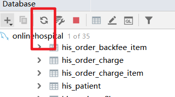
- 从数据库查询一二级菜单是否显示时，二级菜单的查询代码写的位置是否可以更改
  - src/store/modules/menu.js
  - 
- 后续字典管理统称改为码表管理，需要改一些数据显示内容
- 字典管理里面查看某个字典的码值内容时，改成模态框弹出形式
- 关于字典类型的添加和修改的检查是否存在逻辑，总感觉不太对
  - 
- SimpleUser类，原来是写的private Serializable userId;太奇怪了，先改成Long类型了，后续研究
  - 
- 11.8:编写字典类型前端时,发现调用根据字典类型获取字典数据的方法时,前端拿不到数据,this.getDataByType('sys_normal_disable'),原因在于之前修改了后端代码逻辑,该方法在后端的处理是从缓存中获取,但是没有处理缓存中无数据的情况,因此获取不到,后续看是否需要完善(缓存中无数据如何处理的情况)
  - 补充:缓存是公用的,重新加载一下就可以了,为啥说是公用的呢?因为保存数据时与取出数据与当前登录用户无关
  - 
  - 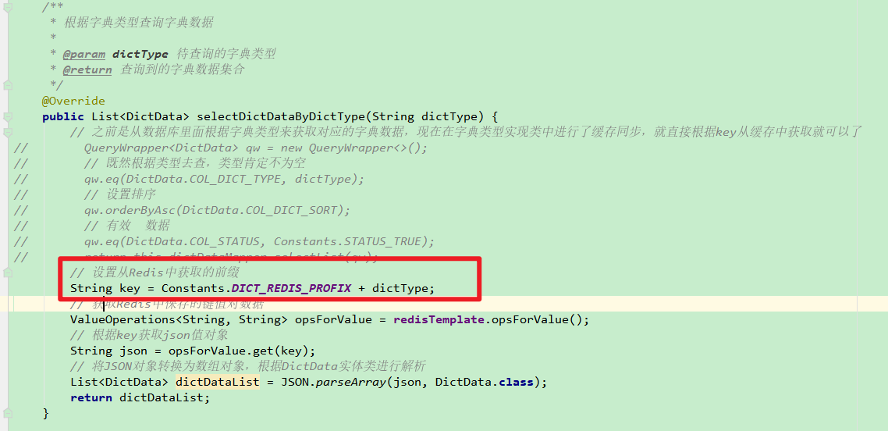
- 字典类型数据列表每行数据进行解析的时候,log输出状态的字典全部数据,输出了好多空值,不知道为啥
  - 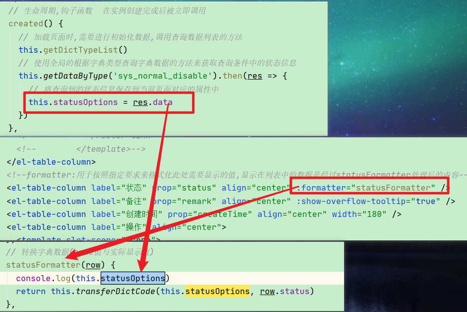
  - 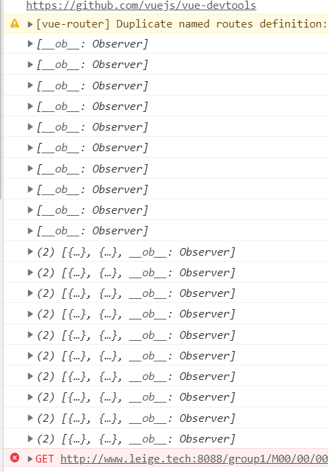
- 字典类型列表页面的修改按钮，原来是点击修改时，根据字典id进行了后台查询数据并填充到this.form中，但是修改操作调用的方法中，可以传递row值，而row值就是一整条数据，就没必要走后台了吧
  - 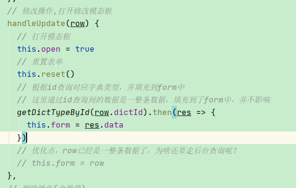
- 数据库数据的创建时间需要修改，时间不对
- 字典数据类型列表执行查询操作时，没有恢复默认页数和默认条数
- 删除字典类型的数据时，没有从缓存中将对应数据移除
- 系统中用到的一些固定变量，可以设置为常量进行引用，比如字典管理这块使用到的在created方法中的获取状态码表的方法调用，可以参考深圳案件来改造
  - 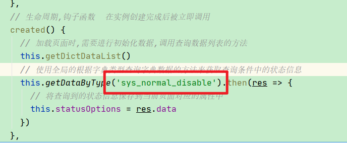
- JS利用||和&&赋值
  - 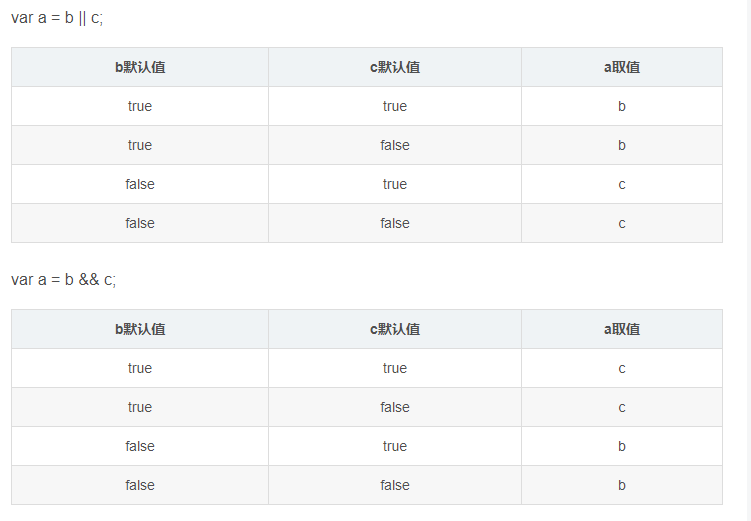
- 很多页面中，比如字典类型列表，字典数据列表有很多类似的方法，可以抽取为公共JS来处理
- 同步最新数据到缓存时，会重新刷新页面，但是状态已经没出现的，还是没有出现
- 字典类型中实际数据的排序不能重复，显示顺序应该按照字典排序来显示
  - 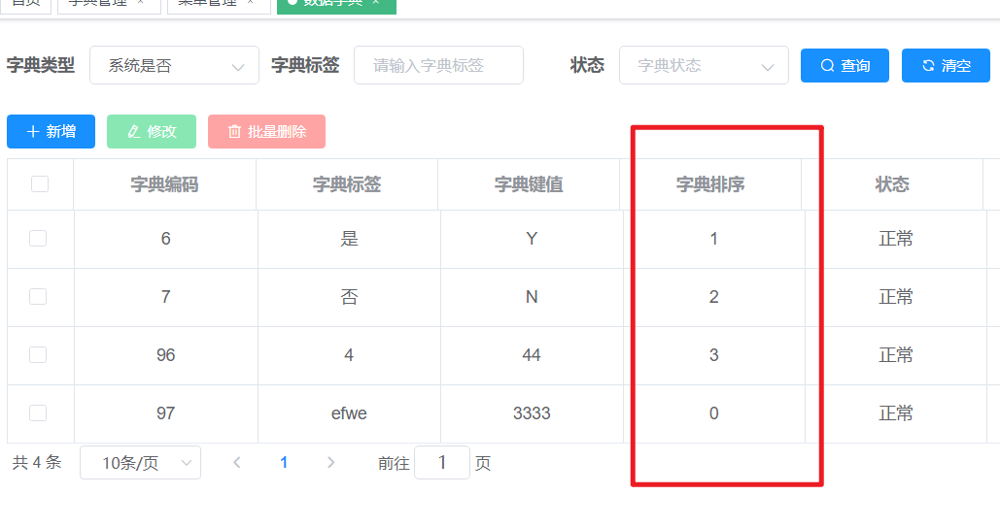
- 系统404页面修改
  - 
  - 
  - 大厂，把404做的都很用心，很不错
- UserRealm中出现了定义后未使用过的变量
  - 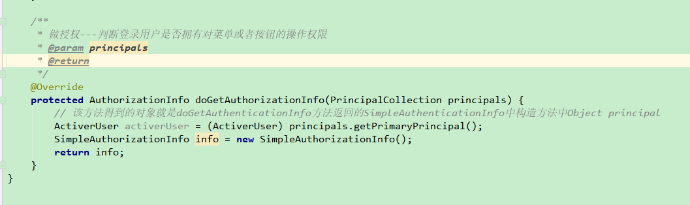
- 统一页面提示信息，成功|错误|提示使用恰当，并且提示内容规范，比如取消删除和取消删除操作，都可以抽取前端常量  $const.xxxx
- 后期修改数据库和路由映射配置，oper_opt与operationLog等
- 清空操作日志执行之后，再次点击就会一直卡住遮罩，数据库已经没有数据库，再次点击会操作失败，返回code400，然后就触发了Notication（全局配置的）
- 对于数据列表，增加列头排序功能
- 后端代码的类的说明注释有的没有添加
- 有些Controller添加了@Log4j2注解，后续看看是否有必要添加
  - OperationLogController
  - LoginLogController
  - LoginController
- 登录日志，清空所有登录日志方法也是有问题，如果数据已经为空，执行清空操作时，会报错，数据库已经没有数据库，再次点击会操作失败，返回code400，然后就触发了Notication（全局配置的）
  - 解决方式：操作方法添加catch，关闭遮罩即可
- 关于对数据库表的插入操作，如果存在更新时间，更新字段的话，应该也得在插入的时候设置一下比较好，同时更新时间一般自动取当前时间戳，但是更新者好像没有赋值，需要后期检查
- 前端很多页面的method功能很多类似，可以进行后期高度封装抽取
- 模态框的弹出显示一下顶部title，比如新增，修改
- 登录页面修改
  - https://mp.weixin.qq.com/s?__biz=Mzg3NTQ1ODIzMQ==&mid=2247484309&idx=1&sn=da484e7d3b3567b6d7a8632a86776cc0&chksm=cec0784df9b7f15bf35d9ef069c9c7c7b6e6bba3c7cb00b3e86f1ccfb4e8b77cce7b1849f622&mpshare=1&scene=1&srcid=1124DM74csFobCoczEkNNHHX&sharer_sharetime=1606174649377&sharer_shareid=225e0d600a762a61e65e03e99a47fdc3&key=a59817bd1bbbc69055a7c58624494fe623a5ee821f906229276414790f17d3d35d8f863bf02111f3f49d851a6c2a81bbfb2d569add88d5913c997902ed374e85c486f33189330d3eb106339622addfa6faa3393dbff64d55a6f0f00289a909d74807ad4d978927ed5d3d161dcdc42261faf68ee91253e9d09a16fce6bb0eb4c0&ascene=1&uin=MzM2OTcxODc4MA%3D%3D&devicetype=Windows+10+x64&version=6300002f&lang=zh_CN&exportkey=A2hAe0J%2FotyHJL%2F5yCWYWMA%3D&pass_ticket=TbpJqNReFD%2FF6r7XYstn7m2XIwGwli%2BUWBVZddZeEFHiTJ3xGNDIXd5U%2F3l%2BaOjN&wx_header=0
- 关于所有Controller的返回值，得判断根据service的结果来返回成功或者失败消息
- 删除菜单的提示语，也规划为常量，方便统一管理
  - 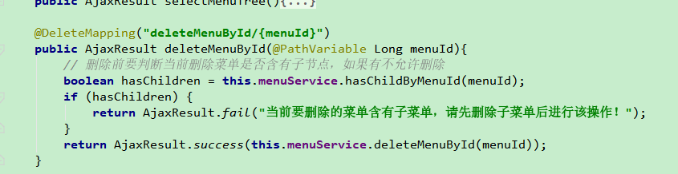
- 复查页面中不合适的注释和多余内容，该删除的删除
- 退出登录方法添加@Log日志注解的时候，控制台会报错，因为从Shiro中取不到当前登录用户信息
- 模态框的title统一处理
- 所有可输入字段做长度校验和合法性校验
- 菜单管理中，新增页面的上级菜单，如果展开后，关闭新增页面后，重新打开新增页面的上级菜单，之前展开的内容依旧还是展开
  - 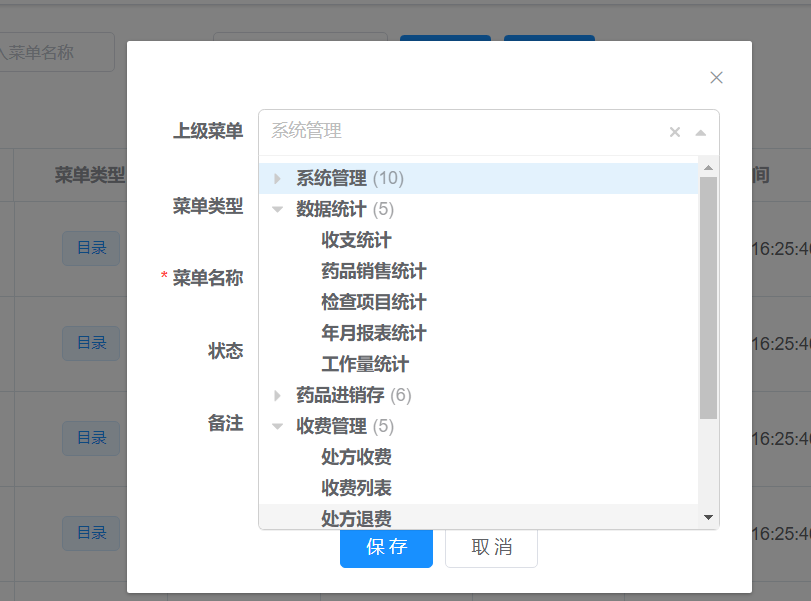
- 能修改的数据，尽量保持在列表中可以显示出来，让人看到效果
- 规范接口名称，比如分页查询菜单 listMenuForPage,分页查询角色listRoleForPage等等
  - 后端
  - 前端api都需要修改
  - YApi
- 一个用户可以有多个角色，一个角色可以操作多个菜单
  - 
- Controller层要检查形参（实体类或者单个参数）的校验是否都进行了必要的添加
- 规范Controller层的返回消息，确保要具体可以定位
- RoleController中更新角色信息方法后端校验没有完全生效
  - 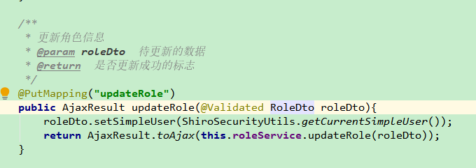
  - 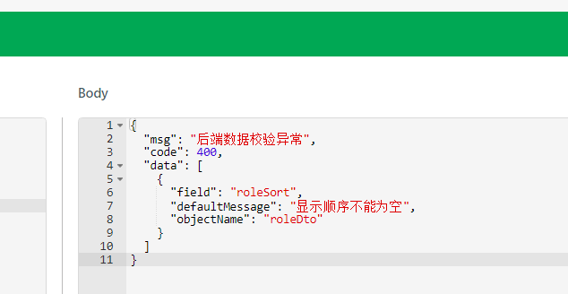
  - 解决方式
    - 实体属性添加校验不合适
      - @NotNull只能校验   null
      - @NotBlank 既可以校验“”  也可以校验null
    - 对于String类型的属性使用@NotBlank更好，对于Integer或者Date对象类型使用@NotNull
- 删除如果是某一页的唯一一条数据，删除完成后并不会自动回到第一页
  - 这里考虑下是否设置删除规则
    - 第一种：删除后，分页还原默认值查询，第一页，每页10条
    - 第二种：删除后，分页回到第一页，每页页数与删除前一致
    - 
- 再次强调，vue页面中Import和全局方法直接调用，不能写this.，因为this调用的是当前页面的方法