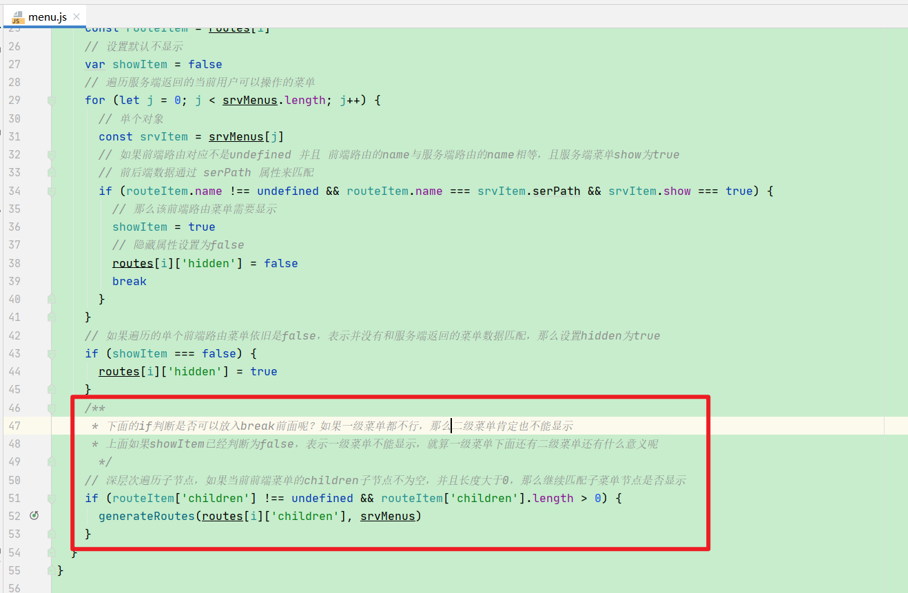
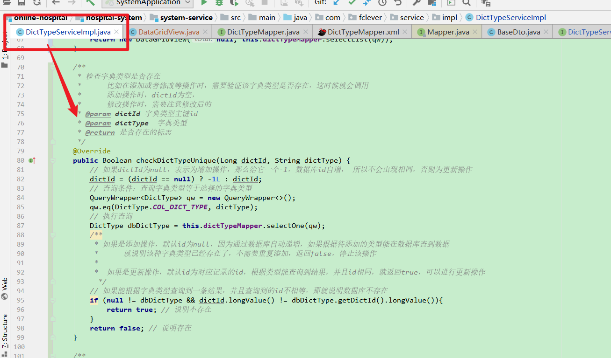
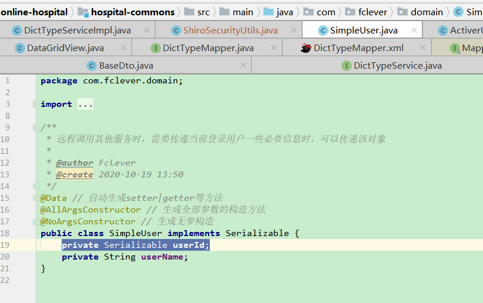

- 从数据库查询一二级菜单是否显示时，二级菜单的查询代码写的位置是否可以更改
  - src/store/modules/menu.js
  - 
- 后续字典管理统称改为码表管理，需要改一些数据显示内容
- 字典管理里面查看某个字典的码值内容时，改成模态框弹出形式
- 关于字典类型的添加和修改的检查是否存在逻辑，总感觉不太对
  - 
- SimpleUser类，原来是写的private Serializable userId;太奇怪了，先改成Long类型了，后续研究
  - 

- 11.8:编写字典类型前端时,发现调用根据字典类型获取字典数据的方法时,前端拿不到数据,this.getDataByType('sys_normal_disable'),原因在于之前修改了后端代码逻辑,该方法在后端的处理是从缓存中获取,但是没有处理缓存中无数据的情况,因此获取不到,后续看是否需要完善(缓存中无数据如何处理的情况)

